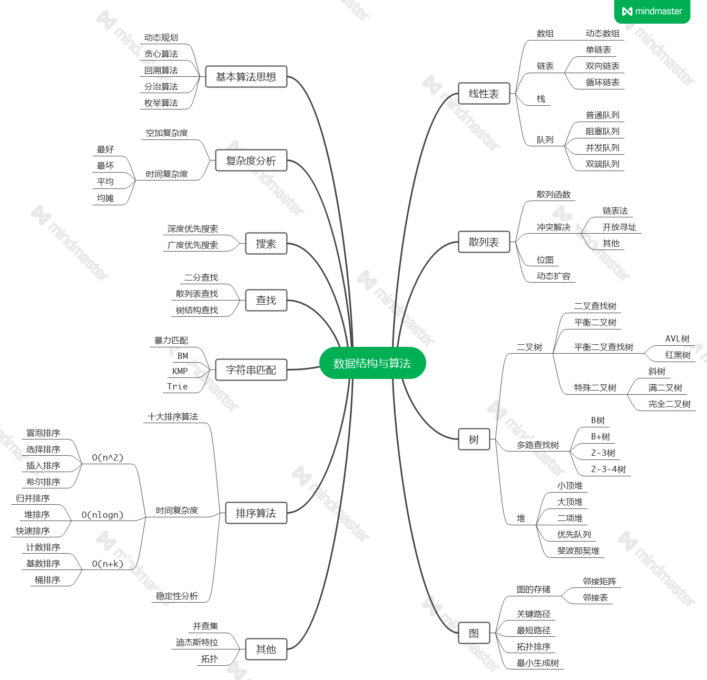
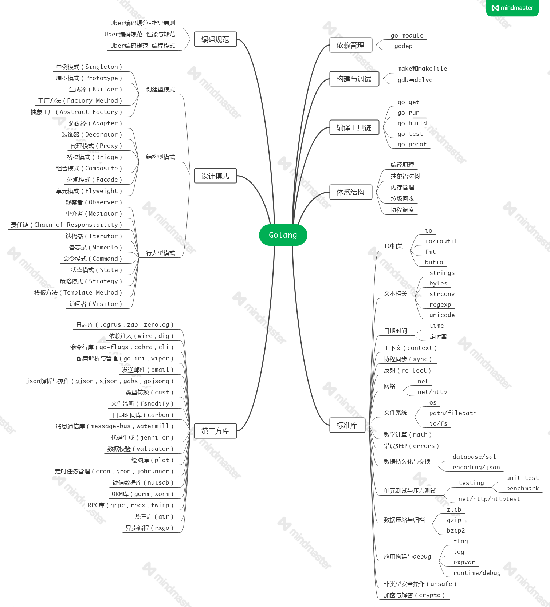
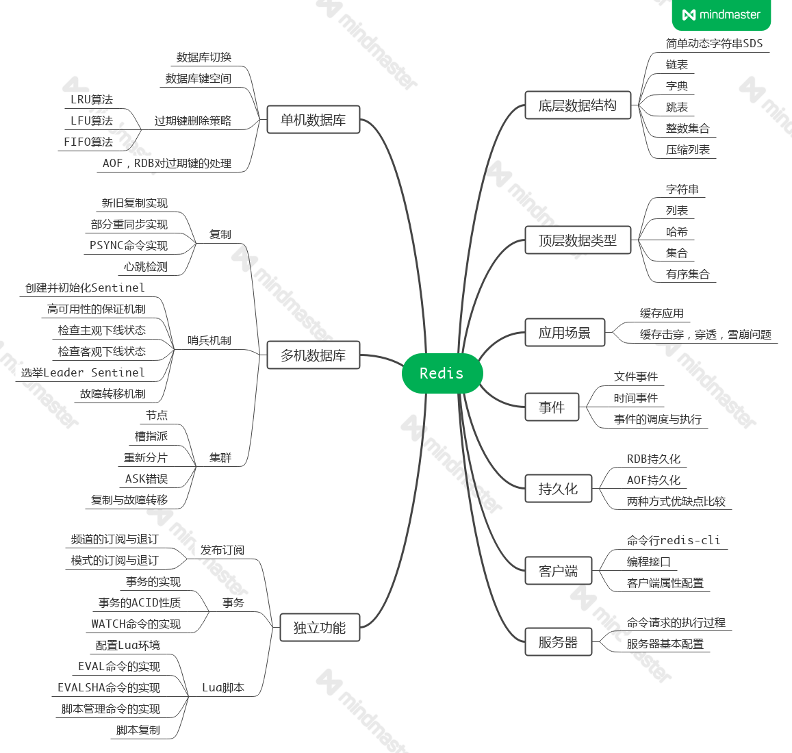
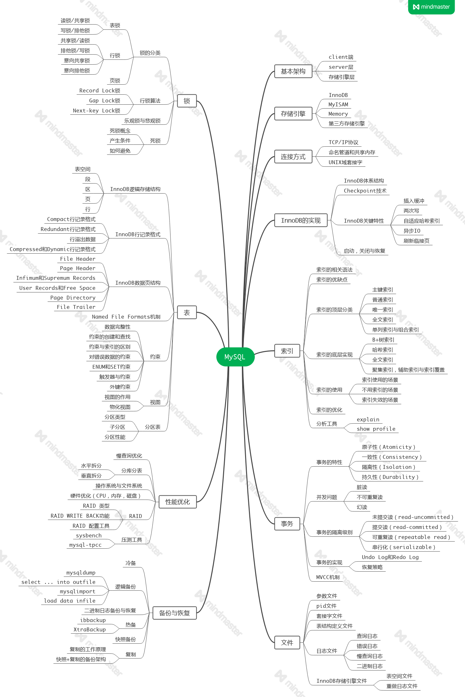
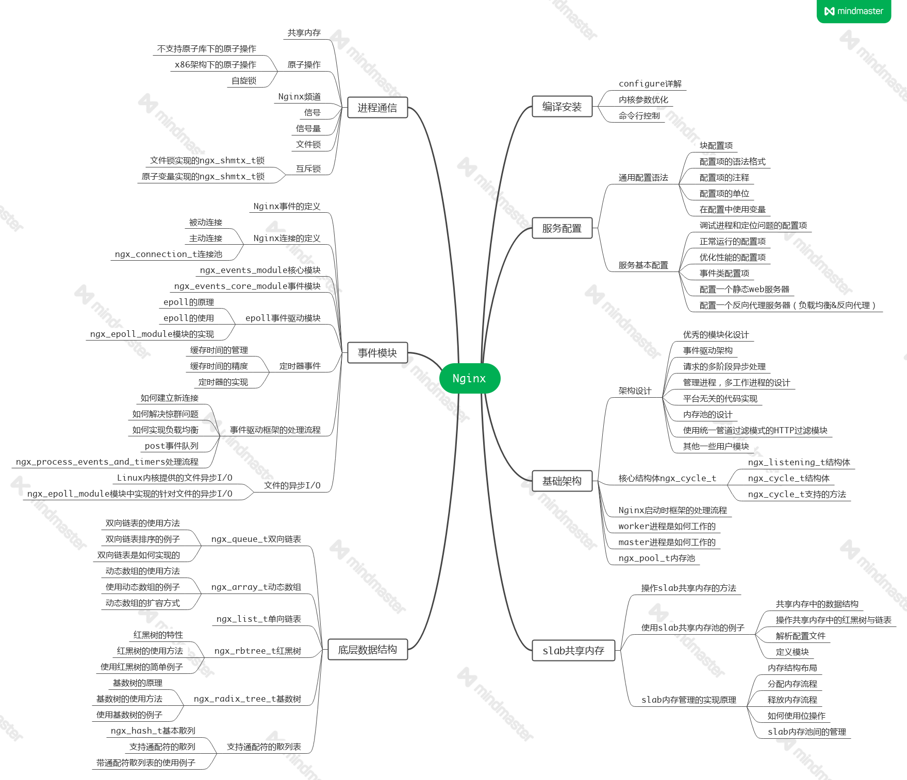
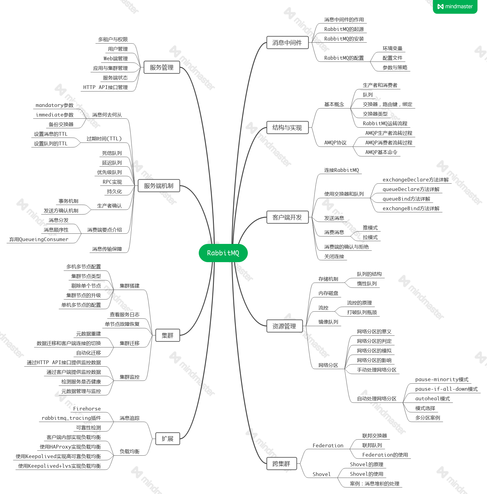
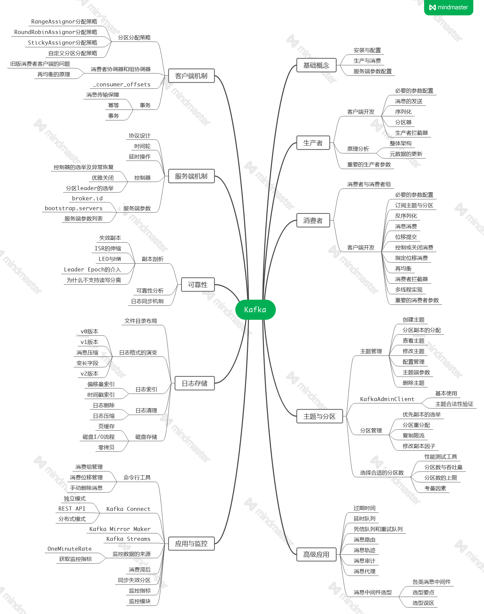

## Algorithms

- 线性表

    [动态数组实现](./algorithms/cdb9e2f0a02a4116b03c8ed8d72260de.md)

    [单链表实现](./algorithms/a227d97f3c0e4578e4a431fa345b1348.md)

    [双链表实现](./algorithms/056131e06c4485d4954261808b5076d8.md)

    [循环链表实现](./algorithms/c65142ab8a103e6ffb29457bfb27250b.md)

    [顺序栈](./algorithms/82155fbdc01043f42648be3c1419322b.md)

    [链式栈](./algorithms/8dd77e5d714cbe12acf2087b0f3a896f.md)

    [最小栈](./algorithms/1e20e3a6ceb3172c3d606752183e3ba3.md)

    [顺序队列](./algorithms/68c9deabb51c2175ca9f96058006b89c.md)

    [链式队列](./algorithms/6c66915fcfefa6ba0f4fe9830fce87d8.md)

    [循环队列](./algorithms/9032418d708c9a9e96cd0a810f85d590.md)

    [双端队列](./algorithms/e91ccb7dfd8576c599d23ddec1f62c4a.md)

    [协程安全队列](./algorithms/86fc324b72a60c96fe24c8e160c8a838.md)

- 散列表

    [散列表](./algorithms/02d41e5327c314ce9db19e5d6becdd61.md)

    [链表法实现](./algorithms/0a743f901e4a616aecb07a329c11c379.md)

    [开放寻址法实现](./algorithms/0ef831d22a0b283d9917d51f2373492c.md)

    [位图](./algorithms/a549fa900bc4726e2b468de4c8e87f76.md)

    [位图的实现](./algorithms/2486be2d57e6df4e9197898f8cd2aaa3.md)

    [动态扩容](./algorithms/55a4e59bf45ecaab6990a4442f741118.md)

- 树

    [二叉查找树](./algorithms/383fcb991fe00219aa1358c588215b03.md)

    [二叉查找树代码实现](./algorithms/07cb6b3d95259311400736d4ca28b1d3.md)

    [AVL树](./algorithms/918accc0aed3e3dfbf775397eb19f337.md)

    [红黑树](./algorithms/b6f1621270b34da2625392b7f00ea618.md)

    [特殊的二叉树](./algorithms/e90a6ac6d5748c22e8483be264e24ee7.md)

    [跳表的原理及实现](./algorithms/250b12cefb8b44a26555f5442a224d50.md)

    [B树](./algorithms/39a6b440ba8f6a8c4d180c53b515dd8c.md)

    [B+树](./algorithms/19dd3d1e5ad169e8c1bd8fd2dbc67326.md)

- 堆

    [小顶堆与大顶堆](./algorithms/1355f3674ffcc6cf264bd3c2c6a27178.md)

- 基本算法思想

    [动态规划](./algorithms/8c05890ac8f93d0195f884f1ff4656ec.md)

    [贪心算法](./algorithms/f609d9e1619f07d45b7d493b39e44c77.md)

    [回溯算法](./algorithms/fced5721d59aa669be7ac4f2832d1841.md)

    [分治算法](./algorithms/eee59e469f6661a3f40fe663a5021935.md)

    [穷举算法](./algorithms/e4b7ba3fdac014f8f3381b0812ea0df9.md)

- 搜索

    [深度优先遍历和广度优先遍历](./algorithms/b96bf61b91e4b2b5f127cc233aa8e612.md)

- 字符串匹配

    [KMP模式匹配](./algorithms/dada3d14923329b297f59cb2c7452393.md)

    [Trie前缀树](./algorithms/3bcdc3e216fea6939212811ada89e457.md)

- 七种排序算法

    [冒泡排序](./algorithms/5d7ecc89fa546563d431f68bd3cd0f4b.md)

    [插入排序](./algorithms/112be43e6e87ac1724a1e97795567a56.md)

    [选择排序](./algorithms/cc128b01cc0a031743b5cd9aec7f0468.md)

    [快速排序](./algorithms/5ee213ee925122f6aef374cf940c4f95.md)

    [希尔排序](./algorithms/ddb032899d6061cd37306a0714eefb0c.md)

    [归并排序](./algorithms/9556661369382e0ad772180a2c789e69.md)

    [堆排序](./algorithms/141c7256607edf699b0505cc86f5b7ac.md)

- 缓存淘汰算法

    [缓存淘汰策略之LRU算法分析](./algorithms/20c57fc31aa7606867c3f2508cbf008f.md)

    [缓存淘汰策略之LFU算法分析](./algorithms/b24c750436a508c67e8287da8c887c97.md)

    [缓存淘汰策略之LRU算法改进](./algorithms/7582ec0043c5a8a28748a821ef2b968e.md)     

## Golang

- 依赖管理

    [Go-Modules详解](./golang/7963c3241f660333e66770b999610358.md)

- 构建与调试

    [构建工具make和makefile编写](./golang/cafdf12ee69bec6d9195f0c9307ad283.md)

- 编码规范

    [Uber-Golang编码规范-指导原则](./guide/efc4e3b51d06b3dde5fee816e6505914.md)

    [Uber-Golang编码规范-性能与规范](./guide/545a7f4bb1f9fb1db36540a82f547019.md)

    [Uber-Golang编码规范-编程模式](./guide/82a5a09e8d0f5faef9be628fb82d66e0.md)

- 标准库

    [slice的底层实现](./golang/80487aad121cf9be11c8aa1bd219e5ed.md)

    [interface的实现](./golang/8e64504c9e1c572c6c6098ad10d6a04b.md)

    [map的底层实现](./golang/e6480ecfabffb4028372fc5d2909cf71.md)

    [map的扩容机制](./golang/73e254a888a9fbebaaed6875fc1c1a3f.md)

    [sync.Map源码分析](./golang/4cc5086abc237cd75fa591619deae465.md)

    [channel的底层实现](./golang/8f15812d7843050c2fb4b966b10fb533.md)

    [select的底层实现](./golang/fdf93252c53661388ee33bb70b0716b3.md)

    [context机制详解](./golang/15ef742f3c8f1500f7e78936b88b776b.md)

    [atomic原子操作](./golang/d83755d0ff9855a2b602af77775bb07d.md)

    [defer机制剖析](./golang/e613a22a891e0ed1d985fb7cb67d13ba.md)

    [panic与recover机制](./golang/860681a0393cb0c8032b959037be3b01.md)

    [bufio读写机制剖析](./golang/1edef46cb50498cbb8f1e6d0816554dd.md)

    [net/http包路由机制详解](./golang/557b6f167c0235c740405a209b834404.md)

    [unsafe包详解](./golang/cd10787177a22a08560b4b26fba49a7f.md)
    
    [sync.Pool临时对象池](./golang/2c2496a74b1243d762153dc2fdb8aa9f.md)

    [sync包中的同步原语](./golang/468b01a85672e8f37708aa5dcef2d521.md)

    [sync包的实际应用](./golang/27b92a32ea3922079b13f63faf5e46d3.md)

    [log包源码分析](./golang/a5127429a98b648f28ce2fc869160008.md)

- 体系结构

    [Go的自举](./golang/163ce40937379b0315d83b29cb349c7b.md)

    [Go的编译过程](./golang/9aef27454c5df62def894f0bad45c625.md)

    [Go的抽象语法树AST](./golang/bec7c420b84c4e848e9259480d8eb11a.md)

    [Golang调度器GMP原理分析](./golang/6113dbb0299525cbff967c7471da73ee.md)

    [Golang内存分配管理机制](./golang/ca0890beab8a91ac060d192fa36f1512.md)

    [Golang内存分配逃逸分析](./golang/c73e87e3582627abfeb7f2d69c6c6de0.md)

    [Golang的GC机制分析](./golang/5459371bba88e8b61457014503e915da.md)

- 并发编程

    [Go的并发模型与并发模式](./golang/d1126cba14c403d93622c1862941ab0d.md)

    [Go中的并发限制与超时控制](./golang/17f2b3867ba1cdfcc9f2116398ab36ad.md)

    [如何优雅的关闭Channel](./golang/2b3d750cdd4f7ab3d245882de9215b85.md)

    [实现一个Go并发连接池](./golang/dc2304b5445bd93705e8a613373f86c9.md)

    [实现一个Go并发处理队列](./golang/64fef4899b9ea0c00617ded60f7f459f.md)

- 设计模式

    [选项模式](./golang/1178cb47c1ae2f2d75ac039f150edb8e.md)

    [单例模式](./golang/e146dbe8b105a58764dc08148ccf67d6.md)

    [多生产者多消费者](./golang/2ea8010da854784e4d11ed74ed95c755.md)

- 单元测试

    [基础原理](./golang/fe2d77a30ea3c2710404f6767f6d9a75.md)

    [mock框架](./golang/1c041f2235b3ccc29b92996532a66efd.md)

    [testify](./golang/6138348c4230add17aea69eb1fc35f1c.md)

    [依赖注入框架wire](./golang/3e906a19d83a7ca9ffabef0dc7f4654b.md)

- 压力测试

    [benchmark性能测试](./golang/f04a1da7ec24fdc3c45ba62bac65c67a.md)

    [pprof性能优化](./golang/8a22c72aa2b491eb714b56a562a565f0.md)

- 部署发布

    [微服务的几种发布方式](./golang/91cf972a22d6a2346e501768baa4d2bc.md)

- 第三方库

    [日志库logrus](./golang/c6aea72f78bce2ac98917c53427f77c4.md)

    [命令行库cli](./golang/7291c7df1d759949affdb99bde16499d.md)

    [依赖注入wire](./golang/1bfdc00f58f271a2f8a4c270d79a35c3.md)

    [访问控制casbin](./golang/d10de1c285078a0716d584293f302bd1.md)

## Redis

- 底层数据结构

    [简单动态字符串SDS](./redis/5a7505d4c08ba9f7c68e31715368fc10.md)

    [链表](./redis/777cc60e866fff12295e870743c02771.md)

    [字典](./redis/ad552573d71a78e98660beb1131cbdf8.md)

    [跳表](./redis/b91300342bd14a679529c10837966fb0.md)

    [整数集合](./redis/9f028d301e53c6673ca8f758ea730c9f.md)

    [压缩列表](./redis/6f5a407880a6fa4c3fa7801035d23e73.md)

- 顶层数据类型

    [对象系统](./redis/b14494137c805dc66bdc9ed88d7fd2de.md)

    [字符串](./redis/cc4dd1da7e1a754534215f02fb9ba85d.md)

    [列表](./redis/3712972d84adf48acbd6ad24b4d75ad0.md)

    [哈希](./redis/b5dbd2c8c3e080e34db9053a36b2b2d3.md)

    [集合](./redis/508b37f195b91f7d901273d4cd2d87f0.md)

    [有序集合](./redis/507d7069cc147e1d86c69ff2ee502a27.md)

- 应用场景

    [缓存雪崩，缓存穿透和缓存击穿方案分析](./redis/5322c71dcf4f89e769c39bb328e3fe17.md)

- 单机数据库

    [事件驱动模型](./redis/8d48c3007f432bdf1f8c46331c972b8e.md)

    [两种持久化机制](./redis/225b07d051d77eec8944200ea688fd32.md)

    [过期键删除策略](./redis/01e496ccc34abd8e7aaf7e7f28bd8d1c.md)

- 多机数据库

    [主从复制机制](./redis/92c273561eb14294e4b299917ebb460f.md)

    [哨兵机制](./redis/4c4317ad937b7692aec5eb2e3ec5e53c.md)

    [集群](./redis/85fe5099f6807dada65d274810933389.md)

- 独立功能    

    [发布订阅](./redis/)

## MySQL

- [基本架构](./mysql/e7fef5016458eb8864dec3c47f24f617.md)

- [存储引擎](./mysql/3f1132983df2da37948798b8d128c59e.md)

- [连接方式](./mysql/8dc72d15d9064e5945a42f08e9ef7f65.md)  

- InnoDB的实现
   
  [InnoDB体系结构](./mysql/9b31ed4853949086d10d935c0f9b1d49.md) 

  [Checkpoint技术](./mysql/c4a113aaaa65ba18ed5c8af55a6f6a3e.md)

  [InnoDB关键特性](./mysql/5ab46e328a10a895ca4566cf18e21333.md)

  [启动，关闭与恢复](./mysql/824b964e75668a100c078eae253fcc26.md)

- 索引
 
  [索引的基本概念](./mysql/2b9169ab059610bb82267373916b27f6.md)

  [索引的实现原理](./mysql/5ae8aed15a89aa7c153beb7f0ac5aed3.md)

  [分析工具](./mysql/39e59f37dc93e340675ad0f3d255a3db.md)

- 事务

  [事务的实现机制](./mysql/28b067364356d358bfff17f816773949.md)

  [MVCC实现机制](./mysql/b9a011b76e0802f82646166589c3a597.md)

- 文件

  [二进制日志与事务日志](./mysql/40e4aa65a0bfa47d090808382ffddc78.md)

- 锁

  [锁的机制](./mysql/9024c3f9553c820087db796f3c2ebd26.md)

  [间隙锁](./mysql/4d38bbae93f51473257b6a8e845547ff.md)

- 性能优化

  [慢查询优化](./mysql/8d48c3007f432bdf1f8c46331c972b8e.md)

  [常用分库分表方案汇总](./mysql/0f5f04fb1afc6bd7d3b917101ffd65d0.md)

## Nginx

[正向代理与反向代理](./nginx/08b53ca92479e146021c97214330eeb8.md)

[负载均衡策略剖析](./nginx/a31cdec7e48e06cbdb324fd4b8d6619e.md)

[Nginx进程模型](./nginx/883906cf71d31c75c08065eba4061b60.md)

[Nginx内存模型](./nginx/5dfd87bf1d569a433aea72b3dc6e2ec7.md)

[惊群问题](./nginx/6cb3964b9ce7c3a9f537698bdbdc8c74.md)

## RabbitMQ

[简介及入门使用](./rabbit/15091aa76ba1dc7686ddbd7c877347d3.md)

[AMQP协议和RabbitMQ实现](./rabbit/99e34563464ba2f7544ddf1ecccf15c4.md)

## Kafka

## MQ

[分布式消息队列：如何保证消息队列的高可用](./mq/d5d61a06cf76d33ee30c8f6fe6637f2f.md)

[分布式消息队列：如何保证消息不被重复消费](./mq/79925a09b802ded410bd000cbe2d5c29.md)

[分布式消息队列：如何保证消息按顺序执行](./mq/ab46912cdfc280d4153a12cbe4187408.md)

[分布式消息队列：如何解决消息积压](./mq/0dac7c642652d075ff4730747038d408.md)

[分布式消息队列：如何保证消息的可靠性传输](./mq/613946bc627e881df3669c34dd6e2e5f.md)

[分布式消息队列：消息处理失败和死信队列](./mq/913bb532a934afd4382707f016419654.md)

## Docker

## Kubernetes

## Others

- TCP/IP

    [OSI七层参考模型与TCP/IP四层模型](./others/10b715d73152f76f333ef559d01625d9.md)

    [TCP与UDP的区别](./others/283b5221745e7b1891dd4b756185ab87.md)

    [TCP三次握手与四次挥手](./others/49002627a472fc428fa100f2e5dbcc88.md)

    [TCP滑动窗口与拥塞控制](./others/13aaa8179bf63eb427dc113480418096.md)

    [UDP单播，多播和广播](./others/346e62ca5a2dcc3389ba3243cc3bfbf8.md)

- HTTP

    [HTTP1.0/1.1/2.0区别](./others/27d12bc83c39ebee82c47743e81cc324.md)

    [服务限流算法的几种实现](./others/f8bdcb5371d0afa35b36c71bb2b1648b.md)

- HTTPS

    [HTTPS如何保证传输安全](./others/288fa6439aacddf7ffeb6cfcf44aee66.md)

    [SSL双向认证与单向认证](./others/858f2ec213fc89884ce3df10358bd52a.md)

- 网络模型

    [Linux IO模式及select,pool,epoll详解](./others/25ad3572861d5f4f03bfc03964c76287.md)

    [彻底搞懂Reactor模型和Proactor模型](./others/e0c360144f2b2551242156800779fb96.md)

- 鉴权机制
    
    [浅析Basic认证](./others/17583d2da8e486854fac256903ac9bdd.md)

    [JWT机制分析](./others/9751f90ad8fd25438bf1e2f9d5618d5b.md)

    [oAuth2.0授权机制](./others/3c3524c954bbaa25bedb012d38258984.md)

    [浅谈权限管理模型](./others/e5a3a4a74dc9ffcfa99a04c00ff68c92.md)

- Web安全

    [Web安全之防止重放攻击](./others/4f892aec044772b882b5bd3391e84892.md)

    [浅说XSS和CSRF](./others/985bfa1f7e6b5200ef0e0b30ddf63fc9.md)

    [SQL注入原理与防护](./others/5e1b901b07a925488ada4bfc91ac044c.md)  

- 分布式

    [详解raft算法](./others/ed74e776e385491babe7056ecd61b001.md)

    [一致性哈希算法](./others/ac5d5e9bd3c215599efc416f6cd94e27.md)

    [浅谈分布式事务的实现模式](./others/611b3158e4cf4399196d42c82f463cc0.md)

    [分布式事务基础](./others/4bf8818e4106ebf2461ffa7e4c90ad38.md)

    [分布式事务解决方案之2PC(两阶段提交)](./others/7891b90c00736076ed36a4ced4d44efa.md)

    [基于Redis的分布式锁实现](./others/06d6b52568476822f5a2e9f0be2e1032.md)

    [RedLock算法-使用redis实现分布式锁服务](./others/41ebba3bc046c23a2a1b19a7bff2d3bb.md)

    [分布式UUID-理解snowflake算法的实现原理](./others/4e9324ab5b9e8589c72dd5f602d35910.md)

## Gin + Gorm

[路由实现-Trie前缀树](./gin/ccb5ea25922bbdbabb4458364296346c.md)

[整体架构-各组件功能实现](./gin/03a1cf5434c15154c97868b9d07a4645.md)

## Grpc

[Protobuf语言指南](./grpc/a0e1e3109ce923c48fcdd18d3aaf6553.md)

[Protobuf生成Go代码指南](./grpc/47dee3eff68bc42187b2d6e958f3d9be.md)

[grpc的特性和背后的设计原则](./grpc/4aafe5445591ca04ea1a01f5ccb9c07d.md)

[grpc接口描述语言ProtoBuffer](./grpc/ca9310a72f2853a38fdba30ee817d1e8.md)

[grpc之Golang入门HelloWorld](./grpc/a7b875a7f97ab4acd41ea380128e4d20.md)

[grpc之流式调用原理http2协议分析](./grpc/592472ad5b65ce619f7949258ca82abf.md)

[grpc认证的多种方式实践](./grpc/b9b2cef4ae0967d353c12a915dc1735b.md)

[grpc拦截器的那些事](./grpc/aeeb6a1c25eb38ec3746dac068bd69bc.md)

[grpc服务注册与服务发现](./grpc/f7dbd0b69f26f000602b6e0a94d7b986.md)

[grpc-server启动分析](./grpc/b456e6f15c800b64001c759ef5145a8c.md)

[grpc的一次请求流程](./grpc/ae9e6625d4cc55338707a5c8b7dcc032.md)

[grpc跨语言通信实例](./grpc/3e226b258dd5734ed0c1e91777dd3305.md)

## Go-Kit

[go-kit的整体结构](./gokit/fad0ab705c7d60ba7cd645fbb88727d0.md)

[basic授权认证中间件](./gokit/5ea369e8a80fb8b332f86b89cfb0c5cc.md)

[endpoint源码分析](./gokit/2ae340fadbe32d13d2498c410802d663.md)

[transport层之http-server](./gokit/52345052a6f9a4ea12b236e2c5c990dd.md)

[transport层之http-client](./gokit/b93acf62f8b62d487769c113527f5305.md)

[transport层之jsonrpc](./gokit/b6cb9fd341765363f306fef479e7f2d9.md)

[transport层之grpc](./gokit/7d86339e64c749c3482e604980bc8e8a.md)

[服务注册中心的通用功能实现](./gokit/31362dddb72a6efb0978280b3f79cc64.md)

[服务注册中心的consul实现](./gokit/4b29320d63e8b97a86bad51a1a9e5097.md)

## Go-Micro

## NSQ

[简介及去中心化实现原理](./nsq/bd3be395e8e94863f67a2289bf7c9d98.md)

[去中心化源码解析](./nsq/d320e4266e033cf4ed0edcc4f8091073.md)

[消息传输的可靠性和持久化](./nsq/a38b6b46ac9ea1d2714bc20c496c3b36.md)

[消息传输的可靠性和持久化](./nsq/9517598622412531c0a6ffdc97e5c69e.md)

[消息的负载处理](./nsq/cccbc30c2792b5793ca6397792dbc2a5.md)

## Etcd

## TiDB
