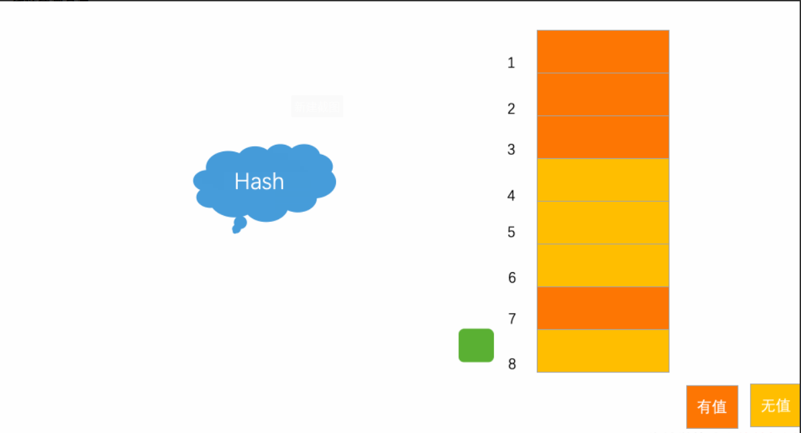
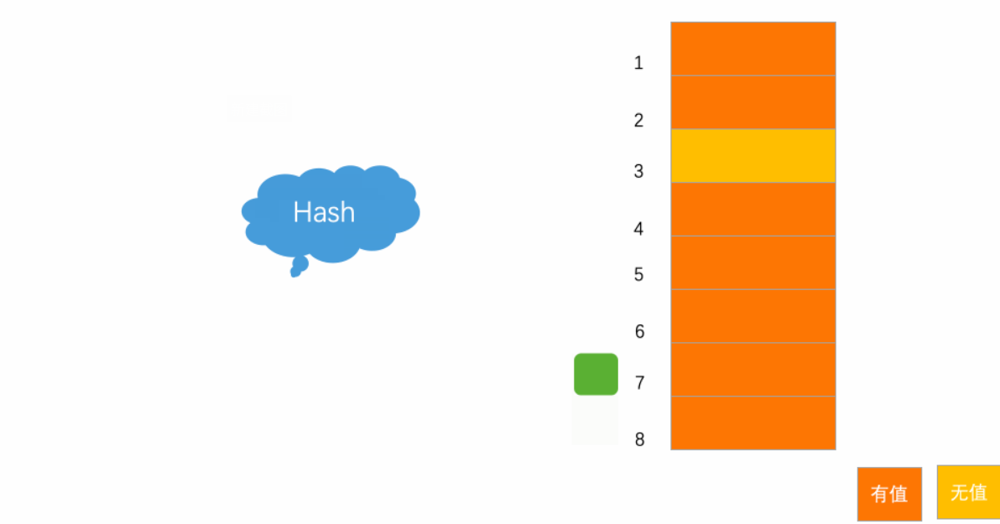
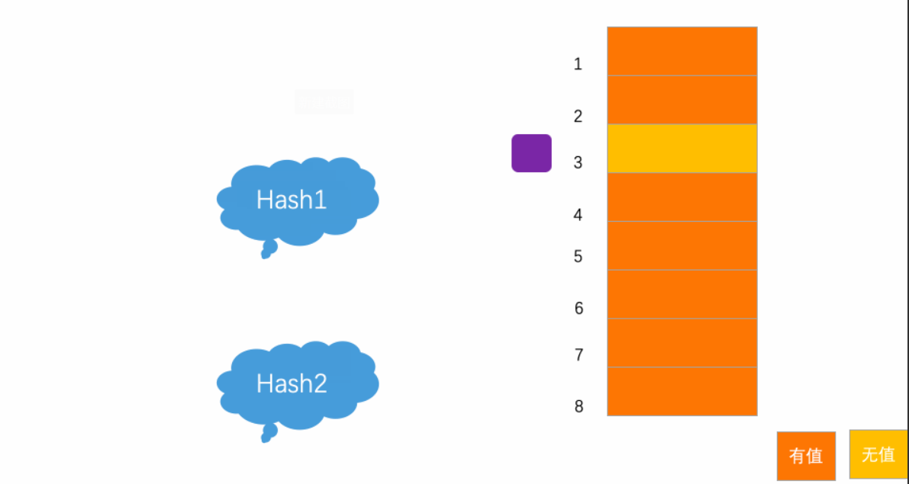
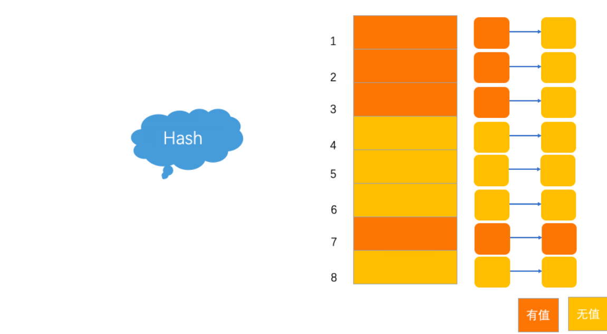

# 散列表

散列表(Hash table，也叫哈希表)，是根据键(Key)而直接访问内存存储位置的数据结构。也就是说，它通过计算一个关于键值的函数，将所需查询的数据映射到表中一个位置来访问记录，这加快了查找速度。这个映射函数称为散列函数，存放记录的数组称做散列表。

## 散列函数

散列函数，顾名思义，是一个函数。如果定义成hash(key)，其中key表示元素的键值，则hash(key)的值表示经过散列函数计算得到的散列值。

散列函数的特点：

- 确定性：如果两个散列值是不相同的(根据同一函数)，那么这两个散列值的原始输入也是不相同的。

- 散列碰撞：散列函数的输入和输出不是唯一对应关系的，如果两个散列值相同，两个输入值很可能是相同的，但也可能不同。

- 不可逆性：一个哈希值对应无数个明文，理论上并不知道哪个是。

- 混淆特性：输入一些数据计算出散列值，然后部分改变输入值，一个具有强混淆特性的散列函数会产生一个完全不同的散列值。

## 常见的散列函数

### MD5

MD5 即 Message-Digest Algorithm 5 (信息-摘要算法5)，用于确保信息传输完整一致。是计算机广泛使用的杂凑算法之一，主流编程语言普遍已有 MD5 实现。

将数据(如汉字)运算为另一固定长度值，是杂凑算法的基础原理，MD5 的前身有 MD2 、MD3 和 MD4 。

MD5 是输入不定长度信息，输出固定长度 128-bits 的算法。经过程序流程，生成四个32位数据，最后联合起来成为一个 128-bits 散列。

基本方式为，求余、取余、调整长度、与链接变量进行循环运算，得出结果。

MD5 计算广泛应用于错误检查。在一些 BitTorrent 下载中，软件通过计算 MD5 来检验下载到的碎片的完整性。

### SHA-1

SHA-1 (英语：Secure Hash Algorithm 1，中文名：安全散列算法1) 是一种密码散列函数，SHA-1可以生成一个被称为消息摘要的160位 (20字节) 散列值，散列值通常的呈现形式为40个十六进制数。

SHA-1 曾经在许多安全协议中广为使用，包括TLS和SSL、PGP、SSH、S/MIME和IPsec，曾被视为是MD5的后继者。

## 散列冲突

理想中有一个散列函数，希望达到

> 如果 key1 ≠ key2，那 hash(key1) ≠ hash(key2)

这种效果，然而在真实的情况下，要想找到一个不同的 key 对应的散列值都不一样的散列函数，几乎是不可能的，即使是 MD5 或者 由美国国家安全局设计的 SHA-1 算法也无法实现。

事实上，再好的散列函数都无法避免散列冲突。

这涉及到数学中比较好理解的一个原理：抽屉原理。

抽屉原理：桌上有十个苹果，要把这十个苹果放到九个抽屉里，无论怎样放，我们会发现至少会有一个抽屉里面至少放两个苹果。这一现象就是我们所说的“抽屉原理”。

对于散列表而言，无论设置的存储区域(n)有多大，当需要存储的数据大于 n 时，那么必然会存在哈希值相同的情况。这就是所谓的散列冲突。

## 解决散列冲突

常用的散列冲突解决方法有两类，开放寻址法(open addressing)和链表法(chaining)。

### 开放寻址法

将散列函数扩展定义成探查序列，即每个关键字有一个探查序列h(k,0)、h(k,1)、...、h(k,m-1)，这个探查序列一定是0....m-1的一个排列（一定要包含散列表全部的下标，不然可能会发生虽然散列表没满，但是元素不能插入的情况），如果给定一个关键字k，首先会看h(k,0)是否为空，如果为空，则插入；如果不为空，则看h(k,1)是否为空，以此类推。

对于开放寻址冲突解决方法，比较经典的有线性探测方法(Linear Probing)、二次探测(Quadratic probing)和 双重散列(Double hashing)等方法。

当我们往散列表中插入数据时，如果某个数据经过散列函数散列之后，存储位置已经被占用了，我们就从当前位置开始，依次往后查找，看是否有空闲位置，直到找到为止。

以上图为例，散列表的大小为 8 ，黄色区域表示空闲位置，橙色区域表示已经存储了数据。目前散列表中已经存储了 4 个元素。此时元素 7777777  经过 Hash 算法之后，被散列到位置下标为 7 的位置，但是这个位置已经有数据了，所以就产生了冲突。

于是按顺序地往后一个一个找，看有没有空闲的位置，此时，运气很好正巧在下一个位置就有空闲位置，将其插入，完成了数据存储。

线性探测法一个很大的弊端就是当散列表中插入的数据越来越多时，散列冲突发生的可能性就会越来越大，空闲位置会越来越少，线性探测的时间就会越来越久。极端情况下，需要从头到尾探测整个散列表，所以最坏情况下的时间复杂度为 O(n)。

### 二次探测法

二次探测是二次方探测法的简称。顾名思义，使用二次探测进行探测的步长变成了原来的“二次方”，也就是说，它探测的下标序列为 hash(key)+0，hash(key)+1^2或[hash(key)-1^2]，hash(key)+2^2或[hash(key)-2^2]。

以上图为例，散列表的大小为 8 ，黄色区域表示空闲位置，橙色区域表示已经存储了数据。目前散列表中已经存储了 7 个元素。此时元素 7777777  经过 Hash 算法之后，被散列到位置下标为 7 的位置，但是这个位置已经有数据了，所以就产生了冲突。

按照二次探测方法的操作，有冲突就先 + 1^2，8 这个位置有值，冲突；变为 - 1^2，6 这个位置有值，还是有冲突；于是 - 2^2， 3 这个位置是空闲的，插入。

### 双重散列法

所谓双重散列，意思就是不仅要使用一个散列函数，而是使用一组散列函数 hash1(key)，hash2(key)，hash3(key)。。。。。。先用第一个散列函数，如果计算得到的存储位置已经被占用，再用第二个散列函数，依次类推，直到找到空闲的存储位置。

以上图为例，散列表的大小为 8 ，黄色区域表示空闲位置，橙色区域表示已经存储了数据。目前散列表中已经存储了 7 个元素。此时元素 7777777  经过 Hash 算法之后，被散列到位置下标为 7 的位置，但是这个位置已经有数据了，所以就产生了冲突。

此时，再将数据进行一次哈希算法处理，经过另外的 Hash 算法之后，被散列到位置下标为 3 的位置，完成操作。

### 装载因子

事实上，不管采用哪种探测方法，只要当散列表中空闲位置不多的时候，散列冲突的概率就会大大提高。为了尽可能保证散列表的操作效率，一般情况下，需要尽可能保证散列表中有一定比例的空闲槽位。

一般使用装载因子(load factor)来表示空位的多少。

装载因子是表示 Hsah 表中元素的填满的程度，若装载因子越大，则填满的元素越多,这样的好处是：空间利用率高了,但冲突的机会加大了。反之,装载因子越小,填满的元素越少,好处是冲突的机会减小了，但空间浪费多了。

链表法是一种更加常用的散列冲突解决办法，相比开放寻址法，它要简单很多。如下动图所示，在散列表中，每个位置对应一条链表，所有散列值相同的元素都放到相同位置对应的链表中。

