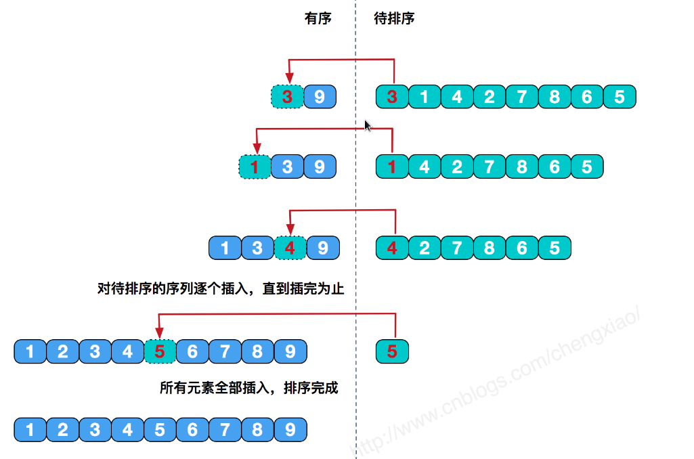

# 插入排序

插入排序基本思想是每一步将一个待排序的记录，插入到前面已经排好序的有序序列中去，直到插完所有元素为止，插入排序是稳定排序。



简单插入排序在最好情况下，需要比较n-1次，无需交换元素，时间复杂度为O(n);在最坏情况下，时间复杂度依然为O(n^2)。

```go
package main

import (
	"fmt"
)

//插入排序
func InsertSort (a []int) ([]int, int) {
	count := 0
	length := len(a)
	for i := 1; i < length; i++ {
		tmp := a[i]
		j := i
		for ; (j > 0) && (tmp < a[j-1]); j-- {
			count++
			a[j] = a[j-1]
		}
		a[j] = tmp
	}
	return a, count
}

func main() {
	beforeSortSet := []int {10, 22, 33, 21, 56, 32, 81, 73, 69, 83}
	fmt.Println("Before Sort:", beforeSortSet)
	afterSortSet, count := InsertSort(beforeSortSet)
	fmt.Println("After Sort:", afterSortSet, "Swap Count:", count)
}
```