# 小顶堆与大顶堆

堆是一种非线性的数据结构，可以把堆看作一个数组，也可以把堆看作一个完全二叉树，通俗来讲堆其实是利用完全二叉树的结构来维护的一维数组，但堆不一定是完全二叉树。

按照堆的特点可以把堆分为大顶堆和小顶堆。

大顶堆：每个节点的值都大于或等于其左右孩子节点的值。

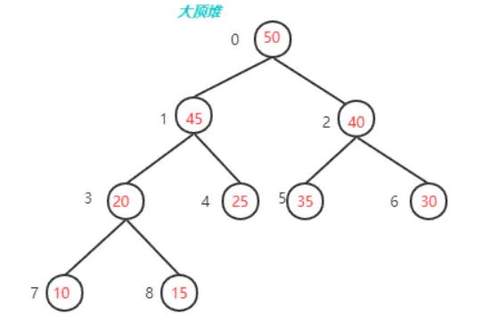

小顶堆：每个节点的值都小于或等于其左右孩子节点的值。

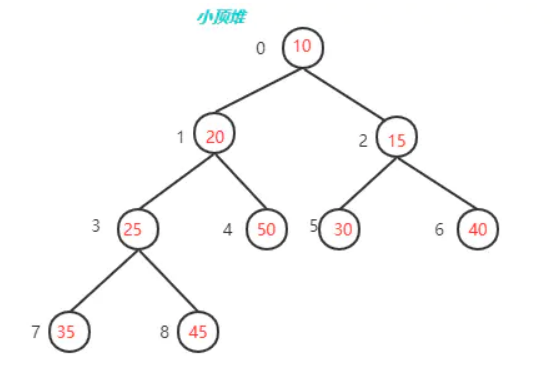

对堆中的结点按层进行编号，将这种逻辑结构映射到数组中就是下面这个样子

```
大顶堆 arr : 50 45 40 20 25 35 30 10 15

小顶堆 arr : 10 20 15 25 50 30 40 35 45
```

我们用简单的公式来描述一下堆的定义就是：

```
大顶堆：arr[i] >= arr[2i+1] && arr[i] >= arr[2i+2]

小顶堆：arr[i] <= arr[2i+1] && arr[i] <= arr[2i+2]
```

其中arr[2i+1]是左节点 arr[2i+2]是右节点

最小堆和最大堆的增删改相似，其实就是把算法中的大于改为小于，把小于改为大于。接下来以大顶堆为例，介绍其构建和添加删除操作。

## 最大堆的构建

最大堆的构建可以从下往上进行，先找到最后一个有子节点的节点，比较其子节点，找到大值与父节点比较。如果父节点值小，则子节点和父节点交换，交换之后要继续进行递归检查，如果出现父节点小于子节点则要调整。这样一步一步递归上去，直到位置为0的节点。

- 先要找到最后一个非叶子节点，数组的长度为6，那么最后一个非叶子节点就是：长度/2-1，也就是6/2-1=2，然后下一步就是比较该节点值和它的子树值，如果该节点小于其左\右子树的值就交换（意思就是将最大的值放到该节点）

8只有一个左子树，左子树的值为2，8>2不需要调整

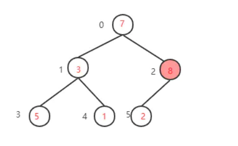

- 下一步，继续找到下一个非叶子节点

（其实就是当前坐标-1就行了这里为2-1=1），该节点的值为3小于其左子树的值5，交换值，交换后该节点值为5，大于其右子树的值1，不需要交换

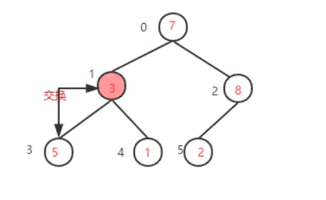

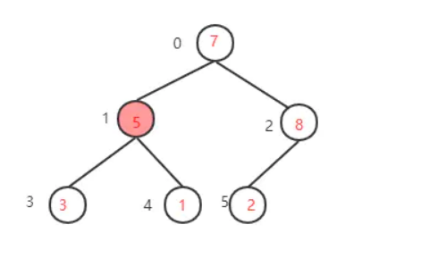

- 下一步，继续找到下一个非叶子节点1-1=0，该节点的值为7，大于其左子树的值，不需要交换，再看右子树，该节点的值小于右子树的值8，需要交换值

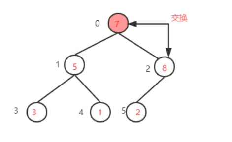

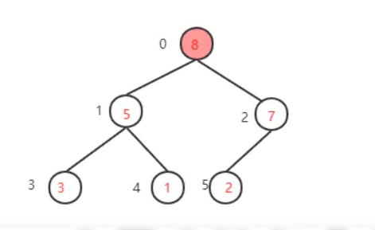

- 下一步，检查调整后的子树，是否满足大顶堆性质，如果不满足则继续调整

（这里因为只将右子树的值与根节点互换，只需要检查右子树是否满足，而7>2刚好满足大顶堆的性质，就不需要调整了。如果运气不好整个数的根节点的值是1，那么就还需要调整右子树

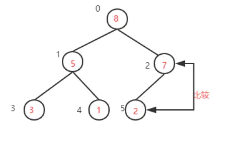

至此，一个大顶堆构建完成。

## 堆的插入

最大堆的插入的思想就是先在最后的结点添加一个元素，然后沿着树上升。跟最大堆的初始化大致相同。

## 堆的删除

按定义，堆中每次都删除第0个数据。为了便于重建堆，实际的操作是将最后一个数据的值赋给根结点，堆的元素个数-1，然后再从根结点开始进行一次从上向下的调整。

调整时先在左右儿子结点中找最小的，如果父结点比这个最小的子结点还小说明不需要调整了，反之将父结点和它交换后再考虑后面的结点。相当于从根结点将一个数据的下沉过程。

实际应用：堆排序，TopN问题。

堆排序过程：

- 交换根节点8与最后一个元素2交换位置（将最大元素"沉"到数组末端），此时最大的元素就归位了，然后对剩下的5个元素重复上面的操作


- 剩下只有5个元素，最后一个非叶子节点是5/2-1=1，该节点的值5大于左子树的值3也大于右子树的值1，满足大顶堆性质不需要交换

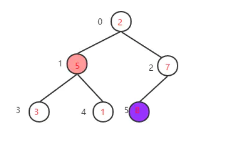

找到下一个非叶子节点，该节点的值2小于左子树的值5，交换值，交换后左子树的2不再满足大顶堆的性质再调整左子树，左子树满足要求后再返回去看根节点，根节点的值5小于右子树的值7，再次交换值

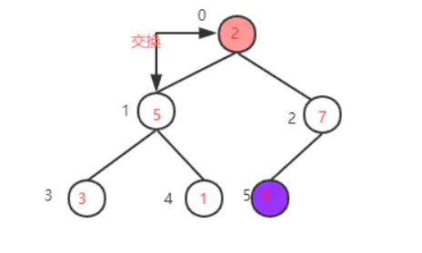

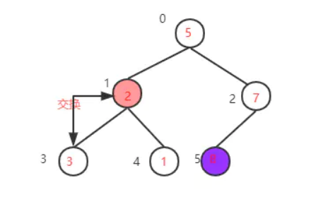

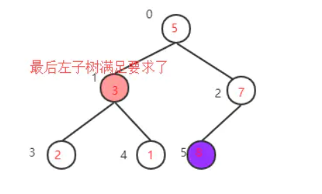

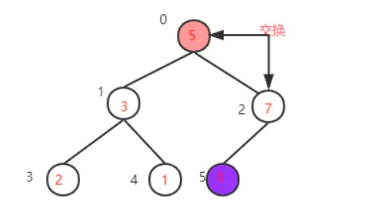

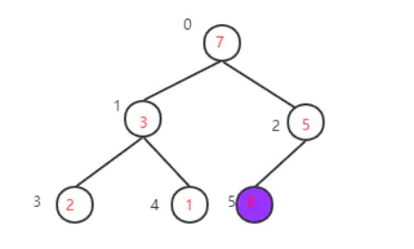

得到新的大顶堆，再把根节点的值7与当前数组最后一个元素值1交换，再重构大顶堆->交换值->重构大顶堆->交换值····，直到整个数组都变成有序序列

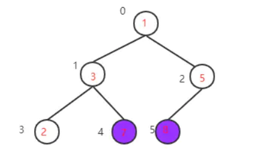

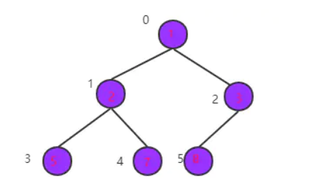

堆排序的最坏、最好、平均时间复杂度均为O(nlogn)，是不稳定排序算法。

TopN问题的解法类似，只是取出N个数后，无需进行后续处理。
