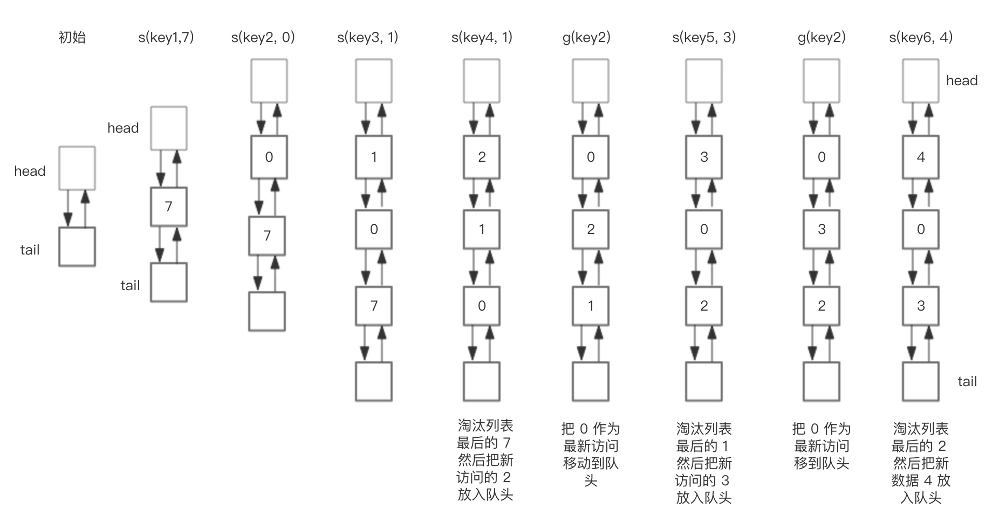

# 缓存淘汰策略之LRU算法分析

实际开发中经常使用缓存提高数据查询速度，由于缓存容量有限，当缓存容量达到上限时，就需要删除部分数据释放空间。缓存数据不能随机删除，一般情况下我们需要根据某种算法删除缓存数据。常用的缓存淘汰算法有LRU，LFU，FIFO，这里我们主要结合实际应用分析LRU算法。

## LRU简介

LRU是 Least Rencently Used 的缩写，这种算法认为最近使用的数据是热门数据，下一次很大概率将会再次使用。而最近很少使用的数据，很大概率下一次不再用到。当缓存容量满的时候，优先淘汰最近很少使用的数据。

下面展示了，预设大小是 3 的使用LRU算法的缓存的在存储和访问过程中的变化。我们对这个LRU缓存的操作序列如下：

```
set("key1", 7)

set("key2", 0)

set("key3", 1)

set("key4", 2)

get("key2")

set("key5", 3)

get("key2")

set("key6", 4)
```
相应的 LRU 部分的变化过程如下:



核心的两个操作步骤：

- set(key, value)，如果节点存在，更新节点的值，并把这个节点移到队头。如果不存在，需要构造新的节点，并且尝试把节点塞到队头，如果LRU空间不足，则通过 tail 淘汰掉队尾的节点。

- get(key)，如果节点存在，这个节点是最新访问的，所以要把节点插入到队头，然后返回缓存的值。

## LRU算法实现

LRU算法需要添加头节点，删除尾节点。而链表添加/删除节点的时间复杂度都是O(1)，非常适合存储缓存数据容器，但是不能使用普通的单向链表，单向链表有几点劣势：

- 每次获取任意节点数据，都需要从头节点遍历下去，这就导致获取节点复杂度为O(n)

- 移动中间节点到头节点，我们需要中间节点前一个节点的信息，单向链表不得不再次遍历以获取信息

因此，改进的方式如下：使用散列表存储节点，获取节点的复杂度将会降低为O(1)。节点移动问题可以在节点中增加前驱指针，记录上一个节点的信息，这样链表就从单向链表变成了双向链表


## Golang代码

```go
package LRU

import (
	"container/list"
	"errors"
	"sync"
)

type CallBack func(key interface{}, value interface{})

type Lru struct {
	max   int
	l     *list.List
	Call  CallBack
	cache map[interface{}]*list.Element
	mu    *sync.Mutex
}

type Node struct {
	Key interface{}
	Val interface{}
}

func NewLru(len int, c CallBack) *Lru {
	return &Lru{
		max:   len,
		l:     list.New(),
		Call:  c,
		cache: make(map[interface{}]*list.Element),
		mu:    new(sync.Mutex),
	}
}

func (l *Lru) Add(key interface{}, val interface{}) error {
	if l.l == nil {
		return errors.New("not init NewLru")
	}
	l.mu.Lock()
	defer l.mu.Unlock()
	if e, ok := l.cache[key]; ok { //以及存在
		e.Value.(*Node).Val = val
		l.l.MoveToFront(e)
		return nil
	}
	ele := l.l.PushFront(&Node{
		Key: key,
		Val: val,
	})
	l.cache[key] = ele
	if l.max != 0 && l.l.Len() > l.max {
		if e := l.l.Back(); e != nil {
			l.l.Remove(e)
			node := e.Value.(*Node)
			delete(l.cache, node.Key)
			if l.Call != nil {
				l.Call(node.Key, node.Val)
			}
		}
	}
	return nil
}

func (l *Lru) Get(key interface{}) (val interface{}, ok bool) {
	if l.cache == nil {
		return
	}
	l.mu.Lock()
	defer l.mu.Unlock()
	if ele, ok := l.cache[key]; ok {
		l.l.MoveToFront(ele)
		return ele.Value.(*Node).Val, true
	}
	return
}

func (l *Lru) GetAll() []*Node {
	l.mu.Lock()
	defer l.mu.Unlock()
	var data []*Node
	for _, v := range l.cache {
		data = append(data, v.Value.(*Node))
	}
	return data
}
```

## LRU算法分析

缓存命中率是缓存系统设计的重要指标，如果缓存系统的命中率过低，将会导致查询回流到数据库，使数据库压力升高。

结合以上分析LRU算法的优缺点。

- LRU算法优势在于算法实现难度不大，对于热点数据，LRU效率会很好

- LRU算法劣势在于对于偶发的批量操作，比如批量查询历史数据，就有可能使缓存中的热门数据被这些历史数据替换，造成缓存污染，导致缓存命中率下降，减慢正常查询。

## LRU在Mysql和Redis中的实现

### MySQL Innodb中的实现

在mysql innodb存储引擎的LRU实现中，将链表拆分为两部分，分为热数据区和冷数据区。

- 访问数据如果位于热数据区，与之前 LRU 算法一样，移动到热数据区的头结点。

- 插入数据时，若缓存已满，淘汰尾结点的数据。然后将数据插入冷数据区的头结点。
处于冷数据区的数据每次被访问需要做如下判断：

    - 若该数据已在缓存中超过指定时间，比如说 1 s，则移动到热数据区的头结点。

    - 若该数据存在在时间小于指定的时间，则位置保持不变

对于偶发的批量查询，数据仅仅只会落入冷数据区，然后很快就会被淘汰出去。热门数据区的数据将不会受到影响，这样就解决了 LRU 算法缓存命中率下降的问题。

其他改进方法还有 LRU-K，2Q,LIRS 算法。

### Redis中的实现

Redis中并没有使用双向链表实现一个LRU算法，Redis整体上是一个大的dict，key是一个string，value会保存为一个robj

```c
typedef struct redisObject {
    ...
    unsigned lru:LRU_BITS; //LRU_BITS为24bit
    ...
} robj;
```
我们看到每个robj中都有一个24bit长度的lru字段，lru字段里边保存的是一个时间戳。看下边的代码

```c
robj *lookupKey(redisDb *db, robj *key, int flags) {
    ...
            if (server.maxmemory_policy & MAXMEMORY_FLAG_LFU) { //如果配置的是lfu方式，则更新lfu
                updateLFU(val);
            } else {
                val->lru = LRU_CLOCK();//否则按lru方式更新
            }
    ...
}
```
在Redis的dict中每次按key获取一个值的时候，都会调用lookupKey函数,如果配置使用了lru模式,该函数会更新value中的lru字段为当前秒级别的时间戳(lfu方式后文再描述)。

那么，虽然记录了每个value的时间戳，但是淘汰时总不能挨个遍历dict中的所有槽，逐个比较lru大小吧。
 
Redis2.8之前的简单版

Redis初始的实现算法很简单，随机从dict中取出五个key,淘汰一个lru字段值最小的。(随机选取的key是个可配置的参数maxmemory-samples,默认值为5).

Redis3.0改进版

在Redis3.0的时候，又改进了一版算法：

- 首先第一次随机选取的key都会放入一个pool中(pool的大小为16),pool中的key是按lru大小顺序排列的。

- 接下来每次随机选取的keylru值必须小于pool中最小的lru才会继续放入，直到将pool放满。

- 放满之后，每次如果有新的key需要放入，需要将pool中lru最大的一个key取出。

- 淘汰的时候，直接从pool中选取一个lru最小的值然后将其淘汰。

