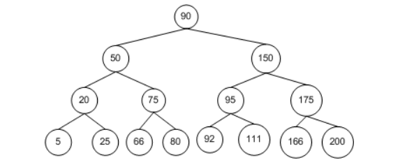
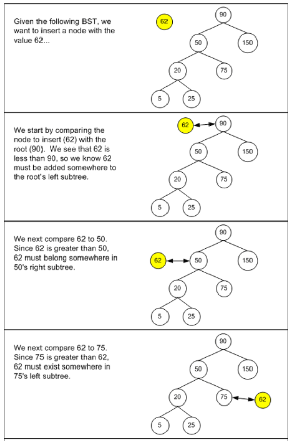
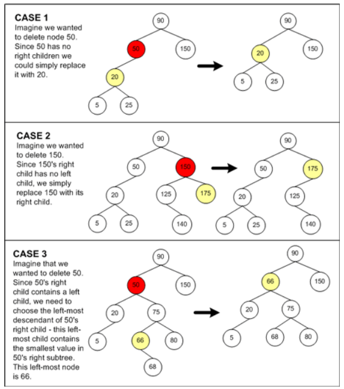
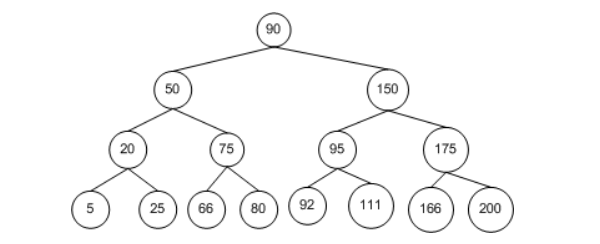

# 二叉查找树

## 二叉查找树的性质

二叉查找树(BST: Binary Search Tree)是一种特殊的二叉树，它改善了二叉树节点的查询效率。二叉查找树具有以下性质：

对于任意一个节点n，

- 其左子树(left subtree)下的每个后代节点(descendant node)的值都小于节点n的值

- 其右子树(right subtree)下的每个后代节点的值都大于节点n的值

## 查找节点

二叉查找树的查找算法过程如下：

假设要查找的节点为n，树中的当前节点为c，开始时c为BST的根节点。然后执行以下步骤：

1. 如果 c 值为空，则 n 不在 BST 中；

2. 比较 c 和 n 的值；

3. 如果值相同，则找到了指定节点 n；

4. 如果 n 的值小于 c，那么如果 n 存在，必然在 c 的左子树中。回到第 1 步，将 c 的左孩子作为 c；

5. 如果 n 的值大于 c，那么如果 n 存在，必然在 c 的右子树中。回到第 1 步，将 c 的右孩子作为 c；

通过 BST 查找节点，理想情况下我们需要检查的节点数可以减半。根据这一特点，查找算法的时间复杂度应该是 O(log­2n)，简写为 O(lg n)。

而实际上，对于 BST 查找算法来说，其十分依赖于树中节点的拓扑结构，也就是节点间的布局关系。下图描绘了一个节点插入顺序为 20, 50, 90, 150, 175, 200 的 BST 树。这些节点是按照递升顺序被插入的，结果就是这棵树没有广度（Breadth）可言。也就是说，它的拓扑结构其实就是将节点排布在一条线上，而不是以扇形结构散开，所以查找时间也为 O(n)

因此，BST 算法查找时间依赖于树的拓扑结构。最佳情况是 O(log­2n)，而最坏情况是 O(n)。

## 插入节点

当向树中插入一个新节点时，该节点将总是作为叶子节点。所以，问题在于如何找到该节点的父节点，以及作为父节点的左孩子还是右孩子。假设新的节点为n，树中的当前节点为c。开始时，节点c为BST的根节点。则定位节点n的父节点的过程如下：

1. 如果节点 c 为空，则节点 c 的父节点将作为节点 n 的父节点。如果节点 n 的值小于该父节点的值，则节点 n 将作为该父节点的左孩子；否则节点 n 将作为该父节点的右孩子。

2. 如果节点 c 非空，比较节点 c 与节点 n 的值。

3. 如果节点 c 的值与节点 n 的值相等，则说明用户在试图插入一个重复的节点。解决办法可以是直接丢弃节点 n，或者可以抛出异常。

4. 如果节点 n 的值小于节点 c 的值，则说明节点 n 一定是在节点 c 的左子树中。并将节点 c 设置为节点 c 的左孩子，然后返回至第 1 步。

5. 如果节点 n 的值大于节点 c 的值，则说明节点 n 一定是在节点 c 的右子树中。则将父节点设置为节点 c，并将节点 c 设置为节点 c 的右孩子，然后返回至第 1 步。

BST 的插入算法的复杂度与查找算法的复杂度是一样的：最佳情况是 O(log­2n)，而最坏情况是 O(n)。因为它们对节点的查找定位策略是相同的。

## 删除节点

从 BST 中删除节点比插入节点难度更大。因为删除一个非叶子节点，就必须选择其他节点来填补因删除节点所造成的树的断裂。如果不选择节点来填补这个断裂，那么就违背了 BST 的性质要求。

删除节点算法的第一步是定位要被删除的节点，这可以使用前面介绍的查找算法，因此运行时间为 O(log­2n)。接着应该选择合适的节点来代替删除节点的位置，它共有三种情况需要考虑。

1. 如果被删除的节点没有子节点，则直接将其父节点对应的指针置空。

2. 如果被删除的节点只有一个子节点，则直接将其父节点指向对应的子节点。

3. 如果被删除的节点有两个子节点，就需要用被删除节点右孩子的左子树中的最下面的节点来替换它，就是说，用被删除节点的右子树中最小值的节点来替换。

我们知道，在 BST 中，最小值的节点总是在最左边，最大值的节点总是在最右边。因此替换被删除节点右子树中最小的一个节点，就保证了该节点一定大于被删除节点左子树的所有节点。同时，也保证它替代了被删除节点的位置后，它的右子树的所有节点值都大于它。因此这种选择策略符合二叉查找树的性质。

和查找、插入算法类似，删除算法的运行时间也与 BST 的拓扑结构有关，最佳情况是 O(log­2n)，而最坏情况是 O(n)。

## 遍历节点

BST 则有三种常用的遍历方式：

- 前序遍历（Perorder traversal）

- 中序遍历（Inorder traversal）

- 后序遍历（Postorder traversal）

这三种遍历方式的工作原理是类似的。它们都是从根节点开始，然后访问其子节点。区别在于遍历时，访问节点本身和其子节点的顺序不同。

### 前序遍历

前序遍历从当前节点（节点 c）开始访问，然后访问其左孩子，再访问右孩子。开始时，节点 c 为 BST 的根节点。算法如下：

1. 访问节点 c；

2. 对节点 c 的左孩子重复第 1 步；

3. 对节点 c 的右孩子重复第 1 步；

上图中树的遍历结果为：90, 50, 20, 5, 25, 75, 66, 80, 150, 95, 92, 111, 175, 166, 200。

### 中序遍历

中序遍历是从当前节点（节点 c）的左孩子开始访问，再访问当前节点，最后是其右节点。开始时，节点 c 为 BST 的根节点。算法如下：

1. 访问节点 c 的左孩子；

2. 对节点 c 重复第 1 步；

3. 对节点 c 的右孩子重复第 1 步。

上图中树的遍历结果为：5, 20, 25, 50, 66, 75, 80, 90, 92, 95, 111, 150, 166, 175, 200。

### 后序遍历

后序遍历首先从当前节点（节点 c）的左孩子开始访问，然后是右孩子，最后才是当前节点本身。开始时，节点 c 为 BST 的根节点。算法如下：

1. 访问节点 c 的左孩子；

2. 对节点 c 的右孩子重复第1 步；

3. 对节点 c 重复第 1 步；

上图中树的遍历结果为：5, 25, 20, 66, 80, 75, 50, 92, 111, 95, 166, 200, 175, 150, 90。