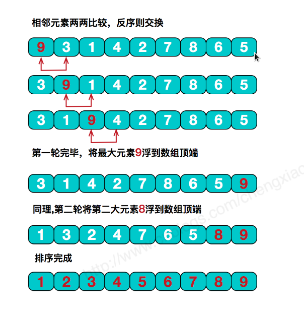

# 冒泡排序

冒泡排序的基本思想是，对相邻的元素进行两两比较，顺序相反则进行交换，这样每一趟会将最小或最大的元素“浮”到顶端，最终达到完全有序，冒泡排序是稳定排序。



在冒泡排序的过程中，如果某一趟执行完毕，没有做过任何一次交换工作，比如数组[5, 4, 1, 2, 3]，执行了两次冒泡，也就是两次外循环之后，分别将5和4调整到最终位置[1, 2, 3, 4, 5]。此时，再执行第三次循环后，一次交换都没有做，这就说明剩下的序列已经是有序的，排序操作已经完成了。

若数组本身就是有序的，仅需n-1次比较就可以完成，若是倒序，比较次数为n-1+n-2+...+1=n(n-1)/2，交换次数和比较次数等值。所以其时间复杂度为O(n^2)。

```go
package main

import (
	"fmt"
)

//冒泡排序(稳定排序)
func BubbleSort(a []int) ([]int, int) {
	 count := 0
	 length := len(a)
	 for i := length - 1; i >= 0 ; i-- {
	 	flag := 0
	 	for j := 0; j < i; j++ {
			if a[j] > a[j+1] {
				a[j], a[j+1] = a[j+1], a[j]
				count++
				flag = 1
			}
		}
		if flag == 0 {
			break
		}
	 }
	 return a, count
}

func main() {
	beforeSortSet := []int {10, 22, 33, 21, 56, 32, 81, 73, 69, 83}
	fmt.Println("Before Sort:", beforeSortSet)
	afterSortSet, count := BubbleSort(beforeSortSet)
	fmt.Println("After Sort:", afterSortSet, "Swap Count:", count)
}
```