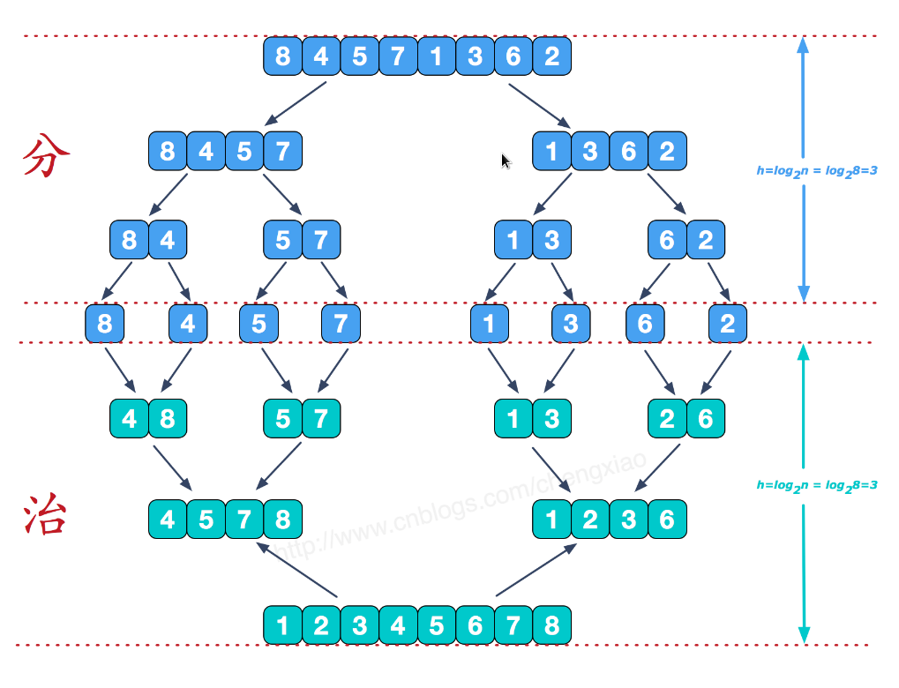
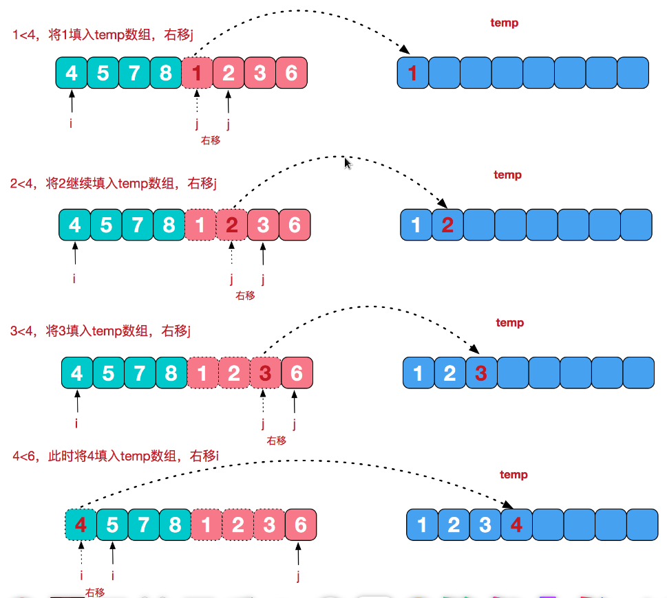
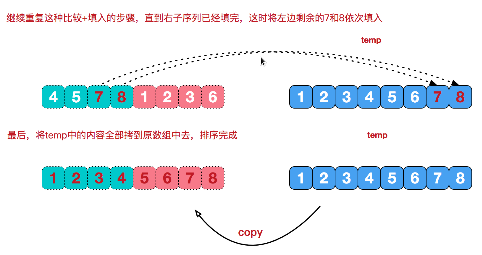

# 归并排序

归并排序(MERGE-SORT)是利用归并的思想实现的排序方法，该算法采用经典的分治策略(divide-and-conquer)，(分治法将问题分(divide)成一些小的问题然后递归求解，而治(conquer)的阶段则将分的阶段得到的各答案"修补"在一起，即分而治之)



可以看到这种结构很像一棵完全二叉树，这里的归并排序我们采用递归去实现（也可采用迭代的方式去实现）。分阶段可以理解为就是递归拆分子序列的过程，递归深度为log2n。

## 合并有序子序列

再来看看治阶段，我们需要将两个已经有序的子序列合并成一个有序序列，比如上图中的最后一次合并，要将[4,5,7,8]和[1,2,3,6]两个已经有序的子序列，合并为最终序列[1,2,3,4,5,6,7,8]，来看下实现步骤。





```go
package main

import (
	"fmt"
)

const INFINITY = 0xffff

func MergeSort(a []int) {
	merge(a, 0, len(a) - 1)
}

func merge(a []int, start int, end int) {
	if start < end {
		mid := (start + end)/2
		merge(a, start, mid)
		merge(a, mid + 1, end)

		arr1 := make([]int, mid - start + 2)
		copy(arr1, a[start:mid+1])
		arr1[mid - start + 1] = INFINITY

		arr2 := make([]int, end - mid + 1)
		copy(arr2, a[mid+1:end+1])
		arr2[end - mid] = INFINITY

		j, k := 0, 0
		for i := start; i <= end; i++ {
			if arr1[j] <= arr2[k] {
				a[i] = arr1[j]
				j++
			} else {
				a[i] = arr2[k]
				k++
			}
		}
	}
}

func main() {
	beforeSortSet := []int {10, 22, 33, 21, 56, 32, 81, 73, 69, 83}
	fmt.Println("Before Sort:", beforeSortSet)
	MergeSort(beforeSortSet)
	fmt.Println("After Sort:", beforeSortSet)
}
```
