# 红黑树

红黑树(Red Black Tree)是一种自平衡的二叉查找树，除了符合二叉查找树的基本特征以外，还具有下列的附加特征：

1. 节点是红色或者黑色

2. 根节点是黑色

3. 每个叶子节点都是黑色的空节点

4. 每个红色节点的两个子节点都是黑色

5. 从任一节点到其每个叶子的所有路径都包含相同数目的黑色节点

下面是一棵典型的红黑树：

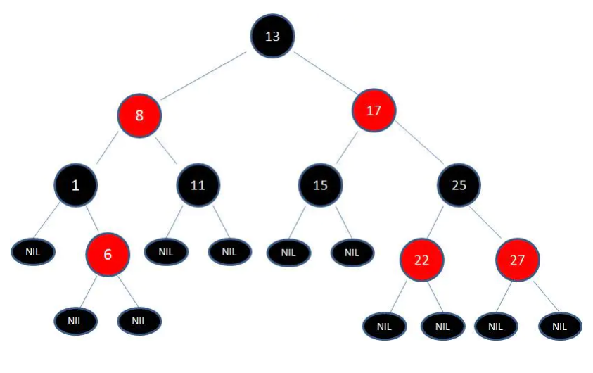

红黑树的规则限制保证了红黑树的自平衡，红黑树从根到叶子的最长路径不会超过最短路径的2倍。

当插入或者删除节点的时候，红黑树的规则可能被打破，这时就需要做出一些调整，来维持规则。

调整有两种方法，分别是变色和旋转，旋转分为左旋和右旋。

## 变色

为了重新符合红黑树的规则，尝试把红色节点变为黑色，或者把黑色节点变为红色。

## 旋转

### 左旋

逆时针旋转红黑树的两个节点，使得父节点被自己的右孩子取代，而自己成为自己的左孩子。说起来很怪异，大家看下图：

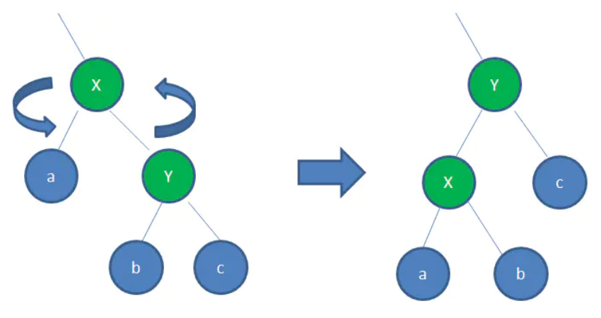

图中，身为右孩子的Y取代了X的位置，而X变成了自己的左孩子。此为左旋转。

### 右旋

顺时针旋转红黑树的两个节点，使得父节点被自己的左孩子取代，而自己成为自己的右孩子。大家看下图：

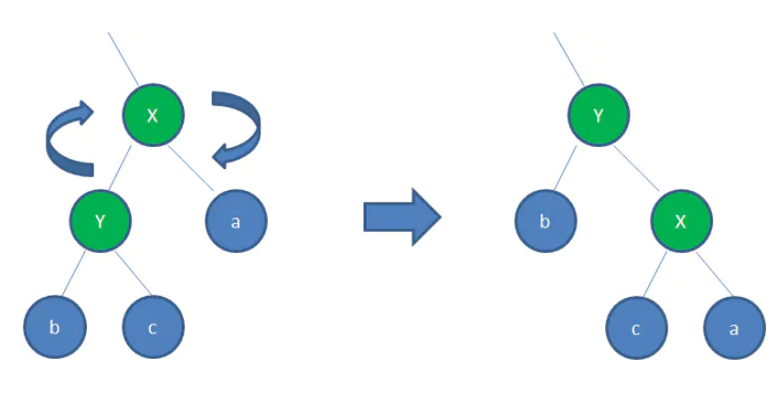

图中，身为左孩子的Y取代了X的位置，而X变成了自己的右孩子。此为右旋转。

什么情况下会破坏红黑树的规则，什么情况下不会破坏规则呢？我们举两个简单的栗子：

1. 向原红黑树插入值为14的新节点：

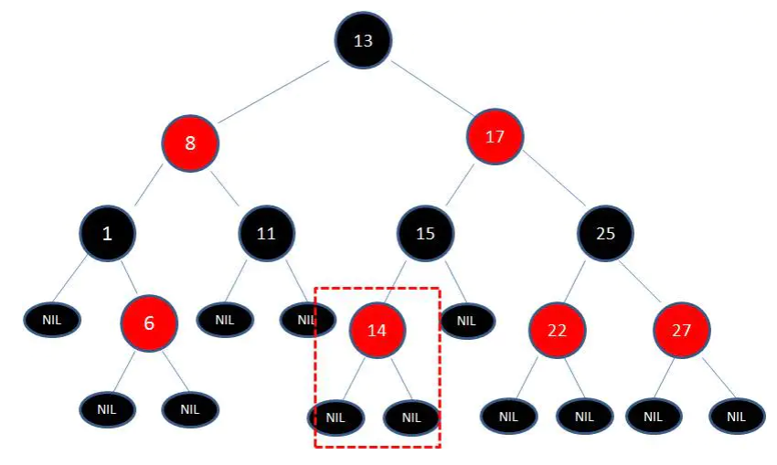

由于父节点15是黑色节点，因此这种情况并不会破坏红黑树的规则，无需做任何调整。

2. 向原红黑树插入值为21的新节点：

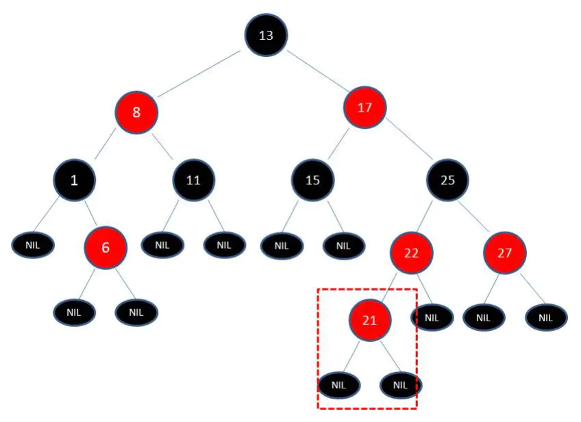

由于父节点22是红色节点，因此这种情况打破了红黑树的规则4（每个红色节点的两个子节点都是黑色），必须进行调整，使之重新符合红黑树的规则。

首先，我们需要做的是变色，把节点25及其下方的节点变色：

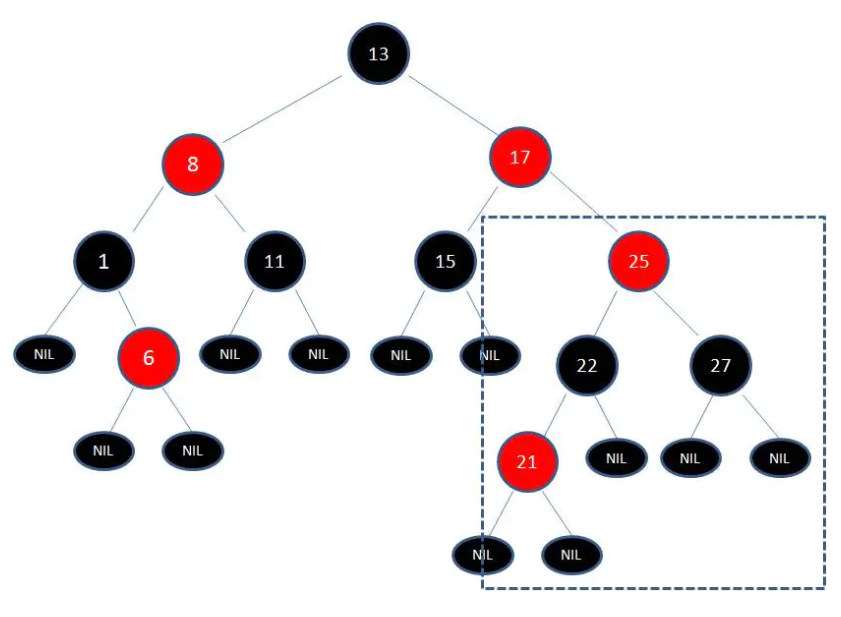

此时节点17和节点25是连续的两个红色节点，那么把节点17变成黑色节点？恐怕不合适。这样一来不但打破了规则4，而且根据规则2（根节点是黑色），也不可能把节点13变成红色节点。

变色已无法解决问题，我们把节点13看做X，把节点17看做Y，像刚才的示意图那样进行左旋转：

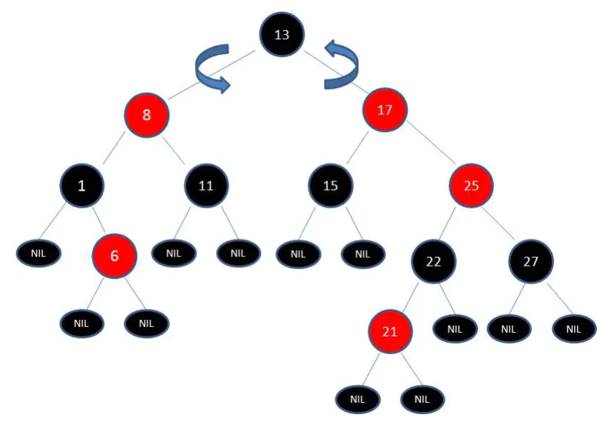

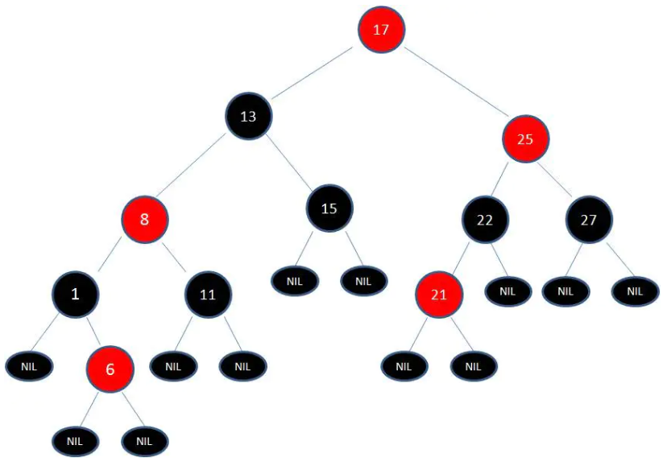

由于根节点必须是黑色节点，所以需要变色，变色结果如下:

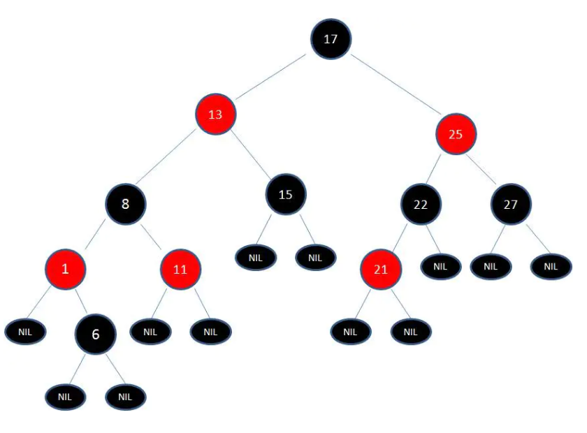

这样就结束了吗？并没有。因为其中两条路径(17 -> 8 -> 6 -> NIL)的黑色节点个数是4，其他路径的黑色节点个数是3，不符合规则5。

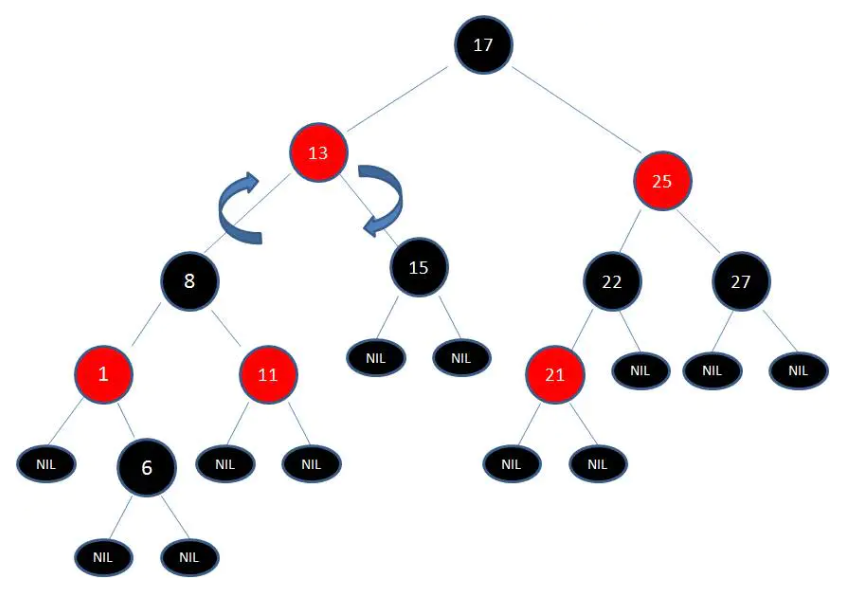

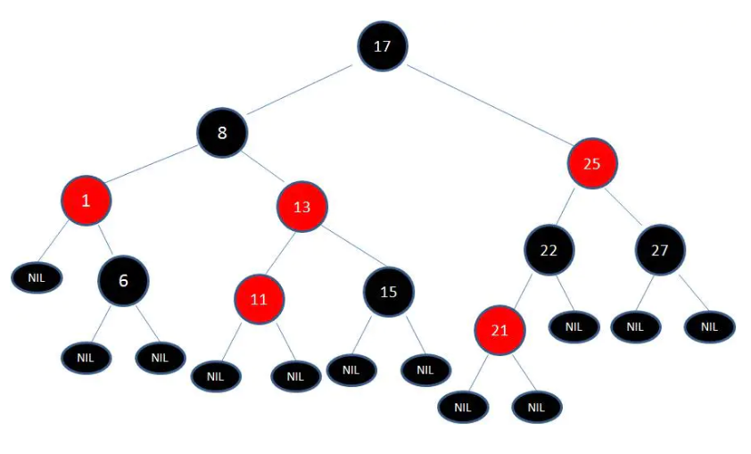

最后根据规则来进行变色：

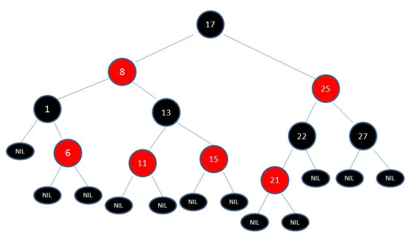

如此一来，我们的红黑树变得重新符合规则。这一个例子的调整过程比较复杂，经历了如下步骤：

变色 -> 左旋转 -> 变色 -> 右旋转 -> 变色

## 应用

红黑树在实际中的应用有很多，其中JDK的集合类TreeMap和TreeSet底层就是红黑树，在Java8中，HashMap也用到了红黑树。

