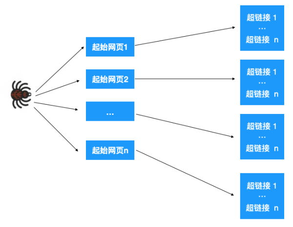

# 深度优先遍历和广度优先遍历

深度优先遍历(DFS)和广度优先遍历(BFS)是图论中两种非常重要的算法，生产上广泛用于拓扑排序，寻路(迷宫)，搜索引擎，爬虫等。也频繁出现在高频面试题中。

## 深度优先遍历

主要思路是从一个未访问的顶点V开始，沿着一条路一直走到底，然后从这条路尽头的节点回退到上一个节点，再从另一条路开始走到底...，不断递归重复此过过程，直到所有的顶点都遍历完成，它的特点是不撞南墙不回头，先走完一条路，再换另一条路继续走。

树的深度优先遍历


1. 从根节点1开始遍历，它相邻的节点有2，3，4，先遍历节点2，再遍历2的子节点5，然后再遍历5的子节点9。


2. 上图中一条路已经走到底了(9是叶子节点，再无可遍历的节点)，此时就从 9 回退到上一个节点 5，看下节点 5 是否还有除 9 以外的节点，没有继续回退到 2，2 也没有除 5 以外的节点，回退到 1，1 有除 2 以外的节点 3，所以从节点 3 开始进行深度优先遍历，如下：


3. 同理从 10 开始往上回溯到 6, 6 没有除 10 以外的子节点，再往上回溯，发现 3 有除 6 以外的子点 7，所以此时会遍历 7。


4. 从 7 往上回溯到 3， 1，发现 1 还有节点 4 未遍历，所以此时沿着 4， 8 进行遍历,这样就遍历完成了。

完整的节点的遍历顺序如下(节点上的的蓝色数字代表):


相信大家看到以上的遍历不难发现这就是树的前序遍历,实际上不管是前序遍历，还是中序遍历，亦或是后序遍历，都属于深度优先遍历。

那么深度优先遍历该怎么实现呢，有递归和非递归两种表现形式，接下来我们以二叉树为例来看下如何分别用递归和非递归来实现深度优先遍历。

### 递归实现

递归实现比较简单，由于是前序遍历，所以我们依次遍历当前节点，左节点，右节点即可，对于左右节点来说，依次遍历它们的左右节点即可，依此不断递归下去，直到叶节点(递归终止条件)，代码如下

```java
public class Solution { 
    private static class Node { 
        /** 
         * 节点值 
         */ 
        public int value; 
        /** 
         * 左节点 
         */ 
        public Node left; 
        /** 
         * 右节点 
         */ 
        public Node right; 
 
        public Node(int value, Node left, Node right) { 
            this.value = value; 
            this.left = left; 
            this.right = right; 
        } 
    } 
 
    public static void dfs(Node treeNode) { 
        if (treeNode == null) { 
            return; 
        } 
        // 遍历节点 
        process(treeNode) 
        // 遍历左节点 
        dfs(treeNode.left); 
        // 遍历右节点 
        dfs(treeNode.right); 
    } 
} 
```

递归的表达性很好，也很容易理解，不过如果层级过深，很容易导致栈溢出。所以我们重点看下非递归实现。

### 非递归实现

仔细观察深度优先遍历的特点，对二叉树来说，由于是先序遍历(先遍历当前节点，再遍历左节点，再遍历右节点)，所以我们有如下思路：

对于每个节点来说，先遍历当前节点，然后把右节点压栈，再压左节点(这样弹栈的时候会先拿到左节点遍历，符合深度优先遍历要求)。

弹栈，拿到栈顶的节点，如果节点不为空，重复步骤 1， 如果为空，结束遍历。

我们以以下二叉树为例来看下如何用栈来实现 DFS


整体动图如下：


整体思路还是比较清晰的，使用栈来将要遍历的节点压栈，然后出栈后检查此节点是否还有未遍历的节点，有的话压栈，没有的话不断回溯(出栈)，有了思路，不难写出如下用栈实现的二叉树的深度优先遍历代码：

```java
/** 
 * 使用栈来实现 dfs 
 * @param root 
 */ 
public static void dfsWithStack(Node root) { 
    if (root == null) { 
        return; 
    } 
 
    Stack<Node> stack = new Stack<>(); 
    // 先把根节点压栈 
    stack.push(root); 
    while (!stack.isEmpty()) { 
        Node treeNode = stack.pop(); 
        // 遍历节点 
        process(treeNode) 
 
        // 先压右节点 
        if (treeNode.right != null) { 
            stack.push(treeNode.right); 
        } 
 
        // 再压左节点 
        if (treeNode.left != null) { 
            stack.push(treeNode.left); 
        } 
    } 
} 
```

可以看到用栈实现深度优先遍历其实代码也不复杂，而且也不用担心递归那样层级过深导致的栈溢出问题。

## 广度优先遍历

广度优先遍历，指的是从图的一个未遍历的节点出发，先遍历这个节点的相邻节点，再依次遍历每个相邻节点的相邻节点。

上文所述树的广度优先遍历动图如下，每个节点的值即为它们的遍历顺序。所以广度优先遍历也叫层序遍历，先遍历第一层(节点 1)，再遍历第二层(节点 2，3，4)，第三层(5，6，7，8)，第四层(9，10)。


深度优先遍历用的是栈，而广度优先遍历要用队列来实现，我们以下图二叉树为例来看看如何用队列来实现广度优先遍历。


动图如下：


代码如下：

```java
/** 
 * 使用队列实现 bfs 
 * @param root 
 */ 
private static void bfs(Node root) { 
    if (root == null) { 
        return; 
    } 
    Queue<Node> stack = new LinkedList<>(); 
    stack.add(root); 
 
    while (!stack.isEmpty()) { 
        Node node = stack.poll(); 
        System.out.println("value = " + node.value); 
        Node left = node.left; 
        if (left != null) { 
            stack.add(left); 
        } 
        Node right = node.right; 
        if (right != null) { 
            stack.add(right); 
        } 
    } 
} 
```

## 应用

搜索引擎的工作原理，简单来说有三步：

1、网页抓取

搜索引擎通过爬虫将网页爬取，获得页面 HTML 代码存入数据库中

2、预处理

索引程序对抓取来的页面数据进行文字提取，中文分词，(倒排)索引等处理，以备排名程序使用

3、排名

用户输入关键词后，排名程序调用索引数据库数据，计算相关性，然后按一定格式生成搜索结果页面。

我们重点看下第一步，网页抓取。

这一步的大致操作如下：给爬虫分配一组起始的网页，我们知道网页里其实也包含了很多超链接，爬虫爬取一个网页后，解析提取出这个网页里的所有超链接，再依次爬取出这些超链接，再提取网页超链接。。。，如此不断重复就能不断根据超链接提取网页。



最终构成了一张图，于是问题就转化为了如何遍历这张图，显然可以用深度优先或广度优先的方式来遍历。

如果是广度优先遍历，先依次爬取第一层的起始网页，再依次爬取每个网页里的超链接，如果是深度优先遍历，先爬取起始网页 1，再爬取此网页里的链接...，爬取完之后，再爬取起始网页 2...

实际上爬虫是深度优先与广度优先两种策略一起用的，比如在起始网页里，有些网页比较重要(权重较高)，那就先对这个网页做深度优先遍历，遍历完之后再对其他(权重一样的)起始网页做广度优先遍历。