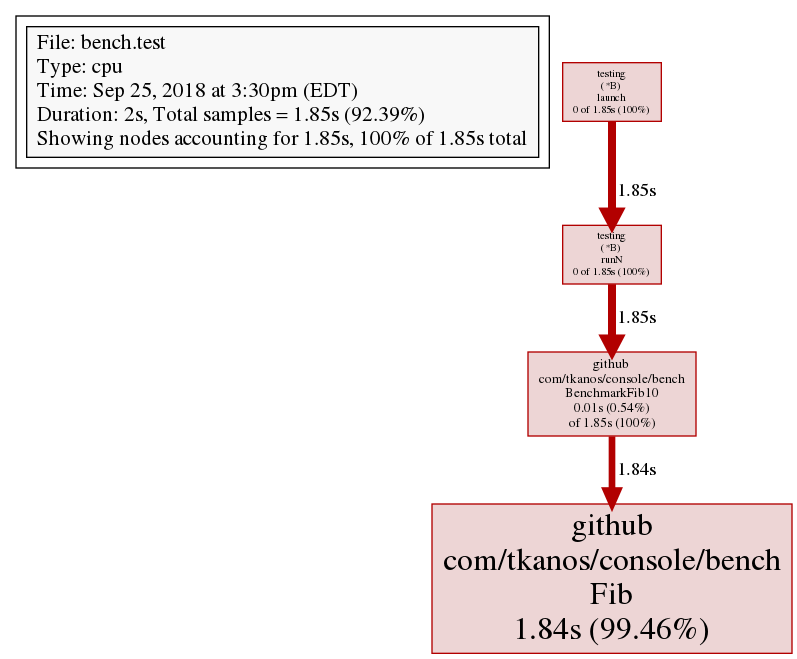
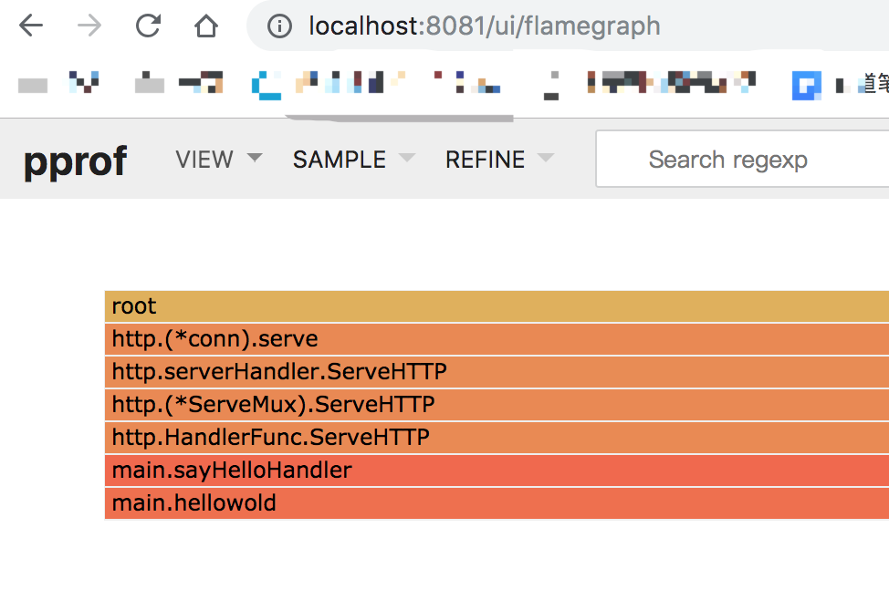

# Go benchmark性能测试

## 编写基准测试

基准测试主要是通过测试CPU和内存的效率问题，来评估测试代码的性能，进而找到更好的解决方案。

```go
func BenchmarkSprintf(b *testing.B){
	num:=10
	b.ResetTimer()
	for i:=0;i<b.N;i++{
		fmt.Sprintf("%d",num)
	}
}
```

1. 基准测试的代码文件必须以_test.go结尾

2. 基准测试的函数必须以Benchmark开头，必须是可导出的

3. 基准测试的函数必须接收一个指向Benchmark类型的指针作为唯一参数

4. 基准测试函数不能有返回值

5. b.ResetTimer是重置计时器，这样可以避免for循环之前的初始化代码的干扰

6. 最后的for循环很重要，被测试的代码要放到循环里

7. b.N是基准测试框架提供的，表示循环的次数，因为需要反复调用测试的代码，才可以评估性能

```
➜  go test -bench=. -run=none
BenchmarkSprintf-8      20000000               117 ns/op
PASS
ok                     flysnow.org/hello       2.474s
```

使用 go test 命令，加上 -bench= 标记，接受一个表达式作为参数, .表示运行所有的基准测试

因为默认情况下 go test 会运行单元测试，为了防止单元测试的输出影响我们查看基准测试的结果，可以使用-run=匹配一个从来没有的单元测试方法，过滤掉单元测试的输出，我们这里使用none，因为我们基本上不会创建这个名字的单元测试方法。

也可以使用 -run=^$, 匹配这个规则的，但是没有，所以只会运行benchmark

```
go test -bench=. -run=^$
```

有些时候在benchmark之前需要做一些准备工作，并且，我们不希望这些准备工作纳入到计时里面，我们可以使用 b.ResetTimer()，代表重置计时为0，以调用时的时刻作为重新计时的开始。

- 函数后面的-8表示运行时对应的GOMAXPROCS的值。

- 接着的20000000表示运行for循环的次数也就是调用被测试代码的次数

- 最后的117 ns/op表示每次需要话费117纳秒。(执行一次操作的耗时)

以上是测试时间默认是1秒，也就是1秒的时间，调用两千万次，每次调用花费117纳秒。

如果想让测试运行的时间更长，可以通过-benchtime指定，比如3秒。

```
➜  hello go test -bench=. -benchtime=3s -run=none
// Benchmark 名字 - CPU     循环次数          平均每次执行时间 
BenchmarkSprintf-8         50000000           109 ns/op
PASS
//  哪个目录下执行go test         累计耗时
ok                     flysnow.org/hello       5.628s
```

可以发现，我们加长了测试时间，测试的次数变多了，但是最终的性能结果：每次执行的时间，并没有太大变化。一般来说这个值最好不要超过3秒，意义不大。

## 性能对比

上面那个基准测试的例子，其实是一个int类型转为string类型的例子，标准库里还有几种方法，我们看下哪种性能更加.

```go
func BenchmarkSprintf(b *testing.B){
	num:=10
	b.ResetTimer()
	for i:=0;i<b.N;i++{
		fmt.Sprintf("%d",num)
	}
}

func BenchmarkFormat(b *testing.B){
	num:=int64(10)
	b.ResetTimer()
	for i:=0;i<b.N;i++{
		strconv.FormatInt(num,10)
	}
}

func BenchmarkItoa(b *testing.B){
	num:=10
	b.ResetTimer()
	for i:=0;i<b.N;i++{
		strconv.Itoa(num)
	}
}
```

```
➜  hello go test -bench=. -run=none              
BenchmarkSprintf-8      20000000               117 ns/op
BenchmarkFormat-8       50000000                33.3 ns/op
BenchmarkItoa-8         50000000                34.9 ns/op
PASS
ok                      flysnow.org/hello       5.951s
```

从结果上看strconv.FormatInt函数是最快的，其次是strconv.Itoa，然后是fmt.Sprintf最慢，前两个函数性能达到了最后一个的3倍多。那么最后一个为什么这么慢的，我们再通过-benchmem找到根本原因。

```
➜  hello go test -bench=. -benchmem -run=none
BenchmarkSprintf-8      20000000               110 ns/op              16 B/op          2 allocs/op
BenchmarkFormat-8       50000000                31.0 ns/op             2 B/op          1 allocs/op
BenchmarkItoa-8         50000000                33.1 ns/op             2 B/op          1 allocs/op
PASS
ok                      flysnow.org/hello       5.610s
```

-benchmem可以提供每次操作分配内存的次数，以及每次操作分配的字节数。从结果我们可以看到，性能高的两个函数，每次操作都是进行1次内存分配，而最慢的那个要分配2次；性能高的每次操作分配2个字节内存，而慢的那个函数每次需要分配16字节的内存。从这个数据我们就知道它为什么这么慢了，内存分配都占用都太高。

在代码开发中，对于我们要求性能的地方，编写基准测试非常重要，这有助于我们开发出性能更好的代码。不过性能、可用性、复用性等也要有一个相对的取舍，不能为了追求性能而过度优化。

## 结合pprof

pprof性能监控

```go
package bench
import "testing"
func Fib(n int) int {
    if n < 2 {
      return n
    }
    return Fib(n-1) + Fib(n-2)
}
func BenchmarkFib10(b *testing.B) {
    // run the Fib function b.N times
    for n := 0; n < b.N; n++ {
      Fib(10)
    }
}
```

```
go test -bench=. -benchmem -cpuprofile profile.out
```

```
go test -bench=. -benchmem -memprofile memprofile.out -cpuprofile profile.out
```

然后就可以对输出的文件使用pprof进行解析

```
go tool pprof profile.out
File: bench.test
Type: cpu
Time: Apr 5, 2018 at 4:27pm (EDT)
Duration: 2s, Total samples = 1.85s (92.40%)
Entering interactive mode (type "help" for commands, "o" for options)
(pprof) top
Showing nodes accounting for 1.85s, 100% of 1.85s total
      flat  flat%   sum%        cum   cum%
     1.85s   100%   100%      1.85s   100%  bench.Fib
         0     0%   100%      1.85s   100%  bench.BenchmarkFib10
         0     0%   100%      1.85s   100%  testing.(*B).launch
         0     0%   100%      1.85s   100%  testing.(*B).runN
```

可以用list命令检查函数消耗的时间

```
(pprof) list Fib
     1.84s      2.75s (flat, cum) 148.65% of Total
         .          .      1:package bench
         .          .      2:
         .          .      3:import "testing"
         .          .      4:
     530ms      530ms      5:func Fib(n int) int {
     260ms      260ms      6:   if n < 2 {
     130ms      130ms      7:           return n
         .          .      8:   }
     920ms      1.83s      9:   return Fib(n-1) + Fib(n-2)
         .          .     10:}
```

或者使用web命令生成图像（png,pdf,...）



## 火焰图

火焰图（Flame Graph）是 Bredan Gregg 创建的一种性能分析图表，因为它的样子近似火焰而得名。

火焰图 svg 文件可以通过浏览器打开，它对于调用图的最优点是它是动态的：可以通过点击每个方块来 zoom in 分析它上面的内容。

火焰图的调用顺序从下到上，每个方块代表一个函数，它上面一层表示这个函数会调用哪些函数，方块的大小代表了占用 CPU 使用的长短。火焰图的配色并没有特殊的意义，默认的红、黄配色是为了更像火焰而已。

runtime/pprof分析项目, 会在当前文件夹内导出profile文件。然后用火焰图去分析，就不能指定域名了，要指定文件。

## go-torch

网上介绍大部分使用uber的开源工具

go-torch。这是 uber 开源的一个工具，可以直接读取 golang profiling 数据，并生成一个火焰图的 svg 文件。

go-torch 工具的使用非常简单，没有任何参数的话，它会尝试从 http://localhost:8080/debug/pprof/profile 获取 profiling 数据。它有三个常用的参数可以调整：

- -u --url：要访问的 URL，这里只是主机和端口部分
- -s --suffix：pprof profile 的路径，默认为 /debug/pprof/profile
- --seconds：要执行 profiling 的时间长度，默认为 30s

## 原生支持

从 Go 1.11 开始, 火焰图被集成进入 Go 官方的 pprof 库.

```
# This will listen on :8081 and open a browser.
# Change :8081 to a port of your choice.
$ go tool pprof -http=":8081" [binary] [profile]
```

如果低于1.11版本那么请从git 获取 pprof

```
# Get the pprof tool directly
$ go get -u github.com/google/pprof

$ pprof -http=":8081" [binary] [profile]
```

## 一个web小例子

```go
package main

import (
	"fmt"
	"log"
	"net/http"
	_ "net/http/pprof"
	"time"
)

func sayHelloHandler(w http.ResponseWriter, r *http.Request) {
	hellowold(10000)
	fmt.Println("path", r.URL.Path)
	fmt.Println("scheme", r.URL.Scheme)
	fmt.Fprintf(w, "Hello world!\n") //这个写入到w的是输出到客户端的
}

func main() {
	http.HandleFunc("/", sayHelloHandler) //	设置访问路由
	log.Fatal(http.ListenAndServe(":8080", nil))
}

func hellowold(times int) {
	time.Sleep(time.Second)
	var counter int
	for i := 0; i < times; i++ {
		for j := 0; j < times; j++ {
			counter++
		}
	}
}
```

使用下面的命令开启监控，然后访问几次localhost:8080

```
go tool pprof -http=":8081" http://localhost:8080/debug/pprof/profile
```

过一会儿会产生个web窗口, 选择 VIEW->Flame Graph 得到火焰图形

```
http://localhost:8081/ui/flamegraph
```




## Testing flags

go 测试后面可以跟哪些参数

Testing flags

常用flag

- -bench regexp:性能测试，支持表达式对测试函数进行筛选。-bench .则是对所有的benchmark函数测试
- -benchmem:性能测试的时候显示测试函数的内存分配的统计信息
- -count n:运行测试和性能多少此，默认一次
- -run regexp:只运行特定的测试函数， 比如-run ABC只测试函数名中包含ABC的测试函数
- -timeout t:测试时间如果超过t, panic,默认10分钟
- -v:显示测试的详细信息，也会把Log、Logf方法的日志显示出来

Go 1.7中开始支持 sub-test的概念。


