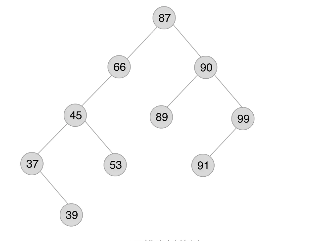
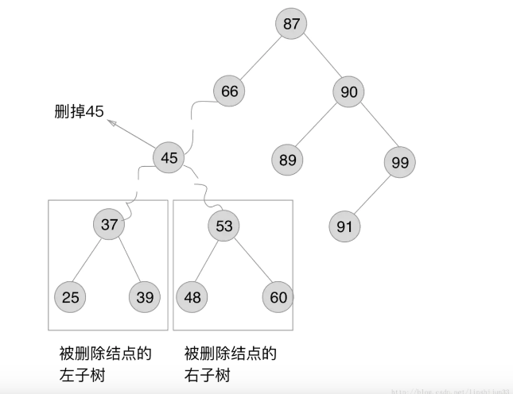

# 二叉排序树，AVL树和红黑树

AVL树和红黑树在计算机领域的应用场景都十分广泛，AVL树在Windows进程地址空间管理中得到了使用，而红黑树在STL和Linux都有一定的运用。

## 二叉排序树

### 产生背景

AVL树和红黑树都来源于二叉排序树。

线性表分为无序线性表和有序线性表，无序线性表的数据并不是按升序或者降序来排列的，所以在插入和删除时，没有什么必须遵守的规矩而可以插入在数据尾部或者删除数据尾部(将待删除的数据和最有一个数据交换位置)，但是在查找的时候，需要遍历整个数据集，影响了效率。

有序线性表的数据在查找时因为数据有序，可以用二分法，插值法，斐波那契查找法来实现，但是，插入和删除需要维护有序的结构，会耗费大量的时间。

为了提高插入和删除的效率，因此诞生了二叉排序树。

### 定义

二叉排序树(BST)是一棵具有下列性质的二叉树。

- 若它的左子树不空，则左子树上所有结点的值均小于它的根结构的值

- 若它的右子树不空，则右子树上所有结点的值均小于它的根结构的值

- 它的左子树和右子树都是二叉排序树

定义中最为关键的特点是， 左子树结点一定比父结点小，右子树结点一定比父结点大 



### 查找

查找树中一个值，可以从根节点开始查找，和根结点的值做比较，比根结点的值小，就在根结点的左子树中查找，比根结点的值大，就在根结点的右子树中查找。其他结点的行为与根结点的行为也是一样的。可以得到递归算法：

- 如果树是空的，则查找结束，无匹配。

- 如果被查找的值和根结点的值相等，查找成功。否则就在子树中继续查找。如果被查找的值小于根结点的值就选择左子树，大于根结点的值就选择右子树。在理想情况下，每次比较过后，树会被砍掉一半，近乎折半查找

遍历打印可以使用 中序遍历 ，打印出来的结果是从小到大的有序数组。

### 插入

二叉排序的插入是建立在二叉排序的查找之上的，原因很简单，添加一个结点到合适的位置，就是通过查找发现合适位置，把结点直接放进去。 

先来说一下插入函数,SearchBST(BiTree T, int key,BiTree f,BiTree *p)中指针p具有非常重要的作用：

- 若查找的key已经有在树中，则p指向该数据结点。

- 若查找的key没有在树中，则p指向查找路径上最后一个结点，而这里的最后一个结点的位置和key应该被放入的位置存在着简单关系（要么当树空时直接插入作为根结点， 要么当树非空时新结点作为查找路径终止结点的左孩子或者右孩子插入 ）。

```c
InsertBST(BiTree *T,int key) {
    BiTree p,s;
    if(!SearchBST(*T,key,NULL，&p))  /* 查找不成功 */ {
        s=(BiTree)malloc（sizeof(BiTree));
        s->data=key;
        s->lchild=s->rchild=NULL;
        if(!p)          /* 树为空 */
            *T=s;       /* 在空树中插入一个新结点作为根结点 */
        else if(key<p->data)
            p->lchild=s;
        else 
            p->rchild=s;
        return TRUE;
    } else
        return FALSE;   /*树中已经有相应的key，不用插入*/
}
```

借助了二叉排序树的查找，轻松的找到新结点该放在哪个位置，然后把新结点对号入座放进去，就完成了二叉排序树的插入操作。这中间并不会引起二叉树其他部分的结构变化。

### 删除

二叉排序树的删除不再像插入那么容易了，因为删除某个结点后，会影响到树的其它部分的结构，比如删掉45,然后45的子孙们37,39,53将何处安放？


删除的时候需要考虑一下几种情况：删除的结点只有左子树、删除的结点只有右子树、删除的结点既有左子树又有右子树。 

考虑前两种情况，直接将左子树或者右子树替换被删除的结点即可。 

第三种情况，有左子树和右子树的情况。 



当把二叉排序树进行中序遍历，在序列中可以得到一个删除结点s的直接前驱（或者直接后继），用直接前驱p来替代s。 

```c
/* 处理删除结点后子树拼接的三种情况 */
Status Delete(BiTree *p)
{
    BiTree q,s;
    if((*p)->rchild==NULL) /* 只有左子树则只重接左子树 */
    {
        q=*p;*p=(*p)->lchild;free(q);
    }else if((*p)->lchild==NULL)   /* 只有右子树则只重接右子树 */
    {
        q=*p;*p=(*p)->lchild==NULL);free(q); 
    }else  /* 左右子树均不为空 */
    {
        q=*p;s=(*p)->lchild;
        while(s->rchild)   /* 找到左子树的右尽头（找到直接前驱）*/
        {
            q=s;s=s->rchild;
        }
        (*p)->data=s->data;  /* s指向被删除结点的直接前驱 */
        if(q!=*p)
            q->rchild=s->lchild;  /* 重接q的右子树 */
        else
            q->lchild=s->lchild;  /* 重接q的左子树 */
        free(s); 
    }
    return TRUE;
}
```
这段大码的内容分析了左右子树均不为空的情况，目的就是在与找到p的 左子树的右尽头 （因为右尽头是待删除结点的前驱结点），这个寻找的步骤就是while循环里面指针s指向自身的右孩子：s=s->rchild. 

找到右尽头后，就要把右尽头的左子树（因为是右尽头了，所以右尽头只有左子树没有右子树）拼接到q上，完成树的移植工作。

### 极端情况

二叉排序树的优点在于保持了插入删除不用移动元素只要修改指针的优点。在查找上，查找次数等于待查找的结点在二叉排序树的层级。 
来看一种极端情况：


这种有序数组，查找最后一个结点99需要经历非常多的层级，其实查找次数还是偏多的。这样的情况下，树是不平衡的，右侧太重。 

我们为了提高二叉排序树的查找效率，需要把树构建得更为平衡，从而不出现左右偏重的情况。 
这就引出了AVL树和红黑树这两种平衡二叉树了。

## AVL树


