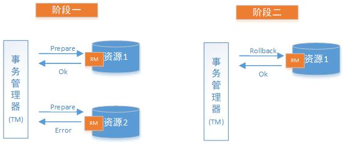
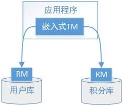
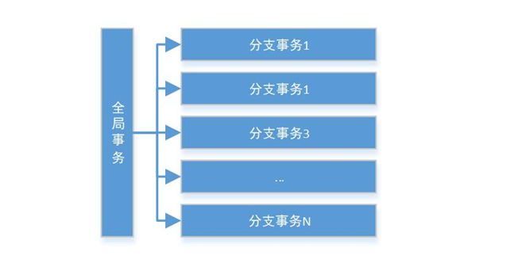
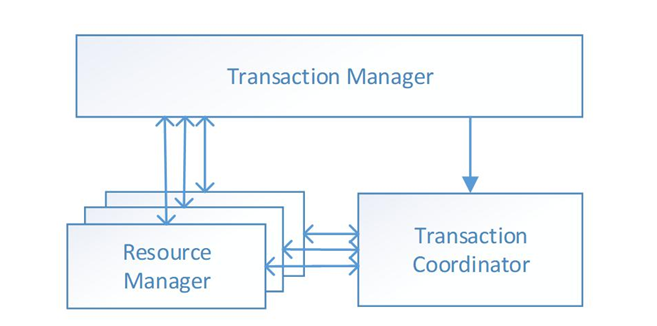
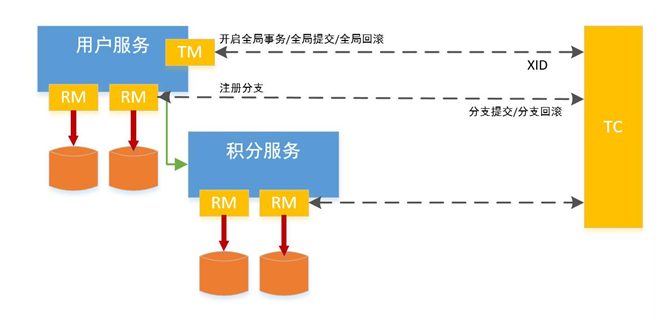

# 分布式事务解决方案之2PC(两阶段提交)

前面已经学习了分布式事务的基础理论，以理论为基础，针对不同的分布式场景业界常见的解决方案有2PC、TCC、可靠消息最终一致性、最大努力通知这几种。

## 什么是2PC

2PC即两阶段提交协议，是将整个事务流程分为两个阶段，准备阶段（Prepare phase）、提交阶段（commit phase），2是指两个阶段，P是指准备阶段，C是指提交阶段。

举例：张三和李四好久不见，老友约起聚餐，饭店老板要求先买单，才能出票。这时张三和李四分别抱怨近况不如意，囊中羞涩，都不愿意请客，这时只能AA。只有张三和李四都付款，老板才能出票安排就餐。但由于张三和李四都是铁公鸡，形成了尴尬的一幕：

- 准备阶段：老板要求张三付款，张三付款。老板要求李四付款，李四付款。

- 提交阶段：老板出票，两人拿票纷纷落座就餐。

例子中形成了一个事务，若张三或李四其中一人拒绝付款，或钱不够，店老板都不会给出票，并且会把已收款退回。

整个事务过程由事务管理器和参与者组成，店老板就是事务管理器，张三、李四就是事务参与者，事务管理器负责决策整个分布式事务的提交和回滚，事务参与者负责自己本地事务的提交和回滚。

在计算机中部分关系数据库如Oracle、MySQL支持两阶段提交协议，如下图：

1. 准备阶段（Prepare phase）：事务管理器给每个参与者发送Prepare消息，每个数据库参与者在本地执行事务，并写本地的Undo/Redo日志，此时事务没有提交。

（Undo日志是记录修改前的数据，用于数据库回滚，Redo日志是记录修改后的数据，用于提交事务后写入数据文件）

2. 提交阶段（commit phase）：如果事务管理器收到了参与者的执行失败或者超时消息时，直接给每个参与者发送回滚(Rollback)消息；否则，发送提交(Commit)消息；参与者根据事务管理器的指令执行提交或者回滚操作，并释放事务处理过程中使用的锁资源。注意:必须在最后阶段释放锁资源。

下图展示了2PC的两个阶段，分成功和失败两个情况说明：

成功情况：

失败情况：

## 解决方案

### XA方案

2PC的传统方案是在数据库层面实现的，如Oracle、MySQL都支持2PC协议，为了统一标准减少行业内不必要的对接成本，需要制定标准化的处理模型及接口标准，国际开放标准组织Open Group定义了分布式事务处理模型DTP（Distributed Transaction Processing Reference Model）。

为了让大家更明确XA方案的内容程，下面新用户注册送积分为例来说明：

执行流程如下：

1、应用程序（AP）持有用户库和积分库两个数据源。

2、应用程序（AP）通过TM通知用户库RM新增用户，同时通知积分库RM为该用户新增积分，RM此时并未提交事务，此时用户和积分资源锁定。

3、TM收到执行回复，只要有一方失败则分别向其他RM发起回滚事务，回滚完毕，资源锁释放。

4、TM收到执行回复，全部成功，此时向所有RM发起提交事务，提交完毕，资源锁释放。

DTP模型定义如下角色：

- AP(Application Program)：即应用程序，可以理解为使用DTP分布式事务的程序。

- RM(Resource Manager)：即资源管理器，可以理解为事务的参与者，一般情况下是指一个数据库实例，通过资源管理器对该数据库进行控制，资源管理器控制着分支事务。

- TM(Transaction Manager)：事务管理器，负责协调和管理事务，事务管理器控制着全局事务，管理事务生命周期，并协调各个RM。全局事务是指分布式事务处理环境中，需要操作多个数据库共同完成一个工作，这个工作即是一个全局事务。

DTP模型定义TM和RM之间通讯的接口规范叫XA，简单理解为数据库提供的2PC接口协议，基于数据库的XA协议来实现2PC又称为XA方案。

以上三个角色之间的交互方式如下：

1）TM向AP提供 应用程序编程接口，AP通过TM提交及回滚事务。

2）TM交易中间件通过XA接口来通知RM数据库事务的开始、结束以及提交、回滚等。

总结：

整个2PC的事务流程涉及到三个角色AP、RM、TM。AP指的是使用2PC分布式事务的应用程序；RM指的是资源管理器，它控制着分支事务；TM指的是事务管理器，它控制着整个全局事务。

1）在准备阶段RM执行实际的业务操作，但不提交事务，资源锁定；

2）在提交阶段TM会接受RM在准备阶段的执行回复，只要有任一个RM执行失败，TM会通知所有RM执行回滚操作，否则，TM将会通知所有RM提交该事务。提交阶段结束资源锁释放。

XA方案的问题： 

1、需要本地数据库支持XA协议。

2、资源锁需要等到两个阶段结束才释放，性能较差。

### Seata方案

Seata是由阿里中间件团队发起的开源项目 Fescar，后更名为Seata，它是一个是开源的分布式事务框架。

传统2PC的问题在Seata中得到了解决，它通过对本地关系数据库的分支事务的协调来驱动完成全局事务，是工作在应用层的中间件。主要优点是性能较好，且不长时间占用连接资源，它以高效并且对业务零侵入的方式解决微服务场景下面临的分布式事务问题，它目前提供AT模式(即2PC)及TCC模式的分布式事务解决方案。

Seata的设计思想如下：

Seata的设计目标其一是对业务无侵入，因此从业务无侵入的2PC方案着手，在传统2PC的基础上演进，并解决2PC方案面临的问题

Seata把一个分布式事务理解成一个包含了若干分支事务的全局事务。全局事务的职责是协调其下管辖的分支事务达成一致，要么一起成功提交，要么一起失败回滚。此外，通常分支事务本身就是一个关系数据库的本地事务，下图是全局事务与分支事务的关系图：

与 传统2PC 的模型类似，Seata定义了3个组件来协议分布式事务的处理过程：

Transaction Coordinator (TC)： 事务协调器，它是独立的中间件，需要独立部署运行，它维护全局事务的运行状态，接收TM指令发起全局事务的提交与回滚，负责与RM通信协调各各分支事务的提交或回滚。

Transaction Manager (TM)： 事务管理器，TM需要嵌入应用程序中工作，它负责开启一个全局事务，并最终向TC发起全局提交或全局回滚的指令。

Resource Manager (RM)： 控制分支事务，负责分支注册、状态汇报，并接收事务协调器TC的指令，驱动分支（本地）事务的提交和回滚

还拿新用户注册送积分举例Seata的分布式事务过程：

具体的执行流程如下：

1. 用户服务的 TM 向 TC 申请开启一个全局事务，全局事务创建成功并生成一个全局唯一的XID。

2. 用户服务的 RM 向 TC 注册 分支事务，该分支事务在用户服务执行新增用户逻辑，并将其纳入 XID 对应全局事务的管辖。

3. 用户服务执行分支事务，向用户表插入一条记录。

4. 逻辑执行到远程调用积分服务时(XID 在微服务调用链路的上下文中传播)。积分服务的RM 向 TC 注册分支事务，该分支事务执行增加积分的逻辑，并将其纳入 XID 对应全局事务的管辖。

5. 积分服务执行分支事务，向积分记录表插入一条记录，执行完毕后，返回用户服务。

6. 用户服务分支事务执行完毕。

7. TM 向 TC 发起针对 XID 的全局提交或回滚决议。

8. TC 调度 XID 下管辖的全部分支事务完成提交或回滚请求。

Seata实现2PC与传统2PC的差别：

- 架构层次方面，传统2PC方案的 RM 实际上是在数据库层，RM 本质上就是数据库自身，通过 XA 协议实现，而Seata的 RM 是以jar包的形式作为中间件层部署在应用程序这一侧的。

- 两阶段提交方面，传统2PC无论第二阶段的决议是commit还是rollback，事务性资源的锁都要保持到Phase2完成才释放。而Seata的做法是在Phase1 就将本地事务提交，这样就可以省去Phase2持锁的时间，整体提高效率。

### 小结

本节讲解了传统2PC（基于数据库XA协议）和Seata实现2PC的两种2PC方案，由于Seata的0侵入性并且解决了传统2PC长期锁资源的问题，所以推荐采用Seata实现2PC。

Seata实现2PC要点：

1、全局事务开始使用 @GlobalTransactional标识 。

2、每个本地事务方案仍然使用@Transactional标识。

3、每个数据都需要创建undo_log表，此表是seata保证本地事务一致性的关键。

