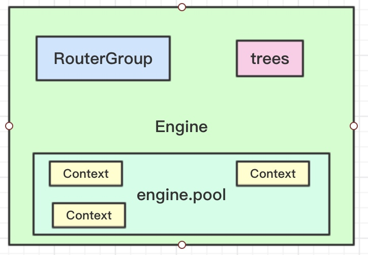

# 整体架构-各组件功能实现

在gin中有几个比较重要的结构体：

- Engine是一个总的引擎，保存了各个组件的信息

- RouterGroup是一个路由组，保存了路由信息

- trees是一棵树，保存了url与handle的映射关系

- Context用于request中传递值

在Engine中利用sync.pool临时对象池来重复利用Context对象，从而减少内存的分配从而减轻GC压力。



## Engine

```go
type Engine struct {
    RouterGroup

    // 如果true，当前路由匹配失败但将路径最后的 / 去掉时匹配成功时自动匹配后者
    // 比如：请求是 /foo/ 但没有命中，而存在 /foo，
    // 对get method请求，客户端会被301重定向到 /foo
    // 对于其他method请求，客户端会被307重定向到 /foo
    RedirectTrailingSlash bool

    // 如果true，在没有处理者被注册来处理当前请求时router将尝试修复当前请求路径
    // 逻辑为：
    // - 移除前面的 ../ 或者 //
    // - 对新的路径进行大小写不敏感的查询
    // 如果找到了处理者，请求会被301或307重定向
    // 比如： /FOO 和 /..//FOO 会被重定向到 /foo
    // RedirectTrailingSlash 参数和这个参数独立
    RedirectFixedPath bool

    // 如果true，当路由没有被命中时，去检查是否有其他method命中
    //  如果命中，响应405 （Method Not Allowed）
    //  如果没有命中，请求将由 NotFound handler 来处理
    HandleMethodNotAllowed bool

    // 如果true， url.RawPath 会被用来查找参数
    UseRawPath bool

    // 如果true， path value 会被保留
    // 如果 UseRawPath是false(默认)，UnescapePathValues为true
    // url.Path会被保留并使用
    UnescapePathValues bool

    allNoRoute       HandlersChain
    allNoMethod      HandlersChain
    noRoute          HandlersChain
    noMethod         HandlersChain

    //每个http method对应一棵树
    trees            methodTrees
}
```
## RouterGroup结构体

```go
// RouterGroup在gin的内部配置路由，RouterGroup将请求路径和一组处理器(包括中间件和请求处理器)关联.
type RouterGroup struct {
	Handlers HandlersChain
	basePath string
	engine   *Engine
	root     bool
}
```

## Context结构体

```go
// Context作为一个数据结构在中间件中传递本次请求的各种数据、管理流程，进行响应
// context.go:40
type Context struct {
    // ServeHTTP的第二个参数: request
    Request   *http.Request

    // 用来响应 
    Writer    ResponseWriter
    writermem responseWriter

    // URL里面的参数，比如：/xx/:id  
    Params   Params
    // 参与的处理者（中间件 + 请求处理者列表）
    handlers HandlersChain
    // 当前处理到的handler的下标
    index    int8

    // Engine单例
    engine *Engine

    // 在context可以设置的值
    Keys map[string]interface{}

    // 一系列的错误
    Errors errorMsgs

    // Accepted defines a list of manually accepted formats for content negotiation.
    Accepted []string
}
```
