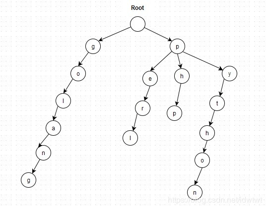
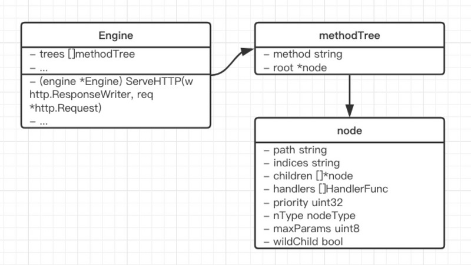
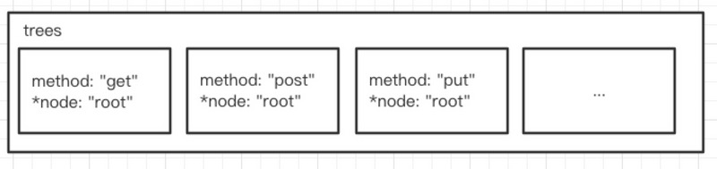
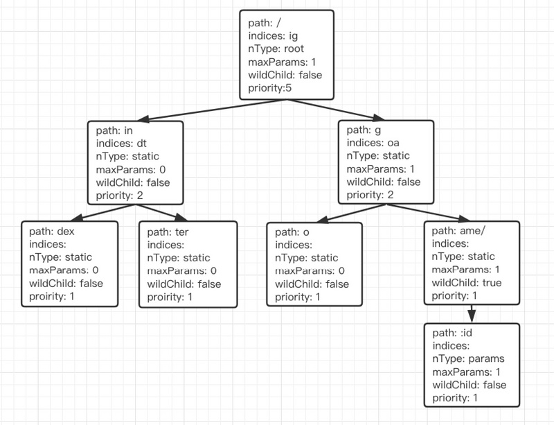

# 路由-Trie前缀树

## 什么是Trie树

Trie树，又称前缀树，基数树或字典树，是一种树形结构。典型应用是用于统计和排序大量字符串（但不限于字符串），所以经常被搜索引擎系统用于文本词频统计。它的优点是最大限度地减少无谓的字符串比较，查询效率比较高。

Trie的核心思想是空间换时间，利用字符串的公共前缀来降低查询时间的开销以达到提高效率的目的。

### 基本性质

1. 根节点不包含字符，除根节点外每一个节点都只包含一个字符。

2. 从根节点到某一节点，路径上经过的字符连接起来，为该节点对应的字符串。

3. 每个节点的所有子节点的字符都不相同。

举个简单的例子，现有字符串go，golang，php，python，perl，我们可以构造一棵如下图所示的Trie树



### 搜索方法

1. 从根节点开始一次搜索

2. 取得要查找的关键词的第一个字母，并根据该字母选择对应的子树转到该子树继续进行检索

3. 在相应的子树上，取得要查找关键词的第二个字母，并进一步选择对应的子树进行检索

4. 重复上述步骤

5. 所有字母都被取出，则读取附加在该节点上的信息，完成查找

### 代码实现

```go
package main

import (
    "fmt"
)

const MAXCAP = 26        // a-z
 
type Trie struct {
    next    map[byte]*Trie
    value   int
}
 
/** Initialize your data structure here. */
func Constructor() Trie {
    root := new(Trie)
    root.next = make(map[byte]*Trie, MAXCAP)
    root.value = 0
    return *root
}
 
/** Inserts a word into the trie. */
func (this *Trie) Insert(word string, value int) {
    for _, v := range word {
        if this.next[v] == nil {
            node := new(Trie)
            //子节点数量为26
            node.next = make(map[byte]*Trie, MAXCAP)
            //初始化节点单词标志为假
            node.value = 0
            this.next[v] = node
        }
        this = this.next[v]
    }
    this.value = value
}
 
/** Returns if the word is in the trie. */
func (this *Trie) Search(word string) int {
    for _, v := range word {
        if this.next[v] == nil {
            return false
        }
        this = this.next[v]
    }
    return this.value
}
 
/** Returns if there is any word in the trie that starts with the given prefix. */
func (this *Trie) StartsWith(prefix string) bool {
    for _, v := range prefix {
        if this.next[v] == nil {
            return false
        }
        this = this.next[v]
    }
    return true
}
 
func main(){
    t := Constructor()
    t.Insert("Hello")
    fmt.Print(t.Search("Hello"),"\n")
    fmt.Print(t.Search("Hallo"),"\n") 
}

//输出
true
false
```

## 压缩前缀树

以上是一种标准的前缀树的做法。当字符串公用的节点比较少的时候，对于每个字符都要创建单独的节点，有点浪费空间。有一种压缩前缀树的算法，在处理前缀树问题的时候能够使用更少的节点。

压缩前缀树的结构如下：

```go
type Trie struct {
    key         string
    children    map[byte]*Trie
    value       int
}
```


压缩前缀树与前缀树的实现不同点在于节点的分裂，比如，当树中已经存在"inner"，"inter"的情况时，再加入"iframe"时，原来的"in"节点需要分裂成"i" -> "n"两个节点

在Insert时，需要判断当前插入字符串key与节点字符串this.key的最长公共前缀长度n:

```go
minLen := min(len(key), len(this.key))
// 找出最长公共前缀
n := 0
for n < minLen && key[n] == this.key[n] {
    n++
}
```
然后拿n与len(this.key)比较，如果比this.key长度短，则this.key需要分裂，否则不需要分裂。

this 节点分裂逻辑：

```go
// 最前公共前缀 n < len(this.key)
// 则该节点需要分裂
child := &Trie{
    key:        this.key[n:],
    value:      this.value,
    children:   this.children,
}

// 更新当前节点
this.key                    = this.key[:n]
this.value                  = 0
this.children               = make(map[byte]*Trie)
this.children[child.key[0]] = child
```
然后再判断n与len(key)，如果n == len(key)，则说明key对应该节点，直接更新value

```go
if n == len(key) {
    this.value = value
    return
}
```
n < len(key)时， 如果有符合条件子树，则继续迭代，否则直接插入孩子节点：

```go
key = key[n:]
c := key[0]

// 如果剩余 子key 的第一个字符存在与 children
// 则继续向下遍历树
if a, ok := this.children[c]; ok {
   this = a
   continue walk
} else{
   // 否则，新建节点
   this.children[c] = &Trie{
      key: key,
      value: value,
      children: make(map[byte]*Trie),
   }
   return
}
```
## 进一步优化

上述 Trie的children使用的是map，但是map一般占用内存较大，可以使用节点数组children + 节点前缀数组 indices的方式维护子节点，其中indices与children一一对应。

此时的结构应该是这样的：

```go
type Trie struct {
   key          string
   indices      []byte
   children     []*Trie
   value        int
}
```
查找子树时，需要拿key[:n][0]与indices中的字符比较，找到下标后继续迭代子树，未找到时插入子树即可。

## gin框架中的实现

### methodTree

Gin的Engine结构体内嵌了RouterGroup结构体，定义了GET，POST等路由注册方法。

Engine中的trees字段定义了路由逻辑。trees是methodTree类型的数组，不同请求方法路由到不同的methodTree中。

methodTree结构中的root字段(\*node类型)是路由树的根节点，树的构造与寻址都是在\*node的方法中完成的



trees 是个数组，数组里会有不同请求方法的路由树。



### node

node结构体定义如下

```go
type node struct {
    path      string           // 当前节点相对路径（与祖先节点的 path 拼接可得到完整路径）
    indices   string           // 所以孩子节点的path[0]组成的字符串
    children  []*node          // 孩子节点
    handlers  HandlersChain    // 当前节点的处理函数（包括中间件）
    priority  uint32           // 当前节点及子孙节点的实际路由数量
    nType     nodeType         // 节点类型
    maxParams uint8            // 子孙节点的最大参数数量
    wildChild bool             // 孩子节点是否有通配符（wildcard）
}
```
### handlers

handlers里存储了该节点对应路由下的所有处理函数，处理业务逻辑时是这样的

```go
func (c *Context) Next() {
    c.index++
    for s := int8(len(c.handlers)); c.index < s; c.index++ {
        c.handlers[c.index](c)
    }
}
```
一般来说，除了最后一个函数，前面的函数被称为中间件。

如果某个节点的 handlers为空，则说明该节点对应的路由不存在。比如上面定义的根节点对应的路由 /in 是不存在的，它的 handlers就是[]。

### nType

Gin中定义了四种节点类型：

```go
const (
    static nodeType = iota  // 普通节点，默认
    root                    // 根节点
    param                   // 参数路由，比如 /user/:id
    catchAll                // 匹配所有内容的路由，比如 /article/*key
)
```
param 与 catchAll 使用的区别就是 : 与 * 的区别。* 会把路由后面的所有内容赋值给参数 key；但 : 可以多次使用。
比如：/user/:id/:no 是合法的，但 /user/*id/:no 是非法的，因为 * 后面所有内容会赋值给参数 id。

### wildChild

如果孩子节点时通配符（*或者:），则该字段为true。

### 一个路由树的例子

定义如下：

```go
r.GET("/", func(context *gin.Context) {})
r.GET("/index", func(context *gin.Context) {})
r.GET("/inter", func(context *gin.Context) {})
r.GET("/go", func(context *gin.Context) {})
r.GET("/game/:id/:k", func(context *gin.Context) {})
```
得到的路由树结构图如下：



进一步追踪添加路由的方法：

```go
//RouterGroup实现的GET方法调用了handler
func (group *RouterGroup) GET(relativePath string, handlers ...HandlerFunc) IRoutes {
	return group.handle("GET", relativePath, handlers)
}

func (group *RouterGroup) handle(httpMethod, relativePath string, handlers HandlersChain) IRoutes {
	//方法计算出路径，把group中的basepath和relativepath 合并在一起
	absolutePath := group.calculateAbsolutePath(relativePath)
	//合并handler 把group中添加的中间件和传入的handlers合并起来
	handlers = group.combineHandlers(handlers)
	//调用addRoute 添加router
	group.engine.addRoute(httpMethod, absolutePath, handlers)
	return group.returnObj()
}
```

接下来我们需要看的是addRoute这个方法了，方法体比较长。其实大多的逻辑都在处理带参数的节点，真正核心的逻辑其实并不多。我把主要的逻辑都写上了注释应该还是比较容易理解的。如果看不懂其实一步步debug几次也能帮助理解。

```go
func (engine *Engine) addRoute(method, path string, handlers HandlersChain) {
	assert1(path[0] == '/', "path must begin with '/'")
	assert1(method != "", "HTTP method can not be empty")
	assert1(len(handlers) > 0, "there must be at least one handler")

	debugPrintRoute(method, path, handlers)
	//获取method的树的根节点，每个method都有一个根节点，比如GET，POST 都会维护一个根节点
	root := engine.trees.get(method)
	//如果没有则创建一个节点
	if root == nil {
		root = new(node)
		engine.trees = append(engine.trees, methodTree{method: method, root: root})
	}
	//正式添加路由
	root.addRoute(path, handlers)
}
```

```go
func (n *node) addRoute(path string, handlers HandlersChain) {
	//记录原始path
	fullPath := path
	n.priority++
	//统计path中包含多少参数 就是判断`：`，`*`的数量 最多255个
	numParams := countParams(path)

	//判断节点是否为空
	if len(n.path) > 0 || len(n.children) > 0 {
	walk:
		for {
			// 更新最大参数数量
			if numParams > n.maxParams {
				n.maxParams = numParams
			}

			// 找到相同前缀 循环次数 是取 path 和 n.path 长度的小那个长度
			i := 0
			max := min(len(path), len(n.path))
			//循环判断是否字符相同，相同则i++ 直到最后
			for i < max && path[i] == n.path[i] {
				i++
			}

			//判断是否有前缀相同，如果有相同的则把目前这个节点提取出来作为子节点
			//再把相同前缀的path部分作为 父节点
			//比如n的path = romaned 现在新增路由的path = romanus 相同前缀为 roman
			//步骤为：
			//1. 提取ed 新建一个child节点 把原来n的属性都复制过去
			//2. 把原来的n的path改为相同前缀：roman 为indices添加 子节点的第一个字符:e
			if i < len(n.path) {
				child := node{
					path:      n.path[i:],
					wildChild: n.wildChild,
					indices:   n.indices,
					children:  n.children,
					handlers:  n.handlers,
					priority:  n.priority - 1,
				}

				// Update maxParams (max of all children)
				for i := range child.children {
					if child.children[i].maxParams > child.maxParams {
						child.maxParams = child.children[i].maxParams
					}
				}

				n.children = []*node{&child}
				// []byte for proper unicode char conversion, see #65
				n.indices = string([]byte{n.path[i]})
				n.path = path[:i]
				n.handlers = nil
				n.wildChild = false
			}

			//原先的节点n现在已经分成2个节点了 结构为：
			//roman 父节点
			//	ed	子节点[0]
			//那么现在需要把传入的路由添加到这个父节点中
			//最终结构为
			//roman 父节点
			//	ed 子节点[0]
			//	us 子节点[1]
			// 其中还有一些情况需要自调用 相当于递归 举例说明：
			//roman
			//	ed
			//	uie
			//当判断父节点n 本来就有一个uie子节点 这时候uie和us 又有相同前缀u 这个时候需要把这个u再次提取出来作为父节点 所以需要递归调用walk
			//最终结果为 三层结构
			//roman
			//	ed
			//	u
			//	    ie
			//	    s
			//还有一种情况是如果是带有参数的路由 则也会再次调用walk
			if i < len(path) {
				path = path[i:]

				if n.wildChild {
					n = n.children[0]
					n.priority++

					// Update maxParams of the child node
					if numParams > n.maxParams {
						n.maxParams = numParams
					}
					numParams--

					// Check if the wildcard matches
					if len(path) >= len(n.path) && n.path == path[:len(n.path)] {
						// check for longer wildcard, e.g. :name and :names
						if len(n.path) >= len(path) || path[len(n.path)] == '/' {
							continue walk
						}
					}

					panic("path segment '" + path +
						"' conflicts with existing wildcard '" + n.path +
						"' in path '" + fullPath + "'")
				}

				c := path[0]

				// slash after param
				if n.nType == param && c == '/' && len(n.children) == 1 {
					n = n.children[0]
					n.priority++
					continue walk
				}

				// Check if a child with the next path byte exists
				for i := 0; i < len(n.indices); i++ {
					if c == n.indices[i] {
						i = n.incrementChildPrio(i)
						n = n.children[i]
						continue walk
					}
				}

				// Otherwise insert it
				if c != ':' && c != '*' {
					// []byte for proper unicode char conversion, see #65
					n.indices += string([]byte{c})
					child := &node{
						maxParams: numParams,
					}
					n.children = append(n.children, child)
					n.incrementChildPrio(len(n.indices) - 1)
					n = child
				}
				n.insertChild(numParams, path, fullPath, handlers)
				return

			} else if i == len(path) {
				if n.handlers != nil {
					panic("handlers are already registered for path '" + fullPath + "'")
				}
				n.handlers = handlers
			}
			return
		}
	} else { // 节点为空，直接添加直接添加路由
		n.insertChild(numParams, path, fullPath, handlers)
		n.nType = root
	}
}

//添加节点函数 主要处理包含参数节点
func (n *node) insertChild(numParams uint8, path string, fullPath string, handlers HandlersChain) {
	var offset int // already handled bytes of the path

	// 循环查找前缀为'：' 或者 '*'
	for i, max := 0, len(path); numParams > 0; i++ {
		c := path[i]
		if c != ':' && c != '*' {
			continue
		}

		// 判断在*参数之后不能再有*或者: 否则则报错 除非到了下一个/
		end := i + 1
		for end < max && path[end] != '/' {
			switch path[end] {
			// the wildcard name must not contain ':' and '*'
			case ':', '*':
				panic("only one wildcard per path segment is allowed, has: '" +
					path[i:] + "' in path '" + fullPath + "'")
			default:
				end++
			}
		}

		//检查这个节点是否存在子节点，如果我们在这里插入通配符，子节点将是不可访问的
		if len(n.children) > 0 {
			panic("wildcard route '" + path[i:end] +
				"' conflicts with existing children in path '" + fullPath + "'")
		}

		// check if the wildcard has a name
		if end-i < 2 {
			panic("wildcards must be named with a non-empty name in path '" + fullPath + "'")
		}

		// 参数类型 相当于注册路由时候带有:
		if c == ':' {
			// split path at the beginning of the wildcard
			if i > 0 {
				n.path = path[offset:i]
				offset = i
			}

			child := &node{
				nType:     param,
				maxParams: numParams,
			}
			n.children = []*node{child}
			n.wildChild = true
			n = child
			n.priority++
			numParams--

			if end < max {
				n.path = path[offset:end]
				offset = end

				child := &node{
					maxParams: numParams,
					priority:  1,
				}
				n.children = []*node{child}
				n = child
			}

		} else {
			//如果是通配符*
			if end != max || numParams > 1 {
				panic("catch-all routes are only allowed at the end of the path in path '" + fullPath + "'")
			}

			if len(n.path) > 0 && n.path[len(n.path)-1] == '/' {
				panic("catch-all conflicts with existing handle for the path segment root in path '" + fullPath + "'")
			}

			// currently fixed width 1 for '/'
			i--
			if path[i] != '/' {
				panic("no / before catch-all in path '" + fullPath + "'")
			}

			n.path = path[offset:i]

			// first node: catchAll node with empty path
			child := &node{
				wildChild: true,
				nType:     catchAll,
				maxParams: 1,
			}
			n.children = []*node{child}
			n.indices = string(path[i])
			n = child
			n.priority++

			// second node: node holding the variable
			child = &node{
				path:      path[i:],
				nType:     catchAll,
				maxParams: 1,
				handlers:  handlers,
				priority:  1,
			}
			n.children = []*node{child}

			return
		}
	}

	// 插入路由 如果不包含参数节点 offset为0
	n.path = path[offset:]
	n.handlers = handlers
}
```
最后看下根据path获取router的方法getRouter。这个方法还是比较简单的，注释基本也能明白。

```go
//根据path查找路由的方法
func (n *node) getValue(path string, po Params, unescape bool) (handlers HandlersChain, p Params, tsr bool) {
	p = po
walk:
	for {
		if len(path) > len(n.path) {
			if path[:len(n.path)] == n.path {
				path = path[len(n.path):]
				// 判断如果不是参数节点
				// 那path的第一个字符 循环对比indices中的每个字符查找到子节点
				if !n.wildChild {
					c := path[0]
					for i := 0; i < len(n.indices); i++ {
						if c == n.indices[i] {
							n = n.children[i]
							continue walk
						}
					}

					tsr = path == "/" && n.handlers != nil
					return
				}

				// handle wildcard child
				n = n.children[0]
				switch n.nType {
				case param:
					// 如果是普通':'节点, 那么找到/或者path end, 获得参数
					end := 0
					for end < len(path) && path[end] != '/' {
						end++
					}

					// save param value
					if cap(p) < int(n.maxParams) {
						p = make(Params, 0, n.maxParams)
					}
					i := len(p)
					p = p[:i+1] // expand slice within preallocated capacity
					p[i].Key = n.path[1:]
					val := path[:end]
					if unescape {
						var err error
						if p[i].Value, err = url.QueryUnescape(val); err != nil {
							p[i].Value = val // fallback, in case of error
						}
					} else {
						p[i].Value = val
					}

					// 如果参数还没处理完, 继续walk
					if end < len(path) {
						if len(n.children) > 0 {
							path = path[end:]
							n = n.children[0]
							continue walk
						}

						// ... but we can't
						tsr = len(path) == end+1
						return
					}
					// 否则获得handle返回就OK
					if handlers = n.handlers; handlers != nil {
						return
					}
					if len(n.children) == 1 {
						// No handle found. Check if a handle for this path + a
						// trailing slash exists for TSR recommendation
						n = n.children[0]
						tsr = n.path == "/" && n.handlers != nil
					}

					return

				case catchAll:
					// *匹配所有参数
					if cap(p) < int(n.maxParams) {
						p = make(Params, 0, n.maxParams)
					}
					i := len(p)
					p = p[:i+1] // expand slice within preallocated capacity
					p[i].Key = n.path[2:]
					if unescape {
						var err error
						if p[i].Value, err = url.QueryUnescape(path); err != nil {
							p[i].Value = path // fallback, in case of error
						}
					} else {
						p[i].Value = path
					}

					handlers = n.handlers
					return

				default:
					panic("invalid node type")
				}
			}
		} else if path == n.path {
			// We should have reached the node containing the handle.
			// Check if this node has a handle registered.
			if handlers = n.handlers; handlers != nil {
				return
			}

			if path == "/" && n.wildChild && n.nType != root {
				tsr = true
				return
			}

			// No handle found. Check if a handle for this path + a
			// trailing slash exists for trailing slash recommendation
			for i := 0; i < len(n.indices); i++ {
				if n.indices[i] == '/' {
					n = n.children[i]
					tsr = (len(n.path) == 1 && n.handlers != nil) ||
						(n.nType == catchAll && n.children[0].handlers != nil)
					return
				}
			}

			return
		}

		// Nothing found. We can recommend to redirect to the same URL with an
		// extra trailing slash if a leaf exists for that path
		tsr = (path == "/") ||
			(len(n.path) == len(path)+1 && n.path[len(path)] == '/' &&
				path == n.path[:len(n.path)-1] && n.handlers != nil)
		return
	}
}
```