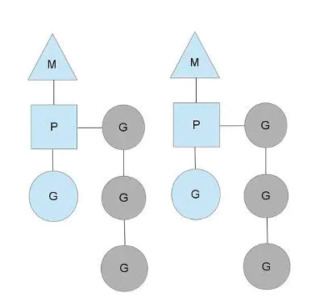
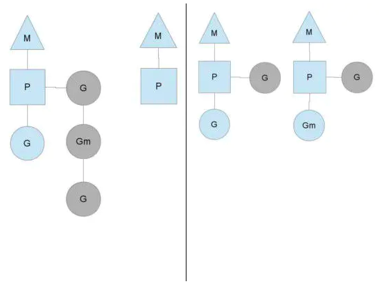
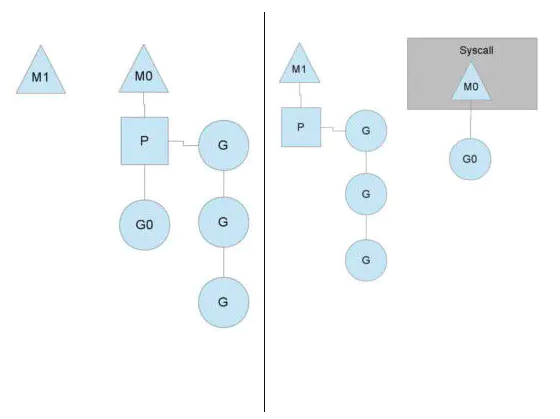

# G-P-M调度模型

## 基本概念

1.进程：进程是具有一定独立功能的程序关于某个数据集合上的一次运行活动,进程是系统进行资源分配和调度的一个独立单位。每个进程都有自己的独立内存空间，不同进程通过进程间通信来通信。由于进程比较重量，占据独立的内存，所以上下文进程间的切换开销（栈、寄存器、虚拟内存、文件句柄等）比较大，但相对比较稳定安全。

2.线程：线程是进程的一个实体,是CPU调度和分派的基本单位,它是比进程更小的能独立运行的基本单位.线程自己基本上不拥有系统资源,只拥有一点在运行中必不可少的资源(如程序计数器,一组寄存器和栈),但是它可与同属一个进程的其他的线程共享进程所拥有的全部资源。线程间通信主要通过共享内存，上下文切换很快，资源开销较少，但相比进程不够稳定容易丢失数据。

3.协程：协程是一种用户态的轻量级线程，协程的调度完全由用户控制。协程拥有自己的寄存器上下文和栈。协程调度切换时，将寄存器上下文和栈保存到其他地方，在切回来的时候，恢复先前保存的寄存器上下文和栈，直接操作栈则基本没有内核切换的开销，可以不加锁的访问全局变量，所以上下文的切换非常快。

## 并发模型

互联网时代以降，由于在线用户数量的爆炸，单台服务器处理的连接也水涨船高，迫使编程模式由从前的串行模式升级到并发模型，而几十年来，并发模型也是一代代地升级，有IO多路复用、多进程以及多线程。

这几种模型都各有长短，现代复杂的高并发架构大多是几种模型协同使用，不同场景应用不同模型，扬长避短，发挥服务器的最大性能，而多线程，因为其轻量和易用，成为并发编程中使用频率最高的并发模型，而后衍生的协程等其他子产品，也都基于它，而我们今天要分析的 goroutine 也是基于线程，因此，我们先来聊聊线程的三大模型：

## 线程模型

现在主流的线程模型分三种：内核级线程模型、用户级线程模型和两级线程模型（也称混合型线程模型），它们之间最大的差异就在于用户线程与内核调度实体（KSE，Kernel Scheduling Entity）之间的对应关系上。

所谓的内核调度实体 KSE 就是指可以被操作系统内核调度器调度的对象实体。简单来说 KSE 就是内核级线程，是操作系统内核的最小调度单元，也就是我们写代码的时候通俗理解上的线程了。

传统的协程库属于用户级线程模型，而goroutine和它的Go Scheduler在底层实现上其实是属于两级线程模型。

## 用户线程模型

用户线程与内核线程KSE是多对一（N : 1）的映射模型，多个用户线程的一般从属于单个进程并且多线程的调度是由用户自己的线程库来完成，线程的创建、销毁以及多线程之间的协调等操作都是由用户自己的线程库来负责而无须借助系统调用来实现。一个进程中所有创建的线程都只和同一个KSE在运行时动态绑定，也就是说，操作系统只知道用户进程而对其中的线程是无感知的，内核的所有调度都是基于用户进程。

许多语言实现的 协程库 基本上都属于这种方式（比如python的gevent）。由于线程调度是在用户层面完成的，也就是相较于内核调度不需要让CPU在用户态和内核态之间切换。

这种实现方式相比内核级线程可以做的很轻量级，对系统资源的消耗会小很多，因此可以创建的线程数量与上下文切换所花费的代价也会小得多。

但该模型有个原罪：并不能做到真正意义上的并发，假设在某个用户进程上的某个用户线程因为一个阻塞调用（比如I/O阻塞）而被CPU给中断（抢占式调度）了，那么该进程内的所有线程都被阻塞（因为单个用户进程内的线程自调度是没有CPU时钟中断的，从而没有轮转调度），整个进程被挂起。即便是多CPU的机器，也无济于事，因为在用户级线程模型下，一个CPU关联运行的是整个用户进程，进程内的子线程绑定到CPU执行是由用户进程调度的，内部线程对CPU是不可见的，此时可以理解为CPU的调度单位是用户进程。

所以很多的协程库会把自己一些阻塞的操作重新封装为完全的非阻塞形式，然后在以前要阻塞的点上，主动让出自己，并通过某种方式通知或唤醒其他待执行的用户线程在该KSE上运行，从而避免了内核调度器由于KSE阻塞而做上下文切换，这样整个进程也不会被阻塞了

## 内核线程模型

用户线程与内核线程KSE是一对一（1 : 1）的映射模型，也就是每一个用户线程绑定一个实际的内核线程，而线程的调度则完全交付给操作系统内核去做，应用程序对线程的创建、终止以及同步都基于内核提供的系统调用来完成。

大部分编程语言的线程库(比如Java的java.lang.Thread、C++11的std::thread等等)都是对操作系统的线程（内核级线程）的一层封装，创建出来的每个线程与一个独立的KSE静态绑定，因此其调度完全由操作系统内核调度器去做，也就是说，一个进程里创建出来的多个线程每一个都绑定一个KSE。

这种模型的优势和劣势同样明显：优势是实现简单，直接借助操作系统内核的线程以及调度器，所以CPU可以快速切换调度线程，于是多个线程可以同时运行，因此相较于用户级线程模型它真正做到了并行处理。

但它的劣势是，由于直接借助了操作系统内核来创建、销毁和以及多个线程之间的上下文切换和调度，因此资源成本大幅上涨，且对性能影响很大。

## 两级线程模型

两级线程模型是博采众长之后的产物，充分吸收前两种线程模型的优点且尽量规避它们的缺点。在此模型下，用户线程与内核KSE是多对多（N : M）的映射模型：首先，区别于用户级线程模型，两级线程模型中的一个进程可以与多个内核线程KSE关联，也就是说一个进程内的多个线程可以分别绑定一个自己的KSE，这点和内核级线程模型相似；其次，又区别于内核级线程模型，它的进程里的线程并不与KSE唯一绑定，而是可以多个用户线程映射到同一个KSE，当某个KSE因为其绑定的线程的阻塞操作被内核调度出CPU时，其关联的进程中其余用户线程可以重新与其他KSE绑定运行。

所以，两级线程模型既不是用户级线程模型那种完全靠自己调度的也不是内核级线程模型完全靠操作系统调度的，而是中间态（自身调度与系统调度协同工作）

因为这种模型的高度复杂性，操作系统内核开发者一般不会使用，所以更多时候是作为第三方库的形式出现，而Go语言中的runtime调度器就是采用的这种实现方案，实现了Goroutine与KSE之间的动态关联，不过Go语言的实现更加高级和优雅；该模型为何被称为两级？即用户调度器实现用户线程到KSE的『调度』，内核调度器实现KSE到CPU上的『调度』。

## G-P-M 模型概述

任何用户线程最终肯定都是要交由OS线程来执行的，goroutine（称为G）也不例外，但是G并不直接绑定OS线程运行，而是由Goroutine Scheduler中的 P - Logical Processor （逻辑处理器）来作为两者的『中介』。

P可以看作是一个抽象的资源或者一个上下文，一个P绑定一个OS线程，在golang的实现里把OS线程抽象成一个数据结构：M。

G实际上是由M通过P来进行调度运行的，但是在G的层面来看，P提供了G运行所需的一切资源和环境，因此在G看来P就是运行它的 “CPU”。

由 G、P、M 这三种由Go抽象出来的实现，最终形成了Go调度器的基本结构：

- G: 表示Goroutine，每个Goroutine对应一个G结构体，G存储Goroutine的运行堆栈、状态以及任务函数，可重用。G并非执行体，每个G需要绑定到P才能被调度执行。

- P: 表示Processor，表示逻辑处理器， 对G来说，P相当于CPU核，G只有绑定到P(在P的local runq中)才能被调度。对M来说，P提供了相关的执行环境(Context)，如内存分配状态(mcache)，任务队列(G)等，P的数量决定了系统内最大可并行的G的数量（前提：物理CPU核数 >= P的数量），P的数量由用户设置的GOMAXPROCS决定，但是不论GOMAXPROCS设置为多大，P的数量最大为256。

- M: 表示Machine，OS线程抽象，代表着真正执行计算的资源，在绑定有效的P后，进入schedule循环；而schedule循环的机制大致是从Global队列、P的Local队列以及wait队列中获取G，切换到G的执行栈上并执行G的函数，调用goexit做清理工作并回到M，如此反复。M并不保留G状态，这是G可以跨M调度的基础，M的数量是不定的，由Go Runtime调整，为了防止创建过多OS线程导致系统调度不过来，目前默认最大限制为10000个。

## work-stealing 调度算法：

Go调度器工作时会维护两种用来保存G的任务队列：一种是一个Global任务队列，一种是每个P维护的Local任务队列。

当通过go关键字创建一个新的goroutine的时候，它会优先被放入P的本地队列。

为了运行goroutine，M需要持有（绑定）一个P，接着M会启动一个OS线程，循环从P的本地队列里取出一个goroutine并执行。

当M执行完了当前P的Local队列里的所有G后，会先尝试从Global队列寻找G来执行，如果Global队列为空，它会随机挑选另外一个P，从它的队列里中拿走一半的G到自己的队列中执行。

## 阻塞
Go runtime会在下面的goroutine被阻塞的情况下运行另外一个goroutine：

- blocking syscall (for example opening a file)
- network input
- channel operations
- primitives in the sync package

这四种场景又可归类为两种类型：

### 用户态阻塞/唤醒
当goroutine因为channel操作或者network I/O而阻塞时（实际上golang已经用netpoller实现了goroutine网络I/O阻塞不会导致M被阻塞，仅阻塞G，这里仅仅是举个栗子），对应的G会被放置到某个wait队列(如channel的waitq)，该G的状态由_Gruning变为_Gwaitting，而M会跳过该G尝试获取并执行下一个G，如果此时没有runnable的G供M运行，那么M将解绑P，并进入sleep状态；当阻塞的G被另一端的G2唤醒时（比如channel的可读/写通知），G被标记为runnable，尝试加入G2所在P的runnext，然后再是P的Local队列和Global队列。

### 系统调用阻塞
当G被阻塞在某个系统调用上时，此时G会阻塞在_Gsyscall状态，M也处于 block on syscall 状态，此时的M可被抢占调度：执行该G的M会与P解绑，而P则尝试与其它idle的M绑定，继续执行其它G。如果没有其它idle的M，但P的Local队列中仍然有G需要执行，则创建一个新的M；当系统调用完成后，G会重新尝试获取一个idle的P进入它的Local队列恢复执行，如果没有idle的P，G会被标记为runnable加入到Global队列。

