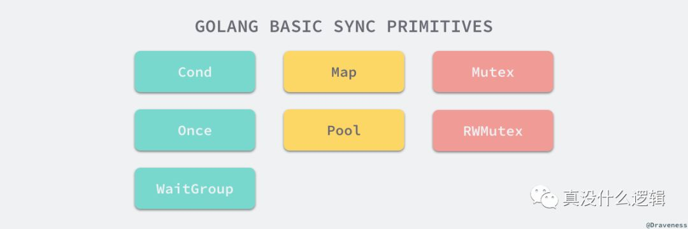

# sync包中的同步原语

在并发编程中，锁的主要作用就是保证多个线程或者 Goroutine 在访问同一片内存时不会出现混乱的问题，锁其实是一种并发编程中的同步原语（Synchronization Primitives）。

这里介绍 Go 语言中常见的同步原语 Mutex、RWMutex、WaitGroup、Once 和 Cond 的实现原理，同时也会涉及互斥锁、信号量等并发编程中的常见概念。

## 基本原语

Go 语言在 sync 包中提供了用于同步的一些基本原语，包括常见的互斥锁 Mutex 与读写互斥锁 RWMutex 以及 Once、WaitGroup、Cond。

这些基本原语的主要作用是提供较为基础的同步功能，我们应该使用 Channel 和通信来实现更加高级的同步机制。



### Mutex

#### 结构

Go 语言中的互斥锁在 sync 包中，它由两个字段 state 和 sema 组成，state 表示当前互斥锁的状态，而 sema 真正用于控制锁状态的信号量，这两个加起来只占 8 个字节空间的结构体就表示了 Go 语言中的互斥锁。

```go
type Mutex struct {
    state   int32
    sema    uint32
}
```

#### 状态

互斥锁的状态是用 int32 来表示的，但是锁的状态并不是互斥的，它的最低三位分别表示 mutexLocked、mutexWoken 和 mutexStarving，剩下的位置都用来表示当前有多少个 Goroutine 等待互斥锁被释放：


互斥锁在被创建出来时，所有的状态位的默认值都是 0，当互斥锁被锁定时 mutexLocked 就会被置成 1、当互斥锁被在正常模式下被唤醒时 mutexWoken 就会被被置成 1、mutexStarving 用于表示当前的互斥锁进入了状态，最后的几位是在当前互斥锁上等待的 Goroutine 个数。

#### 饥饿模式

饥饿模式是在 Go 语言 1.9 版本引入的特性，它的主要功能就是保证互斥锁的获取的『公平性』（Fairness）。

互斥锁可以同时处于两种不同的模式，也就是正常模式和饥饿模式，在正常模式下，所有锁的等待者都会按照先进先出的顺序获取锁，但是如果一个刚刚被唤起的 Goroutine 遇到了新的 Goroutine 进程也调用了 Lock 方法时，大概率会获取不到锁，为了减少这种情况的出现，防止 Goroutine 被『饿死』，一旦 Goroutine 超过 1ms 没有获取到锁，它就会将当前互斥锁切换饥饿模式。


在饥饿模式中，互斥锁会被直接交给等待队列最前面的 Goroutine，新的 Goroutine 在这时不能获取锁、也不会进入自旋的状态，它们只会在队列的末尾等待，如果一个 Goroutine 获得了互斥锁并且它是队列中最末尾的协程或者它等待的时间少于 1ms，那么当前的互斥锁就会被切换回正常模式。

相比于饥饿模式，正常模式下的互斥锁能够提供更好地性能，饥饿模式的主要作用就是避免一些 Goroutine 由于陷入等待无法获取锁而造成较高的尾延时，这也是对 Mutex 的一个优化。

#### 加锁过程

互斥锁 Mutex 的加锁是靠 Lock 方法完成的，最新的 Go 语言源代码中已经将 Lock 方法进行了简化，方法的主干只保留了最常见、简单并且快速的情况；当锁的状态是 0 时直接将 mutexLocked 位置成 1：

```go
func (m *Mutex) Lock() {
    if atomic.CompareAndSwapInt32(&m.state, 0, mutexLocked) {
        return
    }
    m.lockSlow()
}
```
但是当 Lock 方法被调用时 Mutex 的状态不是 0 时就会进入 lockSlow 方法尝试通过自旋或者其他的方法等待锁的释放并获取互斥锁，该方法的主体是一个非常大 for 循环，我们会将该方法分成几个部分介绍获取锁的过程：

```go
func (m *Mutex) lockSlow() {
    var waitStartTime int64
    starving := false
    awoke := false
    iter := 0
    old := m.state
    for {
        if old&(mutexLocked|mutexStarving) == mutexLocked && runtime_canSpin(iter) {
            if !awoke && old&mutexWoken == 0 && old>>mutexWaiterShift != 0 &&
                atomic.CompareAndSwapInt32(&m.state, old, old|mutexWoken) {
                awoke = true
            }
            runtime_doSpin()
            iter++
            old = m.state
            continue
        }
```
在这段方法的第一部分会判断当前方法能否进入自旋来等待锁的释放，自旋（Spinnig）其实是在多线程同步的过程中使用的一种机制，当前的进程在进入自旋的过程中会一直保持 CPU 的占用，持续检查某个条件是否为真，在多核的 CPU 上，自旋的优点是避免了 Goroutine 的切换，所以如果使用恰当会对性能带来非常大的增益。

在 Go 语言的 Mutex 互斥锁中，只有在普通模式下才可能进入自旋，除了模式的限制之外，runtime_canSpin 方法中会判断当前方法是否可以进入自旋，进入自旋的条件非常苛刻：

1. 运行在多 CPU 的机器上；

2. 当前 Goroutine 为了获取该锁进入自旋的次数小于四次；

3. 当前机器上至少存在一个正在运行的处理器 P 并且处理的运行队列是空的；

一旦当前 Goroutine 能够进入自旋就会调用 runtime_doSpin，它最终调用汇编语言编写的方法 procyield 并执行指定次数的 PAUSE 指令，PAUSE 指令什么都不会做，但是会消耗 CPU 时间，每次自旋都会调用 30 次 PAUSE，下面是该方法在 386 架构的机器上的实现：

```
TEXT runtime·procyield(SB),NOSPLIT,$0-0
    MOVL    cycles+0(FP), AX
again:
    PAUSE
    SUBL    $1, AX
    JNZ again
    RET
```

处理了自旋相关的特殊逻辑之后，互斥锁接下来就根据上下文计算当前互斥锁最新的状态了，几个不同的条件分别会更新 state 中存储的不同信息 mutexLocked、mutexStarving、mutexWoken 和 mutexWaiterShift：

```go
    new := old
        if old&mutexStarving == 0 {
            new |= mutexLocked
        }
        if old&(mutexLocked|mutexStarving) != 0 {
            new += 1 << mutexWaiterShift
        }
        if starving && old&mutexLocked != 0 {
            new |= mutexStarving
        }
        if awoke {
            new &^= mutexWoken
        }
```

计算了新的互斥锁状态之后，我们就会使用 atomic 包提供的 CAS 函数修改互斥锁的状态，如果当前的互斥锁已经处于饥饿和锁定的状态，就会跳过当前步骤，调用 runtime_SemacquireMutex 方法：

```go
 if atomic.CompareAndSwapInt32(&m.state, old, new) {
            if old&(mutexLocked|mutexStarving) == 0 {
                break // locked the mutex with CAS
            }
            queueLifo := waitStartTime != 0
            if waitStartTime == 0 {
                waitStartTime = runtime_nanotime()
            }
            runtime_SemacquireMutex(&m.sema, queueLifo, 1)
            starving = starving || runtime_nanotime()-waitStartTime > starvationThresholdNs
            old = m.state
            if old&mutexStarving != 0 {
                delta := int32(mutexLocked - 1<<mutexWaiterShift)
                if !starving || old>>mutexWaiterShift == 1 {
                    delta -= mutexStarving
                }
                atomic.AddInt32(&m.state, delta)
                break
            }
            awoke = true
            iter = 0
        } else {
            old = m.state
        }
    }
}
```
runtime_SemacquireMutex 方法的主要作用就是通过 Mutex 的使用互斥锁中的信号量保证资源不会被两个 Goroutine 获取，从这里我们就能看出 Mutex 其实就是对更底层的信号量进行封装，对外提供更加易用的 API，runtime_SemacquireMutex 会在方法中不断调用 goparkunlock 将当前 Goroutine 陷入休眠等待信号量可以被获取。

一旦当前 Goroutine 可以获取信号量，就证明互斥锁已经被解锁，该方法就会立刻返回，Lock 方法的剩余代码也会继续执行下去了，当前互斥锁处于饥饿模式时，如果该 Goroutine 是队列中最后的一个 Goroutine 或者等待锁的时间小于 starvationThresholdNs(1ms)，当前 Goroutine 就会直接获得互斥锁并且从饥饿模式中退出并获得锁。

#### 解锁过程

互斥锁的解锁过程相比之下就非常简单，Unlock 方法会直接使用 atomic 包提供的 AddInt32，如果返回的新状态不等于 0 就会进入 unlockSlow 方法：

```go
func (m *Mutex) Unlock() {
    new := atomic.AddInt32(&m.state, -mutexLocked)
    if new != 0 {
        m.unlockSlow(new)
    }
}
```

unlockSlow 方法首先会对锁的状态进行校验，如果当前互斥锁已经被解锁过了就会直接抛出异常 sync: unlock of unlocked mutex 中止当前程序，在正常情况下会根据当前互斥锁的状态是正常模式还是饥饿模式进入不同的分支：

```go
func (m *Mutex) unlockSlow(new int32) {
    if (new+mutexLocked)&mutexLocked == 0 {
        throw("sync: unlock of unlocked mutex")
    }
    if new&mutexStarving == 0 {
        old := new
        for {
            if old>>mutexWaiterShift == 0 || old&(mutexLocked|mutexWoken|mutexStarving) != 0 {
                return
            }
            new = (old - 1<<mutexWaiterShift) | mutexWoken
            if atomic.CompareAndSwapInt32(&m.state, old, new) {
                runtime_Semrelease(&m.sema, false, 1)
                return
            }
            old = m.state
        }
    } else {
        runtime_Semrelease(&m.sema, true, 1)
    }
}
```
如果当前互斥锁的状态是饥饿模式就会直接调用 runtime_Semrelease 方法直接将当前锁交给下一个正在尝试获取锁的等待者，等待者会在被唤醒之后设置 mutexLocked 状态，由于此时仍然处于 mutexStarving，所以新的 Goroutine 也无法获得锁。

在正常模式下，如果当前互斥锁不存在等待者或者最低三位表示的状态都为 0，那么当前方法就不需要唤醒其他 Goroutine 可以直接返回，当有 Goroutine 正在处于等待状态时，还是会通过 runtime_Semrelease 唤醒对应的 Goroutine 并移交锁的所有权

#### 小结

通过对互斥锁 Mutex 加锁和解锁过程的分析，我们能够得出以下的一些结论，它们能够帮助我们更好地理解互斥锁的工作原理，互斥锁的加锁的过程比较复杂，涉及自旋、信号量以及 Goroutine 调度等概念：

- 如果互斥锁处于初始化状态，就会直接通过置位 mutexLocked 加锁；

- 如果互斥锁处于 mutexLocked 并且在普通模式下工作，就会进入自旋，执行 30 次 PAUSE 指令消耗 CPU 时间等待锁的释放；

- 如果当前 Goroutine 等待锁的时间超过了 1ms，互斥锁就会被切换到饥饿模式；

- 互斥锁在正常情况下会通过 runtime_SemacquireMutex 方法将调用 Lock 的 Goroutine 切换至休眠状态，等待持有信号量的 Goroutine 唤醒当前协程；

- 如果当前 Goroutine 是互斥锁上的最后一个等待的协程或者等待的时间小于 1ms，当前 Goroutine 会将互斥锁切换回正常模式；

互斥锁的解锁过程相对来说就比较简单，虽然对于普通模式和饥饿模式的处理有一些不同，但是由于代码行数不多，所以逻辑清晰，也非常容易理解：

- 如果互斥锁已经被解锁，那么调用 Unlock 会直接抛出异常；

- 如果互斥锁处于饥饿模式，会直接将锁的所有权交给队列中的下一个等待者，等待者会负责设置 mutexLocked 标志位；

- 如果互斥锁处于普通模式，并且没有 Goroutine 等待锁的释放或者已经有被唤醒的 Goroutine 获得了锁就会直接返回，在其他情况下回通过 runtime_Semrelease 唤醒对应的 Goroutine；

### RWMutex

#### 结构

读写锁也是 Go 语言 sync 包为我们提供的接口之一，一个常见的服务对资源的读写比例会非常高，如果大多数的请求都是读请求，它们之间不会相互影响，那么我们为什么不能将对资源读和写操作分离呢？这也就是 RWMutex 读写互斥锁解决的问题，不限制对资源的并发读，但是读写、写写操作无法并行执行。

读写互斥锁在 Go 语言中的实现是 RWMutex，其中不仅包含一个互斥锁，还持有两个信号量，分别用于写等待读和读等待写：

```go
type RWMutex struct {
    w               Mutex
    writerSem       uint32
    readerSem       uint32
    readerCount     int32
    readerWait      int32
}
```
readerCount 存储了当前正在执行的读操作的数量，最后的 readerWait 表示当写操作被阻塞时等待的读操作个数。

#### 读锁

读锁的加锁非常简单，我们通过 atomic.AddInt32 方法为 readerCount 加一，如果该方法返回了负数说明当前有 Goroutine 获得了写锁，当前 Goroutine 就会调用 runtime_SemacquireMutex 陷入休眠等待唤醒：

```go
func (rw *RWMutex) RLock() {
    if atomic.AddInt32(&rw.readerCount, 1) < 0 {
        runtime_SemacquireMutex(&rw.readerSem, false, 0)
    }
}
```

如果没有写操作获取当前互斥锁，当前方法就会在 readerCount 加一后返回；当 Goroutine 想要释放读锁时会调用 RUnlock 方法：

```go
func (rw *RWMutex) RUnlock() {
    if r := atomic.AddInt32(&rw.readerCount, -1); r < 0 {
        rw.rUnlockSlow(r)
    }
}
```

该方法会在减少正在读资源的 readerCount，当前方法如果遇到了返回值小于零的情况，说明有一个正在进行的写操作，在这时就应该通过 rUnlockSlow 方法减少当前写操作等待的读操作数 readerWait 并在所有读操作都被释放之后触发写操作的信号量 writerSem：

```go
func (rw *RWMutex) rUnlockSlow(r int32) {
    if r+1 == 0 || r+1 == -rwmutexMaxReaders {
        throw("sync: RUnlock of unlocked RWMutex")
    }
    if atomic.AddInt32(&rw.readerWait, -1) == 0 {
        runtime_Semrelease(&rw.writerSem, false, 1)
    }
}
```

writerSem 在被触发之后，尝试获取读写锁的进程就会被唤醒并获得锁。

#### 读写锁

当资源的使用者想要获取读写锁时，就需要通过 Lock 方法了，在 Lock 方法中首先调用了读写互斥锁持有的 Mutex 的 Lock 方法保证其他获取读写锁的 Goroutine 进入等待状态，随后的 atomic.AddInt32(&rw.readerCount, -rwmutexMaxReaders) 其实是为了阻塞后续的读操作：

```go
func (rw *RWMutex) Lock() {
    rw.w.Lock()
    r := atomic.AddInt32(&rw.readerCount, -rwmutexMaxReaders) + rwmutexMaxReaders
    if r != 0 && atomic.AddInt32(&rw.readerWait, r) != 0 {
        runtime_SemacquireMutex(&rw.writerSem, false, 0)
    }
}
```
如果当前仍然有其他 Goroutine 持有互斥锁的读锁，该 Goroutine 就会调用 runtime_SemacquireMutex 进入休眠状态，等待读锁释放时触发 writerSem 信号量将当前协程唤醒。

对资源的读写操作完成之后就会将通过 atomic.AddInt32(&rw.readerCount, rwmutexMaxReaders) 变回正数并通过 for 循环触发所有由于获取读锁而陷入等待的 Goroutine：

```go
func (rw *RWMutex) Unlock() {
    r := atomic.AddInt32(&rw.readerCount, rwmutexMaxReaders)
    if r >= rwmutexMaxReaders {
        throw("sync: Unlock of unlocked RWMutex")
    }
    for i := 0; i < int(r); i++ {
        runtime_Semrelease(&rw.readerSem, false, 0)
    }
    rw.w.Unlock()
}
```
在方法的最后，RWMutex 会释放持有的互斥锁让其他的协程能够重新获取读写锁。

#### 小结

相比状态复杂的互斥锁 Mutex 来说，读写互斥锁 RWMutex 虽然提供的功能非常复杂，但是由于站在了 Mutex 的『肩膀』上，所以整体的实现上会简单很多。

- readerSem — 读写锁释放时通知由于获取读锁等待的 Goroutine；

- writerSem — 读锁释放时通知由于获取读写锁等待的 Goroutine；

- w 互斥锁 — 保证写操作之间的互斥；

- readerCount — 统计当前进行读操作的协程数，触发写锁时会将其减少 rwmutexMaxReaders 阻塞后续的读操作；

- readerWait — 当前读写锁等待的进行读操作的协程数，在触发 Lock 之后的每次 RUnlock 都会将其减一，当它归零时该 Goroutine 就会获得读写锁；

- 当读写锁被释放 Unlock 时首先会通知所有的读操作，然后才会释放持有的互斥锁，这样能够保证读操作不会被连续的写操作『饿死』；

RWMutex 在 Mutex 之上提供了额外的读写分离功能，能够在读请求远远多于写请求时提供性能上的提升，我们也可以在场景合适时选择读写互斥锁。

### WaitGroup

#### 使用场景

WaitGroup 是 Go 语言 sync 包中比较常见的同步机制，它可以用于等待一系列的 Goroutine 的返回，一个比较常见的使用场景是批量执行 RPC 或者调用外部服务：

```go
requests := []*Request{...}

wg := &sync.WaitGroup{}
wg.Add(len(requests))

for _, request := range requests {
    go func(r *Request) {
        defer wg.Done()
        
        // res, err := service.call(r)
    }(request)
}

wg.Wait()
```

通过 WaitGroup 我们可以在多个 Goroutine 之间非常轻松地同步信息，原本顺序执行的代码也可以在多个 Goroutine 中并发执行，加快了程序处理的速度，在上述代码中只有在所有的 Goroutine 都执行完毕之后 Wait 方法才会返回，程序可以继续执行其他的逻辑。


总而言之，它的作用就像它的名字一样，，通过 Done 来传递任务完成的信号，比较常用于等待一组 Goroutine 中并发执行的任务全部结束。

#### 结构

WaitGroup 结构体中的成员变量非常简单，其中的 noCopy 的主要作用就是保证 WaitGroup 不会被开发者通过再赋值的方式进行拷贝，进而导致一些诡异的行为：

```go
type WaitGroup struct {
    noCopy      noCopy

    state1      [3]uint32
}
```
copylock 包就是一个用于检查类似错误的分析器，它的原理就是在 编译期间 检查被拷贝的变量中是否包含 noCopy 或者 sync 关键字，如果包含当前关键字就会报出以下的错误：

```go
package main

import (
    "fmt"
    "sync"
)

func main() {
    wg := sync.Mutex{}
    yawg := wg
    fmt.Println(wg, yawg)
}

$ go run proc.go
./prog.go:10:10: assignment copies lock value to yawg: sync.Mutex
./prog.go:11:14: call of fmt.Println copies lock value: sync.Mutex
./prog.go:11:18: call of fmt.Println copies lock value: sync.Mutex
```
这段代码会在赋值和调用 fmt.Println 时发生值拷贝导致分析器报错，你可以通过访问 链接 尝试运行这段代码。

除了 noCopy 之外，WaitGroup 结构体中还包含一个总共占用 12 字节大小的数组，这个数组中会存储当前结构体持有的状态和信号量，在 64 位与 32 位的机器上表现也非常不同。


WaitGroup 提供了私有方法 state 能够帮助我们从 state1 字段中取出它的状态和信号量。

#### 操作

WaitGroup 对外暴露的接口只有三个 Add、Wait 和 Done，其中 Done 方法只是调用了 wg.Add(-1) 本身并没有什么特殊的逻辑，我们来了解一下剩余的两个方法：

```go
func (wg *WaitGroup) Add(delta int) {
    statep, semap := wg.state()
    state := atomic.AddUint64(statep, uint64(delta)<<32)
    v := int32(state >> 32)
    w := uint32(state)
    if v < 0 {
        panic("sync: negative WaitGroup counter")
    }
    if v > 0 || w == 0 {
        return
    }
    *statep = 0
    for ; w != 0; w-- {
        runtime_Semrelease(semap, false, 0)
    }
}
```
Add 方法的主要作用就是更新 WaitGroup 中持有的计数器 counter，64 位状态的高 32 位，虽然 Add 方法传入的参数可以为负数，但是一个 WaitGroup 的计数器只能是非负数，当调用 Add 方法导致计数器归零并且还有等待的 Goroutine 时，就会通过 runtime_Semrelease 唤醒处于等待状态的所有 Goroutine。

另一个 WaitGroup 的方法 Wait 就会在当前计数器中保存的数据大于 0 时修改等待 Goroutine 的个数 waiter 并调用 runtime_Semacquire 陷入睡眠状态。

```go
func (wg *WaitGroup) Wait() {
    statep, semap := wg.state()
    for {
        state := atomic.LoadUint64(statep)
        v := int32(state >> 32)
        if v == 0 {
            return
        }
        if atomic.CompareAndSwapUint64(statep, state, state+1) {
            runtime_Semacquire(semap)
            if +statep != 0 {
                panic("sync: WaitGroup is reused before previous Wait has returned")
            }
            return
        }
    }
}
```
陷入睡眠的 Goroutine 就会等待 Add 方法在计数器为 0 时唤醒。

#### 小结

通过对 WaitGroup 的分析和研究，我们能够得出以下的一些结论：

- Add 不能在和 Wait 方法在 Goroutine 中并发调用，一旦出现就会造成程序崩溃；

- WaitGroup 必须在 Wait 方法返回之后才能被重新使用；

- Done 只是对 Add 方法的简单封装，我们可以向 Add 方法传入任意负数（需要保证计数器非负）快速将计数器归零以唤醒其他等待的 Goroutine；

- 可以同时有多个 Goroutine 等待当前 WaitGroup 计数器的归零，这些 Goroutine 也会被『同时』唤醒；

### Once

#### 使用场景

Go 语言在标准库的 sync 同步包中还提供了 Once 语义，它的主要功能其实也很好理解，保证在 Go 程序运行期间 Once 对应的某段代码只会执行一次。

在如下所示的代码中，Do 方法中传入的函数只会被执行一次，也就是我们在运行如下所示的代码时只会看见一次 only once 的输出结果：

```go
func main() {
    o := &sync.Once{}
    for i := 0; i < 10; i++ {
        o.Do(func() {
            fmt.Println("only once")
        })
    }
}

$ go run main.go
only once
```
#### 结构

作为 sync 包中的结构体，Once 有着非常简单的数据结构，每一个 Once 结构体中都只包含一个用于标识代码块是否被执行过的 done 以及一个互斥锁 Mutex：

```go
type Once struct {
    done    uint32
    m       Mutex
}
```
Once 结构体对外唯一暴露的方法就是 Do，该方法会接受一个入参为空的函数，如果使用 atomic.LoadUint32 检查到已经执行过函数了，就会直接返回，否则就会进入 doSlow 运行传入的函数：

```go
func (o *Once) Do(f func()) {
    if atomic.LoadUint32(&o.done) == 0 {
        o.doSlow(f)
    }
}

func (o *Once) doSlow(f func()) {
    o.m.Lock()
    defer o.m.Unlock()
    if o.done == 0 {
        defer atomic.StoreUint32(&o.done, 1)
        f()
    }
}
```
doSlow 的实现也非常简单，我们先为当前的 Goroutine 获取互斥锁，然后通过 defer 关键字将 done 成员变量设置成 1 并运行传入的函数，无论当前函数是正常运行还是抛出 panic，当前方法都会将 done 设置成 1 保证函数不会执行第二次。

#### 小结

作为用于保证函数执行次数的 Once 结构体，它使用互斥锁和 atomic 提供的方法实现了某个函数在程序运行期间只能执行一次的语义，在使用的过程中我们也需要注意以下的内容：

- Do 方法中传入的函数只会被执行一次，哪怕函数中发生了 panic；

- 两次调用 Do 方法传入不同的函数时只会执行第一次调用的函数；

### Cond

#### 使用场景

Go 语言在标准库中提供的 Cond 其实是一个条件变量，通过 Cond 我们可以让一系列的 Goroutine 都在触发某个事件或者条件时才被唤醒，每一个 Cond 结构体都包含一个互斥锁 L，我们先来看一下 Cond 是如何使用的：

```go
func main() {
    c := sync.NewCond(&sync.Mutex{})

    for i := 0; i < 10; i++ {
        go listen(c)
    }

    go broadcast(c)

    ch := make(chan os.Signal, 1)
    signal.Notify(ch, os.Interrupt)
    <-ch
}

func broadcast(c *sync.Cond) {
    c.L.Lock()
    c.Broadcast()
    c.L.Unlock()
}

func listen(c *sync.Cond) {
    c.L.Lock()
    c.Wait()
    fmt.Println("listen")
    c.L.Unlock()
}

$ go run main.go
listen
listen
...
listen
```
在上述代码中我们同时运行了 11 个 Goroutine，其中的 10 个 Goroutine 会通过 Wait 等待期望的信号或者事件，而剩下的一个 Goroutine 会调用 Broadcast 方法通知所有陷入等待的 Goroutine，当调用 Boardcast 方法之后，就会打印出 10 次 "listen" 并结束调用。


#### 结构

Cond 的结构体中包含 noCopy 和 copyChecker 两个字段，前者用于保证 Cond 不会再编译期间拷贝，后者保证在运行期间发生拷贝会直接 panic，持有的另一个锁 L 其实是一个接口 Locker，任意实现 Lock 和 Unlock 方法的结构体都可以作为 NewCond 方法的参数：

```go
type Cond struct {
    noCopy      noCopy

    L           Locker

    notify      notifyList
    checker     copyChecker
}
```
结构体中最后的变量 notifyList 其实也就是为了实现 Cond 同步机制，该结构体其实就是一个 Goroutine 的链表：

```go
type notifyList struct {
    wait        uint32
    notify      uint32

    lock        mutex
    head        *sudog
    tail        *sudog
}

```
在这个结构体中，head 和 tail 分别指向的就是整个链表的头和尾，而 wait 和 notify 分别表示当前正在等待的 Goroutine 和已经通知到的 Goroutine，我们通过这两个变量就能确认当前待通知和已通知的 Goroutine。

#### 操作

Cond 对外暴露的 Wait 方法会将当前 Goroutine 陷入休眠状态，它会先调用 runtime_notifyListAdd 将等待计数器 +1，然后解锁并调用 runtime_notifyListWait 等待其他 Goroutine 的唤醒：

```go
func (c *Cond) Wait() {
    c.checker.check()
    t := runtime_notifyListAdd(&c.notify)
    c.L.Unlock()
    runtime_notifyListWait(&c.notify, t)
    c.L.Lock()
}

func notifyListAdd(l *notifyList) uint32 {
    return atomic.Xadd(&l.wait, 1) - 1
}
```

notifyListWait 方法的主要作用就是获取当前的 Goroutine 并将它追加到 notifyList 链表的最末端：

```go
func notifyListWait(l *notifyList, t uint32) {
    lock(&l.lock)

    if less(t, l.notify) {
        unlock(&l.lock)
        return
    }

    s := acquireSudog()
    s.g = getg()
    s.ticket = t
    if l.tail == nil {
        l.head = s
    } else {
        l.tail.next = s
    }
    l.tail = s
    goparkunlock(&l.lock, waitReasonSyncCondWait, traceEvGoBlockCond, 3)
    releaseSudog(s)
}
```
除了将当前 Goroutine 追加到链表的末端之外，我们还会调用 goparkunlock 陷入休眠状态，该函数也是在 Go 语言切换 Goroutine 时经常会使用的方法，它会直接让出当前处理器的使用权并等待调度器的唤醒。


Cond 对外提供的 Signal 和 Broadcast 方法就是用来唤醒调用 Wait 陷入休眠的 Goroutine，从两个方法的名字来看，前者会唤醒队列最前面的 Goroutine，后者会唤醒队列中全部的 Goroutine：

```go
func (c *Cond) Signal() {
    c.checker.check()
    runtime_notifyListNotifyOne(&c.notify)
}

func (c *Cond) Broadcast() {
    c.checker.check()
    runtime_notifyListNotifyAll(&c.notify)
}
```
notifyListNotifyAll 方法会从链表中取出全部的 Goroutine 并为它们依次调用 readyWithTime，该方法会通过 goready 将目标的 Goroutine 唤醒：

```go
func notifyListNotifyAll(l *notifyList) {
    s := l.head
    l.head = nil
    l.tail = nil

    atomic.Store(&l.notify, atomic.Load(&l.wait))

    for s != nil {
        next := s.next
        s.next = nil
        readyWithTime(s, 4)
        s = next
    }
}
```
虽然它会依次唤醒全部的 Goroutine，但是这里唤醒的顺序其实也是按照加入队列的先后顺序，先加入的会先被 goready 唤醒，后加入的 Goroutine 可能就需要等待调度器的调度。

而 notifyListNotifyOne 函数就只会从 sudog 构成的链表中满足 sudog.ticket == l.notify 的 Goroutine 并通过 readyWithTime 唤醒：

```go
func notifyListNotifyOne(l *notifyList) {
    t := l.notify
    atomic.Store(&l.notify, t+1)

    for p, s := (*sudog)(nil), l.head; s != nil; p, s = s, s.next {
        if s.ticket == t {
            n := s.next
            if p != nil {
                p.next = n
            } else {
                l.head = n
            }
            if n == nil {
                l.tail = p
            }
            s.next = nil
            readyWithTime(s, 4)
            return
        }
    }
}
```
在一般情况下我们都会选择在不满足特定条件时调用 Wait 陷入休眠，当某些 Goroutine 检测到当前满足了唤醒的条件，就可以选择使用 Signal 通知一个或者 Broadcast 通知全部的 Goroutine 当前条件已经满足，可以继续完成工作了。

#### 小结

与 Mutex 相比，Cond 还是一个不被所有人都清楚和理解的同步机制，它提供了类似队列的 FIFO 的等待机制，同时也提供了 Signal 和 Broadcast 两种不同的唤醒方法，相比于使用 for {} 忙碌等待，使用 Cond 能够在遇到长时间条件无法满足时将当前处理器让出的功能，如果我们合理使用还是能够在一些情况下提升性能，在使用的过程中我们需要注意：

- Wait 方法在调用之前一定要使用 L.Lock 持有该资源，否则会发生 panic 导致程序崩溃；

- Signal 方法唤醒的 Goroutine 都是队列最前面、等待最久的 Goroutine；

- Broadcast 虽然是广播通知全部等待的 Goroutine，但是真正被唤醒时也是按照一定顺序的；
