# Golang的GC机制分析

垃圾回收(Garbage Collection，简称GC)是编程语言中提供的自动的内存管理机制，自动释放不需要的对象，让出存储器资源，无需程序员手动执行。

Golang中的垃圾回收主要应用三色标记法，GC过程和其他用户goroutine可并发运行，但需要一定时间的STW(stop the world)，STW的过程中，CPU不执行用户代码，全部用于垃圾回收，这个过程的影响很大，Golang进行了多次的迭代优化来解决这个问题：

- Go V1.3 采用标记清除法(会STW)

- Go V1.5 采用三色标记清除+屏障机制(会STW)

- Go V1.8 混合写屏障机制(不会STW)

## Go V1.3 标记清除法

此算法的主要步骤：

- 暂停程序业务逻辑。

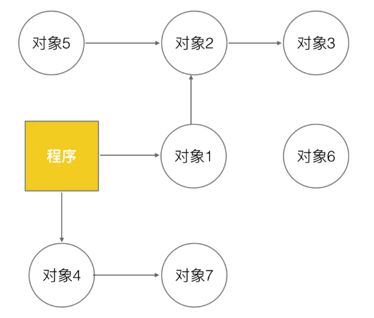

- 找出不可达的对象，然后做上标记。

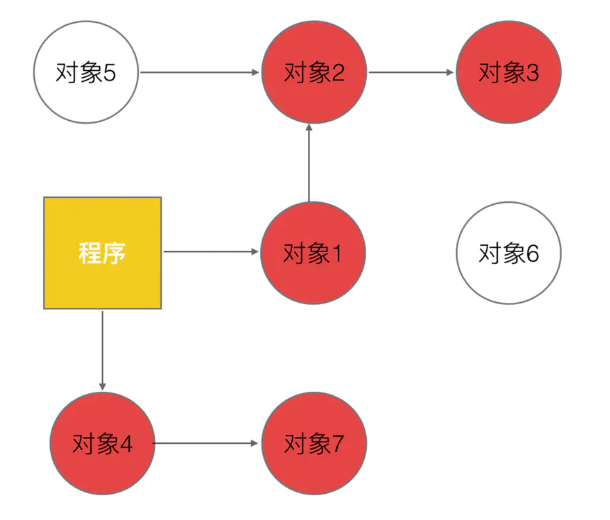

- 标记完了之后，然后开始清除未标记的对象。

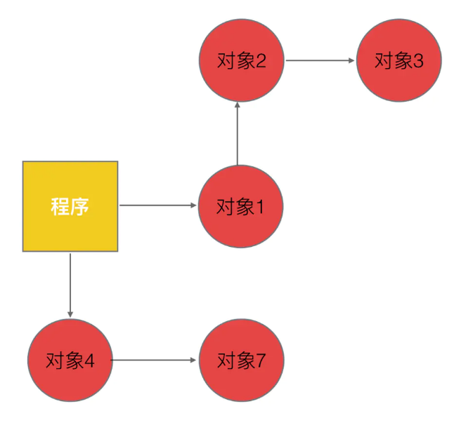

- 程序从暂停中恢复，然后循环重复这个过程，直到process程序生命周期结束

缺点：

- STW，stop the world；让程序暂停，程序出现卡顿 (重要问题)。

- 标记需要扫描整个heap

- 清除数据会产生heap碎片

Go V1.3之前的版本：

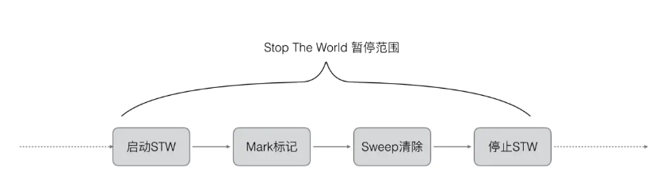

Go V1.3版本做了优化：

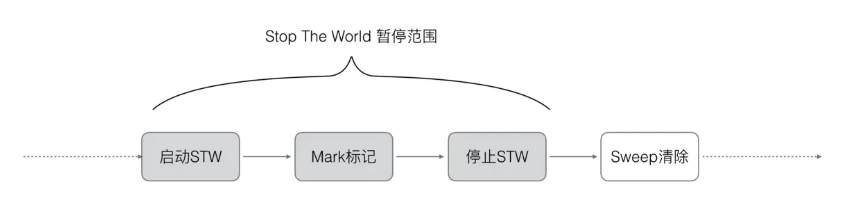

这里面最重要的问题就是：mark-and-sweep 算法会暂停整个程序 。

Go是如何面对并这个问题的呢？接下来G V1.5版本 就用三色并发标记法+屏障机制来优化这个问题。

## Go V1.5 三色并发标记法

先介绍三种颜色：

- 黑色：该对象已经被标记过了，且该对象下的属性也全部都被标记过了。(程序所需要的对象，不应该被回收)

- 灰色：该对象已经被标记过了，但该对象下的属性没有全被标记完。(GC需要从此对象中去寻找垃圾)

- 白色：该对象没有被标记过。(对象垃圾)

朴素的三色标记法的主要过程如下：

- 新创建的对象，默认的颜色都是标记为白色。

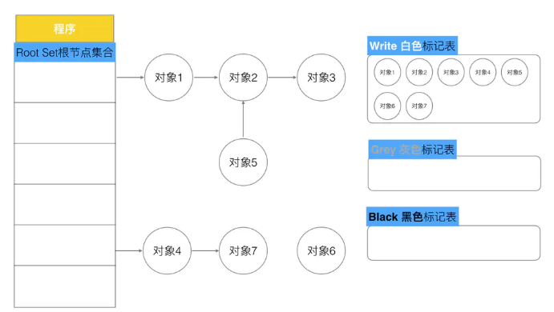

- 每次GC回收开始, 然后从根节点开始遍历所有对象，把遍历到的对象从白色集合放入灰色集合。

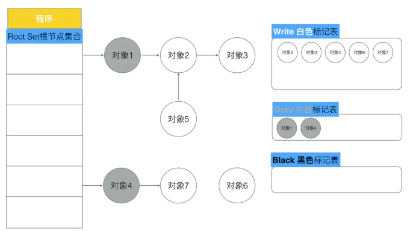

- 遍历灰色集合，将灰色对象引用的对象从白色集合放入灰色集合，之后将此灰色对象放入黑色集合。

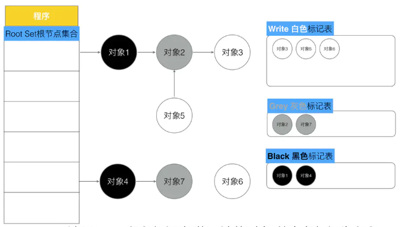

- 第四步, 重复第三步, 直到灰色中无任何对象。

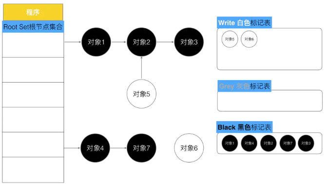

- 最后，回收所有的白色标记表的对象. 也就是回收垃圾。

上述的三色并发标记法是一定要依赖STW的. 因为如果不暂停程序, 程序的逻辑改变对象引用关系, 这种动作如果在标记阶段做了修改，会影响标记结果的正确性。

如果三色标记法, 标记过程不使用STW将会发生什么事情？

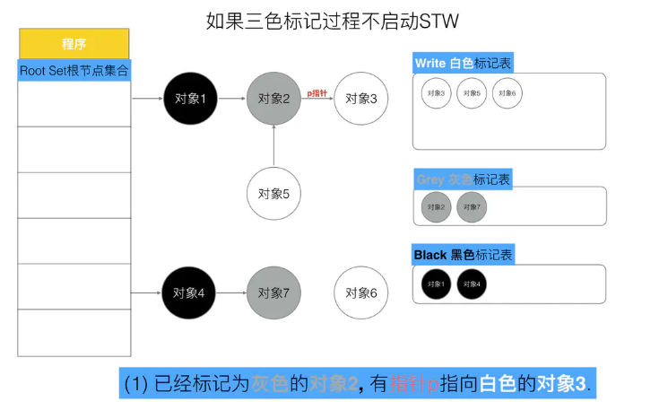

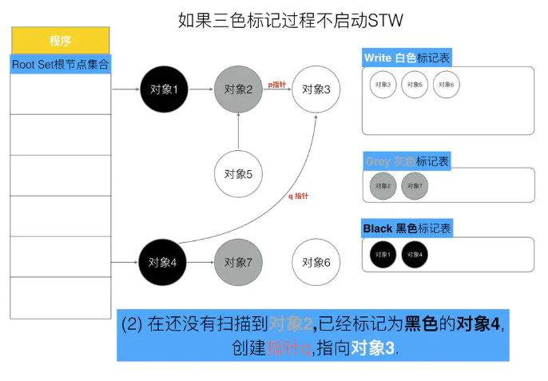

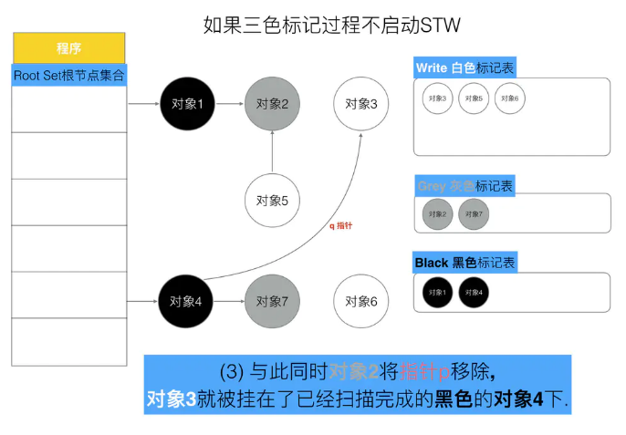

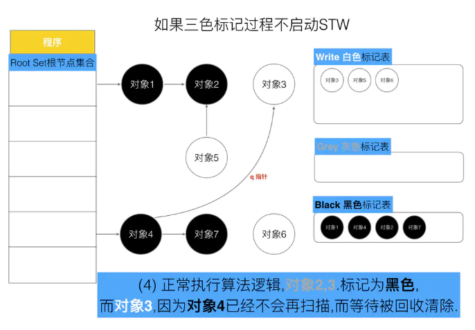

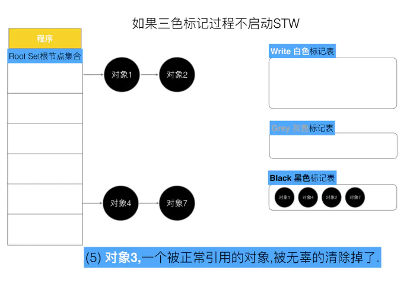

可以看出，有两个问题, 在三色标记法中,是不希望被发生的

- 条件1: 一个白色对象被黑色对象引用(白色被挂在黑色下)

- 条件2: 灰色对象与它之间的可达关系的白色对象遭到破坏(灰色同时丢了该白色)

当以上两个条件同时满足时, 就会出现对象丢失现象!

如果上述中的白色对象3, 如果他还有很多下游对象的话, 也会一并都清理掉.

​为了防止这种现象的发生，最简单的方式就是STW，直接禁止掉其他用户程序对对象引用关系的干扰，但是STW的过程有明显的资源浪费，对所有的用户程序都有很大影响，如何能在保证对象不丢失的情况下合理的尽可能的提高GC效率，减少STW时间呢？

​只要使用一个机制,来破坏上面的两个条件就可以了。这就引入了屏障机制。

### 强弱-三色不变式

为了防止被黑色对象引用的白色对象被回收，需要垃圾回收遵循两种方式：

- 强三色不变式：不存在黑色对象引用到白色对象的指针。

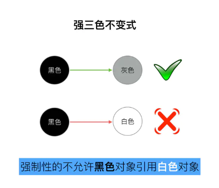

- 弱三色不变式：所有被黑色对象引用的白色对象都处于灰色保护状态.

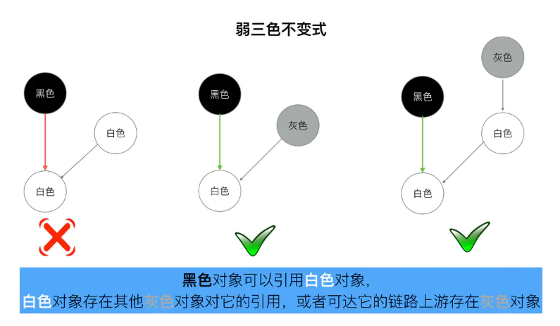

为了遵循上述的两个方式,Golang实现了的两种屏障方式：插入屏障和删除屏障。

### 插入屏障

具体操作: 在A对象引用B对象的时候，B对象被标记为灰色。(将B挂在A下游，B必须被标记为灰色)

满足: 强三色不变式. (不存在黑色对象引用白色对象的情况了， 因为白色会强制变成灰色)

伪码如下:

```
添加下游对象(当前下游对象slot, 新下游对象ptr) {   
  //1
  标记灰色(新下游对象ptr)   
  
  //2
  当前下游对象slot = 新下游对象ptr                   
}

//场景
A.添加下游对象(nil, B)   //A 之前没有下游， 新添加一个下游对象B， B被标记为灰色
A.添加下游对象(C, B)     //A 将下游对象C 更换为B，  B被标记为灰色
```

这段伪码逻辑就是插入屏障，我们知道,黑色对象的内存槽有两种位置：栈和堆。栈空间的特点是容量小，但是要求相应速度快，因为函数调用弹出频繁使用，所以插入屏障机制，在栈空间的对象操作中不使用，而仅仅使用在堆空间对象的操作中。

整个流程如下：

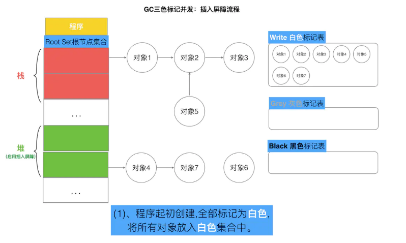

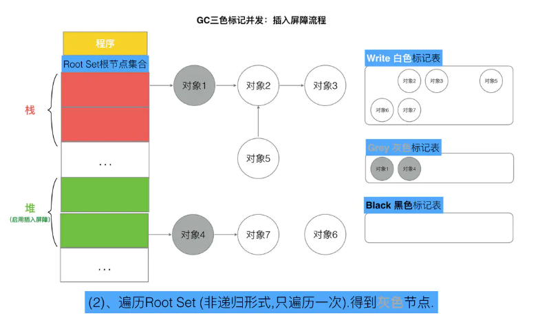


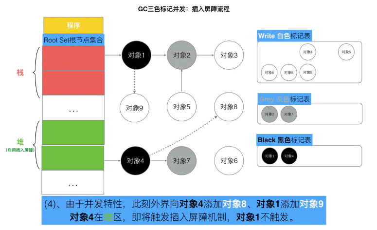

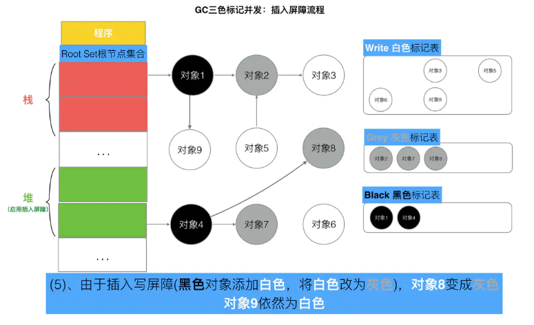


但是如果栈不添加,当全部三色标记扫描之后,栈上有可能依然存在白色对象被引用的情况(如上图的对象9). 所以要对栈重新进行三色标记扫描, 但这次为了对象不丢失, 要对本次标记扫描启动STW暂停. 直到栈空间的三色标记结束.

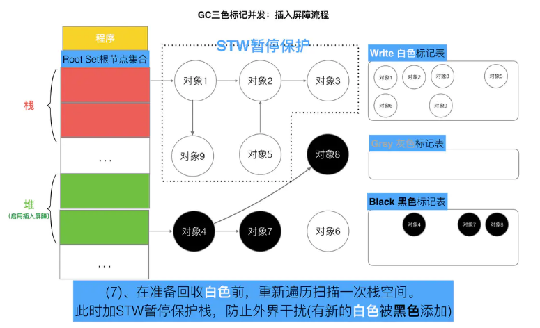

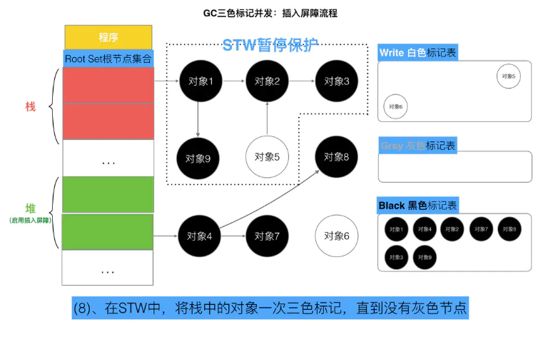

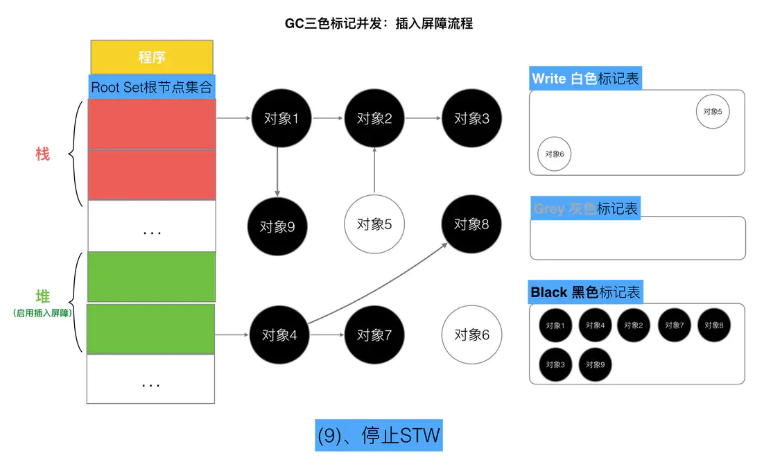

最后将栈和堆空间 扫描剩余的全部 白色节点清除. 这次STW大约的时间在10~100ms间

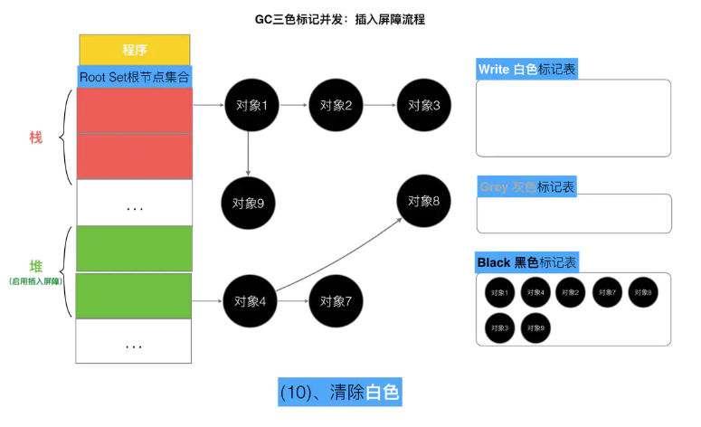

### 删除屏障

具体操作: 被删除的对象，如果自身为灰色或者白色，那么被标记为灰色。

满足: 弱三色不变式. (保护灰色对象到白色对象的路径不会断)

伪代码如下：

```
添加下游对象(当前下游对象slot， 新下游对象ptr) {
  //1
  if (当前下游对象slot是灰色 || 当前下游对象slot是白色) {
        标记灰色(当前下游对象slot)     //slot为被删除对象， 标记为灰色
  }
  
  //2
  当前下游对象slot = 新下游对象ptr
}

//场景
A.添加下游对象(B, nil)   //A对象，删除B对象的引用。  B被A删除，被标记为灰(如果B之前为白)
A.添加下游对象(B, C)       //A对象，更换下游B变成C。   B被A删除，被标记为灰(如果B之前为白)
```

整个流程如下：

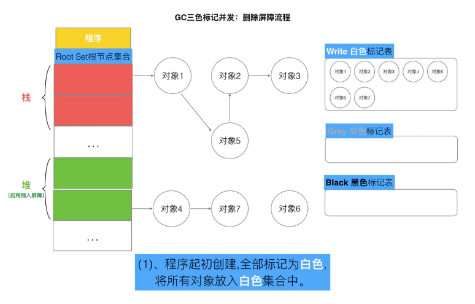

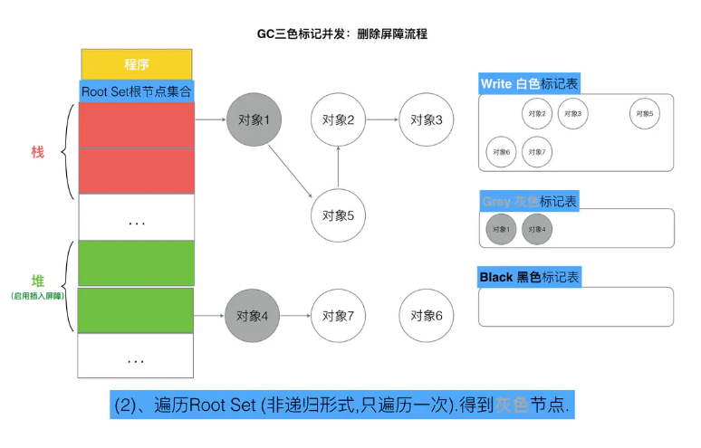

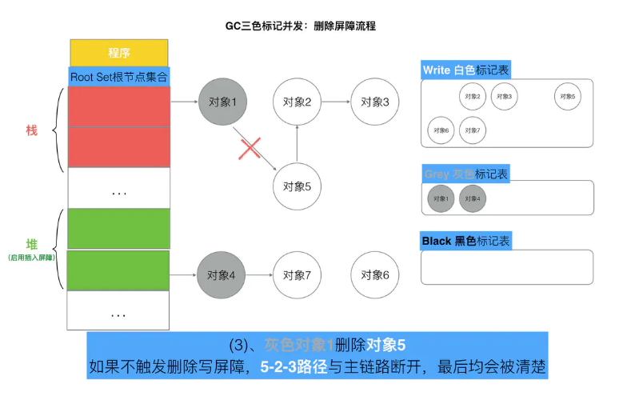

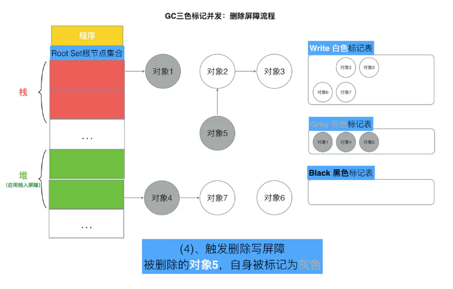

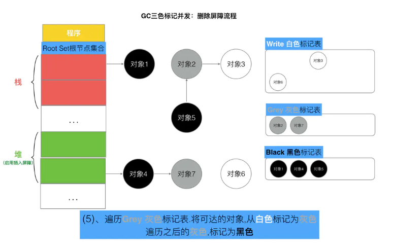

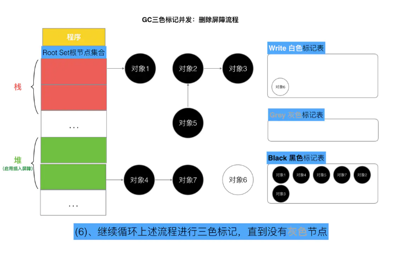

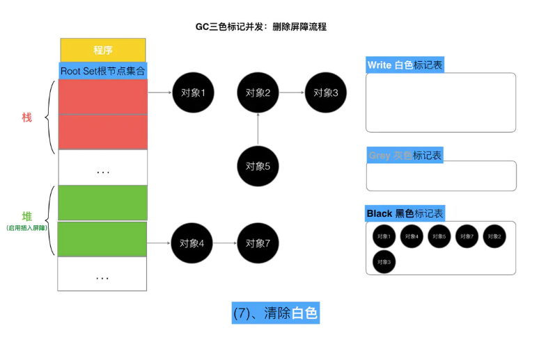

这种方式的插入写屏障和删除写屏障的短板：

- 插入写屏障：结束时需要STW来重新扫描栈，标记栈上引用的白色对象的存活；

- 删除写屏障：回收精度低，GC开始时STW扫描堆栈来记录初始快照，这个过程会保护开始时刻的所有存活对象。

## Go V1.8 混合写屏障

Go V1.8版本引入了混合写屏障机制（hybrid write barrier），避免了对栈re-scan的过程，极大的减少了STW的时间。结合了两者的优点。

混合写屏障的具体操作如下：

- GC开始将栈上的对象全部扫描并标记为黑色(之后不再进行第二次重复扫描，无需STW)，

- GC期间，任何在栈上创建的新对象，均为黑色。

- 被删除的对象标记为灰色。

- 被添加的对象标记为灰色。

满足: 变形的弱三色不变式

伪代码：

```
添加下游对象(当前下游对象slot, 新下游对象ptr) {
    //1 
        标记灰色(当前下游对象slot)    //只要当前下游对象被移走，就标记灰色
    
    //2 
    标记灰色(新下游对象ptr)
        
    //3
    当前下游对象slot = 新下游对象ptr
}
```

### 混合写屏障的具体场景分析

混合写屏障的主要流程和场景如下：

- GC开始：扫描栈区，将可达对象全部标记为黑

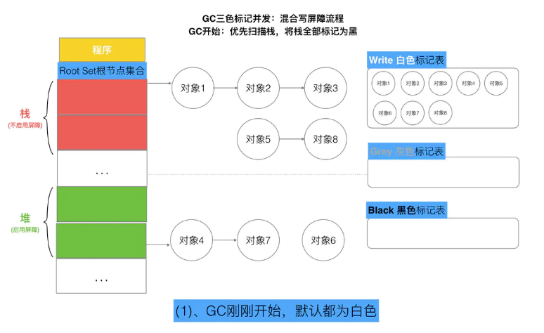

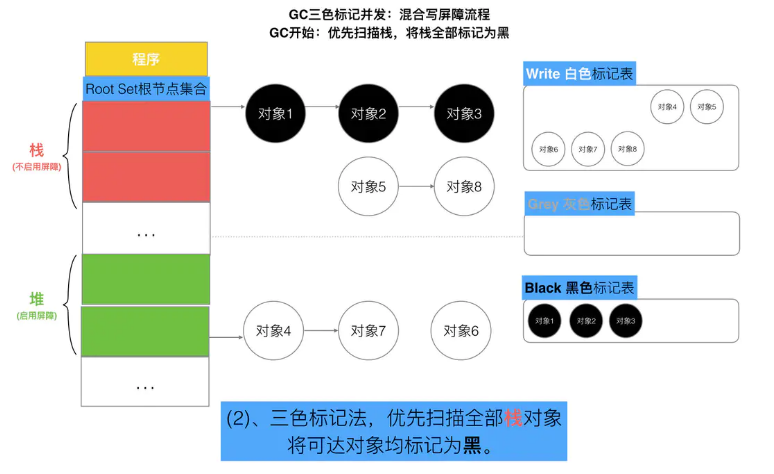

- 场景一：对象被一个堆对象删除引用，成为栈对象的下游

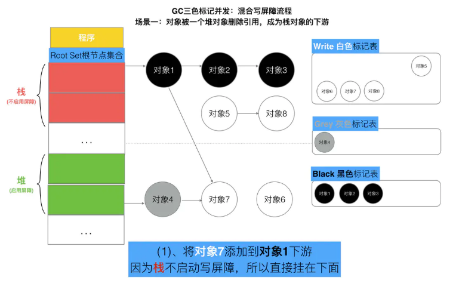

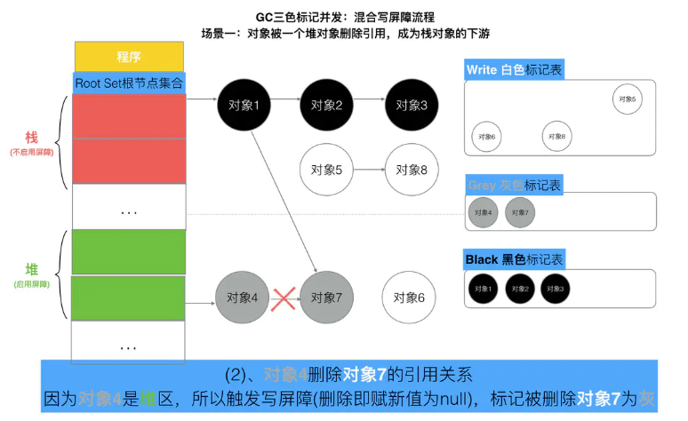

- 场景二：对象被一个栈对象删除引用，成为另一个栈对象的下游

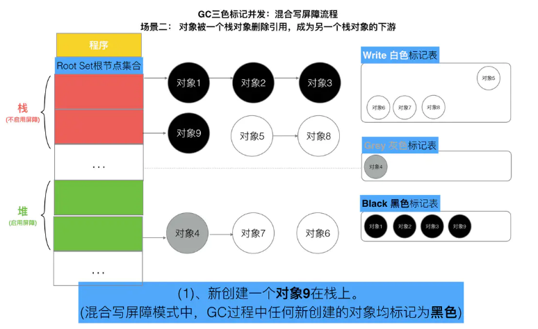

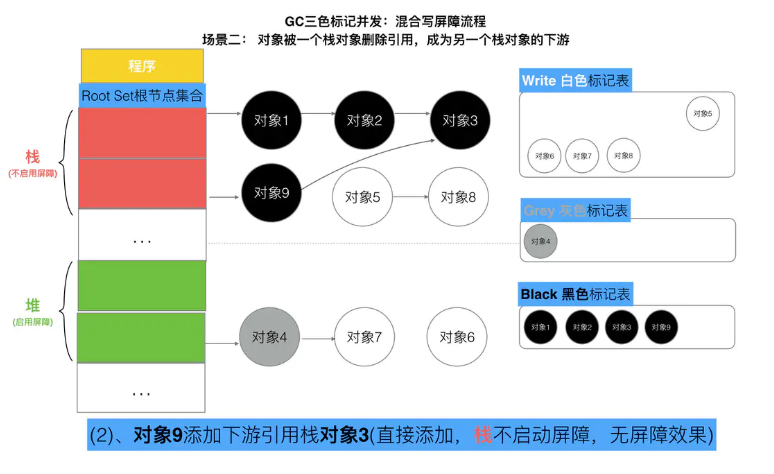

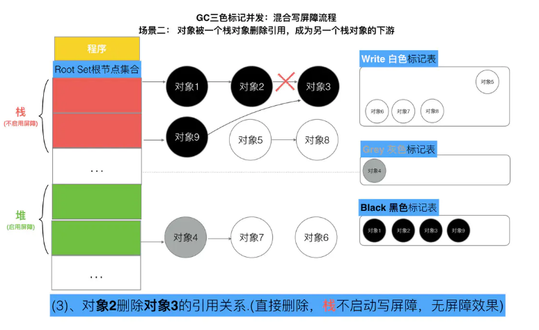

- 场景三：对象被一个堆对象删除引用，成为另一个堆对象的下游

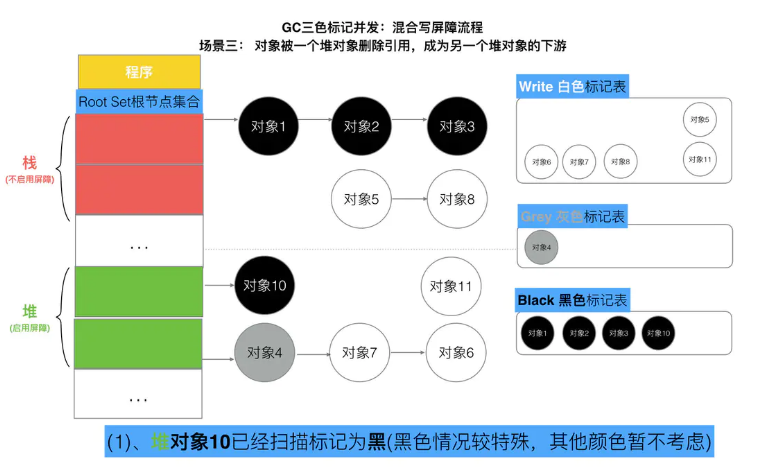

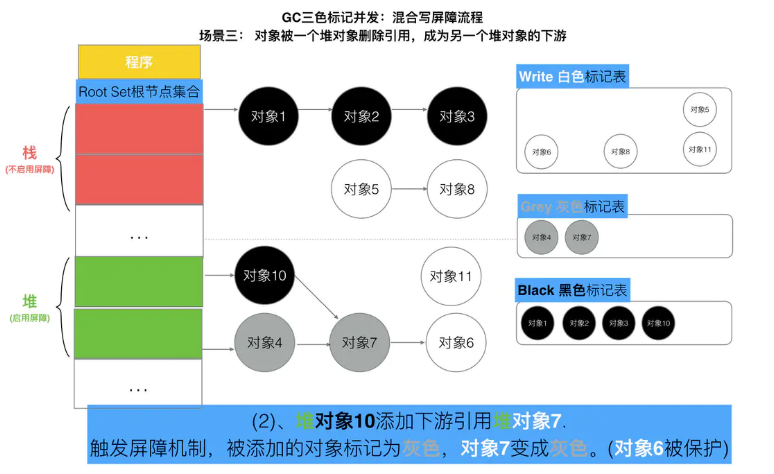

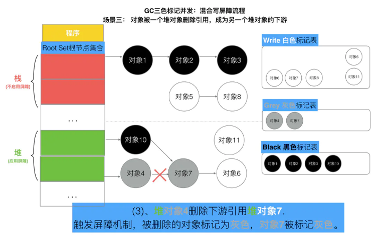

- 场景四：对象从一个栈对象删除引用，成为另一个堆对象的下游

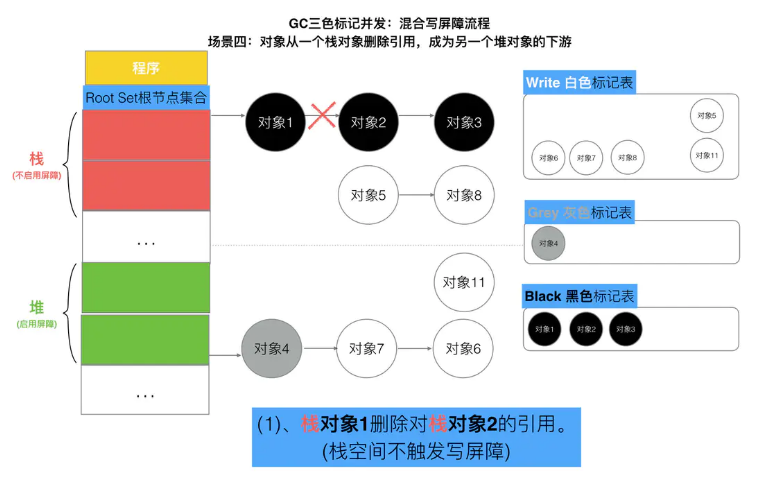

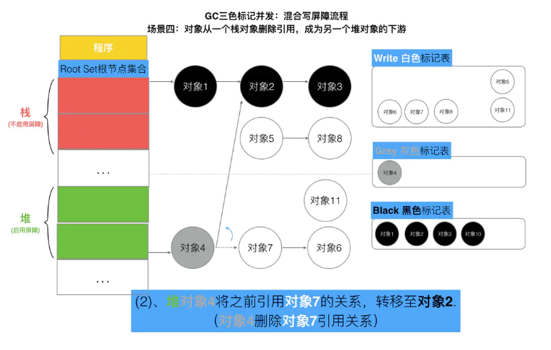

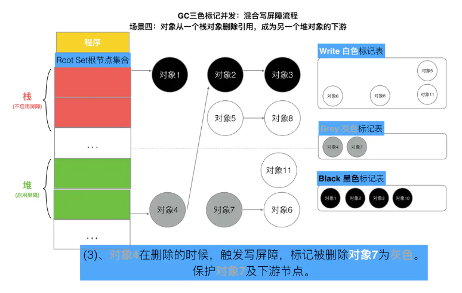

混合写屏障满足弱三色不变式，结合了删除写屏障和插入写屏障的优点，只需要在开始时并发扫描各个goroutine的栈，使其变黑并一直保持，这个过程不需要STW，而标记结束后，因为栈在扫描后始终是黑色的，也无需再进行re-scan操作了，减少了STW的时间。

## GC调优实践

- 减少对象的分配，合理重复利用； 避免string与[]byte转化；

两者发生转换的时候，底层数据结结构会进行复制，因此导致 gc 效率会变低。

- 少量使用+连接 string；

Go里面string是最基础的类型，是一个只读类型，针对他的每一个操作都会创建一个新的string。 如果是少量小文本拼接，用 “+” 就好；如果是大量小文本拼接，用 strings.Join；如果是大量大文本拼接，用 bytes.Buffer。

- 使用临时对象池 sync.Pool

## GC触发条件

自动垃圾回收的触发条件有两个：

- 超过内存大小阈值

阈值是由一个gcpercent的变量控制的,当新分配的内存占已在使用中的内存的比例超过gcprecent时就会触发。比如一次回收完毕后，内存的使用量为5M，那么下次回收的时机则是内存分配达到10M的时候。也就是说，并不是内存分配越多，垃圾回收频率越高。

- 达到定时时间

如果一直达不到内存大小的阈值呢？这个时候GC就会被定时时间触发，比如一直达不到10M，那就定时（默认2min触发一次）触发一次GC保证资源的回收。
