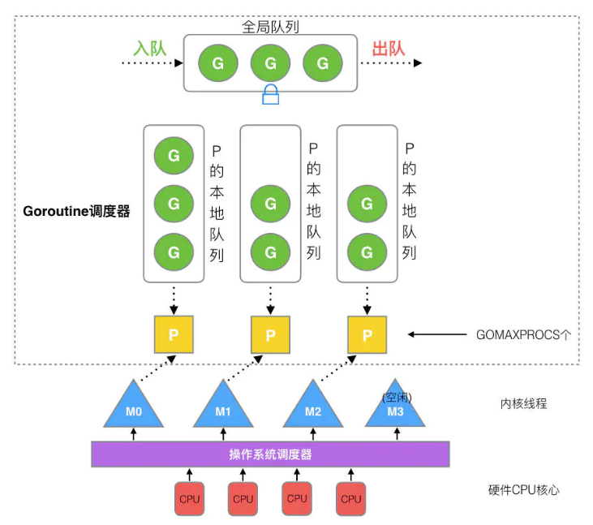
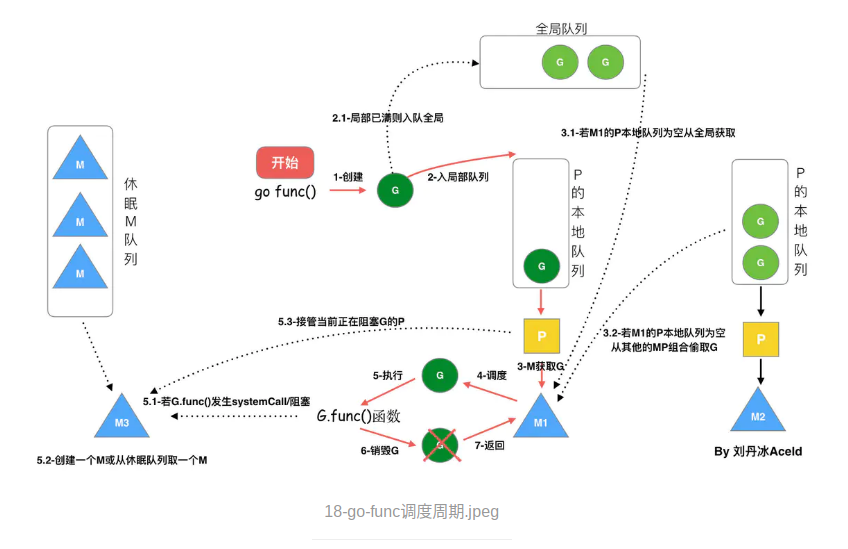
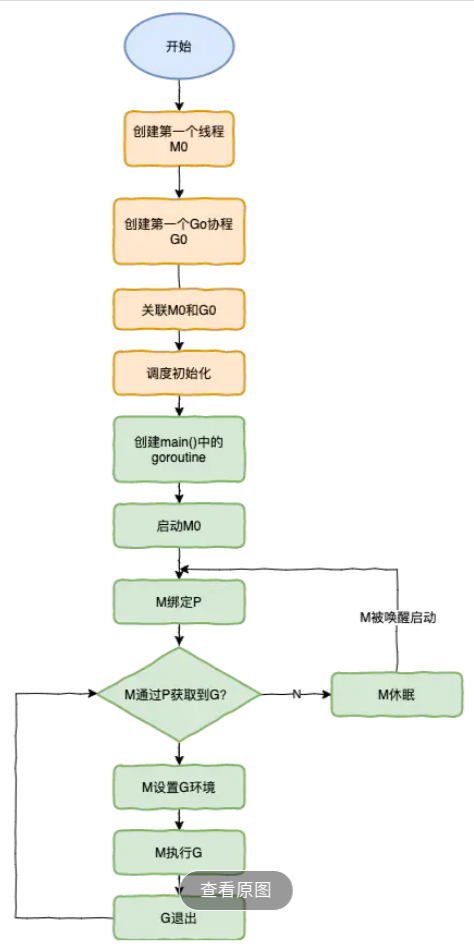

# Golang调度器GMP原理分析

## 基本概念

1.进程：进程是具有一定独立功能的程序关于某个数据集合上的一次运行活动,进程是系统进行资源分配和调度的一个独立单位。每个进程都有自己的独立内存空间，不同进程通过进程间通信来通信。由于进程比较重量，占据独立的内存，所以上下文进程间的切换开销（栈、寄存器、虚拟内存、文件句柄等）比较大，但相对比较稳定安全。

2.线程：线程是进程的一个实体,是CPU调度和分派的基本单位,它是比进程更小的能独立运行的基本单位.线程自己基本上不拥有系统资源,只拥有一点在运行中必不可少的资源(如程序计数器,一组寄存器和栈),但是它可与同属一个进程的其他的线程共享进程所拥有的全部资源。线程间通信主要通过共享内存，上下文切换很快，资源开销较少，但相比进程不够稳定容易丢失数据。

3.协程：协程是一种用户态的轻量级线程，协程的调度完全由用户控制。协程拥有自己的寄存器上下文和栈。协程调度切换时，将寄存器上下文和栈保存到其他地方，在切回来的时候，恢复先前保存的寄存器上下文和栈，直接操作栈则基本没有内核切换的开销，可以不加锁的访问全局变量，所以上下文的切换非常快。 

切换开销：进程 > 线程 > 协程

资源占用：进程(4G) > 线程(4M) > 协程(4K)

## 线程模型

现在主流的线程模型分三种：内核级线程模型、用户级线程模型和两级线程模型(也称混合型线程模型)，它们之间最大的差异就在于用户线程与内核调度实体(KSE，Kernel Scheduling Entity)之间的对应关系上。

所谓的内核调度实体 KSE 就是指可以被操作系统内核调度器调度的对象实体。简单来说 KSE 就是内核级线程，是操作系统内核的最小调度单元，也就是我们写代码的时候通俗理解上的线程了。

### 用户线程模型

用户线程与内核线程KSE是多对一(N : 1)的映射模型，多个用户线程的一般从属于单个进程并且多线程的调度是由用户自己的线程库来完成，线程的创建、销毁以及多线程之间的协调等操作都是由用户自己的线程库来负责而无须借助系统调用来实现。

一个进程中所有创建的线程都只和同一个KSE在运行时动态绑定，也就是说，操作系统只知道用户进程而对其中的线程是无感知的，内核的所有调度都是基于用户进程。

优点：

- N个协程绑定1个线程，优点就是协程在用户态线程即完成切换，不会陷入到内核态，这种切换非常的轻量快速

缺点：

- 一个进程的所有协程都绑定在一个线程上，某个程序用不了硬件的多核加速能力

- 一旦某协程阻塞，造成线程阻塞，本进程的其他协程都无法执行了，根本就没有并发的能力了。

所以很多的协程库会把自己一些阻塞的操作重新封装为完全的非阻塞形式，然后在以前要阻塞的点上，主动让出自己，并通过某种方式通知或唤醒其他待执行的用户线程在该KSE上运行，从而避免了内核调度器由于KSE阻塞而做上下文切换，这样整个进程也不会被阻塞了

### 内核线程模型

用户线程与内核线程KSE是一对一(1 : 1)的映射模型，也就是每一个用户线程绑定一个实际的内核线程，而线程的调度则完全交付给操作系统内核去做，应用程序对线程的创建、终止以及同步都基于内核提供的系统调用来完成。

大部分编程语言的线程库都是对操作系统的线程(内核级线程)的一层封装，创建出来的每个线程与一个独立的KSE静态绑定，因此其调度完全由操作系统内核调度器去做，也就是说，一个进程里创建出来的多个线程每一个都绑定一个KSE。

优点：

- 1个协程绑定1个线程，这种最容易实现，而且多个线程可以同时运行，因此相较于用户级线程模型它真正做到了并行处理。

缺点：

- 由于直接借助了操作系统内核来创建、销毁和以及多个线程之间的上下文切换和调度，因此资源成本大幅上涨，且对性能影响很大。

### 两级线程模型

在此模型下，用户线程与内核KSE是多对多(N : M)的映射模型。

首先，区别于用户级线程模型，两级线程模型中的一个进程可以与多个内核线程KSE关联，也就是说一个进程内的多个线程可以分别绑定一个自己的KSE，这点和内核级线程模型相似；

其次，又区别于内核级线程模型，它的进程里的线程并不与KSE唯一绑定，而是可以多个用户线程映射到同一个KSE，当某个KSE因为其绑定的线程的阻塞操作被内核调度出CPU时，其关联的进程中其余用户线程可以重新与其他KSE绑定运行。

Go语言中的runtime调度器就是采用的这种实现方案，实现了Goroutine与KSE之间的动态关联，用户调度器实现用户线程到KSE的『调度』，内核调度器实现KSE到CPU上的『调度』。

优点：

- 协程切换开销小，可以利用多核优势，做到并行处理。

缺点：

- 实现起来相对复杂。

## Goroutine调度器

### G-M 模型

最开始的Golang采用G-M模型进行调度：

- G: 表示Goroutine，每个Goroutine对应一个G结构体，G存储Goroutine的运行堆栈、状态以及任务函数，可重用。G并非执行体，每个G需要绑定到P才能被调度执行。

- M: 表示Machine，OS线程抽象，代表着真正执行计算的资源，由Go Runtime调整，为了防止创建过多OS线程导致系统调度不过来，目前默认最大限制为10000个

M想要执行、放回G都必须访问全局G队列，并且M有多个，即多线程访问同一资源需要加锁进行保证互斥/同步，所以全局G队列是有互斥锁进行保护的。

- 创建、销毁、调度G都需要每个M获取锁，这就形成了激烈的锁竞争。

- M转移G会造成延迟和额外的系统负载。比如当G中包含创建新协程的时候，M创建了G’，为了继续执行G，需要把G’交给M’执行，也造成了很差的局部性，因为G’和G是相关的，最好放在M上执行，而不是其他M'。

- 系统调用(CPU在M之间的切换)导致频繁的线程阻塞和取消阻塞操作增加了系统开销。

### G-M-P 模型

- P: 表示Processor，表示逻辑处理器， 对G来说，P相当于CPU核，G只有绑定到P(在P的local runq中)才能被调度。对M来说，P提供了相关的执行环境(Context)，如内存分配状态(mcache)，任务队列(G)等，P的数量决定了系统内最大可并行的G的数量（前提：物理CPU核数 >= P的数量），P的数量由用户设置的GOMAXPROCS决定，但是不论GOMAXPROCS设置为多大，P的数量最大为256。



- 全局队列(Global Queue)：存放等待运行的G。

- 本地队列(Local Queue)：同全局队列类似，存放的也是等待运行的G，存的数量有限，不超过256个。新建G'时，G'优先加入到P的本地队列，如果队列满了，则会把本地队列中一半的G移动到全局队列。

- P列表：所有的P都在程序启动时创建，并保存在数组中，最多有GOMAXPROCS(可配置)个。

- M：线程想运行任务就得获取P，从P的本地队列获取G，P队列为空时，M从其他P的本地队列偷一半放到自己P的本地队列，或者尝试从全局队列拿一批G放到P的本地队列。M运行G，G执行之后，M会从P获取下一个G，不断重复下去。

### 调度策略

- 复用线程：避免频繁的创建、销毁线程，而是对线程的复用。

1）work stealing机制

​ 当本线程无可运行的G时，尝试从其他线程绑定的P偷取G，而不是销毁线程。

2）hand off机制

​ 当本线程因为G进行系统调用阻塞时，线程释放绑定的P，把P转移给其他空闲的线程执行。

- 利用并行：GOMAXPROCS设置P的数量，最多有GOMAXPROCS个线程分布在多个CPU上同时运行。GOMAXPROCS也限制了并发的程度，比如GOMAXPROCS = 核数/2，则最多利用了一半的CPU核进行并行。

- 抢占：在coroutine中要等待一个协程主动让出CPU才执行下一个协程，在Go中，一个goroutine最多占用CPU 10ms，防止其他goroutine被饿死，这就是goroutine不同于coroutine的一个地方。

### 调度流程



从上图我们可以分析出几个结论：

​1.我们通过 go func()来创建一个goroutine；

​2.有两个存储G的队列，一个是局部调度器P的本地队列、一个是全局G队列。新创建的G会先保存在P的本地队列中，如果P的本地队列已经满了就会保存在全局的队列中；

​3.G只能运行在M中，一个M必须持有一个P，M与P是1：1的关系。M会从P的本地队列弹出一个可执行状态的G来执行，如果P的本地队列为空，就会想其他的MP组合偷取一个可执行的G来执行；

​4.一个M调度G执行的过程是一个循环机制；

5.当G因为channel操作或者network I/O而阻塞时(用户态阻塞)，G会被放置到某个wait队列，而M会跳过该G尝试获取并执行下一个G，如果此时没有runnable的G供M运行，那么M将解绑P，并进入sleep状态；当阻塞的G被另一端的G2唤醒时(比如channel的可读/写通知)，G被标记为runnable，尝试加入G2所在P的runnext，然后再是P的Local队列和Global队列。

6.当G被阻塞在某个系统调用上时，此时执行该G的M会与P解绑，而P则尝试与其它空闲的M绑定，继续执行其它G。如果没有其它空闲的M，但P的Local队列中仍然有G需要执行，则创建一个新的M；当系统调用完成后，G会重新尝试获取一个空闲的P进入它的Local队列恢复执行，如果没有空闲的P，G会被加入到Global队列，M会变成休眠状态，加入到空闲线程中。

### 调度器的生命周期



特殊的M0和G0：

- M0是启动程序后的编号为0的主线程，这个M对应的实例会在全局变量runtime.m0中，不需要在heap上分配，M0负责执行初始化操作和启动第一个G， 在之后M0就和其他的M一样了。

- G0是每次启动一个M都会第一个创建的gourtine，G0仅用于负责调度的G，G0不指向任何可执行的函数, 每个M都会有一个自己的G0。在调度或系统调用时会使用G0的栈空间, 全局变量的G0是M0的G0。

### 实例

接下来我们来针对上面的代码对调度器里面的结构做一个分析。

```golang
package main

import "fmt"

func main() {
    fmt.Println("Hello world")
}
```

这段代码会经历如上图所示的过程：

- runtime创建最初的线程m0和goroutine g0，并把2者关联。

- 调度器初始化：初始化m0、栈、垃圾回收，以及创建和初始化由GOMAXPROCS个P构成的P列表。

- 示例代码中的main函数是main.main，runtime中也有1个main函数——runtime.main，代码经过编译后，runtime.main会调用main.main，程序启动时会为runtime.main创建goroutine，称它为main goroutine吧，然后把main goroutine加入到P的本地队列。

- 启动m0，m0已经绑定了P，会从P的本地队列获取G，获取到main goroutine。

- G拥有栈，M根据G中的栈信息和调度信息设置运行环境

- M运行G

- G退出，再次回到M获取可运行的G，这样重复下去，直到main.main退出，runtime.main执行Defer和Panic处理，或调用runtime.exit退出程序。

调度器的生命周期几乎占满了一个Go程序的一生，runtime.main的goroutine执行之前都是为调度器做准备工作，runtime.main的goroutine运行，才是调度器的真正开始，直到runtime.main结束而结束。


