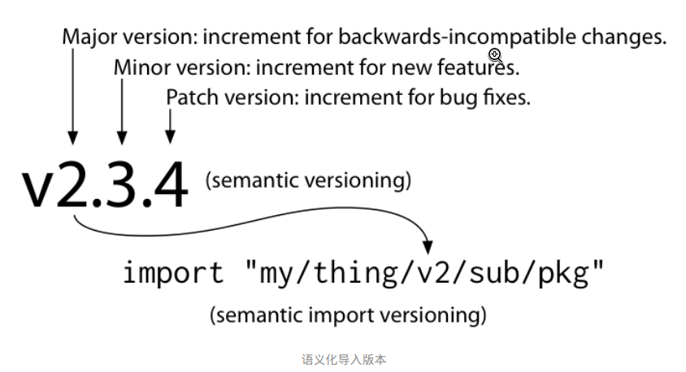
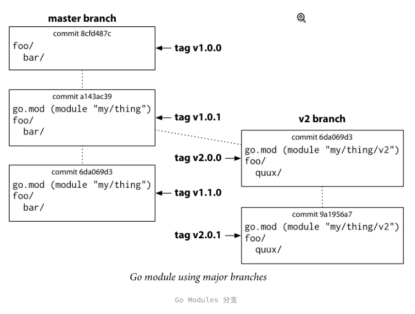
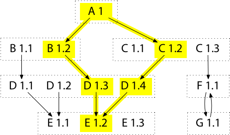
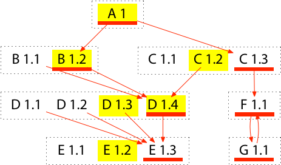
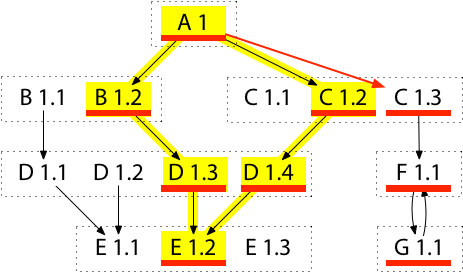

# Go-Modules详解

从Go1.11开始，官方包含了初步对Go Modules支持，并在 2019 年 8 月发布的 Go 1.13 在所有开发过程中默认使用 Go Modules。

Go Modules 是为了提升使用其他开发者代码，即添加依赖项（模块、包）时的体验，也是为了让代码的正确性、安全性得到保障。

## Go Modules模式

Go Modules 在 Go 1.11 及 Go 1.12 中有三个模式，根据环境变量 GO111MODULE 定义：

- 默认模式（未设置该环境变量或 GO111MODULE=auto）：Go 命令行工具在同时满足以下两个条件时使用 Go Modules：

    1.当前目录不在 GOPATH/src/ 下；

    2.在当前目录或上层目录中存在 go.mod 文件。

- GOPATH 模式（GO111MODULE=off）：Go 命令行工具从不使用 Go Modules。相反，它查找 vendor 目录和 GOPATH 以查找依赖项。

- Go Modules 模式（GO111MODULE=on）：Go 命令行工具只使用 Go Modules，从不咨询 GOPATH。GOPATH 不再作为导入目录，但它仍然存储下载的依赖项（GOPATH/pkg/mod/）和已安装的命令（GOPATH/bin/），只移除了 GOPATH/src/。

Go 1.13 默认使用 Go Modules 模式，所以以上内容在 Go 1.13 发布并在生产环境中使用后都可以忽略。

## go mod&go sum

go.mod以及go.sum一般会成对出现在项目根目录中。其中，go.mod负责记录需求列表(用于构建依赖模块)；而go.sum用于记录安全性以及完整性校验，下面依次介绍这两种文件格式：

### 核心文件 go.mod

以下是go.mod文件中最全面的一个案例：

```go
module my/thing
go 1.12
require other/thing v1.0.2 // 这是注释
require new/thing/v2 v2.3.4 // indirect
require（
  new/thing v2.3.4
  old/thing v0.0.0-20190603091049-60506f45cf65
）
exclude old/thing v1.2.3
replace bad/thing v1.4.5 => good/thing v1.4.5
```
go.mod 文件在实际项目没有这么复杂，而且一旦该文件存在，就不需要额外的步骤：像 go build、go test，甚至 go list 这样的命令都会根据需要自动添加新的依赖项以满足导入。

但现在我们还是来详细了解 go.mod 文件的组成：

go.mod 文件是面向行的, 当前模块（主模块）通常位于第一行，接下来是根据路径排序的依赖项。

每行包含一个指令，由一个前导动词后跟参数组成。

所有前导动词的作用如下：

- module：定义模块路径。

- go：设置预期的语言版本。

- require：要求给定版本或更高版本的特定模块。

- exclude：排除特定版本模块的使用，不允许的模块版本被视为不可用，并且查询无法返回。

- replace：使用不同的模块版本替换原有模块版本。

前导动词还可以按块的方式使用，用括号创建一个块（第 5-8 行），就像在 Go 语言中的导入一样：

```go
import (
    "errors"
    "fmt"
    "log"
)
```

注释（第 3-4 行）可以使用单行 // 这是注释 注释，但不能使用多行 /* 这是注释 */ 注释。而 indirect 注释（第 4 行）标记了该模块不是被当前模块直接导入的，只是被间接导入。

go.mod 文件只存在于在模块的根目录下，子目录中的导入路径会使用模块的导入路径 + 子目录路径的形式。例如：如果创建了一个名叫 world 的子目录，并不需要在子目录中使用 go mod init 命令，Go 命令行工具会自动识别它作为 hello 模块的一部分，所以它的导入路径为 hello/world。

Go 命令行工具会自动处理 go.mod 中指定的模块版本。当源代码中 import 指向的模块不存在于 go.mod 文件中时，Go 命令行工具会自动搜索这个模块，并将最新版本（最后一个 tag 且非预发布的稳定版本）添加到 go.mod 文件中。

如果没有 tag，则使用伪版本（第 7 行），这是一种版本语法，专门用于标记没有 tag 的提交（一些 golang.org/x/ 下的包就是没有 tag 的）。如：v0.0.0-20190603091049-60506f45cf65。

前面部分为语义化版本号，用于标记版本；中间部分为 UTC 的提交时间，用于比较两个伪版本以其确定先后顺序；后面部分是 commit 哈希的前缀，用于标记该版本位于哪个 commit。

### 版本管理文件 go.sum

文件内容如下：

```go
github.com/davecgh/go-spew v1.1.0 h1:ZDRjVQ15GmhC3fiQ8ni8+OwkZQO4DARzQgrnXU1Liz8=
github.com/davecgh/go-spew v1.1.0/go.mod h1:J7Y8YcW2NihsgmVo/mv3lAwl/skON4iLHjSsI+c5H38=
github.com/gin-gonic/gin v1.4.0 h1:3tMoCCfM7ppqsR0ptz/wi1impNpT7/9wQtMZ8lr1mCQ=
github.com/gin-gonic/gin v1.4.0/go.mod h1:OW2EZn3DO8Ln9oIKOvM++LBO+5UPHJJDH72/q/3rZdM=
github.com/golang/protobuf v1.3.1 h1:YF8+flBXS5eO826T4nzqPrxfhQThhXl0YzfuUPu4SBg=
github.com/golang/protobuf v1.3.1/go.mod h1:6lQm79b+lXiMfvg/cZm0SGofjICqVBUtrP5yJMmIC1U=
```
每行由模块导入路径、模块的特定版本和预期哈希组成。

在每次缺少模块时，如果缓存中不存在，则需要下载并计算其哈希添加到 go.sum 中；如果缓存中存在，则需要匹配 go.sum 中的已有条目。

这样，构建软件的用户就可以使用哈希验证其构建是否跟你的构建相同（go mod verify），而无论他们怎样获取依赖项，都可以得到相同的版本。同时也保证了项目依赖不会发生预料之外的恶意修改和其他问题。这也是为什么要将 go.sum 文件加入版本管理（Git）的原因。

再加上 Go Modules 选择的是最小版本选择策略（默认使用构建中涉及的每个模块的最旧允许版本，使得新版本的发布对构建没有影响）就可以实现可重现的构建（在重复构建时产生相同的结果）。

## 语义化版本 (semantic version)

语义化版本是一套由 Gravatars 创办者兼 GitHub 共同创办者 Tom Preston-Werner 所建立的约定。在这套约定下，语义化版本号及其更新方式包含了很多有用的信息。

语义化版本号格式为：X.Y.Z（主版本号.次版本号.修订号），使用方法如下：

- 进行不向下兼容的修改时，递增主版本号。

- API 保持向下兼容的新增及修改时，递增次版本号。

- 修复问题但不影响 API 时，递增修订号。

举个例子，有一个语义化版本号为：v0.1.2，则其主版本号为 0，次版本为 1，修订号为 2。而前面的 v 是 version（版本）的首字母，是 Go 语言惯例使用的，标准的语义化版本没有这个约定。

所以在使用 Go 命令行工具或 go.mod 文件时，就可以使用语义化版本号来进行模块查询，具体规则如下：

- 默认值（@latest）：将匹配最新的可用标签版本或源码库的最新未标签版本。

- 完全指定版本（@v1.2.3）：将匹配该指定版本。

- 版本前缀（@v1 或 @v1.2）：将匹配具有该前缀的最新可用标签版本。

- 版本比较（@<v1.2.3 或 @>=v1.5.6）：将匹配最接近比较目标的可用标签版本。< 则为小于该版本的最新版本，> 则为大于该版本的最旧版本。当使用类 Unix 系统时，需用引号将字符串包裹起来以防止大于小于号被解释为重定向。如：go get 'github.com/gin-gonic/gin@<v1.2.3'。

- 指定某个 commit（@c856192）：将匹配该 commit 时的版本。

- 指定某个分支（@master）：将匹配该分支版本。



如上图所示，为了能让 Go Modules 的使用者能够从旧版本更方便地升级至新版本，Go 语言官方提出了两个重要的规则：

- 导入兼容性规则（import compatibility rule）：如果旧包和新包具有相同的导入路径，则新包必须向后兼容旧包。

- 语义化导入版本规则（semantic import versioning rule）：每个不同主版本（即不兼容的包 v1 或 v2）使用不同的导入路径，以主版本结尾，且每个主版本中最多一个。如：一个 rsc.io/quote、一个 rsc.io/quote/v2、一个 rsc.io/quote/v3。

与git分支的集成如下：



## 最小版本选择 (Minimal Version Selection)

Minimal Version Selection是go mod所实现的关于依赖升级和降级的选择策略，它不同于Go之前的包管理器实践。

“最小版本选择”这个名称非常容易让人产生误解，对它的正确理解是：当模块的某个依赖发布更新的版本，MVS选择的结果并不一定会选择该版本，更有可能是保持不变。

这里将一次构建(go build)中所依赖模块及其版本列表称为build list，对于一个稳定发展的项目，build list应该尽可能保持不变，同时也允许开发人员修改build list，比如升级或者降级依赖。而依赖管理因此也可以归纳为如下四个操作：

- 构建项目当前build list

- 升级所有依赖模块到它们的最新版本

- 升级某个依赖模块到指定版本

- 将某个依赖模块降级到指定版本

### Construct Build List 

简单来说可以通过图遍历以及递归算法(图递归遍历)来构建依赖列表。从根节点出发依次遍历直接依赖B1.2以及C1.2，然后递归遍历。这样根据初始的依赖关系(指定版本：A1->B1.2，A1->C1.2)，会按照如下路径选取依赖：



首先构建empty build list，然后从根节点出发递归遍历依赖模块获取rough build list，这样rough build list中可能会存在同一个依赖模块的不同版本(如D1.3与D1.4)，通过选取最新版本构建final build list(最终的构建列表一个模块只取一个版本，即这些版本中的最新版)，如下：


### Upgrade All Modules

一次性升级所有模块(直接&间接)可能是对构建列表最常见的修改，go get -u 就实现了这样的功能。当执行完这个命令后，所有依赖包都将升级为最新版本，如下



这里面添加了新的依赖模块：E1.3，G1.1，F1.1以及C1.3。新rough build list会将新引入的依赖模块和旧的rough build list模块(黄色部分)进行合并，并从中选取最大版本，最终构建final build list(上图红线标识模块)。

为了得到上述结果，需要添加一些依赖模块到A的需求列表中，因为按照正常的构建流程，依赖包不应该包括D1.4和E1.3，而是D1.3和E1.2。这里面就会涉及Algorithm R. Compute a Minimal Requirement List，该算法核心是创建一个能重复构建依赖模块的最小需求列表，也即只保留必须的依赖模块信息(比如直接依赖以及特殊依赖)，并存放于go.mod文件中。

比如上述例子中A1的go.mod文件会构建如下：

```
module A1
go 1.14
require (
	B1.2
	C1.3
	D1.4 // indirect
	E1.3 // indirect
)
```

可以看到上述go.mod文件中，没有出现F1.1以及G1.1，这是因为F1.1存在于C1.3的go.mod文件中，而G1.1存在于F1.1的go.mod文件中，因此没有必要将这两个模块填写到A1的go.mod文件中；

而D1.4和E1.3后面添加了indirect标记，这是因为D1.4和E1.3都不会出现在B1.2，C1.3以及它们的依赖模块对应的go.mod文件中，因此必须添加到模块A1的需求列表中(go需要依据这个列表中提供的依赖以及相应版本信息重复构建这个模块，反过来，如果不将D1.4和E1.3添加到go.mod，那么最终模块A1的依赖构建结果就会是D1.3以及E1.2)

### Upgrade One Module

相比一次性升级所有模块，比较好的方式是只升级其中一个模块，并尽量少地修改构建列表。例如，当我们想升级到C1.3时，我们并不想造成不必要的修改，如升级到E1.3以及D1.4。这个时候我们可以选择只升级某个模块，并执行go get命令如下：

```
go get C@1.3
```



当我们升级某个模块时，会在构建图中将指向这个模块的箭头挪向新版本(A1->C1.2挪向A1->C1.3)并递归引入新的依赖模块。例如在升级C1.2->C1.3时，会新引入F1.1以及G1.1模块(对一个模块的升级或者降级可能会引入其他依赖模块)，而新的rough build list(红线)将由旧rough build list(黄色部分)与新模块(C1.3，F1.1以及G1.1)构成，并最终选取其中最大版本合成新的final build list(A1，B1.2，C1.3，D1.4，E1.2，F1.1以及G1.1)

注意最终构建列表中模块D为D1.4而非D1.3，这是因为当升级某个模块时，只会添加箭头，引入新模块；而不会减少箭头，从而删除或者降级某些模块。比如若从 A 至 C 1.3 的新箭头替换了从 A 至 C 1.2 的旧箭头，升级后的构建列表将会丢掉 D 1.4。也即是这种对 C 的升级将导致 D 的降级(降级为D1.3)，这明显是预料之外的，且不是最小修改

一旦我们完成了构建列表的升级，就可运行前面的算法 R 来决定如何升级需求列表(go.mod)。这种情况下，我们最终将以C1.3替换C 1.2，但同时也会添加一个对D1.4的新需求，以避免D的意外降级(因为按照算法1，D1.3才会出现在最终构建列表中)。如下：

```
module A1
go 1.14
require (
	B1.2
	C1.3
	D1.4 // indirect
)
```

### Downgrade One Module

在升级某个模块后，可能会发现bug并需要降级到某个旧版本。当降级某个模块时，会在构建图中将这个模块的高版本删除，同时回溯删除依赖这些高版本的模块，直到查找到不依赖这些高版本的最新模块版本为止。比如这里我们将D降级到D1.2版本，如下：


在确定直接依赖是B1.1以及C1.1之后，会递归将其依赖模块引入，并添加指定版本D1.2，那么按照算法1可以很容易得出构建列表为：A1，B1.1，D1.2(D1.1 vs D1.2)，E1.1以及C1.1。同时，为了保证最小修改，其它不需要降级的模块我们需要尽可能保留，比如：E1.2。这样，final build list就为：A1，B1.1，D1.2(D1.1 vs D1.2)，E1.2(E1.1 vs E1.2)以及C1.1

另外，根据算法R，降级操作之后A1模块的需求列表变更如下：

```
module A1
go 1.14
require (
	B1.1
	C1.1
	D1.2 // indirect
	E1.2 // indirect
)
```

这里，如果A1最开始依赖的模块是C1.3而非C1.2，那么C1.3将会在构建图中保留下来(因为C1.3并没有依赖D模块)

## vender目录

以前使用 vendor 目录有两个目的：

- 可以使用依赖项的确切版本用来构建。

- 即使原始副本消失，也能保证这些依赖项是可用的。

而模块现在有了更好的机制来实现这两个目的：

- 通过在 go.mod 文件中指定依赖项的确切版本。

- 可用性则由缓存代理（$GOPROXY）实现。

而且 vendor 目录也很难管理这些依赖项，久而久之就会陷入与 node_modules 黑洞一样的窘境。

所以，默认情况下使用 Go Modules 将完全忽略 vendor 的依赖项，但是为了平稳过度，可以使用 go mod vendor 命令可以创建 vendor 目录。

并在 Go 命令行工具使用 -mod=vendor 参数，如：go test -mod=vendor ./...；或设置环境变量 GOFLAGS 为 -mod=vendor，这样会假定 vendor 目录包含正确的依赖项副本，并忽略 go.mod 文件中的依赖项描述来构建。

## 代理

Go Modules允许企业自建代理服务器，用于存放依赖包，减小网络开销。

## GOPROXY

```
GOPROXY="https://proxy.golang.org,direct"
```
GOPROXY可以提供一个服务列表，表示go依赖的中央镜像仓库地址。在运行go相关命令时候，如果需要拉取一个依赖，会同时从服务列表的地址中选择何时的依赖下载。

GOPROXY用于解决因为网络原因拉取依赖过慢的问题。direct表示根据导入路径直接拉取，不走代理。

## GOSUMDB

```
GOSUMDB="sum.golang.google.cn"
```
为了防止拉取到被篡改的依赖，go提供了sum db来校验依赖的正确性。sum db基于内容摘要算法，计算出hash值用于校验。

## GONOPROXY

```
GONOPROXY="*.private.org"
```
在Go1.13中首次引入，考虑到很多公司私有依赖的保密性原因，列表中的依赖名固定不走代理。

## GONOSUMDB

```
GONOSUMDB="*.private.org"
```
在Go1.13中首次引入，考虑到很多公司私有依赖的保密性原因。列表中的依赖名固定不做校验。

## GOPRIVATE

```
GOPRIVATE="*.private.org"
```
GOPRIVATE是GONOPROXY和GONOSUMDB的综合，主要用于简化配置。GOPRIVATE列表中的依赖名自动进入GONOPROXY和GONOSUMDB。

## 常用命令

- go mod init：创建一个新模块，初始化 go.mod 文件，参数为该模块的导入路径，推荐使用这种形式。如：go mod init github.com/linehk/example。

- go get：更改依赖项版本（或添加新的依赖项）。

- go build、go test 等命令：Go 命令行工具会根据需要添加新的依赖项。如：go test ./...，测试当前模块。

- go list -m all：打印当前模块依赖。

- go mod tidy：移除无用依赖。

- go list -m -versions github.com/gin-gonic/gin：列出该模块的所有版本。

- go mod verify：验证哈希。


