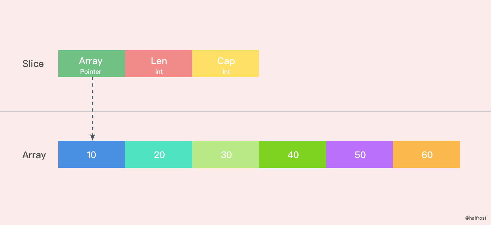
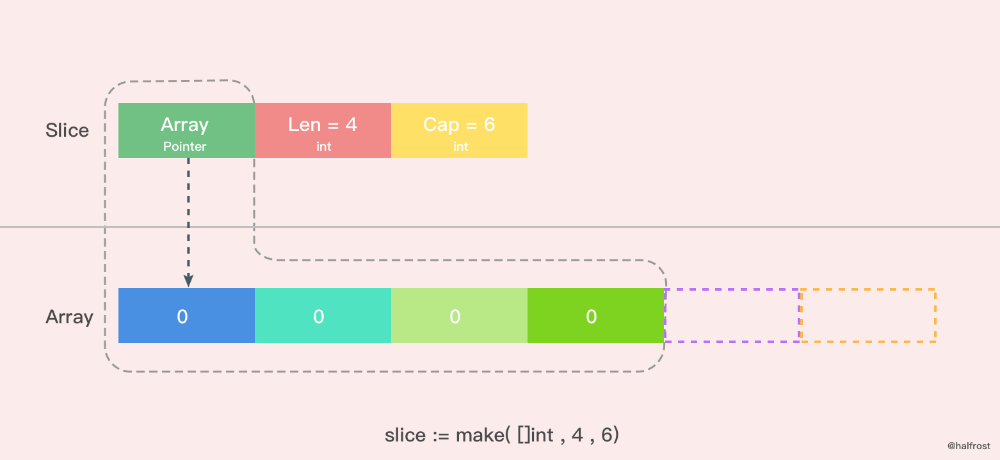
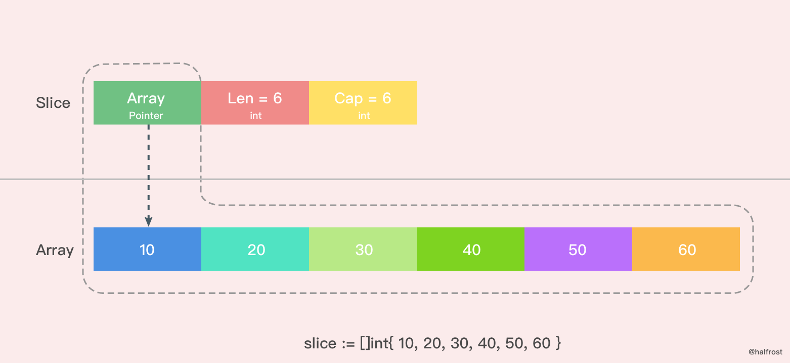
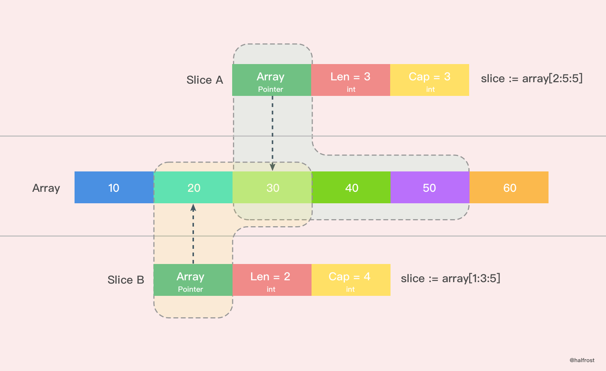

# slice的底层实现

切片是 Go 中的一种基本的数据结构，使用这种结构可以用来管理数据集合。切片的设计想法是由动态数组概念而来，为了开发者可以更加方便的使一个数据结构可以自动增加和减少。但是切片本身并不是动态数据或者数组指针。切片常见的操作有 reslice、append、copy。与此同时，切片还具有可索引，可迭代的优秀特性。

## 数组与切片

在Go中，与C数组变量隐式作为指针不同，Go数组是值类型，赋值和函数传参操作都会复制整个数组数据。

```go
func main() {
	arrayA := [2]int{100, 200}
	var arrayB [2]int

	arrayB = arrayA

	fmt.Printf("arrayA : %p , %v\n", &arrayA, arrayA)
	fmt.Printf("arrayB : %p , %v\n", &arrayB, arrayB)

	testArray(arrayA)
}

func testArray(x [2]int) {
	fmt.Printf("func Array : %p , %v\n", &x, x)
}

//输出结果
arrayA : 0xc4200bebf0 , [100 200]
arrayB : 0xc4200bec00 , [100 200]
func Array : 0xc4200bec30 , [100 200]
```
可以看到，三个内存地址都不同，这也就验证了Go中数组赋值和函数传参都是值复制的。假如每次传参都用数组，那么每次数组都要被复制一遍。这样会消耗掉大量的内存。于是乎有人想到，函数传参用数组的指针。

```go
func main() {
	arrayA := []int{100, 200}
	testArrayPoint(&arrayA)   // 1.传数组指针
	arrayB := arrayA[:]
	testArrayPoint(&arrayB)   // 2.传切片
	fmt.Printf("arrayA : %p , %v\n", &arrayA, arrayA)
}

func testArrayPoint(x *[]int) {
	fmt.Printf("func Array : %p , %v\n", x, *x)
	(*x)[1] += 100
}

//输出结果
func Array : 0xc4200b0140 , [100 200]
func Array : 0xc4200b0180 , [100 300]
arrayA : 0xc4200b0140 , [100 400]
```

这样更加高效的利用内存，性能也比之前的好。

传指针会有一个弊端，从打印结果可以看到，第一行和第三行指针地址都是同一个，原数组的指针指向更改了，那么函数里面的指针指向都会跟着更改。

用切片传数组参数，既可以达到节约内存的目的，也可以达到合理处理好共享内存的问题。打印结果第二行就是切片，切片的指针和原来数组的指针是不同的。

由此我们可以得出结论：

把第一个大数组传递给函数会消耗很多内存，采用切片的方式传参可以避免上述问题。切片是引用传递，所以它们不需要使用额外的内存并且通常来讲比使用数组更有效率。

## 切片的数据结构

切片本身并不是动态数组或者数组指针。它内部实现的数据结构通过指针引用底层数组，设定相关属性将数据读写操作限定在指定的区域内。切片本身是一个只读对象，其工作机制类似数组指针的一种封装。

切片(slice)是对数组一个连续片段的引用，所以切片是一个引用类型(因此更类似于C/C++ 中的数组类型，或者Python中的list类型)。这个片段可以是整个数组，或者是由起始和终止索引标识的一些项的子集。需要注意的是，终止索引标识的项不包括在切片内。切片提供了一个与指向数组的动态窗口。

给定项的切片索引可能比相关数组的相同元素的索引小。和数组不同的是，切片的长度可以在运行时修改，最小为0最大为相关数组的长度：切片是一个长度可变的数组。

切片的结构体由3部分构成，Pointer是指向一个数组的指针，len代表当前切片的长度，cap是当前切片的容量。cap总是大于等于len的，结构如下：

```go
type slice struct {
    array   unsafe.Pointer
    len     int
    cap     int
}
```


如果想从slice中获取一块内存地址，可以这样做：

```go
s := make([]byte, 200)
ptr := unsafe.Pointer(&s[0])
```
如果想从Go的内存地址中构造一个slice，在Go的反射中存在一个与之对应的数据结构SliceHeader，我们可以利用它构造一个slice

```go
var o []byte
sliceHeader := (*reflect.SliceHeader)((unsafe.Pointer(&o)))
sliceHeader.Cap = length
sliceHeader.Len = length
sliceHeader.Data = uintptr(ptr)
```
## 创建切片

make函数允许在运行期动态指定数组长度，绕开了数组类型必须使用编译期常量的限制。

```go
slice := make([]int, 4, 6)
```


上图是用make函数创建的一个len=4，cap=6的切片。内存空间申请了6个int类型的内存大小。由于len=4，所以后面2个暂时访问不到，但是容量还是在的。这时候数组里面每个变量都是0 。

```go
slice := []int{10, 20, 30, 40, 50, 60}
```


这里是用字面量创建的一个 len = 6，cap = 6 的切片，这时候数组里面每个元素的值都初始化完成了。

```go
sliceA := array[2:5:5]
sliceb := array[1:3:5]
```


还有一种简单的字面量创建切片的方法。如上图。上图就sliceA创建出了一个len=3，cap=3的切片。从原数组的第二位元素(0是第一位)开始切，一直切到第四位为止(不包括第五位)。同理，sliceB创建出了一个len=2，cap=4的切片。

nil切片被用在很多标准库和内置函数中，描述一个不存在的切片的时候，就需要用到nil切片。比如函数在发生异常的时候，返回的切片就是nil切片。nil切片的指针指向nil。

```go
var slice[] int
```
空切片一般会用来表示一个空的集合。比如数据库查询，一条结果也没有查到，那么就可以返回一个空切片。

```go
silce := make([]int, 0)
slice := []int{ }
```
空切片和nil切片的区别在于，空切片指向的地址不是nil，指向的是一个内存地址，但是它没有分配任何内存空间，即底层元素包含0个元素。

最后需要说明的一点是。不管是使用nil切片还是空切片，对其调用内置函数append，len和cap的效果都是一样的。

源码实现

```go
func makeslice(et *_type, len, cap int) slice {
	// 根据切片的数据类型，获取切片的最大容量
	maxElements := maxSliceCap(et.size)
    // 比较切片的长度，长度值域应该在[0,maxElements]之间
	if len < 0 || uintptr(len) > maxElements {
		panic(errorString("makeslice: len out of range"))
	}
    // 比较切片的容量，容量值域应该在[len,maxElements]之间
	if cap < len || uintptr(cap) > maxElements {
		panic(errorString("makeslice: cap out of range"))
	}
    // 根据切片的容量申请内存
	p := mallocgc(et.size*uintptr(cap), et, true)
    // 返回申请好内存的切片的首地址
	return slice{p, len, cap}
}
```
int64版本

```go
func makeslice64(et *_type, len64, cap64 int64) slice {
	len := int(len64)
	if int64(len) != len64 {
		panic(errorString("makeslice: len out of range"))
	}

	cap := int(cap64)
	if int64(cap) != cap64 {
		panic(errorString("makeslice: cap out of range"))
	}

	return makeslice(et, len, cap)
}
```
## 切片扩容策略

主要需要关注的有两点，一个是扩容时候的策略，还有一个就是扩容是生成全新的内存地址还是在原来的地址后追加。

Go 中切片扩容的策略是这样的：

- 首先判断，如果新申请容量(cap)大于2倍的旧容量(old.cap)，最终容量(newcap)就是新申请的容量(cap)

- 否则判断，如果旧切片的长度小于1024，则最终容量(newcap)就是旧容量(old.cap)的两倍，即(newcap=doublecap)

- 否则判断，如果旧切片长度大于等于1024，则最终容量(newcap)从旧容量(old.cap)开始循环增加原来的 1/4，即(newcap=old.cap,for {newcap += newcap/4})直到最终容量(newcap)大于等于新申请的容量(cap)，即(newcap >= cap)

- 如果最终容量(cap)计算值溢出，则最终容量(cap)就是新申请容量(cap)

注意：扩容扩大的容量都是针对原来的容量而言的，而不是针对原来数组的长度而言的。

```go
func growslice(et *_type, old slice, cap int) slice {
	if raceenabled {
		callerpc := getcallerpc(unsafe.Pointer(&et))
		racereadrangepc(old.array, uintptr(old.len*int(et.size)), callerpc, funcPC(growslice))
	}
	if msanenabled {
		msanread(old.array, uintptr(old.len*int(et.size)))
	}

	if et.size == 0 {
		// 如果新要扩容的容量比原来的容量还要小，这代表要缩容了，那么可以直接报panic了。
		if cap < old.cap {
			panic(errorString("growslice: cap out of range"))
		}

		// 如果当前切片的大小为0，还调用了扩容方法，那么就新生成一个新的容量的切片返回。
		return slice{unsafe.Pointer(&zerobase), old.len, cap}
	}

    // 这里就是扩容的策略
	newcap := old.cap
	doublecap := newcap + newcap
	if cap > doublecap {
		newcap = cap
	} else {
		if old.len < 1024 {
			newcap = doublecap
		} else {
			// Check 0 < newcap to detect overflow
			// and prevent an infinite loop.
			for 0 < newcap && newcap < cap {
				newcap += newcap / 4
			}
			// Set newcap to the requested cap when
			// the newcap calculation overflowed.
			if newcap <= 0 {
				newcap = cap
			}
		}
	}

	// 计算新的切片的容量，长度。
	var lenmem, newlenmem, capmem uintptr
	const ptrSize = unsafe.Sizeof((*byte)(nil))
	switch et.size {
	case 1:
		lenmem = uintptr(old.len)
		newlenmem = uintptr(cap)
		capmem = roundupsize(uintptr(newcap))
		newcap = int(capmem)
	case ptrSize:
		lenmem = uintptr(old.len) * ptrSize
		newlenmem = uintptr(cap) * ptrSize
		capmem = roundupsize(uintptr(newcap) * ptrSize)
		newcap = int(capmem / ptrSize)
	default:
		lenmem = uintptr(old.len) * et.size
		newlenmem = uintptr(cap) * et.size
		capmem = roundupsize(uintptr(newcap) * et.size)
		newcap = int(capmem / et.size)
	}

	// 判断非法的值，保证容量是在增加，并且容量不超过最大容量
	if cap < old.cap || uintptr(newcap) > maxSliceCap(et.size) {
		panic(errorString("growslice: cap out of range"))
	}

	var p unsafe.Pointer
	if et.kind&kindNoPointers != 0 {
		// 在老的切片后面继续扩充容量
		p = mallocgc(capmem, nil, false)
		// 将 lenmem 这个多个 bytes 从 old.array地址 拷贝到 p 的地址处
		memmove(p, old.array, lenmem)
		// 先将 P 地址加上新的容量得到新切片容量的地址，然后将新切片容量地址后面的 capmem-newlenmem 个 bytes 这块内存初始化。为之后继续 append() 操作腾出空间。
		memclrNoHeapPointers(add(p, newlenmem), capmem-newlenmem)
	} else {
		// 重新申请新的数组给新切片
		// 重新申请 capmen 这个大的内存地址，并且初始化为0值
		p = mallocgc(capmem, et, true)
		if !writeBarrier.enabled {
			// 如果还不能打开写锁，那么只能把 lenmem 大小的 bytes 字节从 old.array 拷贝到 p 的地址处
			memmove(p, old.array, lenmem)
		} else {
			// 循环拷贝老的切片的值
			for i := uintptr(0); i < lenmem; i += et.size {
				typedmemmove(et, add(p, i), add(old.array, i))
			}
		}
	}
	// 返回最终新切片，容量更新为最新扩容之后的容量
	return slice{p, old.len, newcap}
}
```
切片扩容之后的引用的数组不一定是新的。

如果扩容以后并没有新建一个新的数组，扩容前后的数组都是同一个，这也就导致了新的切片修改了一个值，也影响到了老的切片了。并且append()操作也改变了原来数组里面的值。一个append()操作影响了这么多地方，如果原数组上有多个切片，那么这些切片都会被影响。

因此应尽量避免多个slice共享同一底层数组

## 切片的拷贝

```go
func slicecopy(to, fm slice, width uintptr) int {
	// 如果源切片或者目标切片有一个长度为0，那么就不需要拷贝，直接 return 
	if fm.len == 0 || to.len == 0 {
		return 0
	}
	// n 记录下源切片或者目标切片较短的那一个的长度
	n := fm.len
	if to.len < n {
		n = to.len
	}
	// 如果入参 width = 0，也不需要拷贝了，返回较短的切片的长度
	if width == 0 {
		return n
	}
	// 如果开启了竞争检测
	if raceenabled {
		callerpc := getcallerpc(unsafe.Pointer(&to))
		pc := funcPC(slicecopy)
		racewriterangepc(to.array, uintptr(n*int(width)), callerpc, pc)
		racereadrangepc(fm.array, uintptr(n*int(width)), callerpc, pc)
	}
	// 如果开启了 The memory sanitizer (msan)
	if msanenabled {
		msanwrite(to.array, uintptr(n*int(width)))
		msanread(fm.array, uintptr(n*int(width)))
	}

	size := uintptr(n) * width
	if size == 1 { 
		// TODO: is this still worth it with new memmove impl?
		// 如果只有一个元素，那么指针直接转换即可
		*(*byte)(to.array) = *(*byte)(fm.array) // known to be a byte pointer
	} else {
		// 如果不止一个元素，那么就把 size 个 bytes 从 fm.array 地址开始，拷贝到 to.array 地址之后
		memmove(to.array, fm.array, size)
	}
	return n
}
```

在这个方法中，slicecopy方法会把源切片值(即 fm Slice )中的元素复制到目标切片(即 to Slice )中，并返回被复制的元素个数，copy的两个类型必须一致。slicecopy方法最终的复制结果取决于较短的那个切片，当较短的切片复制完成，整个复制过程就全部完成了。

使用例子

```go
func main() {
	array := []int{10, 20, 30, 40}
	slice := make([]int, 6)
	n := copy(slice, array)
	fmt.Println(n,slice)
}

```
```go
func slicestringcopy(to []byte, fm string) int {
	// 如果源切片或者目标切片有一个长度为0，那么就不需要拷贝，直接 return 
	if len(fm) == 0 || len(to) == 0 {
		return 0
	}
	// n 记录下源切片或者目标切片较短的那一个的长度
	n := len(fm)
	if len(to) < n {
		n = len(to)
	}
	// 如果开启了竞争检测
	if raceenabled {
		callerpc := getcallerpc(unsafe.Pointer(&to))
		pc := funcPC(slicestringcopy)
		racewriterangepc(unsafe.Pointer(&to[0]), uintptr(n), callerpc, pc)
	}
	// 如果开启了 The memory sanitizer (msan)
	if msanenabled {
		msanwrite(unsafe.Pointer(&to[0]), uintptr(n))
	}
	// 拷贝字符串至字节数组
	memmove(unsafe.Pointer(&to[0]), stringStructOf(&fm).str, uintptr(n))
	return n
}
```
使用例子

```go
func main() {
    slice := make([]byte, 3)
	n := copy(slice, "abcdef")
	fmt.Println(n,slice)
}
```
输出

```go
3 [97,98,99]
```

```go
func main() {
	slice := []int{10, 20, 30, 40}
	for index, value := range slice {
		fmt.Printf("value = %d , value-addr = %x , slice-addr = %x\n", value, &value, &slice[index])
	}
}
```
输出

```go
value = 10 , value-addr = c4200aedf8 , slice-addr = c4200b0320
value = 20 , value-addr = c4200aedf8 , slice-addr = c4200b0328
value = 30 , value-addr = c4200aedf8 , slice-addr = c4200b0330
value = 40 , value-addr = c4200aedf8 , slice-addr = c4200b0338
```
从上面结果我们可以看到，如果用 range 的方式去遍历一个切片，拿到的 Value 其实是切片里面的值拷贝。所以每次打印 Value 的地址都不变。


由于 Value 是值拷贝的，并非引用传递，所以直接改 Value 是达不到更改原切片值的目的的，需要通过 &slice[index] 获取真实的地址。