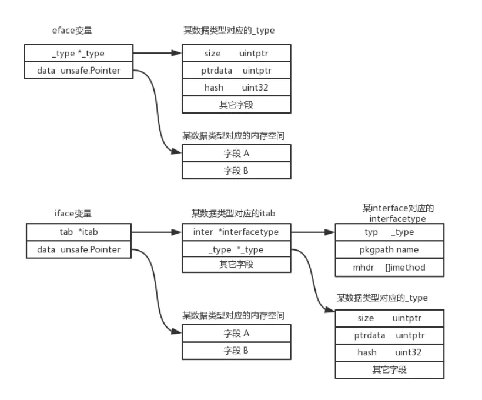
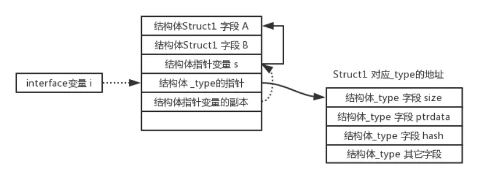
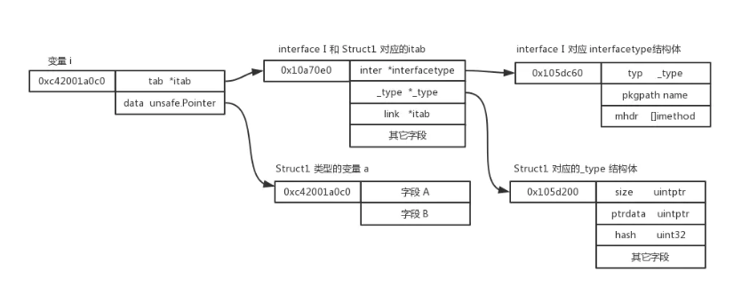
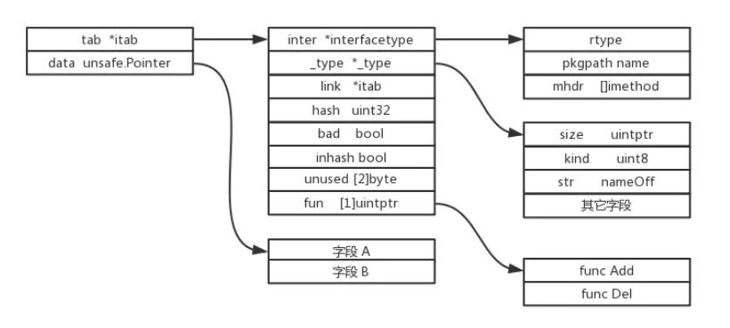
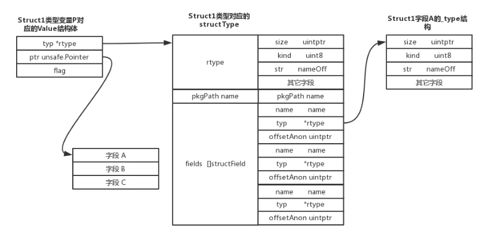
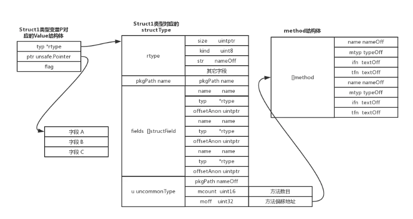

# interface的实现

接口是高级语言中的一个归约，是一组方法签名的集合。Go的interface是非侵入式的，具体类型实现interface不需要在语法上显示声明，只需要具体类型的方法集合是interface方法集合的超集，就表示了该类实现了这一interface。

编译器在编译时会进行interface校验。interface和具体类型不同，它不能实现具体逻辑，也不能定义字段。

Go语言中的所有变量都可以赋值给空interface变量，实现了interface中定义方法的变量可以赋值给带方法的interface变量，并且可以通过interface直接调用对应的方法，实现了其它面向对象语言的多态的概念。

## 内部定义

存在两种interface，一种是带有方法的interface，另一种是不带方法的空interface。

两种不同的interface在Go语言内部被定义成如下的两种结构体(源码基于Go的1.9.2版本)

```go
// 没有方法的interface
type eface struct {
    _type *_type
    data  unsafe.Pointer
}

// 记录着Go语言中某个数据类型的基本特征
type _type struct {
    size       uintptr
    ptrdata    uintptr
    hash       uint32
    tflag      tflag
    align      uint8
    fieldalign uint8
    kind       uint8
    alg        *typeAlg
    gcdata    *byte
    str       nameOff
    ptrToThis typeOff
}

// 有方法的interface
type iface struct {
    tab  *itab
    data unsafe.Pointer
}

type itab struct {
    inter  *interfacetype
    _type  *_type
    link   *itab
    hash   uint32
    bad    bool
    inhash bool
    unused [2]byte
    fun    [1]uintptr
}

// interface数据类型对应的type
type interfacetype struct {
    typ     _type
    pkgpath name
    mhdr    []imethod
}
```

可以看到两种类型的interface在内部实现时都是定义成了一个2个字段的结构体，所以任何一个interface变量都是占用16个byte的内存空间。

在Go语言中_type这个结构体非常重要，记录着某种数据类型的一些基本特征，比如这个数据类型占用的内存大小(size字段)，数据类型的名称(nameOff字段)等等。每种数据类型都存在一个与之对应的_type结构体(Go语言原生的各种数据类型，用户自定义的结构体，用户自定义的interface等等)。

如果是一些比较特殊的数据类型，可能还会对_type结构体进行扩展，记录更多的信息，比如interface类型，就会存在一个interfacetype结构体，除了通用的_type外，还包含了另外两个字段pkgpath和mhdr。

除此之外还有其它类型的数据结构对应的结构体，比如structtype，chantype，slicetype，有兴趣的可以在$GOROOT/src/runtime/type.go文件中查看。



## 赋值

存在对没有方法的interface变量和有方法的interface变量赋值这两种不同的情况。分别详解这两种不同的赋值过程。

1. 没有方法的interface变量赋值

 
对没有方法的interface变量赋值时编译器做了什么工作？创建一个eface.go文件，代码如下：

```go
package main

type Struct1 struct {
    A int64
    B int64
}

func main() {
    s := new(Struct1)
    var i interface{}
    i = a
    _ = i
}
```
赋值完以后的内存分配如下图：



2. 有方法的interface变量赋值
 

如下一段代码在内存的分布

```go
package main

type I interface {
    Add()
    Del()
}

type Struct1 struct {
    A int64
    B int64
}

func (a *Struct1) Add() {
    a.A = a.A + 1
    a.B = a.B + 1
}

func (a *Struct1) Del() {
    a.A = a.A - 1
    a.B = a.B - 1
}

func main() {
    a := new(Struct1)
    var i I
    i = a

    i.Add()
    i.Del()
}
```


上面的例子都是将一个指针赋值给interface变量，如果是将一个值赋值给interface变量。会先对分配一块空间保存该值的副本，然后将该interface变量的data字段指向这个新分配的空间。将一个值赋值给interface变量时，操作的都是该值的一个副本。

## 方法调用

通过对itab结构体进行分析，可以找到根据偏移量找到fun的地址，从而确定add函数和del函数的入口地址。



## 断言实现

在Go语言中，经常需要对一个interface变量进行断言。在进行断言的时候，原理就是将interface变量_type字段的与具体类型对应的_type结构地址进行对比。

## 反射实现

反射是一种强大的语言特性，可以“动态”的调用方法，获取结构体运行时的一些特征，很多框架的实现都离不开反射。Go的反射就是通过interface类型来实现的。

### 通过反射获取变量信息

反射包中存在两个重要的结构体

```go
type Value struct {
    typ *rtype
    ptr unsafe.Pointer
    flag
}

func ValueOf(i interface{}) Value {
}

type Type interface {
    Align() int
    FieldAlign() int
    Method(int) Method
    Name() string
    //一堆方法
    //....
}

func TypeOf(i interface{}) Type {
    eface := *(*emptyInterface)(unsafe.Pointer(&i))
    return toType(eface.typ)
}

type emptyInterface struct {
    typ  *rtype
    word unsafe.Pointer
}
```
任何一个变量可以通过调用ValueOf来获取到变量的Value结构体，通过TypeOf方法来获取变量的Type接口类型。通过TypeOf方法获取到的Type接口实际上就是该变量对应的_type。

通过前面的分析，当通过TypeOf方法获取到变量的_type结构体后，很容易获取到该变量的一些基本信息，比如_type结构体中的各种字段都可以直接获取到。

### 通过反射修改变量的值

```go
package main

import (
    "reflect"
)

func main() {
    var x int64 = 10

    reflect.ValueOf(x).SetInt(20)
    
    reflect.ValueOf(&x).SetInt(20)
 
    reflect.ValueOf(&x).Elem().SetInt(20)
}
```

上面的例子中，第10行，12行都会报panic，只有第14行能修改变量的值。在使用ValueOf获取到Value结构体以后，flag字段记录着值能否进行修改，这样应该是为了避免误操作，保证api调用者明确了解到是否需要修改值。

### 通过反射修改结构体变量的值

```go
package main

import (
    "reflect"
    "fmt"
)

type Struct1 struct {
    A int64
    B int64
    C int64
}

func main() {
    P := new(Struct1)

    V := reflect.ValueOf(P).Elem()
    V.FieldByName("A").SetInt(100)
    V.FieldByName("B").SetInt(200)
    V.FieldByName("C").SetInt(300)

    fmt.Printf("%v", P)
}
```


每一个自定义的struct类型都存在这一个对应的structType结构体，该结构体记录了每个字段structField。通过对比structField里面的name字段，就可以获取到某个字段的type和偏移量。从而对具体的值进行修改。

### 通过反射动态调用方法

```go
package main

import (
    "reflect"
)

type Struct1 struct {
    A int64
    B int64
    C int64
}

func (p *Struct1) Set() {
    p.A = 200
}

func main() {
    P := new(Struct1)
    P.A = 100
    P.B = 200
    P.C = 300

    V := reflect.ValueOf(P)

    params := make([]reflect.Value, 0)
    V.MethodByName("Set").Call(params)
}
```


在编译过程中，结构体对应方法的相关信息都已经存在于内存中，分配了一块uncommonType的结构体跟在fields字段后面。根据内存的分布，如果需要根据一个结构体的名称获取到方法并且执行，只需要根据uncommonType结构中的moff字段去获取方法相关信息的地址块，然后逐个对比名称是否为想要获取的方法进行调用

