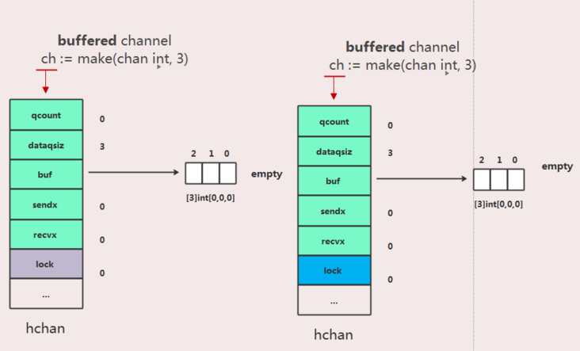
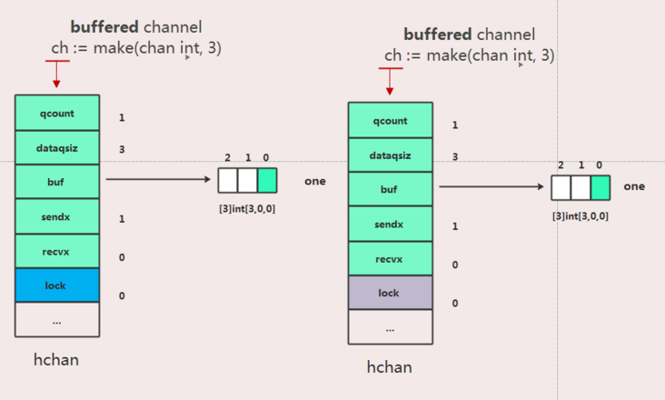
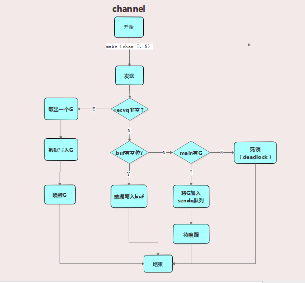
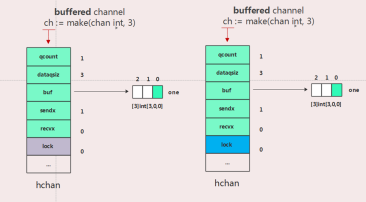
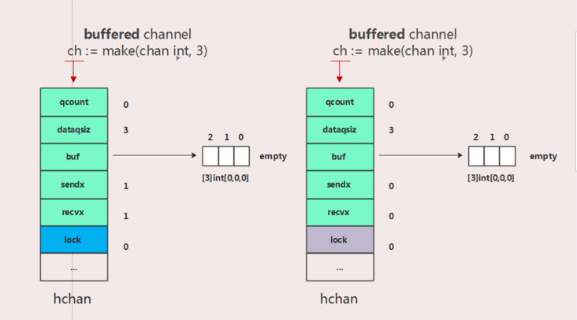
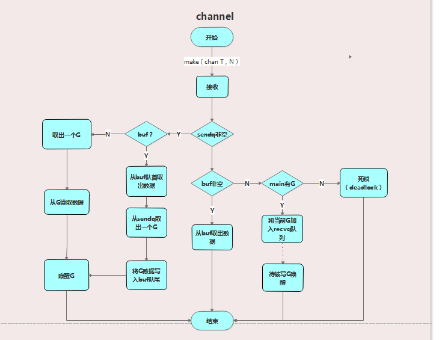
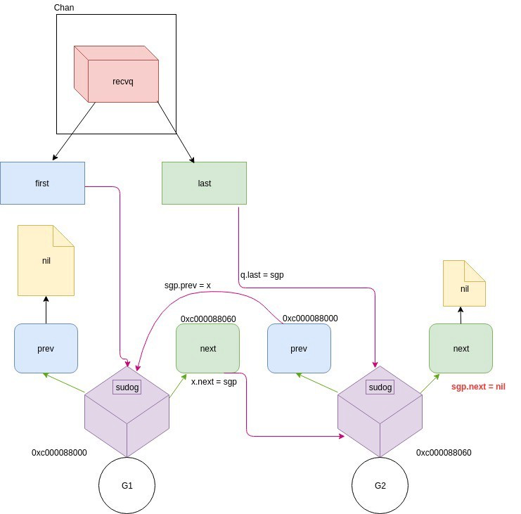

# channel的底层实现原理

在Go中channel是一种基本类型，通过它可以在goroutine之间发信息，它是Go语言层面提供的goroutine之间的通信方式。

## 实现原理

### 数据结构

channel的底层使用hchan结构实现(src/runtime/chan.go)：

```go
type hchan struct {
   qcount   uint           
   dataqsiz uint           
   buf      unsafe.Pointer 
   elemsize uint16
   closed   uint32
   elemtype *_type 
   sendx    uint   
   recvx    uint   
   recvq    waitq  
   sendq    waitq  
   lock     mutex
}

```
相关字段值作用如下：

- qcount： 当前队列中剩余元素个数

- dataqsiz： 环形队列长度，即缓冲区的大小，即make(chan T，N)中的N

- buf： 环形队列指针

- elemsize： 每个元素的大小

- closed： 表示当前通道是否处于关闭状态。创建通道后，该字段设置为0，即通道打开; 通过调用close将其设置为1，通道关闭。

- elemtype： 元素类型，用于数据传递过程中的赋值；

- sendx和recvx：是环形缓冲区的状态字段，它指示缓冲区的当前索引 - 支持数组，它可以从中发送数据和接收数据。

- recvq：等待读消息的goroutine队列

- sendq：等待写消息的goroutine队列

- lock mutex：互斥锁，为每个读写操作锁定通道，因为发送和接收必须是互斥操作。

创建channel有两种，一种是带缓冲的channel，一种是不带缓冲的channel

```go
// 带缓冲
ch := make(chan Task, 3)
// 不带缓冲
ch := make(chan int)
```

如果我们创建一个带buffer的channel，底层的数据模型如下图：


### 向channel写入数据

```go
ch <- 3
```

底层hchan数据流程如图





发送操作概要

1. 锁定整个通道结构。

2. 确定写入。尝试recvq从等待队列中等待goroutine，然后将元素直接写入goroutine。

3. 如果recvq为Empty，则确定缓冲区是否可用。如果可用，从当前goroutine复制数据到缓冲区。

4. 如果缓冲区已满，则要写入的元素将保存在当前正在执行的goroutine的结构中，并且当前goroutine将在sendq中排队并从运行时挂起。

5. 写入完成释放锁。

这里我们要注意几个属性buf、sendx、lock的变化。

流程图



### 从channel读取数据

```go
val := <-a
```

底层hchan数据流程如图





读取操作概要

1. 先获取channel全局锁

2. 尝试sendq从等待队列中获取等待的goroutine，

3. 如有等待的goroutine，没有缓冲区，取出goroutine并读取数据，然后唤醒这个goroutine，结束读取释放锁。

4. 如有等待的goroutine，且有缓冲区（此时缓冲区已满），从缓冲区队首取出数据，再从sendq取出一个goroutine，将goroutine中的数据存入buf队尾，结束读取释放锁。

5. 如没有等待的goroutine，且缓冲区有数据，直接读取缓冲区数据，结束读取释放锁。

6. 如没有等待的goroutine，且没有缓冲区或缓冲区为空，将当前的goroutine加入recvq排队，进入睡眠，等待被写goroutine唤醒。结束读取释放锁。

这里我们要注意几个属性buf、sendx、recvx、lock的变化。

流程图



recvq和sendq结构

recvq和sendq基本上是链表，看起来基本如下

