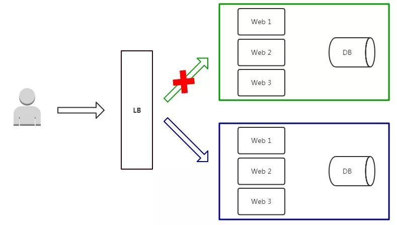
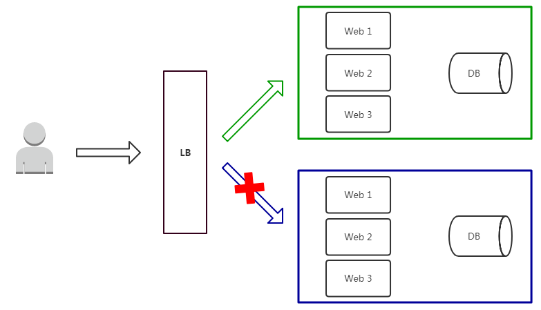
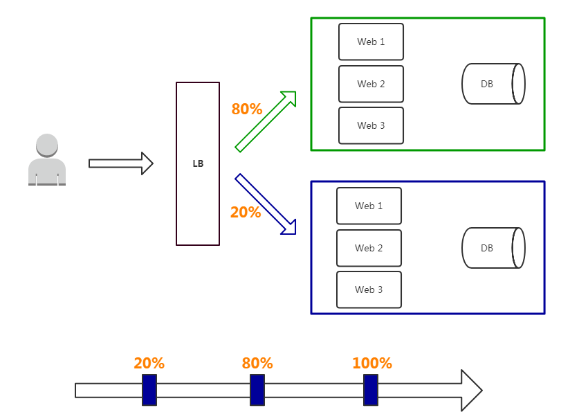
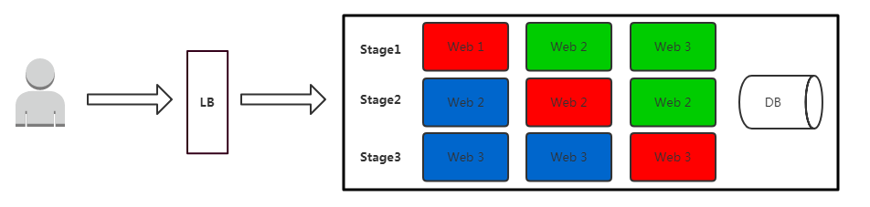

# 微服务的几种发布方式

在对于应用程序升级面临最大挑战是新旧业务切换的同时还要保证系统不间断提供服务。特别是微服务盛行的今天，对服务发布的粒度、发布策略控制更佳尤为重要。

最近几年，市面上流行了很多与颜色相关的部署、发布方法，常见的比如有：蓝绿部署、红黑部署、灰度发布（金丝雀发布）、滚动发布等。

## 从部署到发布的几个阶段

部署、发布、上线这几个名词，其实区分不太明显，我们平时在讨论服务部署上线时，也经常会混用。在这里，先给大家明确区分一下这几个阶段。

- 部署(deploy)，指的是我们把一个代码包拷贝到服务器上运行，但并不把它暴露给用户，也就是并不给用户提供服务。这个阶段比较耗时，但因为还没有面向用户，所以风险很小。

- 发布(release)，是把部署好的服务暴露给用户的过程，也就是开始真正上线服务用户了。这个过程可以通过负载均衡的切换很快实现，但风险很大，一旦出现问题损失就会比较大。

- 发布后(post-release)，指的是服务完全上线以后的阶段。因为产品已经完全上线，我们的主要工作不再是预防，而是变成了监控和降低损失。

## 蓝绿部署

蓝绿部署，是采用两个分开的集群对软件版本进行升级的一种方式。它的部署模型中包括一个蓝色集群 A 和一个绿色集群 B，在没有新版本上线的情况下，两个集群上运行的版本是一致的，同时对外提供服务。

系统升级时，蓝绿部署的流程是：

首先，从负载均衡器列表中删除集群 A，让集群 B 单独提供服务。

然后，在集群 A 上部署新版本。

接下来，集群 A 升级完毕后，把负载均衡列表全部指向 A，并删除集群 B，由 A 单独提供服务。

在集群 B 上部署完新版本后，再把它添加回负载均衡列表中。

这样，我们就完成了两个集群上所有机器的版本升级。

细心的读者，从上述的部署流程中，也能发现，蓝绿部署它的优点在于发布策略简单、对于用户来说无感知，可以实现升级平滑过渡。

但它的缺点也很明显：需要准备正常业务使用资源的两倍以上服务器，需要投入较大的资源成本。当然对于不差钱、追求服务稳定性的公司而言，较为推荐这种部署模式。

## 红黑部署

红黑部署是Netflix采用的部署手段，Netflix的主要基础设施是在AWS上，它与蓝绿部署类似，红黑部署也是通过两个集群完成软件版本的升级。

当前提供服务的所有机器都运行在红色集群 A 中，当需要发布新版本的时候，具体流程是这样的：

先在云上申请一个黑色集群 B，在 B 上部署新版本的服务；

等到 B 升级完成后，我们一次性地把负载均衡全部指向 B；

把 A 集群从负载均衡列表中删除，并释放集群 A 中所有机器。
这样就完成了一个版本的升级。

可以看到，与蓝绿部署相比，红黑部署只不过是充分利用了云计算的弹性伸缩优势，从而获得了两个收益：一是，简化了流程；二是，避免了在升级的过程中，由于只有一半的服务器提供服务，而可能导致的系统过载问题。

## 灰度发布

灰度发布，也被叫作金丝雀发布。与蓝绿部署、红黑部署不同的是，灰度发布属于增量发布方法。也就是说，服务升级的过程中，新旧版本会同时为用户提供服务。

灰度发布的具体流程是这样的：在集群的一小部分机器上部署新版本，给一部分用户使用，以测试新版本的功能和性能；确认没有问题之后，再对整个集群进行升级。简单地说，灰度发布就是把部署好的服务分批次、逐步暴露给越来越多的用户，直到最终完全上线。

之所以叫作灰度发布，是因为它介于黑与白之间，并不是版本之间的直接切换，而是一个平滑过渡的过程。

AB Test就是一种灰度发布方式，让一部分用户继续用A，一部分用户开始用B，如果用户对B没有什么反对意见，那么逐步扩大范围，把所有用户都迁移到B上面来。

灰度发布可以保证整体系统的稳定，在初始灰度的时候就可以发现、调整问题，以保证其影响度，而我们平常所说的金丝雀部署也就是灰度发布的一种方式。

之所以又被叫作金丝雀发布，是因为金丝雀对瓦斯极其敏感，17 世纪时英国矿井工人会携带金丝雀下井，以便及时发现危险。这就与灰色发布过程中，先发布给一部分用户来测试相似，因而得名。

对于灰度发布来说，它的优点在于如果前期出问题影响范围很小，相对用户体验也少；可以做到及时发现、及时调整问题，影响范围可控。但是采取这种模式对自动化以及运维监控能力的要求非常高。

## 滚动发布

滚动发布是指每次只升级一个或多个服务，升级完成后加入生产环境，不断执行这个过程，直到集群中的全部旧版本升级新版本。 

- 红色：正在更新的实例

- 蓝色：更新完成并加入集群的实例

- 绿色：正在运行的实例

这种部署方式相对于蓝绿部署，更加节约资源——它不需要运行两个集群、两倍的实例数。我们可以部分部署，例如每次只取出集群的20%进行升级，比较节约资源，但同时缺点也很明显：采用滚动发布方式部署时，没有一个确定OK的环境。如果使用蓝绿部署，我们能够清晰地知道老版本是OK的，而使用滚动发布，我们无法确定。并且一旦发布过程出现问题，需要回滚，回滚过程非常困难。

在实际工作当中，升级过程中需要保持服务的连续性、稳定，对外界无感知是几个基本的要求。在生产上选择哪种部署方法最合适？这取决于哪种方法最适合你的业务和技术需求。

如果你们运维自动化能力储备不够，肯定是越简单越好，建议蓝绿发布，如果业务对用户依赖很强，建议灰度发布。如果是K8S平台，滚动更新是现成的方案，建议先直接使用。

