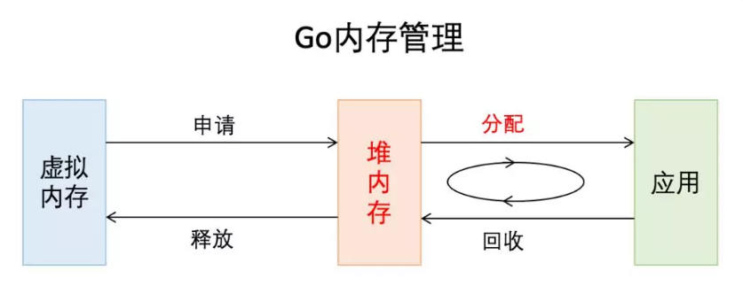
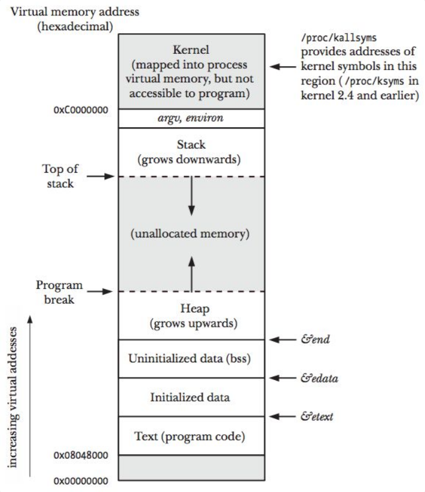
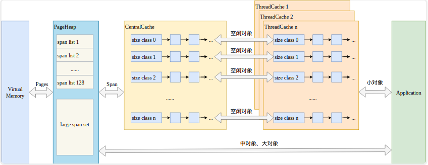
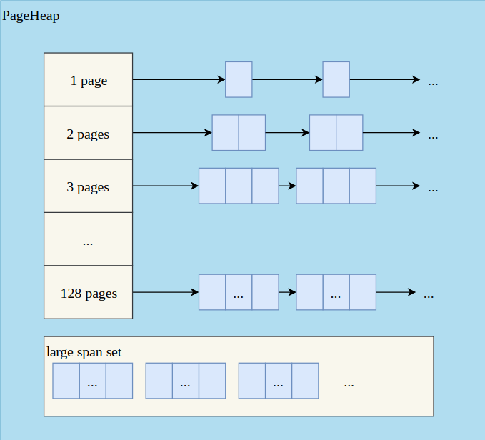
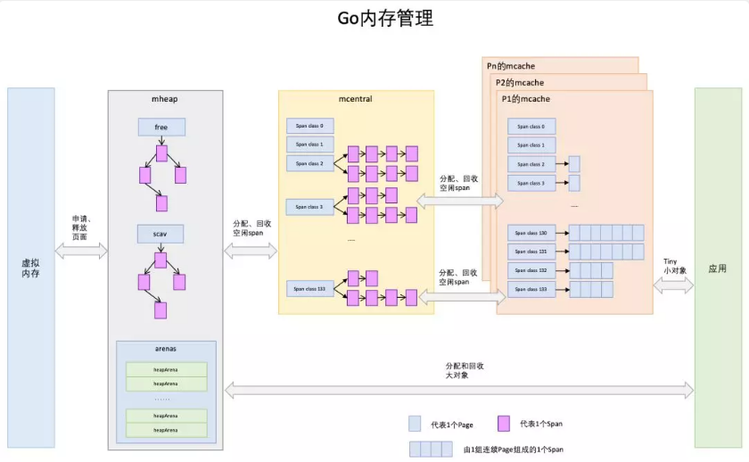
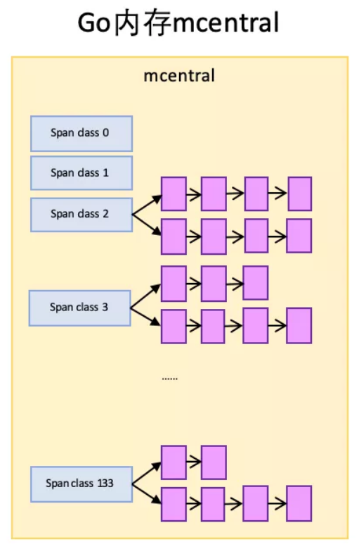
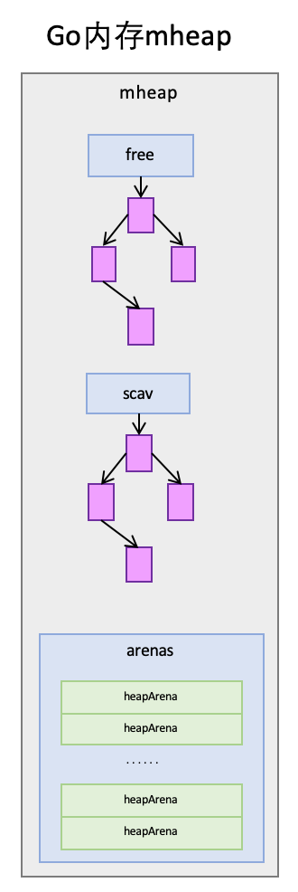

# Golang内存分配管理机制

Golang抛弃了C/C++由开发者管理内存的方式，增加了逃逸分析和GC，将开发者从内存管理中释放出来，让开发者有更多的精力去关注软件设计，而不是底层的内存问题。

从非常宏观的角度讲，Go的内存管理就是下图这个样子，主要关注其中标红的部分。



## 计算机存储架构


计算机的存储体系，从上至下依次是：

- CPU寄存器

- Cache

- 内存

- 硬盘等辅助存储设备

- 鼠标等外接设备

从上至下，访问速度越来越慢，访问时间越来越长。

CPU速度很快，但硬盘等持久存储很慢，如果CPU直接访问磁盘，磁盘可以拉低CPU的速度，机器整体性能就会低下，为了弥补这2个硬件之间的速率差异，所以在CPU和磁盘之间增加了比磁盘快很多的内存。

然而，CPU跟内存的速率也不是相同的，为了弥补这2个硬件之间的速率差异，所以在CPU跟内存之间增加了比内存更快的Cache，Cache是内存数据的缓存，可以降低CPU访问内存的时间。

三级Cache分别是L1、L2、L3，它们的速率是三个不同的层级，L1速率最快，与CPU速率最接近，是RAM速率的100倍，L2速率就降到了RAM的25倍，L3的速率更靠近RAM的速率。

## 虚拟内存

虚拟内存是当代操作系统必备的一项重要功能了，它向进程屏蔽了底层了RAM和磁盘，并向进程提供了远超物理内存大小的内存空间。


某进程访问数据，当Cache没有命中的时候，访问虚拟内存获取数据的过程。

访问内存，实际访问的是虚拟内存，虚拟内存通过页表查看，当前要访问的虚拟内存地址，是否已经加载到了物理内存，如果已经在物理内存，则取物理内存数据，如果没有对应的物理内存，则从磁盘加载数据到物理内存，并把物理内存地址和虚拟内存地址更新到页表。

在没有虚拟内存的时代，物理内存对所有进程是共享的，多进程同时访问同一个物理内存存在并发访问问题。引入虚拟内存后，每个进程都要各自的虚拟内存，内存的并发访问问题的粒度从多进程级别，可以降低到多线程级别

## 栈和堆

虚拟内存中的栈和堆，就是进程对内存的管理。



上图展示了一个进程的虚拟内存划分，代码中使用的内存地址都是虚拟内存地址，而不是实际的物理内存地址。栈和堆只是虚拟内存上2块不同功能的内存区域：

- 栈在高地址，从高地址向低地址增长。

- 堆在低地址，从低地址向高地址增长。

栈相对堆的优点：

- 栈的内存管理简单，分配比堆上快。

- 栈的内存不需要回收，而堆需要，无论是主动free，还是被动的垃圾回收，这都需要花费额外的CPU。

- 栈上的内存有更好的局部性，堆上内存访问就不那么友好了，CPU访问的2块数据可能在不同的页上，CPU访问数据的时间可能增长。

## TCMalloc

TCMalloc是Thread Cache Malloc的简称，Golang的内存管理借鉴了TCMalloc，其主要思想、原理和概念都是和TCMalloc一致的。

在Linux里，其实有不少的内存管理库，比如glibc的ptmalloc，FreeBSD的jemalloc，Google的tcmalloc等等，在多线程编程下，追求更高内存管理效率：更快的分配是其主要目的。

同一进程的所有线程共享相同的内存空间，他们申请内存时需要加锁。
TCMalloc的做法是为每个线程预分配一块缓存，线程申请小内存时，可以从缓存分配内存，这样有2个好处：

- 为线程预分配缓存需要进行1次系统调用，后续线程申请小内存时，从缓存分配，都是在用户态执行，没有系统调用，缩短了内存总体的分配和释放时间，这是快速分配内存的第二个层次。

- 多个线程同时申请小内存时，从各自的缓存分配，访问的是不同的地址空间，无需加锁，把内存并发访问的粒度进一步降低了，这是快速分配内存的第三个层次。



1. Page：操作系统对内存管理以页为单位，TCMalloc也是这样，只不过TCMalloc里的Page大小与操作系统里的大小并不一定相等，而是倍数关系。《TCMalloc解密》里称x64下Page大小是8KB。

2. Span：一组连续的Page被称为Span，比如可以有2个页大小的Span，也可以有16页大小的Span，Span比Page高一个层级，是为了方便管理一定大小的内存区域，Span是TCMalloc中内存管理的基本单位。

3. ThreadCache：每个线程各自的Cache，一个Cache包含多个空闲内存块链表，每个链表连接的都是内存块，同一个链表上内存块的大小是相同的，也可以说按内存块大小，给内存块分了个类，这样可以根据申请的内存大小，快速从合适的链表选择空闲内存块。由于每个线程有自己的ThreadCache，所以ThreadCache访问是无锁的。

4. CentralCache：是所有线程共享的缓存，也是保存的空闲内存块链表，链表的数量与ThreadCache中链表数量相同，当ThreadCache内存块不足时，可以从CentralCache取，当ThreadCache内存块多时，可以放回CentralCache。由于CentralCache是共享的，所以它的访问是要加锁的。

5. PageHeap：PageHeap是堆内存的抽象，PageHeap存的也是若干链表，链表保存的是Span，当CentralCache没有内存的时，会从PageHeap取，把1个Span拆成若干内存块，添加到对应大小的链表中，当CentralCache内存多的时候，会放回PageHeap。如下图，分别是1页Page的Span链表，2页Page的Span链表等，最后是large span set，这个是用来保存中大对象的。毫无疑问，PageHeap也是要加锁的。



上文提到了小、中、大对象，Go内存管理中也有类似的概念，我们瞄一眼TCMalloc的定义：

- 小对象大小：0~256KB

- 中对象大小：257~1MB

- 大对象大小：>1MB

小对象的分配流程：ThreadCache -> CentralCache -> HeapPage，大部分时候，ThreadCache缓存都是足够的，不需要去访问CentralCache和HeapPage，无锁分配加无系统调用，分配效率是非常高的。

中对象分配流程：直接在PageHeap中选择适当的大小即可，128 Page的Span所保存的最大内存就是1MB。

大对象分配流程：从large span set选择合适数量的页面组成span，用来存储数据。

## Golang内存管理



1. Page:与TCMalloc中的Page相同，x64下1个Page的大小是8KB。上图的最下方，1个浅蓝色的长方形代表1个Page。

2. Span:与TCMalloc中的Span相同，Span是内存管理的基本单位，代码中为mspan，一组连续的Page组成1个Span，所以上图一组连续的浅蓝色长方形代表的是一组Page组成的1个Span，另外，1个淡紫色长方形为1个Span。

3. mcache:mcache与TCMalloc中的ThreadCache类似，mcache保存的是各种大小的Span，并按Span class分类，小对象直接从mcache分配内存，它起到了缓存的作用，并且可以无锁访问。

但mcache与ThreadCache也有不同点，TCMalloc中是每个线程1个ThreadCache，Go中是每个P拥有1个mcache，因为在Go程序中，当前最多有GOMAXPROCS个线程在运行，所以最多需要GOMAXPROCS个mcache就可以保证各线程对mcache的无锁访问，线程的运行又是与P绑定的，把mcache交给P刚刚好。

4. mcentral:mcentral与TCMalloc中的CentralCache类似，是所有线程共享的缓存，需要加锁访问，它按Span class对Span分类，串联成链表，当mcache的某个级别Span的内存被分配光时，它会向mcentral申请1个当前级别的Span。

但mcentral与CentralCache也有不同点，CentralCache是每个级别的Span有1个链表，mcache是每个级别的Span有2个链表，这和mcache申请内存有关，稍后我们再解释。

5. mheap:mheap与TCMalloc中的PageHeap类似，它是堆内存的抽象，把从OS申请出的内存页组织成Span，并保存起来。当mcentral的Span不够用时会向mheap申请，mheap的Span不够用时会向OS申请，向OS的内存申请是按页来的，然后把申请来的内存页生成Span组织起来，同样也是需要加锁访问的。

但mheap与PageHeap也有不同点：mheap把Span组织成了树结构，而不是链表，并且还是2棵树，然后把Span分配到heapArena进行管理，它包含地址映射和span是否包含指针等位图，这样做的主要原因是为了更高效的利用内存：分配、回收和再利用。

Go中的内存分类并不像TCMalloc那样分成小、中、大对象，但是它的小对象里又细分了一个Tiny对象，Tiny对象指大小在1Byte到16Byte之间并且不包含指针的对象。小对象和大对象只用大小划定，无其他区分。


小对象是在mcache中分配的，而大对象是直接从mheap分配的，从小对象的内存分配看起。

## 大小转换


1. object size：代码里简称size，指申请内存的对象大小。

2. size class：代码里简称class，它是size的级别，相当于把size归类到一定大小的区间段，比如size[1,8]属于size class 1，size(8,16]属于size class 2。

3. span class：指span的级别，但span class的大小与span的大小并没有正比关系。span class主要用来和size class做对应，1个size class对应2个span class，2个span class的span大小相同，只是功能不同，1个用来存放包含指针的对象，一个用来存放不包含指针的对象，不包含指针对象的Span就无需GC扫描了。

4. num of page：代码里简称npage，代表Page的数量，其实就是Span包含的页数，用来分配内存。

## 对象分配内存的流程

1. 计算对象所需内存大小size

2. 根据size到size class映射，计算出所需的size class

3. 根据size class和对象是否包含指针计算出span class

4. 获取该span class指向的span。

以分配一个不包含指针的，大小为24Byte的对象为例。

根据映射表：

```
 class  bytes/obj  bytes/span  objects  tail waste  max waste
   1          8        8192     1024           0     87.50%
   2         16        8192      512           0     43.75%
   3         32        8192      256           0     46.88%
   4         48        8192      170          32     31.52%
```

size class 3，它的对象大小范围是(16,32]Byte，24Byte刚好在此区间，所以此对象的size class为3。

Size class到span class的计算如下：

```go
// noscan为true代表对象不包含指针
func makeSpanClass(sizeclass uint8, noscan bool) spanClass {
    return spanClass(sizeclass<<1) | spanClass(bool2int(noscan))
}
```

所以，对应的span class为：

```
span class = 3 << 1 | 1 = 7
```

所以该对象需要的是span class 7指向的span。

从span分配对象空间：

Span可以按对象大小切成很多份，这些都可以从映射表上计算出来，以size class 3对应的span为例，span大小是8KB，每个对象实际所占空间为32Byte，这个span就被分成了256块，可以根据span的起始地址计算出每个对象块的内存地址。


随着内存的分配，span中的对象内存块，有些被占用，有些未被占用，比如上图，整体代表1个span，蓝色块代表已被占用内存，绿色块代表未被占用内存。

当分配内存时，只要快速找到第一个可用的绿色块，并计算出内存地址即可，如果需要还可以对内存块数据清零。

span内的所有内存块都被占用时，没有剩余空间继续分配对象，mcache会向mcentral申请1个span，mcache拿到span后继续分配对象。

### mcentral向mcache提供span

mcentral和mcache一样，都是0~133这134个span class级别，但每个级别都保存了2个span list，即2个span链表：

- nonempty：这个链表里的span，所有span都至少有1个空闲的对象空间。这些span是mcache释放span时加入到该链表的。

- empty：这个链表里的span，所有的span都不确定里面是否有空闲的对象空间。当一个span交给mcache的时候，就会加入到empty链表。

这2个东西名称一直有点绕，建议直接把empty理解为没有对象空间就好了。



mcache向mcentral要span时，mcentral会先从nonempty搜索满足条件的span，如果每找到再从emtpy搜索满足条件的span，然后把找到的span交给mcache。

### mcentral向mheap申请span

mheap里保存了2棵二叉排序树，按span的page数量进行排序：

- free：free中保存的span是空闲并且非垃圾回收的span。

- scav：scav中保存的是空闲并且已经垃圾回收的span。

如果是垃圾回收导致的span释放，span会被加入到scav，否则加入到free，比如刚从OS申请的的内存也组成的Span。



mheap中还有arenas，有一组heapArena组成，每一个heapArena都包含了连续的pagesPerArena个span，这个主要是为mheap管理span和垃圾回收服务。

mheap本身是一个全局变量，它其中的数据，也都是从OS直接申请来的内存，并不在mheap所管理的那部分内存内。

mcentral向mcache提供span时，如果emtpy里也没有符合条件的span，mcentral会向mheap申请span。

mcentral需要向mheap提供需要的内存页数和span class级别，然后它优先从free中搜索可用的span，如果没有找到，会从scav中搜索可用的span，如果还没有找到，它会向OS申请内存，再重新搜索2棵树，必然能找到span。

如果找到的span比需求的span大，则把span进行分割成2个span，其中1个刚好是需求大小，把剩下的span再加入到free中去，然后设置需求span的基本信息，然后交给mcentral。

### mheap向OS申请内存

当mheap没有足够的内存时，mheap会向OS申请内存，把申请的内存页保存到span，然后把span插入到free树 。

在32位系统上，mheap还会预留一部分空间，当mheap没有空间时，先从预留空间申请，如果预留空间内存也没有了，才向OS申请。

## Go栈内存

最后提一下栈内存。从一个宏观的角度看，内存管理不应当只有堆，也应当有栈。

每个goroutine都有自己的栈，栈的初始大小是2KB，100万的goroutine会占用2G，但goroutine的栈会在2KB不够用时自动扩容，当扩容为4KB的时候，百万goroutine会占用4GB。

> 可以看到在rpc调用(grpc invoke)时，栈会发生扩容(runtime.morestack)，也就意味着在读写routine内的任何rpc调用都会导致栈扩容， 占用的内存空间会扩大为原来的两倍，4kB的栈会变为8kB，100w的连接的内存占用会从8G扩大为16G（全双工，不考虑其他开销），这简直是噩梦。

## 总结

1. 使用缓存提高效率。在存储的整个体系中到处可见缓存的思想，Go内存分配和管理也使用了缓存，利用缓存一是减少了系统调用的次数，二是降低了锁的粒度，减少加锁的次数，从这2点提高了内存管理效率。

2. 以空间换时间，提高内存管理效率。空间换时间是一种常用的性能优化思想，这种思想其实非常普遍，比如Hash、Map、二叉排序树等数据结构的本质就是空间换时间，在数据库中也很常见，比如数据库索引、索引视图和数据缓存等，再如Redis等缓存数据库也是空间换时间的思想。
