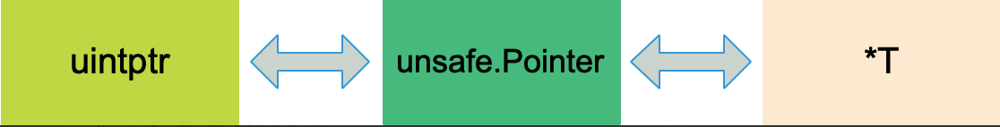

# Golang unsafe包详解

## Go语言中的指针类型

Go语言中关于指针的类型有如下三种：

- *类型：普通指针类型，用于传递对象地址，不能进行指针运算

- unsafe.Pointer：通用指针类型，用于转换不同类型的指针，不能进行指针运算，不能读取内存存储的值，可以维护对象不被GC回收

- 用于指针运算，GC不把uintptr当指针，uintptr无法持有对象，uintptr类型的目标可能会被回收

出于安全考虑，Go语言的指针相比C的指针有很多限制。Go的指针不能进行数学运算，不同类型的指针不能相互转换，不能比较，不能相互赋值。

因此，可以使用unsafe.Pointer作为桥梁，让任意类型的指针实现相互转换，也可以将任意类型的指针转换为uintptr进行运算

## unsafe包主要功能

在Go中有一种非类型安全的指针，就是unsafe包提供的unsafe.Pointer。在某些情况下，它会使代码更高效，但是也可能带来风险。

```go
type ArbitraryType int
type Pointer *ArbitraryType
```
从命名来看，Arbitrary是任意的意思，也就是Pointer可以指向任意类型，实际上它类似于C语言里的void*

```go
func Sizeof(x ArbitraryType) uintptr
func Offsetof(x ArbitraryType) uintptr
func Alignof(x ArbitraryType) uintptr
``` 
Sizeof返回类型x所占据的字节数，但不包含x所指向的内容的大小。例如，对于一个指针，函数返回的大小为8字节（64位机器上），一个slice的大小则为slice header的大小。

Offsetof返回结构体成员在内存中的位置离结构体起始处的字节数，所传参数必须是结构体的成员。

Alignof返回m，m是指当类型进行内存对齐时，它分配的内存地址能整除m。

注意到以上三个函数返回的结果都是uintptr类型，这和unsafe.Pointer可以相互转换。这三个函数都是在编译期间执行，因此结果可以赋值给const型常量。另外三个函数的执行结果和操作系统，编译器相关。

综上所述，unsafe包提供了两个重要的能力

1. 任何类型的指针和unsafe

2. uintptr类型和unsafe.Pointer可以相互转换



## 实际应用

### 获取slice长度

Golang中slice header的定义：

```go
//runtime/slice.go
type slice struct {
	array unsafe.Pointer
	len int
	cap int
}
```
调用make函数创建一个slice时，底层调用的是makeslice函数，返回slice结构体

```go
func makeslice(et *_type, len, cap int) slice
```
因此可以通过unsafe.Pointer和uintptr相互转换，得到slice的len和cap

```go
func main() {
	s := make([]int, 9, 20)
	var Len = *(*int)(unsafe.Pointer(uintptr(unsafe.Pointer(&s)) + uintptr(8)))
	fmt.Println(Len, len(s)) //9  9
	var Cap = *(*int)(unsafe.Pointer(uintptr(unsafe.Pointer(&s)) + uintptr(16)))
	fmt.Println(Cap, cap(s)) //20  20
	
}
```
转换流程如下：

```go
Len: &s => pointer => uintptr => pointer => *int => int
Cap: &s => pointer => uintptr => pointer => *int => int
```

### 获取map长度

Golang中map的定义：

```go
type hmap struct {
	count     int
	flags     uint8
	B         uint8
	noverflow uint16
	hash0     uint32

	buckets    unsafe.Pointer
	oldbuckets unsafe.Pointer
	nevacuate  uintptr

	extra *mapextra
}
```
makemap函数返回的是hmap的指针

```go 
func makemap(t *maptype, hint int64, h *hmap, bucket unsafe.Pointer) *hmap
```
依然可以通过unsafe.Pointer和uintptr进行转换，得到hamp字段的值，count是二级指针

```go
func main() {
	mp := make(map[string]int)
	mp["qcrao"]  = 100
	mp["stefno"] = 18
	
	count := **(**int)(unsafe.Pointer(&mp))
	fmt.Println(count, len(mp))
}
```
count的转换过程

```go
&mp => pointer => **int => int
```

### string和[]byte转换（常用）

利用unsafe.Pointer，可以实现字符串和byte切片之间的转换，这种转换是zero-copy的，相比一般的转换方式，时间和空间效率更高。

slice和string的底层数据结构

```go
type StringHeader struct {
	Data uintptr
	Len	 int
}

type SliceHeader struct {
	Data uintptr
	Len  int
	Cap	 int
}
```
因此，只需要共享底层[]byte数组就可以实现zero-copy

```go
func string2bytes(s string) []byte {
	stringHeader := (*reflect.StringHeader)(unsafe.Pointer(&s))
	
	bh := reflect.SliceHeader{
		Data: stringHeader.Data,
		Len:  stringHeader.Len,
		Cap:  stringHeader.Len,
	}
	return *(*[]byte)(unsafe.Pointer(&bh))
}

func bytes2string(b []byte) string {
	sliceHeader := (*reflect.SliceHeader)(unsafe.Pointer(&b))
	
	sh := reflect.StringHeader{
		Data: sliceHeader.Data,
		Len:  sliceHeader.Len,
	}
	return *(*string)(unsafe.Pointer(&sh))
}
```
