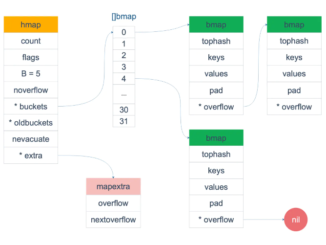
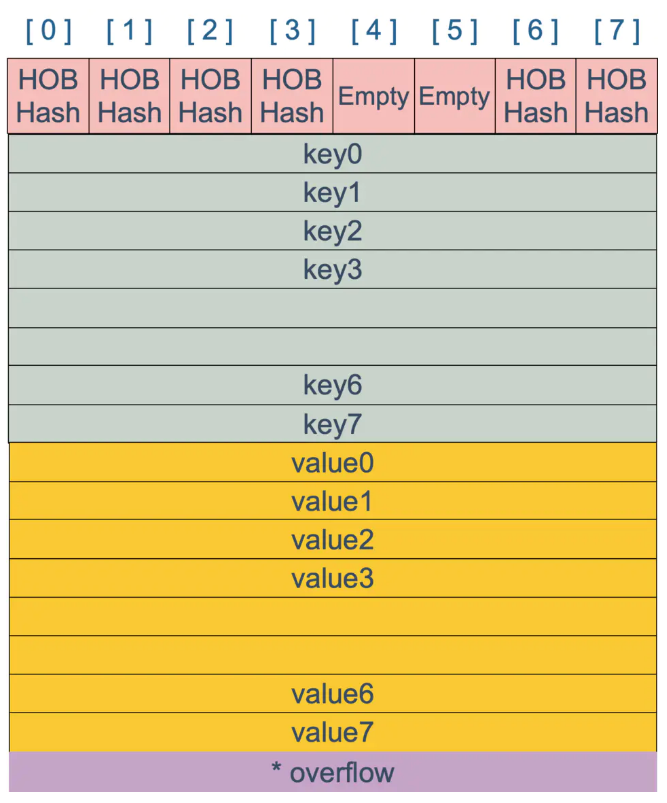
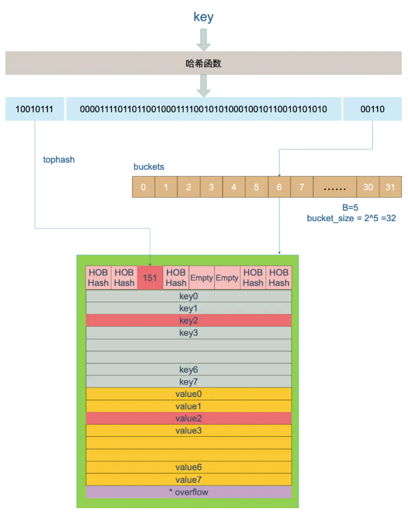
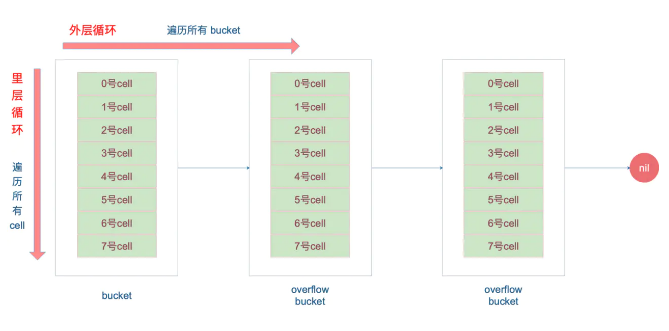

# map的底层实现

## map

map在不同语言里都有实现，一般被称为关联数组，符号表或者字典，是由一组<key, value>对组成的抽象数据结构，并且同一个key只会出现一次。它的任务是设计一种数据结构来维护一个集合的数据，并且可以同时对集合进行增删改查的操作。

这里有两个关键点：map是key-value对组成的，key只会出现一次。

最主要的实现map的数据结构有两种：哈希查找表(Hash table)，搜索树(Search tree)。

- 哈希查找表用一个哈希函数将key分配到不同的桶(bucket)。这样，开销主要在哈希函数的计算以及数组的常数访问时间。在很多场景下，哈希查找表的性能很高。

- 哈希查找表一般会存在"碰撞"的问题，不同的key被哈希到同一个bucket。一般有两种应对方法：链表法和开放地址法。链表法将一个bucket实现成一个链表，落在同一个bucket中的key都会插入这个链表。开放地址法则是碰撞发生后，通过一定的规律，在数组后面挑选"空位"，用来放置新的key。

- 搜索树法一般采用自平衡搜索树，包括：AVL树，红黑树。

- 自平衡搜索树法的最差搜索效率是O(logN)，而哈希查找表最差是O(N)。当然，哈希查找表的平均查找效率是O(1)，如果哈希函数设计的很好，最坏的情况基本不会出现。遍历自平衡搜索树，返回的key序列一般会按从小到大的顺序，而哈希查找表则是乱序的。

## golang中的实现

在golang中，map采用的是哈希查找表，并且使用链表解决哈希冲突。

### map的内存模型

在源码中，用hmap表示map结构体，它是hashmap的缩写。

```go
// A header for a Go map.
type hmap struct {
	count     int                   // 元素个数，调用 len(map) 时，直接返回此值
	flags     uint8	
	B         uint8                 // buckets 的对数 log_2
	noverflow uint16                // overflow 的 bucket 近似数	
	hash0     uint32                // 计算 key 的哈希的时候会传入哈希函数
	buckets    unsafe.Pointer       // 指向 buckets 数组，大小为 2^B 如果元素个数为0，就为 nil
	oldbuckets unsafe.Pointer       // 扩容的时候，buckets 长度会是 oldbuckets 的两倍
	nevacuate  uintptr              // 指示扩容进度，小于此地址的 buckets 迁移完成
	extra *mapextra                 // optional fields
}
```
这里B是buckets数组的长度的对数，也就是说buckets数组的长度就是2^B。bucket里面存储了key和value。buckets是一个指针，最终它指向了一个结构体：

```go
type bmap struct {
	tophash [bucketCnt]uint8
}
```
编译期间会给这个结构体加料，动态地构建一个新的结构：

```go
type bmap struct {
    topbits  [8]uint8
    keys     [8]keytype
    values   [8]valuetype
    pad      uintptr
    overflow uintptr
}
```
bmap 就是我们常说的"桶"，桶里面会最多装8个key，这些key之所以会落入同一个桶，是因为它们经过哈希计算后，哈希结果是"一类"的。在桶内，又会根据key计算出来的hash值的高8位来决定key到底落入桶内的哪个位置（一个桶内最多有8个位置）。



bmap是存放k-v的地方，bmap的内部构成如下



上图就是bucket的内存模型。注意到key和value是各自存放在一起的，并不是key/value/key/value...这样的形式。这样不必在每一个key/value对之后都增加padding，只需要在key和value交界处添加padding。

每个bucket设计成最多只能放8个key-value对，如果有第9个key-value落入当前bucket，那么就需要再构建一个bucket，通过overflow指针连接起来。

### 创建map

从语法层面来说，创建map很简单

```go
ageMp := make(map[string]int)
// 指定 map 长度
ageMp := make(map[string]int, 8)

// ageMp 为 nil，不能向其添加元素，会直接panic
var ageMp map[string]int
```
通过汇编语言可以看到，实际上底层调用的是 makemap 函数，主要做的工作就是初始化 hmap 结构体的各种字段，例如计算 B 的大小，设置哈希种子 hash0 等等。

```go
func makemap(t *maptype, hint int64, h *hmap, bucket unsafe.Pointer) *hmap {
	// 省略各种条件检查...

	// 找到一个 B，使得 map 的装载因子在正常范围内
	B := uint8(0)
	for ; overLoadFactor(hint, B); B++ {
	}

	// 初始化 hash table
	// 如果 B 等于 0，那么 buckets 就会在赋值的时候再分配
	// 如果长度比较大，分配内存会花费长一点
	buckets := bucket
	var extra *mapextra
	if B != 0 {
		var nextOverflow *bmap
		buckets, nextOverflow = makeBucketArray(t, B)
		if nextOverflow != nil {
			extra = new(mapextra)
			extra.nextOverflow = nextOverflow
		}
	}

	// 初始化 hamp
	if h == nil {
		h = (*hmap)(newobject(t.hmap))
	}
	h.count = 0
	h.B = B
	h.extra = extra
	h.flags = 0
	h.hash0 = fastrand()
	h.buckets = buckets
	h.oldbuckets = nil
	h.nevacuate = 0
	h.noverflow = 0

	return h
}
```
注意，这个函数返回的结果：*hmap，它是一个指针，而我们之前讲过的makeslice函数返回的是slice结构体

```go
func makeslice(et *_type, len, cap int) slice
```

makemap和makeslice的区别，带来一个不同点：当map和slice作为函数参数时，在函数参数内部对map的操作会影响map自身；而对slice却不会。

主要原因：一个是指针（\*hmap），一个是结构体（slice）。Go语言中的函数传参都是值传递，在函数内部，参数会被copy到本地。*hmap指针copy完之后，仍然指向同一个map，因此函数内部对map的操作会影响实参。而slice被copy后，会成为一个新的slice，对它进行的操作不会影响到实参。

### 哈希函数

> hash 函数，有加密型和非加密型。
加密型的一般用于加密数据、数字摘要等，典型代表就是 md5、sha1、sha256、aes256 这种；
非加密型的一般就是查找。在 map 的应用场景中，用的是查找。
选择 hash 函数主要考察的是两点：性能、碰撞概率。


map的一个关键点在于哈希函数的选择，在程序启动时，会检测 cpu 是否支持 aes，如果支持，则使用 aes hash，否则使用 memhash。这是在函数 alginit() 中完成，位于路径：src/runtime/alg.go 下。

在Go语言中，表示类型的结构体：

```go
type _type struct {
	size       uintptr
	ptrdata    uintptr // size of memory prefix holding all pointers
	hash       uint32
	tflag      tflag
	align      uint8
	fieldalign uint8
	kind       uint8
	alg        *typeAlg
	gcdata    *byte
	str       nameOff
	ptrToThis typeOff
}
```
其中alg字段就和哈希相关，它是指向如下结构体的指针：

```go
// src/runtime/alg.go
type typeAlg struct {
	// (ptr to object, seed) -> hash
	hash func(unsafe.Pointer, uintptr) uintptr
	// (ptr to object A, ptr to object B) -> ==?
	equal func(unsafe.Pointer, unsafe.Pointer) bool
}
```
typeAlg 包含两个函数，hash 函数计算类型的哈希值，而 equal 函数则计算两个类型是否“哈希相等”。

对于不同的类型，hash函数和equal函数的实现不同，string类型的实现如下：

```go
func strhash(a unsafe.Pointer, h uintptr) uintptr {
	x := (*stringStruct)(a)
	return memhash(x.str, h, uintptr(x.len))
}

func strequal(p, q unsafe.Pointer) bool {
	return *(*string)(p) == *(*string)(q)
}
```

### key定位过程

 key经过计算后得到哈希值，在64位机器上共64个bit位，低位用于计算落在哪个桶中，高位用于计算桶内的key位置。

 一个具体的例子，如果hmap中的B为5，那么桶的数量，也就是buckets数组的长度为2^5=32，现在有一个key经过哈希函数计算后，得到的哈希结果是

 ```go
10010111 | 000011110110110010001111001010100010010110010101010 │ 01010
 ```

- 用最后的5个bit位，也就是01010，值为10，确定10号桶

- 再用哈希值的高8位，找到key在bucket中的位置，这是在寻找已有的key。最开始桶内还没有key，新加入的key 会找到第一个空位，放入。

- buckets编号就是桶编号，当两个不同的key落在同一个桶中，也就是发生了哈希冲突。冲突的解决手段是链表法：在bucket中，从前往后找到第一个空位，这样，在查找某个key时，先找到对应的桶，再去遍历bucket中的key



上图中，假定 B = 5，所以 bucket 总数就是 2^5 = 32。首先计算出待查找 key 的哈希，使用低 5 位 00110，找到对应的 6 号 bucket，使用高 8 位 10010111，对应十进制 151，在 6 号 bucket 中寻找 tophash 值（HOB hash）为 151 的 key，找到了 2 号槽位，这样整个查找过程就结束了。
如果在 bucket 中没找到，并且 overflow 不为空，还要继续去 overflow bucket 中寻找，直到找到或是所有的 key 槽位都找遍了，包括所有的 overflow bucket。

当定位到一个具体的 bucket 时，里层循环就是遍历这个 bucket 里所有的 cell，或者说所有的槽位，也就是 bucketCnt=8 个槽位。整个循环过程：



### map的两种get操作

Go 语言中读取 map 有两种语法：带 comma 和 不带 comma。当要查询的 key 不在 map 里，带 comma 的用法会返回一个 bool 型变量提示 key 是否在 map 中；而不带 comma 的语句则会返回一个 value 类型的零值。如果 value 是 int 型就会返回 0，如果 value 是 string 类型，就会返回空字符串。

```go
package main

import "fmt"

func main() {
	ageMap := make(map[string]int)
	ageMap["qcrao"] = 18

    // 不带 comma 用法
	age1 := ageMap["stefno"]
	fmt.Println(age1)

    // 带 comma 用法
	age2, ok := ageMap["stefno"]
	fmt.Println(age2, ok)
}

//运行结果
0
0 false
```

这其实是编译器在背后做的工作：分析代码后，将两种语法对应到底层两个不同的函数。

```go
// src/runtime/hashmap.go
func mapaccess1(t *maptype, h *hmap, key unsafe.Pointer) unsafe.Pointer
func mapaccess2(t *maptype, h *hmap, key unsafe.Pointer) (unsafe.Pointer, bool)
```
另外，根据 key 的不同类型，编译器还会将查找、插入、删除的函数用更具体的函数替换，以优化效率：


这些函数的参数类型直接是具体的 uint32、unt64、string，在函数内部由于提前知晓了 key 的类型，所以内存布局是很清楚的，因此能节省很多操作，提高效率。

