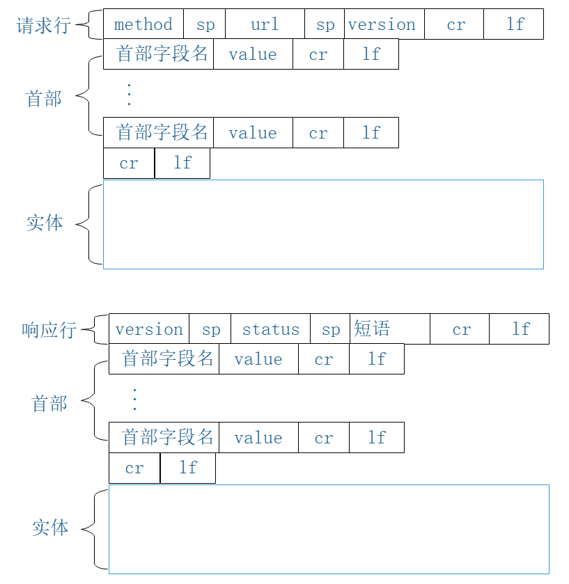
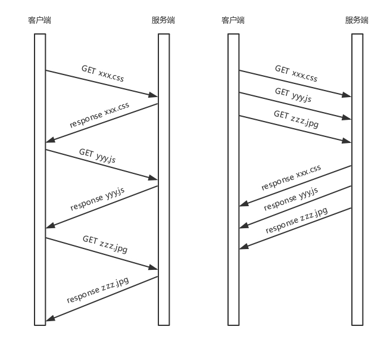
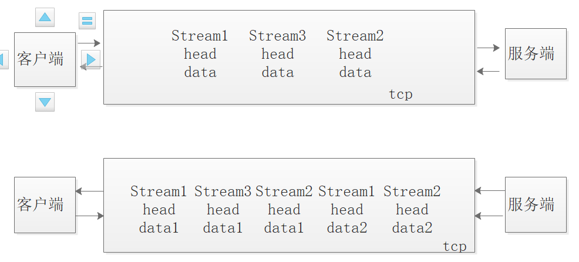
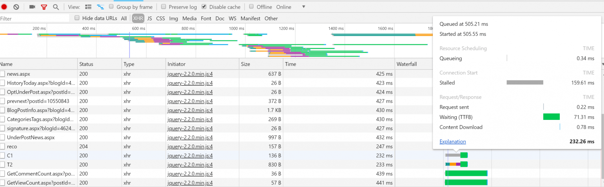

# grpc之流式调用原理http2协议分析

## HTTP/1 协议回顾

- HTTP (Hypertext transfer protocol) 超文本传输协议

- HTTP 协议在 7 层传输架构中属于应用层协议，其依赖 TCP 协议

- HTTP 协议由请求和响应两部分组成，是一个标准的客户端服务器模型

- HTTP 默认端口号 80，https 默认端口号 443

- HTTP 协议通过 URL（统一资源定位符 - Uniform-Resource-Locator）来定位互联网上的资源地址

- HTTP 是一个无状态的面向连接的协议，无状态不代表 HTTP 不能保持长连接，无状态指的是 HTTP 不具备事务记忆能力，也就是下一次的请求不会记住上一次的请求信息。

- HTTP 协议 0.9 和 1.0 版本使用非持续性连接，也就是一次请求一次响应，连接就会关闭，而从 HTTP 协议 1.1 开始，默认开启了 Keep-Alive，保持长连接，就是说一次请求结束后，连接不会马上关闭，下一次请求会继续使用这个连接，但长连接不代表一直不关闭，一段时间后这个连接就会关闭。

HTTP 的请求和响应分别都有请求行 / 响应行，首部，实体组成的，如下图

# HTTP2 协议分析

### 什么是 HTTP2

- HTTP / 2 并不是对 HTTP 协议的重写，相对于 HTTP / 1，HTTP / 2 的侧重点主要在性能。请求方法，状态码和语义和 HTTP / 1 都是相同的，可以使用与 HTTP / 1.x 相同的 API（可能有一些小的添加）来表示协议。

- HTTP / 2 主要有两个规范组成

  1. Hypertext Transfer Protocol version 2 (超文本传输协议版本 2)

  2. HPACK - HTTP / 2 的头压缩 （HPACK 是一种头部压缩算法）

- 这两个规范的连接如下

- https://httpwg.org/specs/rfc7540.html （第一个）

- https://httpwg.github.io/specs/rfc7541.htm... （第二个）

### HTTP2 中的一些概念

- 帧：数据通信的最小信息单位

- 流：存在与 TCP 连接中的一个虚拟通道（双向的，能往过流，也能往回流）

### HTTP2 的特性

- HTTP / 2 支持 HTTP / 1.1 的所有核心功能，但旨在通过多种方式提高效率

- HTTP/2 采用二进制传输数据，而非 HTTP/1 的文本格式传输

- HTTP / 2 基本协议单元是帧，比如 head（头部信息）帧，data（传输数据细信息）帧

- HTTP / 2 使用流技术支持多路复用，也就是说提供了在单个连接上复用 HTTP 请求和响应的能力， 多个请求或响应可以同时在一个连接上使用流.

- HTTP / 2 支持压缩头部帧，允许将多个请求压缩成成一个分组，而且在客户端和服务器端分别头部信息建立索引，相同的表头只需要传输索引就可以。

- HTTP / 2 支持对请求划分优先级（就是流的优先级）

- HTTP / 2 支持 Server Push 技术

下面一张图来对比 HTTP/1 和 HTTP/2 的请求过程：

- 由图得知，发送 3 个请求，在 HTTP/1 中是按照顺序，一起请求，一次响应，而 HTTP/2 协议可以做到在一个 TCP 连接中并行执行，而不用按照顺序一对一。

### HTTP2 的原理

**多路复用**

HTTP/2 将每一个请求变成流，每一个流都有自己的 ID，有自己的优先级，这些流可以由客户端发送到服务端，也可以由服务端发送到客户端，将数据划分为帧，头部信息为 head 帧，实体信息为 data 帧，最后将这些流乱序发送到一个 TCP 连接中，如下图：

- HTTP/2 中，在一个浏览器同域名下的所有请求都是在单个连接中完成，这个连接可以承载任意数量的双向数据流，每个数据流都以消息的形式发送，而消息又由一个或多个帧组成，多个帧之间可以乱序发送，根据帧首部的流标识可以将多个帧重新组装成一个流。

在 HTTP/1 中，如果想并发发送多个请求，必须创建多个 TCP 连接，而且浏览器为了减少负载，会对同一域名下的 TCP 连接做限制，这样当请求量比较大时，会引起阻塞，如下图，Stalled 阻塞已经达到 159ms 了

**服务器推送**

- HTTP /1 中客户端往服务端发送请求严格遵守一个请求，一个响应，比如客户端请求展示网页时，服务端发回 HTML 内容，浏览器解析时发送 css，js 请求，服务端又返回 css，js 文件，那么服务端为什么不能在返回网页时就推送 css，js 内容给客户端呢，在 HTTP /2 中这已功能已经支持。

- 服务端主动推送也会遵守同源策略，不会随便推送第三方的资源到客户端

- 如果服务端推送资源是呗客户端缓存过的，客户端是有权力拒绝服务端的推送的，浏览器可以通过发送 RST_STREAM 帧来拒收。

- 每一个服务端推送的资源都是一个流

**头部压缩**

- HTTP /1 的请求头较大，而且是以纯文本发送，HTTP/2 对消息头进行了压缩，采用的是 HACK 算法，能够节省消息头占用的网络流量，其主要是在两端建立了索引表，消息头在传输时可以采用索引，而 HTTP/1.x 每次请求，都会携带大量冗余头信息，浪费了很多带宽资源。

- HACK 算法可以参考: https://www.zcfy.cc/article/1969

**帧的描述**

- 所有帧都以固定的 9 字节头开头，后跟可变长度的有效载荷，组成如下：

- 长度：帧有效负载的长度表示为无符号的 24 位整数

- 类型：8 位类型的帧，帧类型确定帧的格式和语义

- 标志：为特定于帧类型的布尔标志保留的 8 位字段

- R：保留的 1 位字段。该位的语义未定义

- 流标识符：流标识符，表示为无符号 31 位整数，客户端发起流标识符必须时奇数，服务端发起的流标识符必须是偶数

9 字节总共是：9 * 8 = 72 位

上面的描述 24 + 8 + 8 +1 + 31 = 72 位

## gRPC与HTTP2的关系

- gRPC 设计时的初衷：gRPC 的设计目标是在任何环境下运行，支持可插拔的负载均衡，跟踪，运行状况检查和身份验证。它不仅支持数据中心内部和跨数据中心的服务调用，它也适用于分布式计算的最后一公里，将设备，移动应用程序和浏览器连接到后端服务，同时，它也是高性能的，而 HTTP /2 恰好支持这些。

- HTTP /2 天然的通用性满足各种设备，场景

- HTTP /2 的性能相对来说也是很好的，除非你需要极致的性能

- HTTP /2 的安全性非常好，天然支持 SSL

- HTTP /2 的鉴权也非常成熟

- gRPC 基于 HTTP /2 多语言实现也更容易

