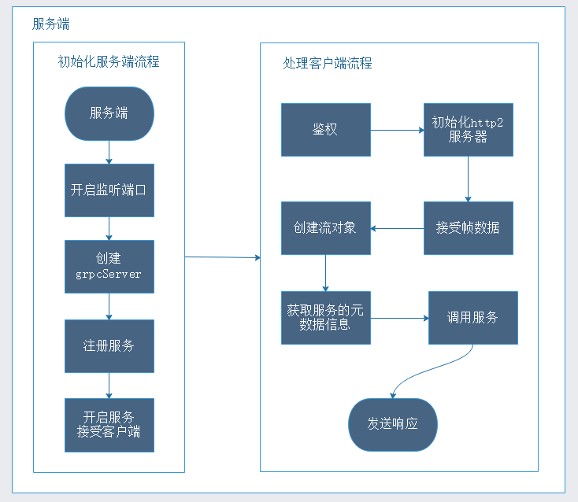
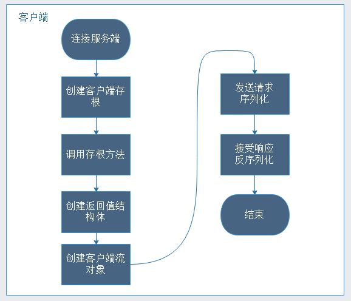

# grpc的一次请求流程

我们知道 RPC 是一个 CS 的架构，有服务的提供者，有服务的消费者，那么一次 RPC 请求到底经历了什么？这篇文章一起从源码解密 gRPC 的一次请求声明周期，从中我们可以了解RPC框架设计时一些必要的模块，进行抽象总结。

## 客户端发送一次请求的流程

在看客户端如何发送一次请求时，我们先看看pb文件，和生成的pb.go文件，事实上常规的rpc请求和和流式的rpc请求是不一样的，这里我们主要分析常规的rpc请求(一次请求，一次响应)

```
//定义接口
service HelloService{
    //一个简单的rpc
    rpc HelloWorld(HelloRequest) returns (HelloResponse){}
}
```

通过 protobuffer 工具生成 pb.go 文件，这个文件中包含的信息比较多，这里我们先主要看对 HelloService 服务的描述信息

```go
//其实就是创建一个ServiceDesc对象，这个结构体定义在server.go文件中
var _HelloService_serviceDesc = grpc.ServiceDesc{
    //服务的名称
   ServiceName: "proto.HelloService", 
    //服务的实现处理结构体
   HandlerType: (*HelloServiceServer)(nil),
   //正常的rpc，一次请求，一次响应的方法集
   Methods: []grpc.MethodDesc{
      {
         MethodName: "HelloWorld",
         //处理helloWorld的handler
         Handler:    _HelloService_HelloWorld_Handler,
      },
   },
   //元数据，也就是proto文件
   Metadata: "hello_world.proto", 
}
```
我们从 HelloWorld 的 RPC 请求看起，看看这个一次请求，一次响应是怎么执行的，首先在 pb.go 文件中，我们看到客户端使用的 api 的定义，如下代码

```go
//这是protobuffer生成的客户端api
type HelloServiceClient interface {
   //一个简单的rpc
   HelloWorld(ctx context.Context, in *HelloRequest, 
                    opts ...grpc.CallOption) (*HelloResponse, error)
}
```

这个 HelloWorld 方法接受三个参数：

- content 上下文参数，

- HelloRequest 请求入参，

- grpc.callOption

这里着重说一下第三个参数，前两个参数相信大家都知道是什么意思，看 gRPC 中对这个参数的定义和描述，很清楚的知道这是一个接口，接口中定义了 before 方法和 after 方法，看如下注释很容易明白的，我们可以自定义结构体实现自己想要处理的一些逻辑。

```go
type CallOption interface {
   // before is called before the call is sent to any server.  If before
   // returns a non-nil error, the RPC fails with that error
   // 翻译过来就是,在发起rpc请求调用之前调用before方法，如果一个非空的error错误，则这次rpc请求失败
   before(*callInfo) error

   // after is called after the call has completed.  after cannot return an
   // error, so any failures should be reported via output parameters.
   // 翻译过来就是在rpc方法执行之后调用after方法，after不能返回错误，因此任何失败都应该通过输出参数来报告
   after(*callInfo)
}
```
接下来我们看看客户端 api 的实现，也是在 pb.go 文件中，核心是 Invoke 方法

```go
type helloServiceClient struct {
   cc *grpc.ClientConn
}
//创建一个该服务的客户端，入参是客户端和服务器端建立的连接
func NewHelloServiceClient(cc *grpc.ClientConn) HelloServiceClient {
   return &helloServiceClient{cc}
}

func (c *helloServiceClient) HelloWorld(ctx context.Context,
   in *HelloRequest, opts ...grpc.CallOption) (*HelloResponse, error) {
   //new一个返回对象
   out := new(HelloResponse)
   //调用客户端连接的Inoke方法 （核心）
   err := c.cc.Invoke(ctx, "/proto.HelloService/HelloWorld", in, out, opts...)
   if err != nil {
      return nil, err
   }
   //返回处理结果
   return out, nil
}
```

当我们在代码中发起调用时，像如下代码一样传入参数，第三个参数我们可以传入一个空的 CallOption, 这是 grpc 提供的默认实现，这个实现在 rpc_util.go 文件中。事实上，grpc 提供了很多默认实现，都在这个文件中，这不是本次的重点，就不展开说了

```go
//连接grpc的服务端
conn, err := grpc.Dial("127.0.0.1:8090", grpc.WithInsecure())
//创建客户端存根对象，调用的这个方法在生成的pb.go文件中
c := pb.NewHelloServiceClient(conn)
//发起调用
c.HelloWorld(context.BackContext(),new(HelloRequest),grpc.EmptyCallOption{})
```

最后我们深入 invoke 方法中做了什么，invoke 方法在 call.go 文件中

```go

//发起rpc调用并等待响应
func (cc *ClientConn) Invoke(ctx context.Context, method string, args, 
    reply  interface{}, opts ...CallOption) error {

   //把客户端的拦截器和和调用方法入参的拦截器合并（就是放到一个切片中）
   opts = combine(cc.dopts.callOptions, opts)
   //拦截器不为空就调用这个方法
   if cc.dopts.unaryInt != nil {
      //拦截器中还是会调用invoke方法（也就是下面的方法）
      return cc.dopts.unaryInt(ctx, method, args, reply, cc, invoke, opts...)
   }
   //否则调用invoke
   return invoke(ctx, method, args, reply, cc, opts...)
}
```

在 invoke 方法中主要做了如下如下事情

- 创建客户端流对象（在这个方法中发送前执行 befor 方法），这个方法中主要初始化一些流对象参数，比如超时时间，发送最大消息大小，接受最大消息大小，

- 发送请求

- 接受服务端响应 （在接受响应后执行 after 方法）

```go
func invoke(ctx context.Context, method string, req, reply interface{}, 
   cc *ClientConn, opts ...CallOption) error {
   //创建客户端流对象
   cs, err := newClientStream(ctx, unaryStreamDesc, cc, method, opts...)
   if err != nil {
      return err
   }
   //发送请求
   if err := cs.SendMsg(req); err != nil {
      return err
   }
   //接受响应
   return cs.RecvMsg(reply)
}
```
进入到 SendMsg 中看看消息是如何发送出去的

```go
func (cs *clientStream) SendMsg(m interface{}) (err error) {
   // 序列化数据
   hdr, payload, data, err := prepareMsg(m, cs.codec, cs.cp, cs.comp)
   if err != nil {
      return err
   }
    //创建发送消息的方法
   op := func(a *csAttempt) error {
      //真正的消息发送是在这个方法中
      err := a.sendMsg(m, hdr, payload, data)
      m, data = nil, nil
      return err
   }
   //开始执行发送，带重试功能
   err = cs.withRetry(op,
                func() { 
                    cs.bufferForRetryLocked(len(hdr)+len(payload), op) 
                }
           )
   return
}
```
再进入 RecvMsg 中看看客户端是如何接受消息的

```go
func (cs *clientStream) RecvMsg(m interface{}) error {
   var recvInfo *payloadInfo
   if cs.binlog != nil {
      recvInfo = &payloadInfo{}
   }
   err := cs.withRetry(func(a *csAttempt) error {
      //整的开始接受服务端结果，并且反序列化，填充到m对象上，m就是返回值
      return a.recvMsg(m, recvInfo)
   }, cs.commitAttemptLocked)

   if err != nil || !cs.desc.ServerStreams {
      //这里面回调用after方法
      cs.finish(err)
   }
   return err
}
```

## 服务端处理一次请求的过程

在之前分析了 gRPC-Server 启动做了哪些事，详细分析了 gRPCServer 的启动流程，这里我们接着看看服务端监听到一个客户端连接之后，是如何处理这个请求的。

在 grpc.Server(listener) 中有如下片段代码

```go

//每来一个连接开启一个协程开始处理客户端请求
go func() {
   //开始处理客户端连接
   s.handleRawConn(rawConn)
}()
```

我们主要分析的是在 handleRwConn 方法中做了哪些事

- 设置连接建立的超时时间

- 权限认证

- 创建基于 http2 的连接

- 处理请求

```go

func (s *Server) handleRawConn(rawConn net.Conn) {
   //设置连接超时时间
   rawConn.SetDeadline(time.Now().Add(s.opts.connectionTimeout))
   //权限认证（是tls认证或者证书认证，不是我们自定义的权限认证）
   conn, authInfo, err := s.useTransportAuthenticator(rawConn)
   // 建立基于http2的连接（主要是创建一个http2的Sever服务器），要看懂这一块需要深入了解http2协议
   st := s.newHTTP2Transport(conn, authInfo)
   if st == nil {
      return
   }
   rawConn.SetDeadline(time.Time{})
   if !s.addConn(st) {
      return
   }
   //开启新的协程处理请求
   go func() {
      s.serveStreams(st)
      s.removeConn(st)
   }()
}
```
继续深入 ServerStreams () 方法看看是如何处理客户端请求的

```go
func (s *Server) serveStreams(st transport.ServerTransport) {
   defer st.Close()
   var wg sync.WaitGroup
   //真正的接受请求流并处理
   st.HandleStreams(func(stream *transport.Stream) {
      wg.Add(1)
      go func() {
         defer wg.Done()
         //处理真正的请求
         s.handleStream(st, stream, s.traceInfo(st, stream))
      }()
   }, func(ctx context.Context, method string) context.Context {
      if !EnableTracing {
         return ctx
      }
      tr := trace.New("grpc.Recv."+methodFamily(method), method)
      return trace.NewContext(ctx, tr)
   })
   wg.Wait()
}
```
HandleStream 方法中主要是循环读取 http2 协议发送的各种帧，然后交给不同的方法去处理，其中 MetaHeadersFrame 帧会触发调用服务端的服务实现，traceCtx 主要负责跟
踪执行过程。这里省略很多代码，感兴趣的去阅读源码，文章里就不粘贴了。

```go
func (t *http2Server) HandleStreams(handle func(*Stream), 
   traceCtx func(context.Context, string) context.Context) {

   defer close(t.readerDone)
   //这是个没有条件的for循环
   for {
      t.controlBuf.throttle()
      //获取http2协议中的帧（不懂的可以翻看gRPC之流式调用原理http2协议分析）
      frame, err := t.framer.fr.ReadFrame() 
      atomic.StoreUint32(&t.activity, 1)
      //判断帧的类型然后去处理  
      switch frame := frame.(type) {
      case *http2.MetaHeadersFrame:
         //这个帧是真正去调用服务实现了，这个方法会调用上面的 s.handleStream(st, stream, s.traceInfo(st, stream))
         if t.operateHeaders(frame, handle, traceCtx) {
            t.Close()
            break
         }    
      }
   }
}
```

最后我们看看这个真正调用我们自己业务服务代码的方法是做了什么，省略很多非核心的代码，这样流程比较清晰

```go
func (s *Server) handleStream(t transport.ServerTransport, 
    stream *transport.Stream, trInfo *traceInfo) {
    //从流中获取服务端需要执行的方法元数据描述
    sm := stream.Method()

   //提取服务名称，方法名称
    service := sm[:pos]
    method := sm[pos+1:]
    //判断服务是否存在，存在则得到具体的服务
    srv, knownService := s.m[service]
    if knownService {
        //这个是一元方法执行 (一次请求，一次响应)
        if md, ok := srv.md[method]; ok { 
          //此时的md就是最上面的ServiceDesc中的Handler，在processUnaryRPC中调 用这个handler,就是调用了我们的业务逻辑服务代码。
            s.processUnaryRPC(t, stream, srv, md, trInfo)
            return
        }
        //这个是流式方法执行（多次请求，多次响应）
        if sd, ok := srv.sd[method]; ok {
            s.processStreamingRPC(t, stream, srv, sd, trInfo)
            return
        }
    }
}
```

## 总结

深入阅读进去，你会发现源码并不是特别难懂，关键在于踏出第一步，上面分析了 grpc 从客户端发起请求到服务端接受处理的全流程，中间也有很多细节并没有说，比如鉴权，比如创建 http2 服务，拦截器执行，trace 跟踪等，尤其是错误处理，但本篇文章重点是带领大家贯穿整个流程，把从客户端发起请求到服务端处理衔接起来，并不是把所有细节说明白，一篇文章也说不明白，最后我用一张图表述整个流程，让大家更加清晰的理解。






