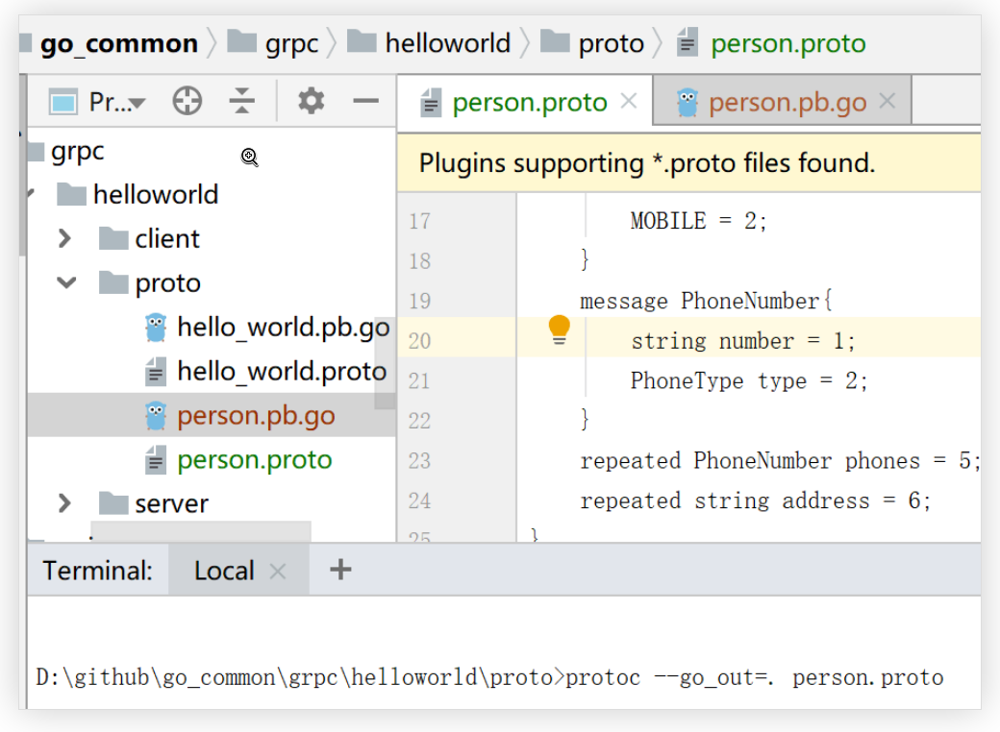
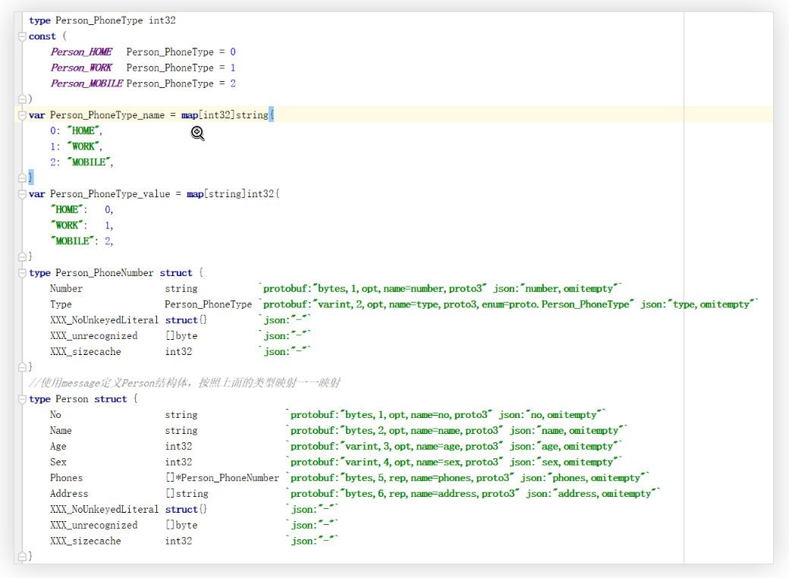
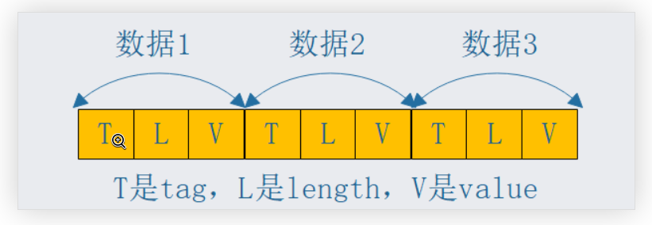
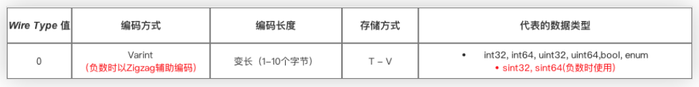
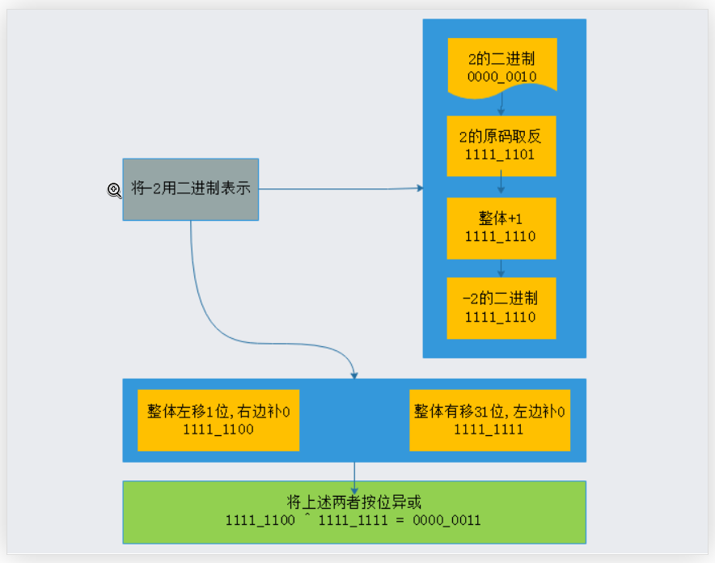

# grpc接口描述语言ProtoBuffer

## 什么是ProtoBuffer

ProtoBuffer是一种语言无关，平台无关，可扩展的序列化结构化数据的方法，用于通信协议，数据存储等，ProtoBuffer 由 Google 开发，目前各大互联网公司普遍使用，在使用时需要编写.proto 文件，目前 ProtoBuffer 有两个版本，Pro2、Pro3，这次主要分享的是 Pro3。

## ProtoBuffer的特点

相比 xml，json 等数据序列化方式，ProtoBuffer 具有如下特点

- 体积小 3 到 10 倍，（其数据格式紧密，没有多余的空格，括号，尖括号，key 等）

- 性能快 20 到 100 倍（体积小了，所以传输也快，另外 protobuffer 也做了一个额外处理，比如传入每个字段值的长度，方便读取）

- 生成更易于以编程方式使用的数据访问类

- 支持新字段增加，向后兼容

- 支持相对复杂的数据格式

- 跨语言（为每种语言提供了编译器），跨平台（序列化结果为二进制与平台无关）

- .proto 文件可读性不高，序列化后的字节序列为二进制序列，不能简单的分析有效性
ProtoBuffer 安装

## ProtoBuffer的安装

安装地址：https://github.com/protocolbuffers/protobuf/releases

选择自己合适的版本进行下载
下载之后把 bin 文件的 protoc 添加到环境变量中

ProtoBuffer 的数据类型和各语言的数据类型的对应关系请看如下链接：

https://developers.google.cn/protocol-buffers/docs/proto3

## ProtoBuffer的使用

我们创建一个 person.proto 文件来描述人的一些信息

```go
//声明proto的版本，并且必须是第一行，否则认为是proto2版本
syntax = "proto3";
//最终通过编译器生成的.go文件的包名
package proto_file;
//使用message定义Person结构体，按照上面的类型映射一一映射
message Person{    
    string no = 1;    
    string name = 2;    
    int32  age = 3;    
    int32  sex = 4;    
    enum PhoneType{        
        HOME = 0;        
        WORK = 1;        
        MOBILE = 2;    
    }    
    message PhoneNumber{        
        string number = 1;        
        PhoneType type = 2;    
    }    
    repeated PhoneNumber phones = 5;    
    repeated  string address = 6;}
}
```
解释一下上面一些字段的含义
message，类似与 Java 中的 class，go 中的 struct
repeated 代表这个字段是可以重复出现的，对应的就是类似数组类型

每个字段后面的编号代表着字段在序列化以后二进制数据中的位置，编号越大越往后，该值在同一 message 中不能重复

enum 是枚举类型字段的关键字，等同于 Java 中的 enum，HOME，WORK，MOBILE 为枚举值，可以为枚举值指定任意的整型值，整型值的顺序必须连续，且在 proto3 中必须从 0 开始

下面说一下如何将 proto 文件编译成 go 文件

1. 我们通过 protobuffer 提供的插件来生成对应的 person.pb.go 文件

2. 首先下载插件 go get -u github.com/golang/protobuf/protoc-gen-go

3. 然后执行以下命令生成对应的 go 文件

4. protoc -I "proto 文件的路径" --go_out="生成的 go 文件的路径" route_guide.proto

5. 我我这里使用的命令是：protoc --go_out=. route_guide.proto

6. 没有 -I 代表我在 proto 文件下执行的命令，. 代表我最后生成的.pb.go 文件在当前目录下，如下截图：



最终生成的代码如下，截取一些核心代码，我们可以看到 protobuffer 编译器将 proto 文件能够转化为 go 的 struct



## ProtoBuffer的原理

什么是 Base 128 varint？这是一个编码算法，我们都知道，int32 占四个字节，int64 占 8 个字节，这是固定的，不管这个数字是 1 还是 123456，占的字节数是一样，那有没有一种能根据数字大小变长编码的算法呢？Base 128 varint 就是，在设置二进制网络协议通信时，这种好处是可观的，能够带来性能上的提升。为什么叫 128 呢，就是因为采用 7bit 的空间存储数据（一个字节占 8bit，但只采用 7bit），7bit 最大当然只能存储 128 了，那么最高位干啥呢？最高位用来当作一个标识 (flag), 如果最高位是 0 就表示这个最后一个字节了。

示例：我们用一个数字 10 和数字 300 来讲解一下上面的 Base 128 varint

先说数字 10，转化为二进制后是：0000 1010，为什么只有八位呢，因为 10 用一个字节表示已经足够了，最高位为 0（加粗的那个），表示这是最后一个字节了，不需要再用额外的字节来存储了

再来看数字 300，转化为二进制后是：‭‭00010010_1100‬, 转化成 varint，如下步骤：

1. 按照 7 位进行分开， 0000010_0101100，不够的补 0

2. 进行反转：0101100_0000010

3. 最高位补数，第一个字节最高位补 1，第二个字节最高位补 0：10101100_00000010

ProtoBuffer 序列化后的存储格式是什么样的呢？

Tag,Length,Value ，这是序列化后存储的二进制的格式，Tag 大家简单理解为就是 proto 文件中字段后面的编号，Length 是这个字段对应的值的字节长度，Value 就是具体的值了，最终将所有数据拼装成一个流，如下图：



由图我们得知，ProtoBuffer 存储是紧密的，各个字段非常紧凑，不会浪费空间，若某个字段没有赋值，则不会出现在序列化后的数据中，相应字段在解码时才会被设置默认值。

ProtoBuffer 对不同类型数据采用编码方式和存储方式，如下图：


如上图，如果采用 varint 方式，则存储的格式是 TV 格式，没有 L，因为 T 上就已经知道 V 的字节长度了。

T 代表的 tag 是由 fieldNumber（字段编号）和 wireType（上图中最左边的 0,1,2...）组成的，fieldNumber 保证了字段不重复和他在数据流中的位置，wireType 标记了数据类型，如果是 varint 编码，fieldNumber 也保证了数据字节的长度 (L)

varint 编码的不足

- 整数 1 在计算几存储中二进制是 0000 00001，那么你知道整数 - 1 的二进制呢？如下：
‭
- 11111111_11111111_11111111_11111111‬, 如果也采用 varint 编码那么就需要至少占用 5 个字节，这显然有些浪费空间，ProtoBuffer 的解决方案如下：

- ProtoBuffer 定义了 sint32 和 sint64 类型来表示负数，通过先采用 Zigzag 编码（将由符号数转化成无符号数），再采用 varint 编码，从而用于减少编码后的字节数



什么是 Zigzag 编码？

Zigzag 也是一种变长的编码方式，使用无符号数表示有符号数，作用是使得绝对值小的数字可以采用较小子的字节进行表示，Zigzag 编码是辅助 varint 在编码负数时的不足，从而更好的帮助 ProtoBuffer 进行数据的压缩，下面一张图了解：



总结

- ProtoBuffer 编解码方式简单（只需要简单的数学运算，位运算）

- ProtoBuffer 数据压缩方式好，占用的空间小

- ProtoBuffer 兼容性好，采用 TLV 的存储格式


