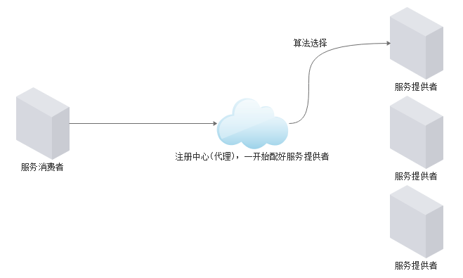
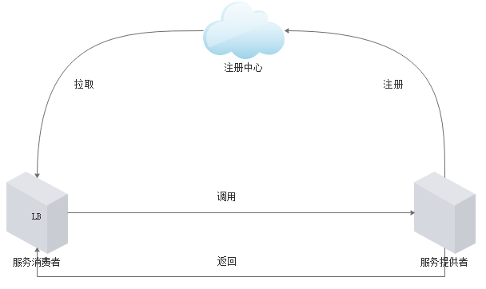

# grpc服务注册与服务发现

gRPC是一个夸语言的rpc框架，但是gRPC本身不支持微服务框架生态圈的一些功能，比如注册中心，限流，熔断等等，这篇文章中我们利用grpc提供的接口实现服务注册和服务发现功能。这里会介绍什么是注册中心，注册中心的实现方案，优缺点，最后使用gRPC-go实现一个注册中心。

## 什么是注册中心

注册中心是微服务的标配，其核心作用是解耦服务提供者和服务调用者，服务提供者可以向注册中心注册自己提供了哪些服务，服务消费者可以根据服务名称查询注册中心有哪些服务提供者，从而解耦了消费者和调用者直接互相通信协调。

当一个服务有多个提供者的时候，调用方应该选择哪一个？这就涉及到负载均衡(随机，轮询，权重，流量)，负载均衡可以在客户端或者服务端实现，也可以在注册中心实现。

当多个实例中有实例不能正常提供服务时，注册中心应具备自动移除的功能，这就是健康检查。注册中心与服务提供者进行定期的通信(几十毫秒一次，几秒一次)，检测服务提供者是否存活，注册中心会定期移除没有往注册中心检测心跳的服务提供者，以此保证给消费方提供的服务提供者是有效的。

## 注册中心的两种方案

> 集中式 LB (Load Balance)，也是代理模型（Proxy Model）



**优点**： 这种方式比如 nginx,F5 等，本身就具备负载均衡算法，心跳检测，失败重试，失败转移等功能，不需要开发人员再次开发，服务提供者往注册中心注册自己的 ip 地址，消费者访问注册中心，注册中心通过算法处理后转发到服务提供者之后返回处理结果，注册中心再把处理结果返回给消费者。

**缺点**： 比如，不支持动态的新增服务提供者，并发量大以后，代理会成为瓶颈，代理也有可能会成为单点等问题。

> 进程内 LB (Load Balance), 软负载



**优点**： 这种方式解决了上面方式的缺点，注册中心本身支持高可用，可扩展，服务提供者启动后向注册中心注册自己，消费者启动后拉取注册中心服务提供者列表，缓存一份，请求到来时，可走本地缓存，也可查询注册中心重新获取，负载均衡算法，失效转移等在客户端实现，自控性强，少了一层代理，性能也会更好。

**缺点**： 需要一定的研发实力，开发起来复杂，如果公司使用多语言开发项目，需要为每种语言都实现一个客户端，如果服务端升级，势必也要求客户端升级重新发布等。

## 常用的注册中心以及优缺点

- 事实上，只要具备存储功能或者配置功能的一些软件或者硬件都可以作为注册中心来使用，就看这个注册中心的完备性，高可用性，可扩展性是否足够好。

- 如 nginx,redis,mysql,zookeeper,etcd,eureka,consul 等都可以作为注册中心

### nginx

在公司规模不大，要求不高的情况下的，采用 http 协议通信，可以选用 nginx 来作为注册中心，使用简单，不需要额外的开发工作，往 nginx 配置文件配置服务端 ip 地址，配置负载均衡策略，服务消费者只需要配置 nginx 的 ip，就可以通过 http 请求形式访问到服务提供者后端，nginx 做了一层代理，提供了负载均衡，失效转移，心跳检测，服务转发等功能，能让开发人员开箱即用，这其实就是上面的第一种方案，但缺点也很明显，如同上面所说，所以在公司发展初期 (流量不大)，是能快速提高研发效率，节省成本，专心发展业务的一种手段。

### zookeeper

提到注册中心，zk 就不得不说，dubbo 开源时注册中心默认的方案就是 zk，直到现在也有很多公司使用 dubbo，也采用 zk 作为注册中心，zk 能作为注册中心主要是 zk 提供了一种临时节点和节点监控的功能，服务提供启动时往 zk 某个目录下 (一般是服务名称) 创建临时节点，节点一创建就会通知监控该服务的消费者服务消费者就会获取到，然后服务提供者和 zk 之间维持心跳检测，因为该节点是临时节点，所以一旦心跳失败，zk 就会删除临时节点，同时服务消费者也会收到通知，这样就摘除了不健康的节点。

zk 是采用 zab 协议的来保证分布式中的一致性，zab 全称（Zookeeper Atomic Broadcast)），zk 在选举的过程中的为了保证最终一致性是不能写入和读取的，也就是说 zk 在选举过程中是不可用的，所以从 cap 理论来说 zk 属于 cp，而注册中心往往的要求的是 ap，同时，zk 写入只能在 leader 节点操作，当有大量服务提供者同时启动时，有可能造成 leader 节点负载过大，从而死机，然后重新选举，死机，形成恶性循环，所以 zk 并不太适合作为注册中心，但这也仅针对一些大公司，一些中小公司并没那么大的业务量，为了节约成本，选用 zk 也是可以的。zk 是使用 Java 语言开发的，所以天然的和 Java 无缝整合，有很多 Java 的 zk 客户端

### eureka

eureka 是开源微服务方案解决框架 springcloud 的一个组件，作为 springcloud 的注册中心，为什么 springcloud 要选择 eureka 作为注册中心呢？

Eureka 是一个 cs 架构，提供基于 rest 服务的服务注册和服务发现组件，服务提供者启动后往 EurekaServer 端注册提供者信息，服务注册后，服务提供者会维护一个心跳用来持续告诉 EurekaServer:"我还活着，" 以防止 Eureka Server 的” 剔除任务 “将该服务实例从服务列表中排除出去，eureka 多个 server 端互相同步服务提供者信息，也就是说只要有一个 EurekaServer 端存活，那么就满足高可用，一个 EurekaServer 集群各个节点是平等的，服务消费者引入 client 的 jar 包，启动后从 server 端获取服务提供者息，缓存本地（默认 30 秒更新一次）, 即便所有 eureka 的 server 死亡，在线的服务提供者，消费者也能正常使用。

### etcd

etcd 是一个采用 go 语言的开发的类似 zk 的分布式协调服务框架，是一个用于共享配置，服务发现的分布式，一致性 kv 存储系统，etcd 在实现上，一致性协议选择上，运维上，安全上比 zk 要优秀好多，etcd 提供 HTTP+JSON, gRPC 接口，跨平台跨语言，这一点要比 zk 好很多，对多语言开发者来说是福音，etcd 也支持 http 所访问，安全性好。

etcd 同 zk 一样也是 cp 系统，在 leader 节点选举时，读写不可用，下面我们 gRPC-go 也是采用 etcd 实现一个注册中心。

## gRPC-go 实现服务注册中心

gRPC 本身没有提供注册中心，但为开发者提供了实现注册中心的接口，开发者是要实现其接口可以了，而且 gRPC 也提供了一个 DNS 的 demo，下面我们一起看一看这个接口。

```go
//接口所在路径如下，grpc版本是1.23.1
google.golang.org/grpc@v1.23.1/resolver/resolver.go
//存储调用对象的信息
type Target struct {
    Scheme    string
    Authority string
    Endpoint  string
}
type BuildOption struct {
    //禁止服务的配置 
    DisableServiceConfig bool
}
type Builder interface {
    //构造一个Resolver
    Build(target Target, cc ClientConn, opts BuildOption) (Resolver, error)
    //返回命名空间字符串
    Scheme() string
}
type ResolveNowOption struct{}
type Resolver interface {
    //GRPC将调用resolveNow来尝试解析目标名称
    ResolveNow(ResolveNowOption)
    //关闭这个解析器
    Close()
}
```
接下来我们实现这些接口完成一个简单的注册中心

代码地址如下：https://github.com/sunpengwei1992/go_common/tree/master/grpc/helloworld_demo

核心流程如下：

- 定义服务信息的结构体

- 定义注册服务和下线服务的接口，并实现

- 实现 gRPC 提供的接口

- 实现 gRPC 提供的接口，定义 etcdBuild 结构体，定义 etcdResolver 结构体


