# 生产者与消费者

## 生产者客户端架构

以kafka的java客户端KafkaProducer为例，消息在真正发往kafka之前，有可能经历拦截器(interceptor)，序列化器(serializer)和分区器(partitioner)等一系列的作用。生产者客户端的整体架构如下：

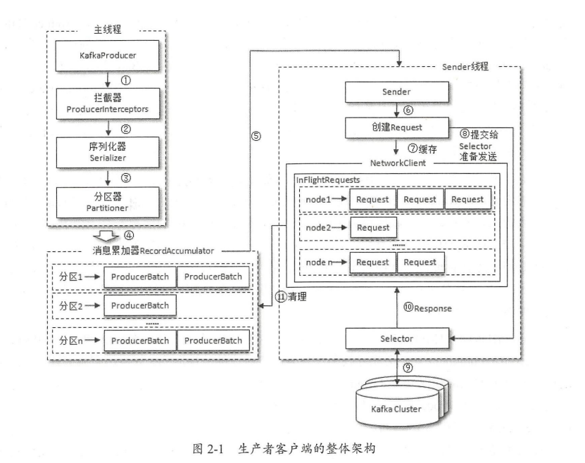

整个生产者客户端由两个线程协调运行，这两个线程分别为主线程和Sender线程。在主线程中由KafkaProducer创建消息，然后通过可能的拦截器，序列化器和分区器的作用之后缓存到消息累加器(RecordAccumulator)中，Sender线程负责从消息累加器中获取消息并将其发送到kafka中。

RecordAccumulator主要用来缓存消息以便Sender线程可以批量发送，进而减少网络传输的资源消耗以提升性能。RecordAccumulator缓存大小可以通过客户端参数(buffer.memory)配置，默认为32MB。如果生产者发送消息的速度超过发送到服务器的速度，则会导致生产者空间不足，这个时候send()方法调用可能被阻塞或抛出异常，取决于参数max.block.ms配置。

主线程中发送过来的消息都会被追加到RecordAccumulator的某个双端队列(Deque)中，在RecordAccumulator内部为每个分区维护了一个双端队列，队列中内容是ProducerBatch。消息写入缓存时，追加到双端队列的尾部，Sender读取消息时，从双端队列的头部读取。

ProducerBatch可以包含一个或多个ProducerRecord，ProducerRecord是生产者中创建的消息，而ProducerBatch是一个消息批次。将较小的ProducerRecord拼凑成一个较大的ProducerBatch可以减少网络请求次数提升整体的吞吐量。如果生产者需要向很多分区发送消息，则可以将buffer.memory参数适当调大以增加整体吞吐量。

消息在网络上都是以字节(Byte)的形式传输的，在发送之前需要创建一块内存区域来保存对应的消息。在Kafka生产者客户端中，通过java.io.ByteBuffer实现消息内存的创建和释放。在RecordAccumulator内部还有一个BufferPool实现了队ByteBuffer的复用，以实现缓存的高效利用。可以适当调整batch.size参数多缓存一些信息。

当一条消息(ProducerRecord)流入RecordAccumulator时，会先寻找与消息分区所对应的双端队列(如果没有则新建)，再从这个双端队列的尾部获取一个ProducerBatch(如果没有则新建)，查看ProducerBatch中是否还可以写入这个ProducerRecord。如果可以则写入，如果不可以则需要创建一个新的ProducerBatch。在新建ProducerBatch时评估这条消息的大小是否超过batch.size，如果不超过，就以batch.size大小来创建ProducerBatch，这样在使用完这块内存区域后，可以通过BufferPool的管理来进行复用。如果超过，就以评估的大小来创建ProducerBatch，这段内存区域不会被复用。

Sender从RecordAccumulator中获取缓存的消息后，会进一步将原本分区-Deque(ProducerBatch)的保存形式转换成Node-List(ProducerBatch)的形式，其中Node表示Kafka集群的broker节点。对于网络连接来说，生产者客户端是与具体broker节点建立的连接，也就是向具体broker节点发送消息，而不关心消息属于哪一个分区；而对于KafkaProducer的应用逻辑而言，只关注向哪个分区中发送哪些消息，所以这里需要做一个应用逻辑层面到网络I/O层的转换。

在转换成Node-List(ProducerBatch)的形式之后，Sender还会进一步封装成Node-Request的形式，这样就可以将Request请求发往各个Node了，这里的Request是指Kafka的各种协议请求，对于消息发送而言就是具体的ProduceRequest。

请求在从Sender线程发往Kafka之前还会保存到InFlightRequests中，InFlightRequests保存对象的具体形式为Map(NodeId, Deque(Request))，它的主要作用是缓存已经发出去但还没收到响应的请求。InFlightRequests通过配置参数(max.in.flight.requests.per.connection)限制每个连接最多缓存的请求数，超过该数值后就不能再向这个连接发送更多请求了，除非有缓存的请求收到了响应。通过比较Deque(Request)的size与这个参数大学来判断对应的Node是否已经堆积了很多未响应的消息。如果如此，说明这个node节点负载较大或网络连接有问题，继续发送请求会增大超时可能

## 生产者元数据更新

从InFlightRequests中还可以获得leastLoadedNode，即所有node节点中负载最小的节点。这里的负载最小是通过每个node在InFlightRequests中还未确认的请求决定的，未确认的请求越多则认为负载越大。

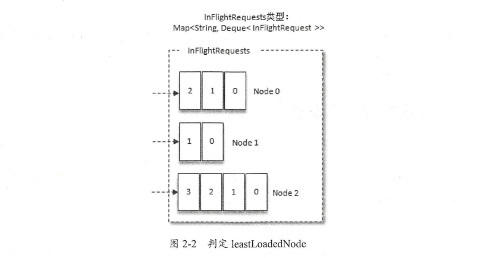

对于上图的InFlightRequests来说，图中展示了三个节点Node0 Node1和Node2，很明显Node1的负载最小。也就是说，Node1为当前的leastLoadNode，选择leastLoadedNode发送请求可以避免网络拥塞等异常从而影响整体的进度。leastLoadedNode的概念可以用于多个应用场合，比如元数据请求，消费者组播协议的交互。

当生产者生产出一条消息后，只知道topic名称，对于其他一些必要信息却一无所知。KafkaProducer要将此消息追加到指定topic的某个分区所对应的leader副本之前，首先要知道主题的分区数量，然后经过计算得出目标分区，之后KafkaProducer需要知道目标分区的leader副本所在的broker节点地址，端口等信息才能建立连接，最终才能将消息发送到Kafka，在这一过程中所需要的信息都属于元信息。

bootstrap.servers参数只需要配置部分broker节点地址即可，不需要配置所有的broker节点地址，因为客户端自己可以发现其他broker节点的地址，这一过程也属于元数据相关的更新操作。与此同时，分区数量和leader副本的分布都会动态地变化，客户端也需要动态地捕捉这些变化。

元数据指的是Kafka集群的元数据，这些数据具体记录了集群中有哪些主题，这些主题有哪些分区，每个分区的leader副本分配在哪个节点上，follower副本分配在哪些节点上，哪些副本在AR ISR集合中，集群中有哪些节点，控制器节点是哪个等。

当客户端中没有需要使用的元数据信息时，比如没有指定的主题信息，或者超过一定时间没有更新元数据都会触发元数据的更新操作。客户端参数metadata.max.age.ms默认值是5分钟更新一次元数据。

当客户端需要更新元数据时，会挑选出leastLoadedNode，然后向这个node发送MetadataRequest请求来获取具体的元数据信息。这个更新操作是由Sender线程发起的，在创建完MetadataRequest之后同样会存入InFlightRequests，之后步骤就和发送消息类似。

## 消费者与消费者组

消费者负责订阅Kafka中的主题，并且从订阅的主题上拉去消息消费。与其他消息中间件不同的是，在Kafka的中还有一层消费组的概念，每个消费者都有一个对应的消费组。当消息发布到主题后，只会被投递给订阅它的每个消费组中的一个消费者。

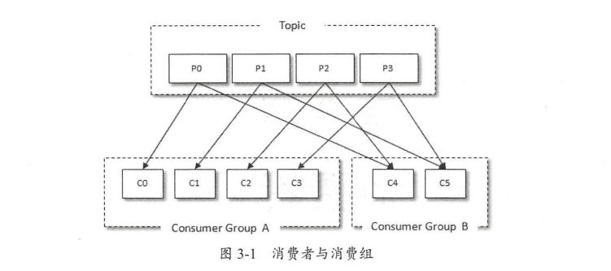

上图所示，某个主题中共有4个分区，P0，P1，P2，P3。有两个消费组A和B都订阅了这个主题，消费组A中有4个消费者(C0，C1，C2和C3)，消费组B中有2个消费者(C4和C5)。按照Kafka默认的规则，最后的分配结果是消费组A中每个消费者分配到1个分区，消费组B中的每个消费者分配到2个分区，两个消费组之间互不影响。每个消费者只能消费所分配的分区中的消息，每个分区只能被消费组中的一个消费者消费。

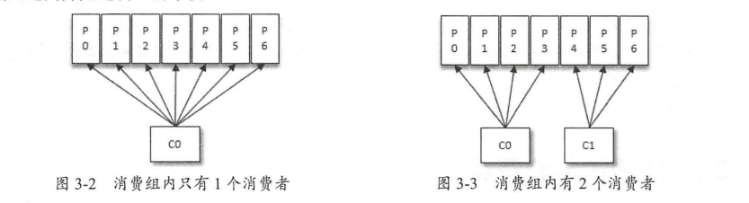

当消费组内的消费者个数变化时，对应的分区分配也跟着演变。假设目前某消费组内只有一个消费者C0，订阅了一个主题，这个主题包含7个分区：P0，P1，P2，P3，P4，P5，P6。也就是说，这个消费者C0订阅了7个分区

此时消费组内又加入了一个新的消费者C1，按照既定的逻辑，需要将原来的消费者C0的部分分区分配给消费者C1消费。消费者C0和C1各自负责消费所分配的分区，彼此之间无逻辑上的干扰。

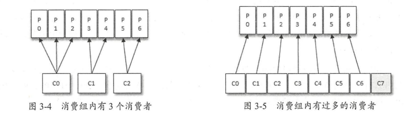

紧接着消费组内又加入了一个新的消费者C2，消费者C0 C1 C2如图中的方式各自负责消费所分配到的分区。

消费者与消费组这种模型可以让整体的消费能力具备横向伸缩性，可以增加(或减少)消费者的个数来提高(或降低)整体的消费能力。对于分区数固定的情况，一味增加消费者并不会让消费能力一直得到提升，如果消费者过多，出现了消费者个数大于分区个数的情况，就会有消费者分配不到任何分区。如图所示，一共有8个消费者，7个分区，最后的消费者C7分配不到任何分区而无法消费任何消息。

以上的分配逻辑是基于默认的分区分配策略来进行的，可以通过消费者客户端参数partition.assignment.strategy来设置消费者与订阅主题之间的分区分配策略。

## 消息投递模式

对于消息中间件而言，一般有两种消息投递模式：点对点(P2P Point-to-Point)模式和发布-订阅(Pub-Sub)模式。点对点模式是基于队列的，消息生产者发送消息到队列，消息消费者从队列接收消息。发布-订阅模式通常在消息一对多广播时采用。

kafka同时支持两种消息投递模式，得益于消费者和消费组模型的契合：

- 如果所有的消费者都隶属于同一个消费组，那么所有的消息都会被均衡地投递给没一个消费者，即每条消息只会被一个消费者处理，这就相当于点对点模式的应用。

- 如果所有的消费者都隶属于不同的消费组，那么所有的消息都会被广播给所有的消费者，即每条消息会被所有的消费者处理，这就相当于发布-订阅模式的应用

## 位移提交

对于Kafka分区而言，它的每条消息都有唯一的offset，用来表示消息在分区中对应的位置。对于消费者而言，它也有一个offset的概念，消费者使用offset来表示消费到分区中某个消息所在的位置。

每次消费时，需要从上次未消费的消息开始。要做到这一点，就需要记录上次消费的消费位移。并且这个消费位移必须做持久化存储，而不是存储在内存中，否则消费者重启后就无法知晓之前的消费位移。当有新的消费者加入时，必然会触发rebalance，对于同一分区而言，它可能在rebalance之后被分配给新的消费者，如果不持久化保存消费位移，那么这个新的消费者也无法知晓之前的消费位移。

在旧消费者客户端中，消费位移是存储在zookeeper中的。而在新消费者客户端中，消费位移存储在kafka内部的主题__consumer_offsets中。这里把消费位移存储起来的动作称为提交，消费者在消费完消息之后需要执行消费位移的提交。

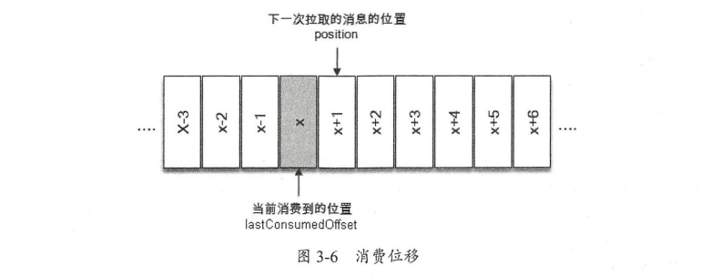

如图所示，x表示某一次拉去操作中分区消息的最大偏移量，假设当前消费者已经消费了x位置的消息，那么我们就可以说消费者的消费位移为x，图中用lastConsumedOffset这个单词来标识它。需要特别注意的是，当前消费者需要提交的消费位移并不是x，而是x+1。

位移提交的具体时机把握很重要，有可能会造成重复消费或消息丢失的现象。

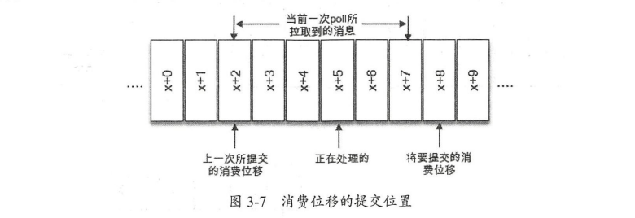

当一次消费操作拉取了消息集为[x+2,x+7]，x+2代表上次提交的消费位移，x+5表示当前正在处理的位置。如果拉到消息就进行了位移提交，提交了x+8，那么当前消费x+5的时候遇到了异常，在故障恢复之后，重新拉取的消息是从x+8开始的。从而引发x+5到x+7之间的消息丢失了。

如果位移提交动作是在消费完所有拉去到的消息后才执行的，那么消费x+5的时候遇到了异常，在故障恢复之后，重新拉取的消息是从x+2开始的。也就是说，x+2到x+4之间的消息又重复消费了一遍，故而又发生了重复消费的现象。

kafka中默认的消费位移提交方式是自动提交，这个由消费者客户端参数配置。这个自动提交不是每消费一条消息提交一次，而是定期提交，默认的客户端设置为5s提交一次。在默认方式下，消费者每隔5s会将拉取的每个分区中最大的消息位移进行提交，在每次真正向服务端发起拉取请求之前会检查是否可以进行位移提交，如果可以，则提交上次轮训位移。

自动位移提交同意存在消息丢失和重复消费的问题，在Kafka中还提供了手动位移提交的方式，这样可以使得开发人员对消费位移的管理控制更加灵活，可以让开发人员根据程序的逻辑在合适的地方进行位移提交。手动提交可以分为同步提交和异步提交。

在一般情况下，位移提交失败的情况很少发生，不重试也没关系，后面的提交也会有成功的。重试会增加代码逻辑复杂度，不重试会增加重复消费的概率。如果消费者异常退出，重复消费的问题很难避免，因为在这种情况下无法及时提交位移，如果消费者正常退出或发生rebalance的情况，可以在退出或rebalance之前使用同步提交的方式做最后把关。

## rebalance

rebalance是指分区的所属权从一个消费者转移到另一消费者的行为，它为消费组具备高可用和伸缩性提供保障，支持方便又安全地删除消费组内的消费者或往消费组添加消费者。在rebalance发生期间，消费组内的消费者是无法读取消息的。

当一个分区被重新分配给另一个消费者时，消费者当前的状态也会丢失。比如消费者消费完某个分区中的一部分消息时还没来得及提交消费位移就发生了rebalance操作，之后这个分区又被分配给了消费组的另一个消费者，原来被消费完的那部分消息又被重新消费一遍，也就是发生了重复消费

## 多线程消费

可以通过多线程的方式实现消息消费，多线程的目的是为了提高整体的消费能力。多线程的实现方式有很多种。

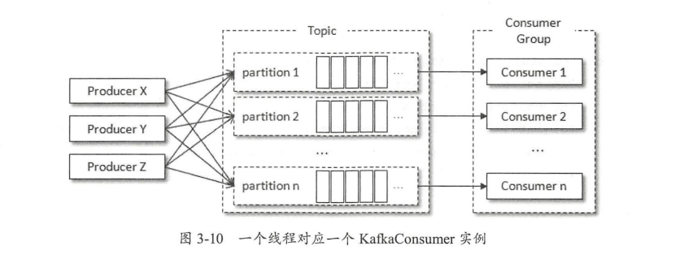

第一种最常见的方式：线程封闭，为每个线程实例化一个KafkaConsumer对象
。一个线程对应一个KafkaConsumer实例，可以称之为消费线程。一个消费线程可以消费一个或多个分区中的消息，所有的消费线程都隶属与同一个消费组。这种实现方式的并发度受限于分区的实际个数，当消费线程的个数大于分区数时，就有部分消费线程一直处于空闲状态。

第二种方式是多个消费线程同时消费同一个分区，这样可以打破原有的消费线程个数不能超过分区数的限制，进一步提高消费的能力。不过这种实现方式对于位移提交和顺序控制的处理就会变得非常复杂，实际应用中使用极少。一般而言，分区是划分消费线程的最小单位。

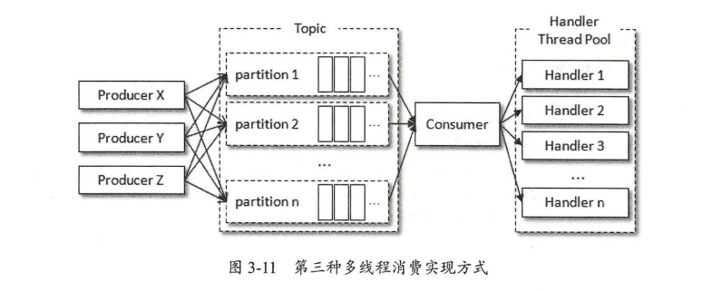

第三种方式将处理消息模块改成多线程的实现方式，相比第一种实现方式而言，提高了横向扩展的能力，减少了TCP连接对系统资源的消耗，缺点是对于消息的顺序处理比较困难。在提交位移的时候需要引入共享变量offsets进行提交，并且共享变量的读写需要保证线程安全，同时防止位移覆盖问题。

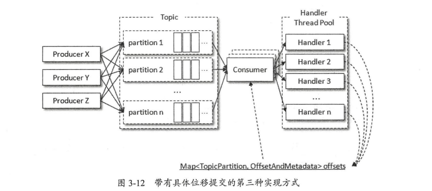

方案三虽然针对位移覆盖做了一定的处理，但还没有解决异常情况下的位移覆盖问题。对此，可以进一步优化方案三，采用滑动窗口的实现方式将拉取的消息暂存起来，多个消费者线程拉取暂存的消息，这个用于暂存消息的缓存大小即为滑动窗口的大小，总体而言没有太多变化，不同的是对消费位移的把控。

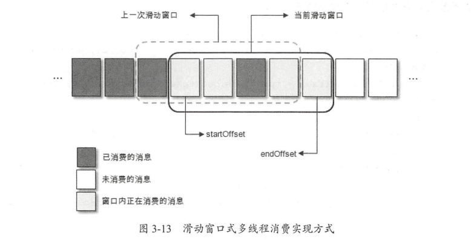

如图所示，一个方格代表一个批次消息，一个滑动窗口包含若干方格，startOffset标注的是当前滑动窗口的起始位置，endOffset标注的是末尾位置。每当startOffset指向的方格中消息被消费完成，就可以提交这部分的位移，与此同时，窗口向前滑动一格，删除原来startOffset所指方格中对应的消息，并且拉取新的消息进入窗口。

滑动窗口的大小固定，所对应的用来暂存消息的缓存大小也就固定了，这部分内存开销可控。方格大小和滑动窗口大小同时决定了消费线程的并发数：一个方格对应一个消费线程，对于窗口大学固定的情况，方格越小并行度越高，对于方格大小固定的情况，窗口越大并行度越高。不过，若窗口设置的过大，不仅会增加内存开销，而且在发生异常的情况下也会引起大量的重复消费。同时考虑线程切换开销，建议根据实际情况设置一个合理的值。

如果一个方格内的消息无法被标记为消费完成，那么就会造成startOffset悬停。为了使窗口能够继续向前滑动，那么就需要设定一个阈值，当startOffset悬停一定时间后对这部分消息进行本地重试消费，如果重试失败则转入重试队列，如果不奏效则转入死信队列，之后可以通过一个额外的处理任务来分析死信队列找出异常原因。