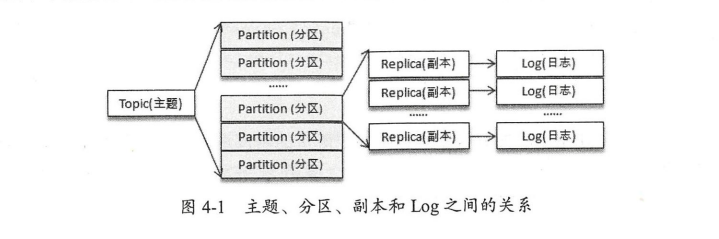

# 主题与分区

主题与分区是Kafka的两个核心概念，生产者和消费者的设计理念所针对的都是主题和分区的操作。主题作为消息的归类，可以再细分为一个或多个分区，分区可以看作对消息的二次归类。分区的划分为Kafka提供了可伸缩性，水平扩展的功能，还通过多副本机制来为Kafka提供数据冗余以提高数据可靠性。

从Kafka的底层实现来说，主题和分区都是逻辑上的概念，分区可以有一至多个副本，每个副本对应一个日志文件，每个日志文件对应一个至多个日志分段(LogSegment)，每个日志分段还可以细分为索引文件，日志存储文件和快照文件等。

主题，分区，副本和日志的关系如图所示，主题和分区都是提供给上层用户的抽象，而在副本层面或日志层面才有实际的物理存在。在同一分区中的多个副本必须分布在不同的broker中，这样才能提供有效的数据冗余。比如分区数为4，副本因子为2，broker数为3的情况下，按照2，3，3的分区副本个数分配给各个broker是最优的选择。再比如分区数为3，副本因子为3，broker数为3，分配3，3，3的分区副本个数给各个broker是最优选择，也就是每个broker中都拥有所有分区的一个副本。

### 分区副本的分配

### 优先副本的选举

分区使用多副本机制来提升可靠性，但只有leader副本对外提供读写服务，而follower副本只负责在内部进行消息的同步。如果一个分区的leader副本不可用，那么意味着整个分区变得不可用，此时就需要Kafka从剩余的follower副本中挑选一个新的leader副本来继续对外提供服务。某种程度上说，broker节点中leader副本个数多少决定了这个节点负载高低。

在创建主题时，主题的分区和副本会尽可能均匀分布到Kafka集群的各个broker节点上，对应leader副本的分配也比较均匀。对于同一个分区，同一个boker节点不可能出现它的多个副本，即一个Kafka集群的一个broker中最多只能有它的一个副本，可以将leader副本所在的broker节点叫做分区的leader节点，follower副本所在的broker节点叫做分区的follower节点

当分区的leader节点发生故障时，其中一个follower节点就会成为新的leader节点，这样就会导致集群的负载不均衡，从而影响整体的健壮性和稳定性。当原来的leader节点恢复后重新加入集群时，它只能成为一个新的follower节点而不再对外提供服务。

为了有效治理负载失衡的情况，Kafka引入了优先副本(preferred replica)的概念。所谓的优先副本是指在AR集合列表中的第一个副本。比如某分区AR集合列表为[1,2,0]，那么分区0的优先副本即为1。

理想情况下，优先副本就是该分区的leader副本，所以也可以称之为preferred leader。Kafka要确保所有主题的优先副本在Kafka集群中均匀分布，这样就保证了所有分区的leader均衡分布，如果leader分布过于集中，就会造成集群负载不均衡。

所谓优先副本选举是指通过一定的方式促使优先副本选举为leader副本，以此来促进集群的负载均衡，这一行为也可以称为分区平衡。分区平衡并不意味着Kafka集群的负载均衡，因为还要考虑集群中的分区分配是否平衡。另外分区中leader副本的负载也是各不相同的。即便集群中分区分配均衡，leader分配均衡，也并不能确保整个集群负载均衡，还需其他指标进一步衡量。

在Kafka中可以提供分区自动平衡的功能，与之对应的broker参数是auto.leader.rebalance.enable，此参数的默认值为true，即默认情况此功能是开启的。如果开启分区自动平衡功能，则Kafka的控制器会启动一个定时任务，轮训所有的broker节点，计算每个broker节点的分区不平衡率(broker不平衡率=非优先副本的leader个数/分区总数)是否超过leader.imbalance.per.broker.percentage参数配置的比值，默认值为10%，如果超过设定的比值会自动执行优先副本的选举动作以求分区平衡。执行周期由参数leader.imbalance.check.interval.seconds控制，默认值为5分钟。

不建议在生产环境中开启分区自动平衡功能，因为这可能引起负面性能问题，也有可能引起客户端一定时间的阻塞。如果在关键时间执行关键任务上优先副本的自动选举操作，势必会有业务阻塞，频繁超时之类的风险。而且分区和副本的均衡也不能完全确保集群整体的均衡，并且集群中一定程度的不均衡也是可以忍受的。可以选择合适的时机手动执行分区平衡。

在实际生产环境中，一般使用path-to-json-file参数来分批，手动执行优先副本的选举操作。尤其是应对大规模Kafka集群时，理应杜绝采用非path-to-json-file参数的选举操作方式。同时，优先副本的选举操作也要注意避开业务高峰期，以免带来性能方面的负面影响。

