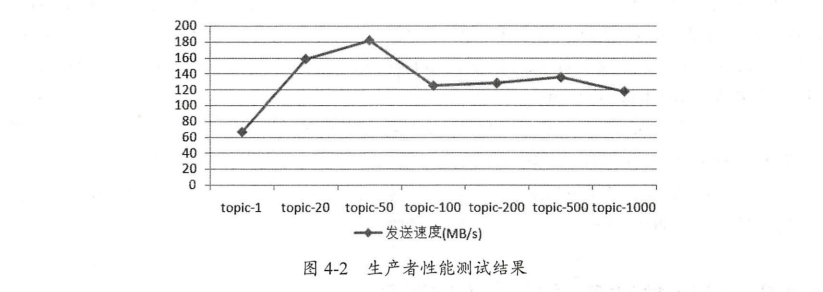
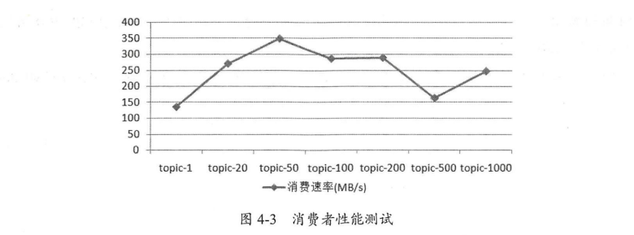

# 主题与分区

主题与分区是Kafka的两个核心概念，生产者和消费者的设计理念所针对的都是主题和分区的操作。主题作为消息的归类，可以再细分为一个或多个分区，分区可以看作对消息的二次归类。分区的划分为Kafka提供了可伸缩性，水平扩展的功能，还通过多副本机制来为Kafka提供数据冗余以提高数据可靠性。

从Kafka的底层实现来说，主题和分区都是逻辑上的概念，分区可以有一至多个副本，每个副本对应一个日志文件，每个日志文件对应一个至多个日志分段(LogSegment)，每个日志分段还可以细分为索引文件，日志存储文件和快照文件等。

主题，分区，副本和日志的关系如图所示，主题和分区都是提供给上层用户的抽象，而在副本层面或日志层面才有实际的物理存在。在同一分区中的多个副本必须分布在不同的broker中，这样才能提供有效的数据冗余。比如分区数为4，副本因子为2，broker数为3的情况下，按照2，3，3的分区副本个数分配给各个broker是最优的选择。再比如分区数为3，副本因子为3，broker数为3，分配3，3，3的分区副本个数给各个broker是最优选择，也就是每个broker中都拥有所有分区的一个副本。

## 分区副本分配

分区分配遵循三个原则

- 将副本平均分布在所有的Broker上

- partition的多个副本应该分配在不同的Broker上

- 如果所有的Broker有机架信息的话，partition副本应该分配到不同的机架上

## 优先副本选举

分区使用多副本机制来提升可靠性，但只有leader副本对外提供读写服务，而follower副本只负责在内部进行消息的同步。如果一个分区的leader副本不可用，那么意味着整个分区变得不可用，此时就需要Kafka从剩余的follower副本中挑选一个新的leader副本来继续对外提供服务。某种程度上说，broker节点中leader副本个数多少决定了这个节点负载高低。

在创建主题时，主题的分区和副本会尽可能均匀分布到Kafka集群的各个broker节点上，对应leader副本的分配也比较均匀。对于同一个分区，同一个boker节点不可能出现它的多个副本，即一个Kafka集群的一个broker中最多只能有它的一个副本，可以将leader副本所在的broker节点叫做分区的leader节点，follower副本所在的broker节点叫做分区的follower节点

当分区的leader节点发生故障时，其中一个follower节点就会成为新的leader节点，这样就会导致集群的负载不均衡，从而影响整体的健壮性和稳定性。当原来的leader节点恢复后重新加入集群时，它只能成为一个新的follower节点而不再对外提供服务。

为了有效治理负载失衡的情况，Kafka引入了优先副本(preferred replica)的概念。所谓的优先副本是指在AR集合列表中的第一个副本。比如某分区AR集合列表为[1,2,0]，那么分区0的优先副本即为1。

理想情况下，优先副本就是该分区的leader副本，所以也可以称之为preferred leader。Kafka要确保所有主题的优先副本在Kafka集群中均匀分布，这样就保证了所有分区的leader均衡分布，如果leader分布过于集中，就会造成集群负载不均衡。

所谓优先副本选举是指通过一定的方式促使优先副本选举为leader副本，以此来促进集群的负载均衡，这一行为也可以称为分区平衡。分区平衡并不意味着Kafka集群的负载均衡，因为还要考虑集群中的分区分配是否平衡。另外分区中leader副本的负载也是各不相同的。即便集群中分区分配均衡，leader分配均衡，也并不能确保整个集群负载均衡，还需其他指标进一步衡量。

在Kafka中可以提供分区自动平衡的功能，与之对应的broker参数是auto.leader.rebalance.enable，此参数的默认值为true，即默认情况此功能是开启的。如果开启分区自动平衡功能，则Kafka的控制器会启动一个定时任务，轮训所有的broker节点，计算每个broker节点的分区不平衡率(broker不平衡率=非优先副本的leader个数/分区总数)是否超过leader.imbalance.per.broker.percentage参数配置的比值，默认值为10%，如果超过设定的比值会自动执行优先副本的选举动作以求分区平衡。执行周期由参数leader.imbalance.check.interval.seconds控制，默认值为5分钟。

不建议在生产环境中开启分区自动平衡功能，因为这可能引起负面性能问题，也有可能引起客户端一定时间的阻塞。如果在关键时间执行关键任务上优先副本的自动选举操作，势必会有业务阻塞，频繁超时之类的风险。而且分区和副本的均衡也不能完全确保集群整体的均衡，并且集群中一定程度的不均衡也是可以忍受的。可以选择合适的时机手动执行分区平衡。

在实际生产环境中，一般使用path-to-json-file参数来分批，手动执行优先副本的选举操作。尤其是应对大规模Kafka集群时，理应杜绝采用非path-to-json-file参数的选举操作方式。同时，优先副本的选举操作也要注意避开业务高峰期，以免带来性能方面的负面影响。

## 分区重分配

当集群中的一个节点突然宕机下线或者要对集群中的一个节点进行有计划下线操作时，为了保证分区和副本的合理分配，希望通过某种方式将该节点的分区副本迁移到其他可用节点上。

当集群中新增broker节点时，只有新创建的主题分区才有可能被分配到这个节点上，而之前的主题分区并不会自动分配到新加入的节点中，这样新节点的负载和原节点的负载之间严重不均衡。

为了解决上述问题，需要让分区副本再次进行合理的分配，也就是所谓的分区重分配。Kafka提供了kafka-reassign-partitions.sh脚本来执行分区重分配工作。

分区重分配的基本原理是先通过控制器为每个分区添加新副本(增加副本因子)，新的副本将从分区的leader副本那里复制所有的数据。根据分区的大小不同，复制过程可能需要花一些时间。在复制完成之后，控制器将旧副本从副本清单里移除(恢复原来的副本因子数)。注意在重分配过程中要确保有足够的空间。

分区重分配对集群的性能有很大影响，需要占用额外的资源，比如网络和磁盘。在实际操作中，建议降低重分配的粒度，分成多个小批次来执行，以此来将负面影响降到最低。也可以对副本间的复制进行限流来保证重分配期间整体服务不受太大影响。

创建主题后我们可以修改分区数，同样可以修改副本因子。修改副本因子的使用场景也很多，比如在创建主题时填写了错误的副本因子而需要修改，再比如运行一段时间后想要通过增加副本因子数来提高容错性和可靠性。与修改分区数不同的是，副本数还可以减少。

## 选择合适的分区数

如何选择合适的分区数？这个问题没有固定的答案，只能从某些角度来做具体的分析，最终需要根据实际的业务场景，软件条件，硬件条件和负载情况等来做具体考量。

性能与分区数有着必然的关系，在设定分区数时一般需要考虑性能因素，首先可以使用性能测试工具对生产消费性能进行评估。

消息中间价的性能一般是指吞吐量和延迟。抛开硬件资源影响，消息写入的吞吐量还会受到消息大小，压缩方式，发送方式，消息确认类型，副本因子等参数的影响，消息消费的吞吐量还会受到应用逻辑处理速度的影响。

创建分区数为1，20，50，100，200，500，1000的主题，对应的topic名称分别为topic-1，topic-20，topic-50，topic-100，topic-200，topic-500，topic-1000，所有主题的副本因子都设置为1

生产者的benchmark结果如图所示

消费者的benchmark结果如图所示

从吞吐量方面考虑，增加合适的分区数可以在一定程度上提升整体吞吐量，但超过对应的阈值之后吞吐量不升反降。如果应用对吞吐量有一定程度的要求，建议在投入生产环境之前对同款硬件资源做一个完备的吞吐量测试，以找到合适的分区数阈值区间。

分区数不能一味增加，分区数会占用文件描述符，一个进程所能支配的文件描述符是有限的，也就是通常所说的文件句柄开销。虽然可以通过修改配置来增加文件描述符的个数，但是在选择合适的分区数之前，最好考量一下当前Kafka进程中已经使用的文件描述符个数。

