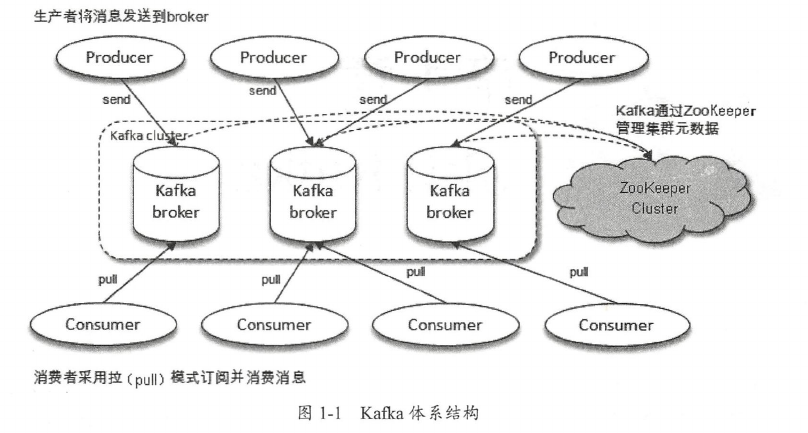
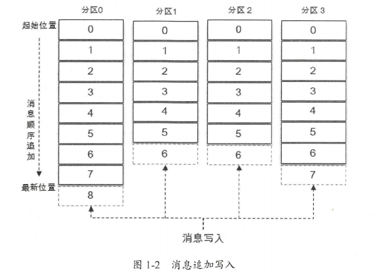
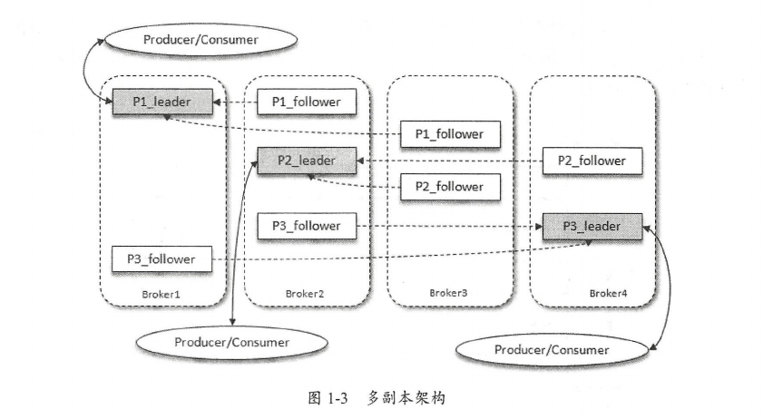
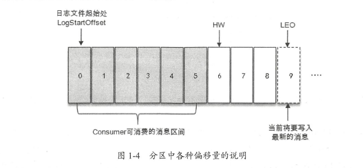

# kafka体系结构

Kafka是一个分布式流式处理平台，具有高吞吐，可持久化，可水平扩展，支持流式数据处理等多种特性。支持与多种开源分布式处理系统Cloudra，Storm，Spark，Flink等进行集成。

## 体系结构

一个典型的Kakfa体系架构包括若干Producer，若干broker，若干Consumer，以及一个Zookeeper集群。

- Zookeeper：是Kafka用来负责集群元数据管理，控制器选举等操作的。

- Producer：生产者，发送消息的一方。生产者负责创建消息，然后将其投递到Kafka中。

- Consumer：消费者，接收消息的一方。消费者连接到Kafka并接收消息，进行相应的业务逻辑处理。

- Broker：服务代理节点，对Kafka而言，一个Broker可以看作一个Kafka实例，一个或多个Broker组成了一个Kafka集群。

## 主题与分区

Kafka中有两个特别重要的概念：主题(Topic)与分区(Partition)，Kafka中的消息以主题为单位进行归类，生产者和消费者都以主题为目标进行生产和消费。

主题是一个逻辑概念，物理上划分为多个分区，一个分区只属于单个主题，同一主题下的不同分区包含的消息是不同的。

分区在存储层面可以看作一个可追加的日志文件，消息在被追加到分区日志文件时会分配一个特定的偏移量(offset)，offset是消息在分区中的唯一标识，Kafka通过它来维护消息在分区中的顺序性。

Kafka保证同一分区内消息有序，而不保证主题中的消息有序。

如图所示的topic有4个分区，消息被顺序追加到每个分区日志文件的尾部。Kafka中的分区分布在不同的服务器(broker)上，也就是说，一个主题可以横跨多个broker，以此来提供比单个broker更强大的功能。

每一条消息被发送到broker之前，会根据分区规则选择存储到哪个具体分区。如果分区规则设定的合理，所有的消息都可以均匀的分配到不同的分区中。

如果一个主题只对应一个文件，那么这个文件所在的机器的IO将成为这个主题的性能瓶颈，而分区解决了这个问题。

在创建主题的时候可以通过指定的参数来设置分区的个数，当然也可以在主题创建完成之后去修改分区的数量，通过增加分区的数量可以实现水平扩展。

## 副本

Kafka为分区引入了多副本(Replica)机制，通过增加副本数量可以提升容灾能力。同一分区的不同副本中保存相同的消息(同一时刻，副本之间并非完全一样)，副本之间是一主多从的关系，其中leader副本负责处理读写请求，follower副本只负责与leader副本的消息同步。

副本处于不同的broker中，当leader副本出现故障时，从follower副本中重新选举新的leader副本对外提供服务。kafka通过多副本机制实现了故障的自动转移，当kafka集群中某个broker失效时仍然能保证服务可用。

如图所示，kafka集群中有4个broker，某个topic有3个分区，且副本因子也为3，如此每个分区便有1个leader副本和2个follower副本。生产者和消费者只与leader副本交互，follower副本只负责消息同步，很多时候follower副本中的消息相对leader副本会有一定的滞后

分区中的所有副本统称为AR(Assigned Replicas)。所有与leader副本保持一定程度同步的副本(包括leader副本在内)组成ISR(In-Sync Replicas)，ISR集合是AR集合中的一个子集。与leader副本同步滞后过多的副本(不包括leader副本)组成OSR(Out-of-Sync Replicas)，由此可见，AR = ISR + OSR。在正常情况下，所有的follower副本都应该与leader副本保持一定程度的同步，即AR = ISR，OSR集合为空。

leader副本负责维护和跟踪ISR集合中所有follower副本的滞后状态，当follower副本落后太多或失效时，leader副本会把它从ISR集合中剔除。如果OSR集合中有follower副本追上了leader副本，那么leader副本会把它从OSR集合转移至ISR集合。

默认情况下，当leader副本发生故障时，只有在ISR集合中的副本才有资格被选举为新的leader，而在OSR集合中的副本则没有任何机会。

## HW与LEO

HW是High Wartermark的缩写，俗称高水位，它标识了一个特定的消息偏移量(offset)，消费者只能拉取到这个offset之前的消息。

LEO是Log End Offset的缩写，它标识当前日志文件中下一条待写入消息的offset，LEO的大小相当于当前日志分区中最后一条消息的offset值加1。

分区ISR集合中的每个副本都会维护自身的LEO，而ISR集合中最小的LEO即为分区的HW，对消费者而言只能消费HW之前的消息。

如图所示，它代表一个日志文件，这个日志文件中有9条消息，第一条消息的offset(LogStartOffset)为0，最后一条消息的offset为8,offset为9的消息用虚线表示，代表下一条待写入的消息。日志文件的HW为6,表示消费者只能拉到offset在0至5之间的消息，而offset为6的消息对消费者而言是不可见的。

由此可见，kafka的复制机制既不是完全的同步复制，也不是单纯的异步复制。事实上，同步复制要求所能工作的follower副本都复制完，这条消息才会被确认为已成功提交，这种复制方式极大地影响了性能。

而在异步复制方式下，follower副本异地从leader副本中复制数据，数据只要被leader副本写入就被认为已经成功提交。在这种情况下，如果follower副本都还没有复制完而落后于leader副本，突然leader副本宕机，则会造成数据丢失。kafka使用这种ISR方式则有效地权衡了数据可靠性和性能之间的关系。
