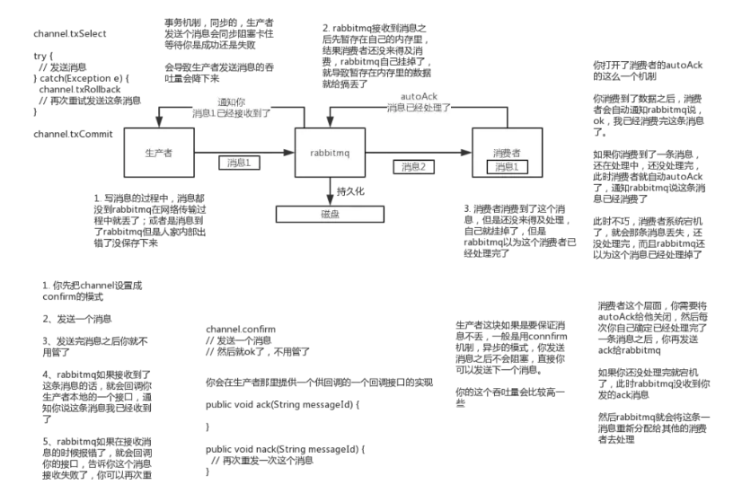

# 分布式消息队列：如何保证消息的可靠性传输

## rabbitmq

### 生产者丢失数据

生产者将数据发送到rabbitmq时，可能由于网络原因，导致数据的丢失。

这时可以选择使用rabbitmq提供的事务功能，就是生产者发送数据之前开启rabbitmq事务(channel.txSelect)，然后发送消息，如果消息没有成功被rabbitmq接收到，那么生产者会收到异常报错，此时就可以回滚事务(channel.txRollback)，然后重试发送消息，如果收到了消息，那么可以提交事务(channel.txCommit)。缺点是rabbitmq事务会降低吞吐量。

另外一种做法是开启confirm模式，在生产者那里设置开启confirm模式之后，每次写的消息都会分配一个唯一的id，然后如果写入了rabbitmq中，rabbitmq会回传一个ack信息，如果rabbitmq没能处理这个消息，会回调生产者提供的nack接口，通知生产者消息接收失败。生产者可以结合这个机制在自己的内存里维护每个消息id的状态，如果超过一定时间没有接收这个消息的回调，可以重发。

事务机制和confirm机制的最大不同在于，事务机制是同步的，提交一个事务之后会阻塞在那里，但是confirm机制是异步的，发送某个消息后可以发送下一个消息，rabbitmq接收了消息后会异步回调生产者的接口通知生产者消息已收到。

因此，在生产者部分避免数据丢失一半都采用confirm机制。

### rabbitmq丢失数据

为保证rabbitmq不丢失数据，必须开启rabbitmq的持久化，消息写入后会持久化到磁盘，这样即便rabbitmq挂掉，恢复之后会自动读取之前存储的数据。如果rabbitmq持久化之前挂掉，可能会导致少量数据丢失。

设置持久化有两个步骤，第一个是创建queue的时候将其设置为持久化的，这样就可以保证rabbitmq持久化queue的元数据，但是不会持久化queue里的数据；第二个是发送消息的时候将消息的deliveryMode设置为2，就是将消息设置为持久化的，此时rabbitmq就会将消息持久化到磁盘上去。必须要同时设置这两个持久化才行，rabbitmq哪怕是挂了，再次重启，也会从磁盘上重启恢复queue，恢复这个queue里的数据。

持久化可以跟生产者的confirm机制配合起来，只有消息被持久化到磁盘之后，才会通知生产者(ack)，所以如果在持久化到磁盘之前，rabbitmq挂了，数据丢了，生产者收不到ack，可以重发。

### 消费端丢失数据

消费端丢失数据的情形：如果消费者读到一个消息，还没来得及处理就挂掉，rabbitmq认为该条消息已处理，会导致数据丢失。

这个时候可以使用rabbitmq提供的ack机制，简单来说，就是关闭rabbitmq的自动ack，每次自己代码里确保处理完的时候，在程序里ack。这样的话，如果你还没处理完，rabbitmq未收到ack，就会把这个消费分配给别的consumer去处理，消息是不会丢的。

## kafka

### 消费端丢失数据

消费者消费到了某个消息，然后消费者自动提交了offset，让kafka认为已经消费好了这个消息，消费者尚未处理自己就挂了，此时这条消息就就丢失。

kafka会自动提交offset，那么只要关闭自动提交offset，在处理完之后自己手动提交offset，就可以保证数据不会丢。但是此时确实还是会重复消费，比如消费者刚处理完，还没提交offset，结果自己挂掉，此时肯定会重复消费一次，消费者需要保证幂等性。

### kafka丢失数据

这块比较常见的一个场景，就是kafka某个broker宕机，然后重新选举partiton的leader时。如果此时其他的follower刚好还有些数据没有同步，结果此时leader挂了，然后选举某个follower成leader之后，就会丢失一些数据。

此时一般是要求起码设置如下4个参数：

- 给这个topic设置replication.factor参数：这个值必须大于1，要求每个partition必须有至少2个副本

- 在kafka服务端设置min.insync.replicas参数：这个值必须大于1，这个是要求一个leader至少感知到有至少一个follower还跟自己保持联系，没掉队，这样才能确保leader挂了还有一个follower吧

- 在producer端设置acks=all：这个是要求每条数据，必须是写入所有replica之后，才能认为是写成功了

- 在producer端设置retries=MAX（很大很大很大的一个值，无限次重试的意思）：这个是要求一旦写入失败，就无限重试，卡在这里了

这样配置之后，至少在kafka broker端就可以保证在leader所在broker发生故障，进行leader切换时，数据不会丢失

### 生产者会不会丢失数据

如果按照上述的思路设置了ack=all，一定不会丢，要求是，leader接收到消息，所有的follower都同步到了消息之后，才认为本次写成功了。如果没满足这个条件，生产者会自动不断的重试，重试无限次。
