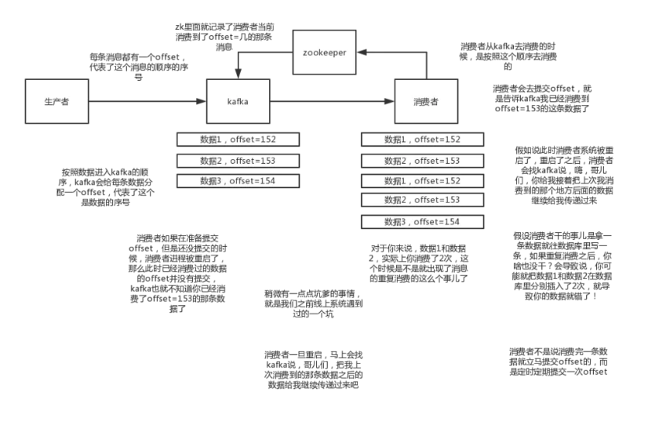
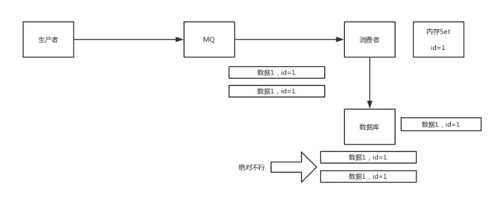

# 分布式消息队列：如何保证消息不被重复消费

rabbitmq、rocketmq、kafka，都有可能会出现消费重复消费的问题。因为这个问题通常不是mq自己保证的，是消费者保证的。我们以kafka来举个例子，说说怎么重复消费的原因。

kafka实际上有个offset的概念，就是每个消息写进去，都有一个offset，代表他的序号，然后consumer消费了数据之后，每隔一段时间，会把自己消费过的消息的offset提交一下，代表我已经消费过了，consumer如果重启，则继续从上次消费到的offset来消费。

但是凡事总有意外，有时候重启系统，如何重启？如果直接kill进程了，再重启。这会导致consumer有些消息处理了，但是没来得及提交offset。重启之后，少数消息会再次消费一次。

其实重复消费不可怕，可怕的是你没考虑到重复消费之后，怎么保证幂等性。

通俗点说，就一个数据，或者一个请求，给你重复来多次，你得确保对应的数据是不会改变的，不能出错。

其实还得结合业务思考

1. 比如你拿个数据要写库，你先根据主键查一下，如果这数据都有了，你就别插入了，update一下

2. 比如你是写redis，那没问题了，反正每次都是set，天然幂等性

3. 比如你不是上面两个场景，那做的稍微复杂一点，你需要让生产者发送每条数据的时候，里面加一个全局唯一的id，类似订单id之类的东西，然后你这里消费到了之后，先根据这个id去比如redis里查一下，之前消费过吗？如果没有消费过，你就处理，然后这个id写redis。如果消费过了，那你就别处理了，保证别重复处理相同的消息即可。

还有比如基于数据库的唯一键来保证重复数据不会重复插入多条，我们之前线上系统就有这个问题，就是拿到数据的时候，每次重启可能会有重复，因为kafka消费者还没来得及提交offset，重复数据拿到了以后我们插入的时候，因为有唯一键约束了，所以重复数据只会插入报错，不会导致数据库中出现脏数据如何保证MQ的消费是幂等性的，需要结合具体的业务来看

