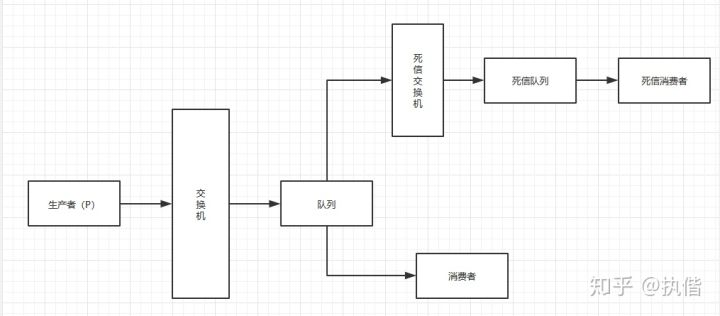

# 分布式消息队列：消息处理失败和死信队列

在生产环境中使用MQ一般会设计两个队列，一个是核心业务队列，一个是死信队列。为了保证数据不丢失，当消息消费发生异常时，将消息投入到死信队列中，方便我们查看消息失败的原因并对失败的消息进行集中处理。

## RabbitMQ

### 死信队列的概念

死信在RabbitMQ中是一种消息机制，当队列里的消息出现以下情况时：

1. 消息被否定确认，使用 channel.basicNack 和 channel.basicReject ，并且此时 requeue 属性被设置为 false。

2. 消息的队列存活时间超过设置的TTL时间。

3. 消息队列的消息数量已经超过最大队列长度。

那么该消息将成为"死信"。

"死信"消息会被RabbitMQ进行特殊的处理，如果配置了死信队列信息，那么该消息将会被丢弃进死信队列中，如果没有配置，则该消息将会被丢弃。

### 如何配置死信队列

RabbitMQ中配置死信队列大致步骤如下：

1. 配置业务队列，绑定到业务交换器上。

2. 为业务队列配置死信交换器和路由键。

3. 为死信交换器配置死信队列。

并不是直接声明一个公共的死信队列，然后所以死信消息就自己跑到死信队列里去了。而是为每个需要使用死信的业务队列配置一个死信交换机，这里同一个项目的死信交换机可以共用一个，然后为每个业务队列分配一个单独的路由key。

有了死信交换机和路由key后，接下来，就像配置业务队列一样，配置死信队列，然后绑定在死信交换器上。

死信队列并不是什么特殊的队列，只不过是绑定在死信交换器上的队列。死信交换机也不是什么特殊的交换机，只不过是用来接受死信的交换机，所以可以为任何类型(Direct、Fanout、Topic)。

一般来说，会为每个业务队列分配一个独有的路由key，并对应的配置一个死信队列进行监听，也就是说，一般会为每个重要的业务队列配置一个死信队列。

### 死信队列的生命周期

死信消息是RabbitMQ为我们做的一层保证，其实我们也可以不使用死信队列，而是在消息消费异常时，将消息主动投递到另一个交换器中，死信队列的生命周期：

1. 业务消息被投入业务队列

2. 消费者消费业务队列的消息，由于处理过程中发生异常，于是进行了nck或者reject操作

3. 被nck或reject的消息由RabbitMQ投递到死信交换机中

4. 死信交换机将消息投入相应的死信队列

5. 死信队列的消费者消费死信消息

## Kafka

kafka中没有实现死信队列的功能，但是由于当前的message的offset如果不提交，就会阻塞后续的消费，所以需要预留失败的message补偿的机制；实现方法有几种：

### 本地队列

用本地队列去控制，设置在定时器中，给任务设置30s，5min，30min三次重试的机会，如果不行，持久化到DB中，进行人工干预，当然报警、日志都要跟上。

优点：逻辑简单、实现简单。

缺点：需要一些机制保证本地cache的可靠性，比如加hook预防服务更新，但是这样仍不能完全解决，还要面临初始化重试队列、宕机来不及调用hook等问题。

### 失败后直接放入新的topic：Retry+topic

这种思路也面临很大的问题：就是kafka没有实现延时的功能，那么新的message可能瞬时就被消费了，但是这个时候导致失败的原因，比如DB连接、网络问题没有解决，很快尝试几次之后，就进到死信队列了。

还有一种是《深入kafka》一书中也讲了一些方法，但是都需要改动kafka的内部实现，这个不太适合小型项目。

### 失败后直接放入新的topic，Redis实现延时功能

redis是很普遍的组件，而且对于少量失败、且对重试时间要求没那么严格的情况下，redis很适合，redis的持久化、哨兵之类的，对可靠性保证的还是很不错的。

