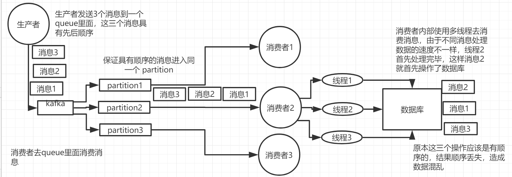
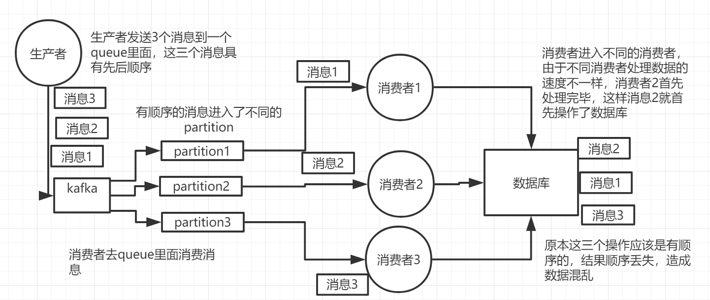
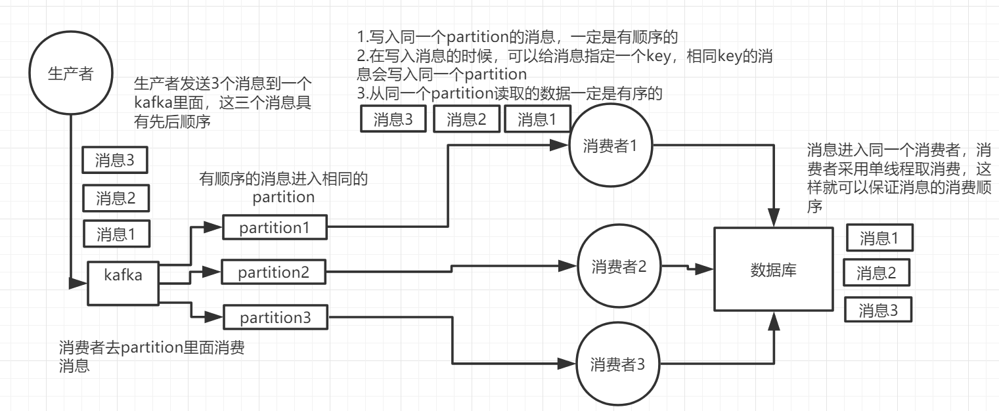
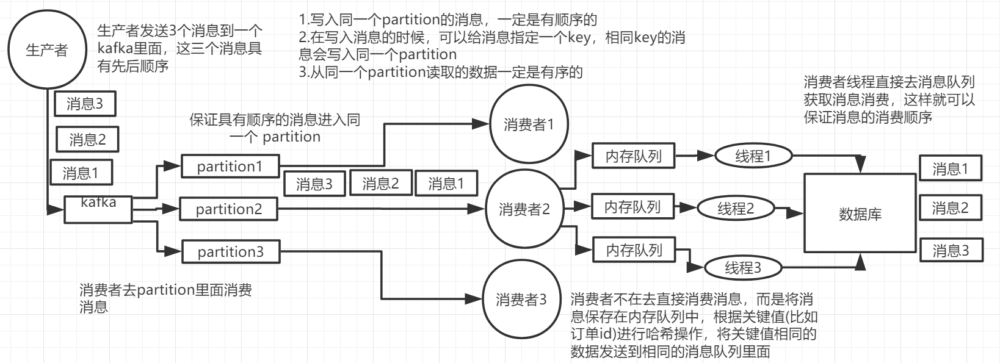

# 分布式消息队列：如何保证消息按顺序执行

## 为什么要保证顺序

消息队列中若干消息如果对一个数据进行操作，这些操作具有前后的关系，则必须按照前后顺序执行，否则就会造成数据异常。

比如，通过mysql binlog进行两个数据库的数据同步，由于对数据库的数据操作是具有顺序性的，如果操作顺序搞反，就会造成不可估量的错误。比如数据库对一条数据依次进行了插入-> 更新 -> 删除操作，这个顺序必须是这样，如果在同步过程中，消息的顺序变成了删除 -> 插入 -> 更新， 那么原本应该被删掉的数据，就没有被删除，造成数据不一致的问题。

## 出现顺序错乱的场景

### rabbitmq

1. 一个queue，有多个consumer去消费，这样就会造成顺序的错误，consumer从MQ里面读取出来的数据是有序的，但是每个consumer的执行时间是不固定的，无法保证先读到消息的consumer一定先完成操作，这样就会出现消息并没有按照顺序执行，造成数据顺序错乱。

2. 一个queue对应一个consumer，但是consumer里面进行了多线程消费，这样也会造成消息消费顺序错误。

### kafka

kafka一个topic，一个partition，一个consumer，但是consumer内部进行多线程消费，这样数据也会出现顺序错乱问题。

具有顺序的数据写入到了不同的partition里面，不同的消费者去消费，但是每个consumer的执行时间是不固定的，无法保证先读到消息的consumer一定先完成工作，这样就会出现消息并没有按照顺序执行，造成数据顺序错误。

## 保证消息的消费顺序

### rabbitmq

1. 拆分多个queue，每个queue一个consumer，就是多一些queue，这样做会造成吞吐量下降。

2. 一个queue对应一个consumer，这个consumer内部用内存队列做排队，然后分发给底层不同的worker来处理

### kafka

1. 确保同一个消息发送到同一个partition，一个partition对应一个consumer，内部单线程消费。

2. 写N个内存queue，然后N个线程分别消费一个内存queue即可

