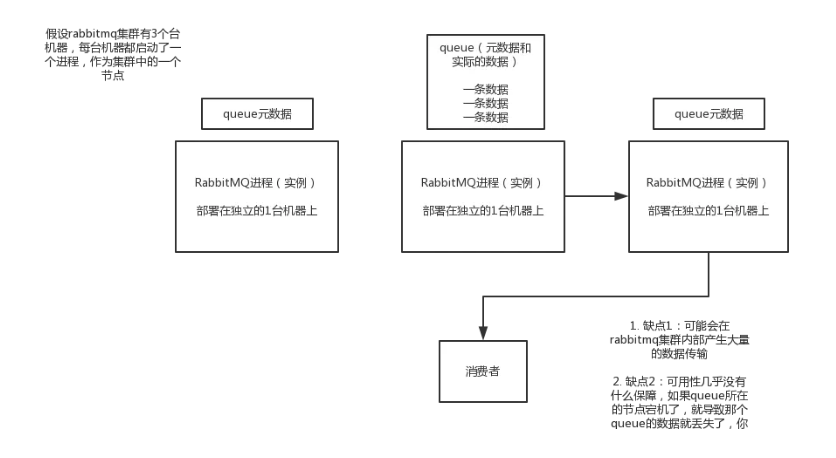
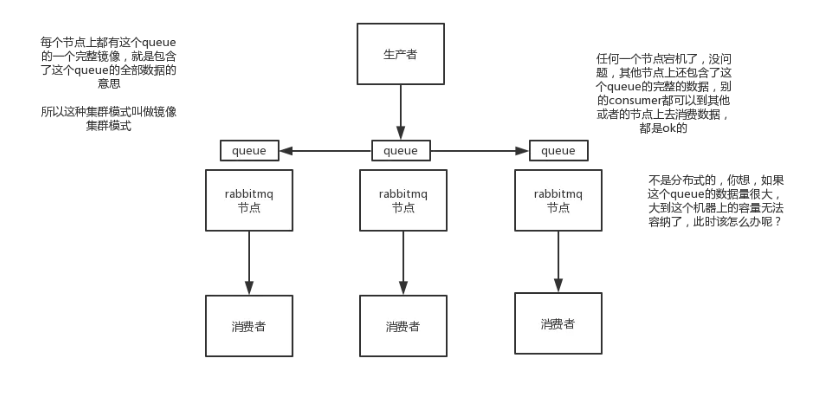
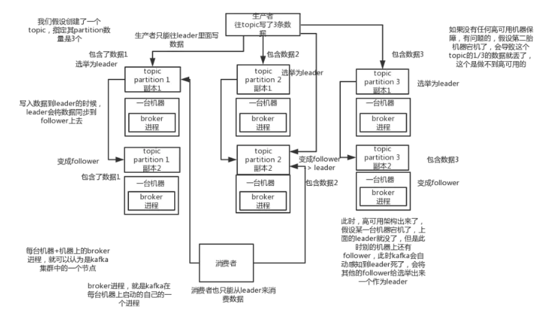

# 分布式消息队列：如何保证消息队列的高可用

## Rabbitmq的高可用性

Rabbitmq是比较有代表性的，它是基于主从实现高可用性的。

### rabbitmq的三种模式

- 单机模式

- 普通集群模式

- 镜像集群模式

**单机模式**

就是demo级别的，一般只在本地启动测试，没人在生产环境使用。

**普通集群模式**

在多台机器上启动多个RabbitMQ实例，每个机器启动一个。但是创建的queue只会放在一个RabbitMQ实例上，每个实例都同步queue的元数据。在实际消费的时候，如果连接了存放非queue数据的实例，那么这个实例会从queue数据所在的实例上把数据拉取过来。这种方式确实很麻烦，没做到所谓的分布式，只是普通的集群。因为这导致你要么消费者每次随机连接一个实例然后拉取数据，要么固定连接那个queue所在实例消费数据，前者有数据拉取的开销，后者导致单实例性能瓶颈。

如果存放queue数据的实例宕机，会导致其他实例无法从它拉取，如果开启消息持久化，让queue数据落盘，消息不一定会丢失，但需要等待这个实例恢复了，才可以继续从这个queue拉取数据。所以这种情况没有什么所谓的高可用性可言，这个方案主要是提高吞吐量，就是说让集群中多个节点来服务某个queue的读写操作。

**集群镜像模式**

这种模式才是所谓的RabbitMQ的高可用模式，跟普通集群模式不一样的是，你创建的queue，无论元数据还是queue的数据都会存在于多个实例上，每次写消息到queue的时候，都会自动进行多实例的同步。

这样做的好处在于任何一个节点宕机了，其余节点仍然可用。缺点是同步每台机器网络开销过大，新增机器需要同步所有的queue数据，扩展性较差。

rabbitmq有很好的管理控制台，就是在后台新增一个策略，这个策略是镜像集群模式的策略，指定的时候可以要求数据同步到所有节点的，也可以要求就同步到指定数量的节点，然后你再次创建queue的时候，应用这个策略，就会自动将数据同步到其他的节点上去了。

## kafka的高可用性

kafka一个最基本的架构认识：多个broker组成，每个broker是一个节点；你创建一个topic，这个topic可以划分为多个partition，每个partition可以存在于不同的broker上，每个partition就放一部分数据。

这就是天然的分布式消息队列，就是说一个topic的数据，是分散放在多个机器上的，每个机器就放一部分数据。 

实际上rabbitmq之类的，并不是分布式消息队列，他就是传统的消息队列，只不过提供了一些集群、HA的机制而已，因为无论怎么玩儿，rabbitmq一个queue的数据都是放在一个节点里的，镜像集群下，也是每个节点都放这个queue的完整数据。

kafka 0.8以前，是没有HA机制的，就是任何一个broker宕机了，那个broker上的partition就废了，没法写也没法读，没有什么高可用性可言。

kafka 0.8以后，提供了HA机制，就是replica副本机制。每个partition的数据都会同步到吉他机器上，形成自己的多个replica副本。然后所有replica会选举一个leader出来，那么生产和消费都跟这个leader打交道，然后其他replica就是follower。写的时候，leader会负责把数据同步到所有follower上去，读的时候就直接读leader上数据即可。只能读写leader？很简单，要是你可以随意读写每个follower，那么就要care数据一致性的问题，系统复杂度太高，很容易出问题。kafka会均匀的将一个partition的所有replica分布在不同的机器上，这样才可以提高容错性。

这么搞，就有所谓的高可用性了，因为如果某个broker宕机了，没事儿，那个broker上面的partition在其他机器上都有副本的，如果这上面有某个partition的leader，那么此时会重新选举一个新的leader出来，大家继续读写那个新的leader即可。这就有所谓的高可用性了。

写数据的时候，生产者就写leader，然后leader将数据落地写本地磁盘，接着其他follower自己主动从leader来pull数据。一旦所有follower同步好数据了，就会发送ack给leader，leader收到所有follower的ack之后，就会返回写成功的消息给生产者。（当然，这只是其中一种模式，还可以适当调整这个行为）

消费的时候，只会从leader去读，但是只有一个消息已经被所有follower都同步成功返回ack的时候，这个消息才会被消费者读到。

