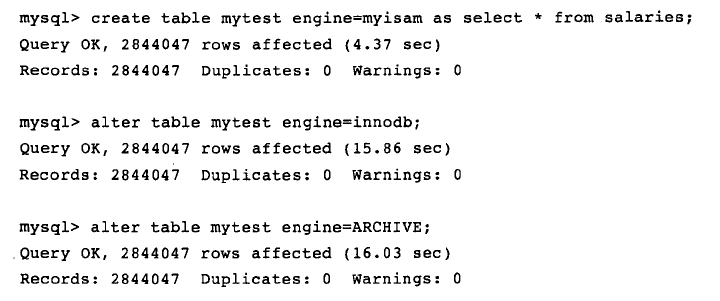

# 存储引擎

MySQL区别于其他数据库的最重要特点就是其插件式的表存储引擎，插件式的存储引擎架构提供了一系列标准的管理和服务的支持。存储引擎是底层物理结构的实现，每个存储引擎开发者都可以按照自己的意愿定制开发。各个存储引擎有各自的特点，支持根据具体的应用建立不同存储引擎表。

## InnoDB存储引擎

InnoDB存储引擎的特点：支持事务，行锁设计，支持外键，非锁定读。

- InnoDB将数据放在一个逻辑表空间中，使用裸设备(row disk)来建立其表空间，这个表空间由InnoDB自身进行管理。每个InnoDB存储引擎的表单独放在一个独立的ibd文件中。

- InnoDB通过使用多版本并发控制(MVCC)来获得高并发性，并且实现了SQL标准的四种隔离级别，默认为REPEATABLE级别。同时使用一种next-key locking策略来避免幻读(phantom)现象的产生。

- InnoDB还提供了插入缓冲(insert buffer)，二次写(double write)，自适应哈希索引(adaptive hash index)，预读(read ahead)等高性能和高可用的功能。

- 对于表中的数据存储，InnoDB采用了聚集(clustered)的方式，每张表的存储都按主键的顺序存放，如果没有显示在表定义时指定主键，InnoDB存储引擎会为每一行生成一个6字节的ROWID，并以此作为主键。

## MyISAM存储引擎

MyISAM存储引擎的特点：不支持事务，表锁设计，不支持外键，对一些OLAP操作速度快。

- MyISAM存储引擎表由MYD和MYI组成，MYD用于存储数据文件，MYI用于存放索引文件。可以通过myisampack工具进一步压缩数据文件，myisampack使用赫夫曼编码静态算法来编码数据。使用myisampack工具压缩后的表是只读的。

- MySQL5.0版本前，MyISAM默认支持的表大小为4GB，如果需要支持大于4GB的MyISAM表，需要修改MAX_ROWS和AVG_ROW_LENGTH属性，MySQL5.0版本开始，MyISAM默认支持256T单表数据，可以满足一般应用需求。

- 对于MyISAM存储引擎表，MySQL数据库只缓存其中的索引文件，数据文件的缓存由操作系统本身完成。

## NDB存储引擎

NDB存储引擎是一个集群存储引擎，其结构是share nothing架构，能提供更高级别的可用性。

- NDB将数据全部存放在内存中，因此主键查找(primary key lookup)速度极快，通过添加NDB数据存储节点(Data Node)可以线性提高数据库性能。NDB是一个高可用，高性能的集群系统。

- NDB存储引擎的连接操作(JOIN)是在MySQL数据库层完成的，复杂的连接操作需要巨大的网络开销，查询速度很慢。

## Memory存储引擎

Memory存储引擎将表中的数据放在内存中，如果数据库重启或者崩溃，表中的数据将全部丢失。它非常适合存储临时数据的临时表。默认使用哈希索引，而不是B+树索引。

- Memory存储引擎只支持表锁，并发性能较差，不支持TEXT和BLOB类型，存储变长字段(varchar)时按照定长字段(char)的方式存储，会带来一定的内存浪费。

- MySQL使用Memory存储引擎作为临时表来存放查询的中间结果集。如果中间结果集大于Memory存储引擎的容量或者中间结果含有TEXT或BLOB类型字段，则MySQL数据库会把其转换到MyISAM存储引擎表存放到磁盘，由于MyISAM不会缓存数据文件，此时会对查询性能带来损失。

## Archive存储引擎

Archive存储引擎只支持INSERT和SELETE操作，其使用zlib算法将数据行(row)进行压缩后存储。压缩比例可达1:10，正如其名所示，Archive存储引擎非常适合存储归档数据，比如日志信息。Archive存储引擎使用行锁来实现高并发插入操作，但是本身不是事务安全的存储引擎，其设计的主要目标是提供高速的插入和压缩功能。

## Federated存储引擎

Federated存储引擎并不存放数据，它只是指向一台远程MySQL数据库服务器上的表，类似于一个透明代理，只支持MySQL数据库表，不支持异构的数据库表。

## Maria存储引擎

Maria设计的主要目的是用来取代原有的MyISAM存储引擎，可以看作是MyISAM的后续版本。它的特点是：缓存数据和索引文件，行锁设计，提供MVCC功能，支持事务和非事务安全的选项，以及更好的BLOB字符类型的处理性能。

除了上面提到的存储引擎外，还有很多其他的存储引擎，包括Merge，CSV，Sphinx和Infobright，它们都有各自的适用场景。

通过SHOW ENGINES语句查看当前使用的MySQL数据库支持的存储引擎，也可以通过查询information_schema架构下的ENGINES表来查看

下面的例子简单展示了使用不同存储引擎保存数据底层存储空间使用情况：

通过每次的统计我们发现：当最初的表使用MyISAM存储引擎时，表的大小为40.7MB，使用InnoDB存储引擎时，表增大到了113.6MB，而使用Archive存储引擎时，表的大小只有20.2MB。

