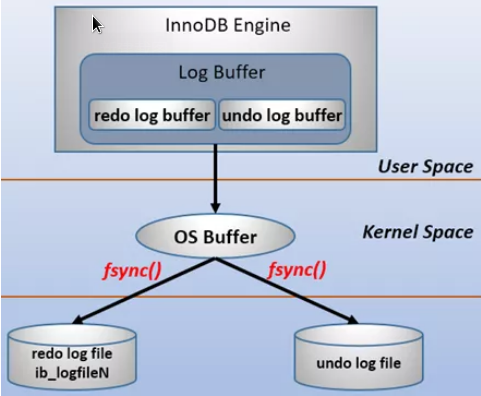
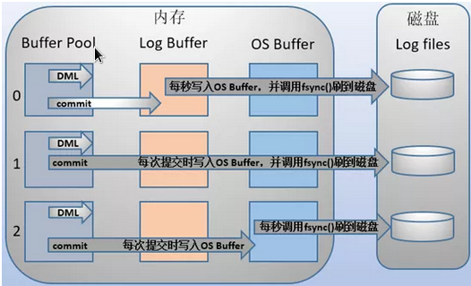
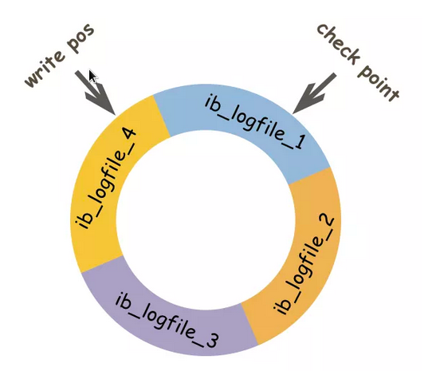

# MySQL的三大日志

日志是 mysql 数据库的重要组成部分，记录着数据库运行期间的各种状态信息。mysql 日志主要包括错误日志，查询日志，慢查询日志，事务日志和二进制日志几大类。

- 逻辑日志：可以简单理解为记录的就是sql语句

- 物理日志：mysql的数据最终保存在数据页中的，物理日志记录的就是数据页变更

作为开发，我们重点需要关注的是二进制日志(binlog)，和事务日志(包括 redo log和undo log)，本文接下来会详细介绍这三种日志。

## binlog

binlog用于记录数据库执行的写入操作(不包括查询信息)，以二进制的形式保存在磁盘中。binlog是mysql的逻辑日志，并且由 server 层进行记录，使用任何存储引擎的 mysql 数据库都会记录 binlog 日志。

binlog是通过追加的方式进行写入的，可以通过 max_binlog_size 参数设置每个binlog文件的大小，当文件大小达到指定值之后，会生成新的文件来保存日志。

### binlog使用场景

在实际应用中，binlog的主要使用场景有两个，分别是主从复制和数据恢复。

1. 主从复制：在 Master 端开启 binlog，然后将binlog发送到各个 Slave 端，Slave端重放 binlog 从而达到主从数据一致。

2. 数据恢复：通过使用mysqlbinlog工具来恢复数据。

### binlog刷盘时机

对于 InnoDB 存储引擎而言，只有在事务提交时才会记录binlog，此时记录还在内存中，那么binlog是什么时候刷到磁盘中的呢？

mysql通过 sync_binlog 参数控制 binlog 的刷盘时机，取值范围是0-N：

- 0：不去强制要求，由系统自行判断何时写入磁盘；

- 1：每次 commit 的时候都要将 binlog 写入磁盘；

- N：每N个事务，才会将 binlog 写入磁盘。

从上面可以看出， sync_binlog 最安全的是设置是 1 ，这也是MySQL 5.7.7之后版本的默认值。但是设置一个大一些的值可以提升数据库性能，因此实际情况下也可以将值适当调大，牺牲一定的一致性来获取更好的性能。

### binlog日志格式

binlog 日志有三种格式，分别为 STATMENT 、 ROW 和 MIXED。

> 在 MySQL 5.7.7 之前，默认的格式是 STATEMENT ， MySQL 5.7.7 之后，默认值是 ROW。日志格式通过 binlog-format 指定。

- STATMENT：基于SQL 语句的复制( statement-based replication, SBR )，每一条会修改数据的sql语句会记录到binlog 中  。

  - 优点：不需要记录每一行的变化，减少了 binlog 日志量，节约了  IO  , 从而提高了性能；

  - 缺点：在某些情况下会导致主从数据不一致，比如执行sysdate() 、  slepp()  等 。

- ROW：基于行的复制(row-based replication, RBR )，不记录每条sql语句的上下文信息，仅需记录哪条数据被修改了 。

  - 优点：不会出现某些特定情况下的存储过程、或function、或trigger的调用和触发无法被正确复制的问题 ；

  - 缺点：会产生大量的日志，尤其是` alter table ` 的时候会让日志暴涨

- MIXED：基于STATMENT 和 ROW 两种模式的混合复制(mixed-based replication, MBR )，一般的复制使用STATEMENT 模式保存 binlog ，对于 STATEMENT 模式无法复制的操作使用 ROW 模式保存 binlog

## redo log

我们都知道，事务的四大特性里面有一个是持久性，具体来说就是只要事务提交成功，那么对数据库的修改就被永久的保存下来，不可能因为任何原因再回到原来的状态。

那么 mysql是如何保证持久性的呢？

最简单的做法是在每次事务提交的时候，将该事务涉及修改的数据页全部刷新到磁盘中。但是这么做会有严重的性能问题，主要体现在两个方面：

- 因为 Innodb 是以 页 为单位进行磁盘交互的，而一个事务很可能只修改一个数据页里面的几个字节，这个时候将完整的数据页刷到磁盘的话，太浪费资源了！

- 一个事务可能涉及修改多个数据页，并且这些数据页在物理上并不连续，使用随机IO写入性能太差！

因此 mysql 设计了 redo log ， 具体来说就是只记录事务对数据页做了哪些修改，这样就能完美地解决性能问题了(相对而言文件更小并且是顺序IO)。

### redo log 基本概念

redo log包括两部分：一个是内存中的日志缓冲(redo log buffer)，另一个是磁盘上的日志文件(redo logfile)。

mysql 每执行一条 DML 语句，先将记录写入redo log buffer，后续某个时间点再一次性将多个操作记录写道redo logfile，这种先写日志，再写磁盘的技术就是 mysql 里经常说的 WAL(Write-Ahead Loggin)技术。

在计算机操作系统里，用户空间(user space)下的缓冲区数据一般是无法直接写入磁盘的，中间必须经过操作系统内核空间(kernel space)缓冲区(os buffer)

因此，redo log buffer 写入 redo logfile 实际上是先写入 os buffer，然后再通过系统调用 fsync() 将其刷到 redo logfile中，过程如下：

mysql 支持三种将 redo log buffer 写入 redo log file 的时机，可以通过 innodb_flush_log_at_trx_commit 参数配置，各参数值含义如下：

- 0 (延迟写) 事务提交时不会将redo log buffer中日志写入到os buffer，而是每秒写入os buffer并调用 fsync() 写入到redo log file中。也就是说设置为0时是(大约)每秒刷新写入到磁盘中，当系统崩溃，会丢失1秒中的数据。

- 1 (实时写，实时刷) 事务每次提交都会将redo log buffer中的日志写入os buffer并调用 fsync() 刷到 redo log file中。这种方式即使系统崩溃也不会丢失任何数据，但是因为每次提交都写入磁盘，IO的性能较差。

- 2 (实时写，延迟刷) 每次提交都仅写入os buffer，然后是每秒调用 fync() 将 os buffer 中的日志写入到redo log file。

### redo log 记录形式

前面说过，redo log实际上记录数据页的变更，而这种变更记录是没必要全部保存的。因此 redo log实现上采用了大小固定，循环写入的方式，当写到结尾时，会回到开头循环写日志。如下图：

同时我们很容易得知， 在innodb中，既有redo log 需要刷盘，还有 数据页 也需要刷盘， redo log存在的意义主要就是降低对 数据页 刷盘的要求。

在上图中， write pos 表示 redo log 当前记录的 LSN (逻辑序列号)位置， check point 表示 数据页更改记录 刷盘后对应 redo log 所处的 LSN(逻辑序列号)位置。

write pos 到 check point 之间的部分是 redo log 空着的部分，用于记录新的记录；check point 到 write pos 之间是 redo log 待落盘的数据页更改记录。当 write pos追上check point 时，会先推动 check point 向前移动，空出位置再记录新的日志。

启动 innodb 的时候，不管上次是正常关闭还是异常关闭，总是会进行恢复操作。因为 redo log记录的是数据页的物理变化，因此恢复的时候速度比逻辑日志(如 binlog )要快很多。

重启innodb 时，首先会检查磁盘中数据页的 LSN ，如果数据页的LSN 小于日志中的 LSN ，则会从 checkpoint 开始恢复。

还有一种情况，在宕机前正处于checkpoint 的刷盘过程，且数据页的刷盘进度超过了日志页的刷盘进度，此时会出现数据页中记录的 LSN 大于日志中的 LSN，这时超出日志进度的部分将不会重做，因为这本身就表示已经做过的事情，无需再重做。

### redo log与binlog区别

- 文件大小：redo log大小是固定的，binlog可通过配置参数max_binlog_size设置每个binlog文件大小。
斌咯哥
- 实现方式：redo log是InnoDB引擎层实现的，并不是所有引擎都有。binlog是server层实现的，所有引擎都可以使用binlog日志

- 记录方式：redo log采用循环写的方式记录，当写到结尾时，会回到开头循环写日志。binlog通过追加的方式记录，当文件大小大于给定值后，后续的日志会记录到新的文件上

- 适用场景：redo log适用于崩溃恢复(crash-safe)，binlog适用于主从复制和数据恢复

由 binlog 和 redo log 的区别可知：binlog 日志只用于归档，只依靠 binlog 是没有 crash-safe 能力的。

但只有 redo log 也不行，因为 redo log 是 InnoDB特有的，且日志上的记录落盘后会被覆盖掉。因此需要 binlog和 redo log二者同时记录，才能保证当数据库发生宕机重启时，数据不会丢失。

## undo log

数据库事务四大特性中有一个是 原子性 ，具体来说就是 原子性是指对数据库的一系列操作，要么全部成功，要么全部失败，不可能出现部分成功的情况。

实际上， 原子性 底层就是通过 undo log 实现的。undo log主要记录了数据的逻辑变化，比如一条 INSERT 语句，对应一条DELETE 的 undo log ，对于每个 UPDATE 语句，对应一条相反的 UPDATE 的 undo log ，这样在发生错误时，就能回滚到事务之前的数据状态。

同时， undo log 也是 MVCC(多版本并发控制)实现的关键。

