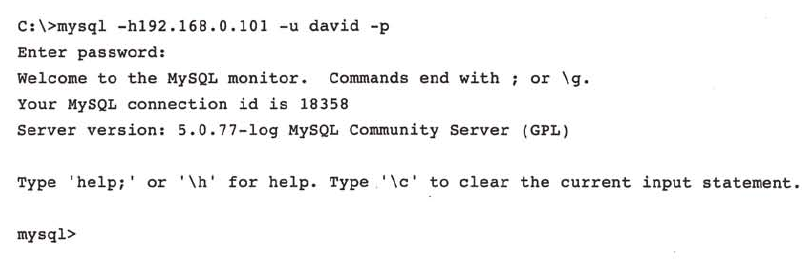
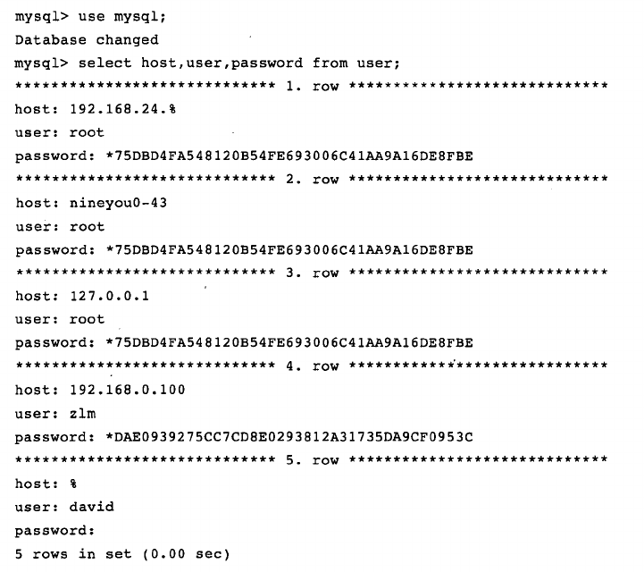
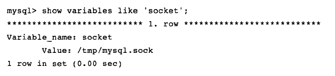
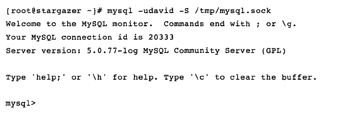

# 连接方式

连接MySQL的操作是连接进程和MySQL数据库实例进行通信，从开发的角度上看，本质是进程通信。常见的进程通信方式：管道，命名管道，TCP/IP套接字，Unix域套接字，共享内存，消息队列等。MySQL提供的连接方式从本质上说都是上述的进程通信方式。

## TCP/IP

TCP/IP套接字方式是MySQL在任何平台下都提供的连接方式，也是网络中使用的最多的一种方式。这种方式在TCP/IP连接上建立一个基于网络的连接请求，一般情况下客户端和MySQL实例分别位于不同机器上，两者通过TCP/IP连接进行网络通信。

这里的客户端是Windows，它向一台IP为192.168.0.101的MySQL实例发起TCP/IP连接请求，并且连接成功。之后，就可以对数据库进行一些操作，比如DDL或DML。

在通过TCP/IP连接到MySQL实例时，MySQL会先检查一张权限视图，用来判断发起请求的客户端IP是否允许连接到MySQL实例。该视图在mysql库下，表名为user

从这张表可以看出，MySQL允许David这个用户在任何IP段下连接该实例，并且不需要密码。此外，还给出了root用户在各个网段下的访问控制权限

## 命名管道和共享内存

如果两个通信的进程在同一台机器上，那么可以使用命名管道。在MySQL数据库中，需要在配置文件中启用--enable-named-pipe选项。MySQL还提供了共享内存的方式，在配置文件中添加--shared-memory。如果想使用共享内存的方式，在连接时，MySQL客户端还必须使用-protocol=memory选项。

## Unix域套接字

在Linux或Unix环境下，可以使用Unix域套接字。Unix域套接字其实不是一个网络协议，所以只能在MySQL客户端和数据库实例在同一台服务器上的情况下可用。使用时需要在配置文件中指定套接字文件的路径，如：-socket=/tmp/mysql.sock。当数据库实例启动时，可以通过下面的方式查找Unix域套接字文件：

知道了Unix域套接字文件的路径后，就可以使用该方式进行连接了：

