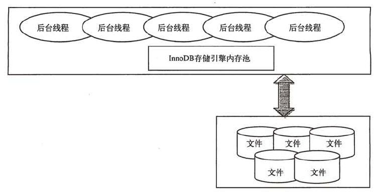
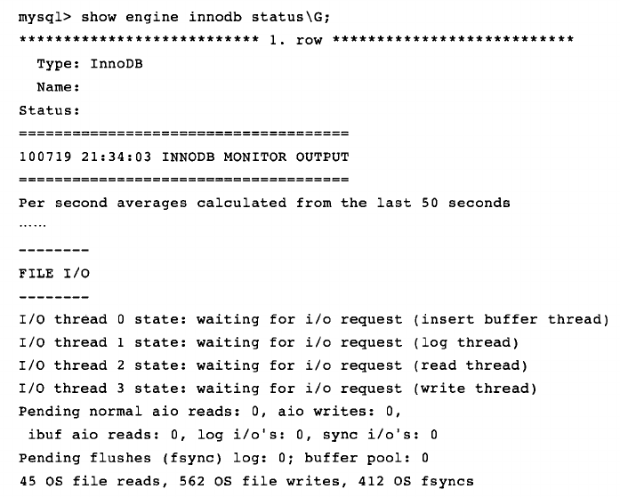
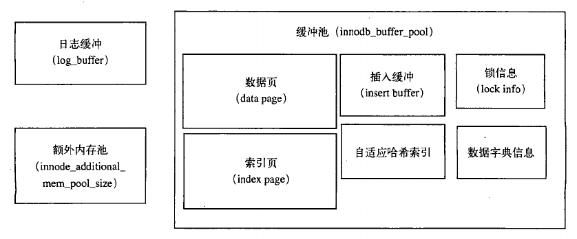

# InnoDB体系结构

InnoDB存储引擎采用多线程模型，维护了由多个内存块组成的内存池。内存池主要作用如下：

- 维护所有线程需要访问的多个内部数据结构。

- 缓存磁盘上的数据，方便快速读取。

- 重做日志(redo log)缓冲。

后台线程的主要作用是负责刷新内存池中的数据，保证缓冲池中的内存缓存的是最近的数据。将已经修改的数据刷新到磁盘文件，保证数据库异常情况下的恢复工作。



## 线程

### Master Thread

Master Thread是一个非常核心的后台线程，主要负责将缓冲池中的数据异步刷新到磁盘，保证数据的一致性。

### IO Thread

在InnoDB存储引擎中大量使用了AIO(Async IO)来处理写IO请求，这样可以极大提高数据库性能。IO Thread主要工作是负责这些IO请求的回调(callback)处理。总共有四类IO Thread，分别是write，read，insert buffer和log IO thread。

可以通过命令SHOW ENGINE INNODB STATUS来观察InnoDB中的IO Thread。



### Purge Thread

事务被提交后，其使用的undolog可能不再需要，因此需要PurgeThread来回收已经使用并分配的undo页。为减轻Master Thread工作，purge操作被分配到单独的线程中执行。用户可以在配置文件中添加如下命令启动独立的Purge Thread

```
[mysqld]

innodb_purge_threads = 1
```

### Page Cleaner Thread

Pager Cleaner Thread线程的作用是将之前版本中脏页的刷新操作都放入到单独的线程中完成，以减轻Master Thread的工作。减少用户查询线程的阻塞，进一步提高InnoDB存储引擎的性能。

## 内存

InnoDB将内存划分为三个部分：缓冲池(buffer pool)，重做日志缓冲(redo log_buffer)和额外内存池(innodb_additional_mem_pool_size)。



### 缓冲池

缓冲池简单来说就是一块内存区域，通过内存的速度来弥补速度较慢的磁盘对数据库性能的影响，因此缓冲池大小直接影响数据库的整体性能。

- 在数据库中进行读取页的操作，首先将从磁盘读取到的页放在缓冲池中，这个过程称为将页"Fix"在缓冲池中。下次读取相同的页时，首先判断该页是否放在缓冲池中，如果在则直接读取该页，否则读取磁盘。

- 对于数据库中页的修改操作，则首先修改在缓冲池中的页，然后再以一定的频率刷新到磁盘上。这里需要注意的是，页从缓冲池刷新回磁盘的操作并不是每次页发生变更时触发，而是通过一种称为Checkpoint的机制刷新回磁盘。

- 对于InnoDB存储引擎而言，其缓冲池的配置通过参数innodb_buffer_pool_size来设置，缓冲池中的数据页类型有：索引页，数据页，undo页，插入缓冲，自适应哈希索引，InnoDB存储锁信息，数据字典信息等。索引页和数据页的缓存只是占了一大部分。

- 缓冲池可以有多个实例，每个页根据哈希值平均分配到不同的缓冲池实例中，这样做的好处是减少数据库内部的资源竞争，增加数据库的并发处理能力。可以通过参数innodb_buffer_pool_instances来进行配置。

- 可以通过information_schema架构下的表INNODB_BUFFER_POOL_STATS来观察缓冲实例的状态。

### LRU List，Free List和Flush List

数据库的缓冲池是通过LRU(Last Recent Used)算法来进行管理的，最频繁使用的页放在LRU列表的前端，最少使用的也放在LRU列表的尾端。当缓冲池容量满时，首先释放LRU列表尾端的页。

朴素的LRU算法带来的问题是，某些SQL操作，比如索引或数据的扫描可能会将缓冲池中的热数据页被刷出，从而影响缓冲池的效率。

- 在InnoDB存储引擎中，缓冲池中页的大小默认为16KB，并对LRU算法进行了优化。在LRU列表中加入了midpoint位置，新读取到的页不会直接放入到LRU列表的首部，而是放入到LRU列表的midpoint位置。

- 默认配置下，该位置在LRU列表长度的5/8处。midpoint位置可以由innodb_old_block_pct控制。把midpoint之后的列表称之为old列表，之前的列表称之为new列表。可以简单地将new列表中的数据为活跃的热点数据。

- InnoDB还引入了另外一个参数innodb_old_blocks_time用于表示读取到mid位置后还需要等多久才会被加入到LRU列表的热端，从而保证只有在midpoint后位置待了足够久才可以被刷新到热端。

LRU列表用于管理已经读取的页，数据库刚启动时，LRU列表是空白的，这时页都存放在Free List中，当需要从缓冲池中分页时，首先从Free List中查找是否有可用的空闲页，若有则从Free List中删除，放入到LRU List中。

- 可以通过命令SHOW ENGINE INNNODB STATUS来观察LRU List和 Free List的使用情况。Free Buffers表示当前Free列表中页的数量，Database pages表示LRU列表中页的数量， Buffers与Database pages数量之和不等于Buffer pool size，因为缓冲池中的页还有插入缓冲，自适应哈希索引等页，这部分不由LRU List维护。

- 此外还有一个比较重要的指标是Buffer pool hit rate，表示缓冲池的命中率，如果该值小于95%，用户需要观察是否发生LRU列表被污染的问题。

在LRU列表中的页被修改后，该页变为脏页(dirty page)，即缓冲池中的页和磁盘上的页数据产生了不一致。这时数据库会通过Checkpoint机制将脏页刷新回磁盘，而Flush列表中的页即为脏页列表。

- 脏页既存在于LRU列表，也存在于Flush列表，LRU列表用于管理缓冲池中页的可用性，Flush列表用于将脏页刷新回磁盘，两者互不影响。

- Flush List可以通过命令SHOW ENGINE INNODB STATUS来查看，Modified db pages就是脏页的数量。

### 重做日志缓冲

InnoDB存储引擎的内存区域还有一块用于重做日志缓冲(redo log buffer)。InnoDB存储引擎首先将重做日志信息放入这个缓冲区，然后按一定的频率将其刷新到重做日志文件。

- 重做日志缓冲一般不需要设置很大，一般情况下每一秒钟会将重做日志缓冲刷新到日志文件，用户只需保证每秒产生的事务量在这个缓冲大小之内即可。

- 该值可以由配置参数innodb_log_buffer_size来控制，默认为8MB。

- 重做日志在下面三种情况下会将日志缓冲中的内容刷新到磁盘重做日志文件中：

    - Master Thread每一秒将重做日志缓冲刷新到重做日志文件。

    - 每个事务提交时会将重做日志缓冲刷新到重做日志文件。

    - 当重做日志缓冲池剩余空间小于1/2时，重做日志缓冲刷新到重做日志文件。

### 额外的内存池

在InnoDB中，对内存的管理是通过一种称为内存堆(heap)的方式进行的，在对一些数据结构本身的内存进行分配时，需要从额外的内存池中进行申请，当该区域不够时，会从缓冲池中进行申请。比如，分配了缓冲池，但是每个缓冲池中的帧缓冲还有对应的缓冲控制对象的内存需要从额外的内存池中申请。因此，在申请了很大的InnoDB缓冲池时，也应考虑相应增加这个值。

