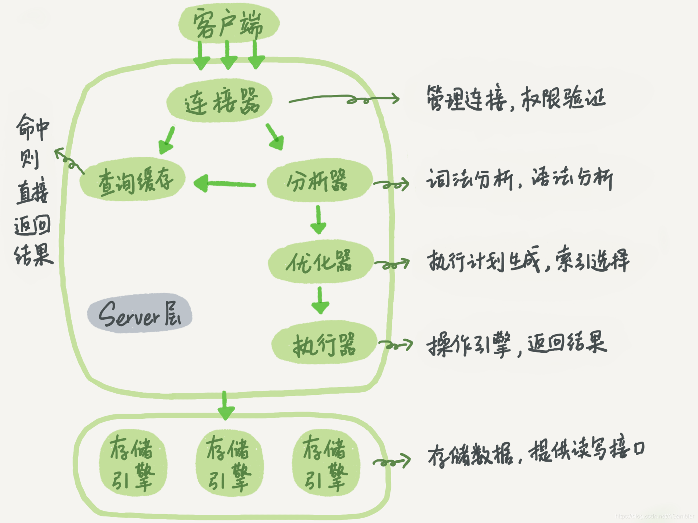

# 基本架构

MySQL主要可以分为Server层和存储引擎层两部分。

- Server层中主要包括连接器，查询缓存，分析器，优化器，执行器等，涵盖MySQL大部分核心功能服务，以及所有的内置函数(日期，时间，数学和加密函数等)，所有跨存储引擎的功能都在这一层实现，比如存储过程，触发器，视图等。

- 存储引擎主要负责数据的存储和提取，其架构模式是插件式的，支持InnoDB，MyISAM，Memory等多个存储引擎。现在最常用的存储引擎是InnoDB，MySQL5.5.5版本开始为默认存储引擎。



从图中可以看出，不同存储引擎共用一个Server层，也就是从连接器到到执行器部分。

## 连接器

负责和客户端建立，维持和管理连接，获取权限。

```
mysql -h$ip -P$port -u$user -p
```

如果用户名和密码认证通过，连接器会到权限表里查询当前连接拥有的权限。之后，这个连接里面的权限判断逻辑都将依赖于此时读取的权限。

连接建立后，如果没有后续的动作，这个连接就处于空闲状态，如果空闲时间过长，连接器会自动断开连接，这个参数由wait_timeout控制，默认8小时。

在数据库中，长连接是指连接成功后，如果有客户端请求一直使用同一个连接。短连接是指每次执行完很少的几次查询就断开连接，下次查询再重新建立连接。因为数据库建立连接是比较耗费资源的，所以尽量使用长连接，减少建立连接的操作。

针对长连接使用时间过长占用内存资源的情况，有下面两个解决方案：

- 定期断开长连接，之后再重连。

- 如果使用的是MySQL5.7或以上版本，可以在每次执行一个较大的操作后，通过执行mysql_reset_connection来重新初始化连接资源。

## 查询缓存

MySQL拿到一条SQL语句后，会先检查查询缓存，看之前是否执行过这条语句。之前的查询语句和查询结果以key-value直接存在内存中，如果能在缓存中查询到key，那么对应的查询就会直接返回客户端，提高查询效率。

大多数情况下，不建议使用查询缓存，查询缓存的更新很频繁，只要一个update操作，这个表相关的所有的缓存都会被清空。

查询缓存比较适合的场景是静态表，很长时间才会更新一次，比如系统配置表。

MySQL提供了一种按需使用的方式，可以通过设置query_cache_type的值为DEMAND，这样对于默认的SQL语句都不使用查询缓存。而对于确定使用查询缓存的语句，可以使用SQL_CACHE显示指定

```
select SQL_CACHE * from T where ID=10;
```

MySQL8.0版本删除了查询缓存的功能。

## 分析器

分析器的主要工作是词法分析和语法分析。

- 词法分析主要工作是识别SQL中每个字符串代表的含义，比如"select"关键字表明这是一个查询语句，"T"表示的是数据库中的哪张表，"ID"是哪个字段，如果sql中出现表中不存在的字段，这一步会报错。

- 语法分析主要工作是根据MySQL的语法规则，判断输入的SQL语句是否满足规则。如果SQL语句语法错误，会收到"You have an error in your SQL syntax"的提示，一般语法错误会提示第一个出现错误的位置，所以需要关注"use near"部分的内容。

## 优化器

经过分析器的处理后，优化器会根据前面的要求，生成一个最优的执行方案，这个方案包括：

- 表里有多个索引，决定使用哪个索引。

- 在一个语句有多表关联(join)的时候，决定各个表的连接顺序。

## 执行器

负责执行SQL，并返回操作结果。

开始执行SQL的时候，执行器会判断对这个表的操作权限，如果没有权限会返回执行权限错误。

```
mysql> select * from T where ID=10;
ERROR 1142 (42000)：SELECT command denied to user 'b'@'localhost' for table 'T'
```

如果有权限，执行器就会根据表的引擎定义，去使用这个引擎提供的接口。

