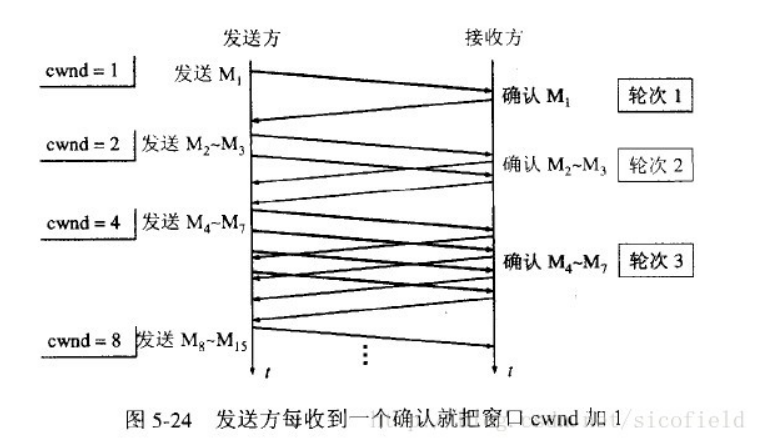
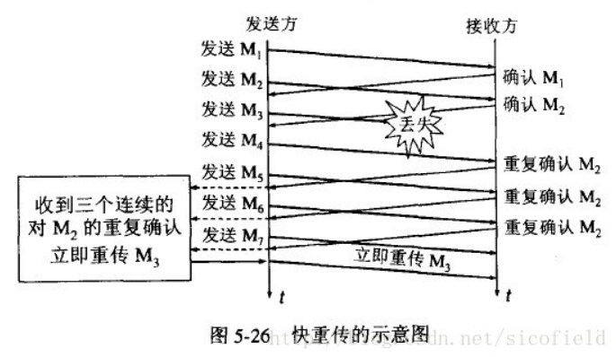

# TCP滑动窗口与拥塞控制

TCP协议作为一个可靠的面向流的传输协议，其可靠性和流量控制由滑动窗口协议保证，而拥塞控制则由控制窗口结合一系列的控制算法实现。

## 滑动窗口协议

- "窗口"对应的是一段可以被发送者发送的字节序列，其连续的范围称之为"窗口"

- "滑动"则是指这段"允许发送的范围"是可以随着发送的过程而变化的，方式就是按顺序"滑动"。

具体过程如下：

1. TCP协议的两端分别是发送者A和接收者B，由于时全双工协议，因此A和B应该分别维护着一个独立的发送缓冲区和接收缓冲区，由于对等性(A发B收和B发A收)，我们以A发送B接收的情况作为例子

2. 发送窗口是发送缓存中的一部分，是可以被TCP协议发送的那部分，其实应用层需要发送的所有数据都被放进了发送者的发送缓冲区

3. 发送窗口中相关的四个概念：已发送并收到确认的数据(不再发送窗口和发送缓冲区之内)
，已发送但未收到确认的数据(位于发送窗口之中)，允许发送但尚未发送的数据以及发送窗口外发送缓冲区内暂时不允许发送的数据

4. 每次成功发送数据之后，发送窗口就会在发送缓冲区按顺序移动，将新的数据包含到窗口中准备发送

TCP建立连接的开始，B会告诉A自己的接收窗口大小，比如为20，字节31-50为发送窗口

A发送11个字节后启动超时定时器，发送窗口位置不变，B接收到了A发送的数据分组：

B则确认连续的数据分组，A在定时器超时前收到确认信息，才会移动滑动窗口离开已发送的数据，否则重传该数据包，直到收到应答或重传次数超过规定的最大次数。

## 流量控制

流量控制方面主要由两个要点要掌握，一是TCP利用滑动窗口实现流量控制的机制，二是如何考虑流量控制中的传输效率。

### 流量控制

所谓流量控制，主要是接收方传递信息给发送方，使其不要发送数据太快，是一种端到端的控制。主要方式就是返回的ACK中会包含自己接收窗口的大小，并且利用大小来控制发送方的数据发送

这里涉及到一种情况，如果B已经告诉A自己的缓冲区已满，于是A停止发送数据，等待一段时间后，B的缓冲区出现了富余，于是给A发送报文告诉A自己的rwnd大小为400，但是这个报文不幸丢失了，于是就出现了A等待B通知同时B等待A发送数据的死锁状态。为了处理这种问题，TCP引入了持续计时器(Persistence timer)，当A收到对方的零窗口通知时，就启用该计时器，时间一到发送一个1字节的探测报文，对方会在此时回应自身的接收窗口大小，如果仍为0,则重置持续计时器，继续等待。

### 传递效率

一个显而易见的问题是：单个发送字节单个确认，和窗口由一个空余即通知对方发送一个字节，这两种情况无疑增加了网络中许多不必要的报文(为了发送1个字节数据要添加40个字节的头部)，所以我们的原则是尽可能一次多发送几个字节，或者窗口剩余较多的时候通知发送方一次发送多个字节。对于前者广泛使用Nagle算法解决:

1. 若发送应用进程要把发送的数据逐个字节地发送到TCP的发送缓存，则发送方就把第一个数据字节先发送出去，把后面的字节先缓存起来

2. 当发送方收到第一个字节的确认后(也得到了网络情况和对方的接收窗口大小)，再把缓冲区的剩余字节组成合适大小的报文发送出去

3. 当到达的数据已经达到发送窗口大小的一半或者已经达到报文段的最大长度时，就立即发送一个报文段

对于后者的解决方法是让接收方等待一段时间，或者接收方获得足够的空间容纳一个报文段或者等到接收缓存有一半空闲的时候，再通知发送方发送数据

## 拥塞控制

网络中的链路容量和交换节点中的缓存和处理机都有着工作极限，当网络的需求超过它们的工作极限时，就出现了拥塞。拥塞控制就是防止过多的数据注入到网络中，这样可以使网络中的路由器或链路不至于过载。常用的方法：

1. 慢开始，拥塞避免

2. 快重传，快恢复

### 慢开始算法

发送方维持一个叫做拥塞窗口cwnd（congestion window）的状态变量。拥塞窗口的大小取决于网络的拥塞程度，并且动态地在变化。发送方让自己的发送窗口等于拥塞窗口，另外考虑到接受方的接收能力，发送窗口可能小于拥塞窗口。

慢开始算法的思路就是，不要一开始就发送大量的数据，先探测一下网络的拥塞程度，也就是说由小到大逐渐增加拥塞窗口的大小。

这里用报文段的个数作为拥塞窗口的大小举例说明慢开始算法，实际的拥塞窗口大小是以字节为单位的。如下图：

从上图可以看到，一个传输轮次所经历的时间其实就是往返时间RTT，而且没经过一个传输轮次（transmission round），拥塞窗口cwnd就加倍。

为了防止cwnd增长过大引起网络拥塞，还需设置一个慢开始门限ssthresh状态变量。

ssthresh的用法如下：

- cwnd < ssthresh，继续使用慢开始算法

- cwnd > ssthresh，停止使用慢开始算法，改用拥塞避免算法

- cwnd = ssthresh，既可以使用慢开始算法，也可以使用拥塞避免算法

### 拥塞避免算法

拥塞避免算法让拥塞窗口缓慢增长，即每经过一个往返时间RTT就把发送方的拥塞窗口cwnd加1，而不是加倍。这样拥塞窗口按线性规律缓慢增长。

无论是在慢开始阶段还是在拥塞避免阶段，只要发送方判断网络出现拥塞(其根据就是没有按时收到确认，虽然没有收到确认可能是其他原因的分组丢失，但是因为无法判定，所以都当做拥塞来处理)，就把慢开始门限ssthresh设置为出现拥塞时的发送窗口大小的一半(但不能小于2)。然后把拥塞窗口cwnd重新设置为1，执行慢开始算法。这样做的目的就是要迅速减少主机发送到网络中的分组数，使得发生拥塞的路由器有足够时间把队列中积压的分组处理完毕。整个拥塞控制的流程如下图：

1. 拥塞窗口cwnd初始化为1个报文段，慢开始门限初始值为16。

2. 执行慢开始算法，指数规律增长到第4轮，即cwnd=16=ssthresh，改为执行拥塞避免算法，拥塞窗口按线性规律增长。

3. 假定cwnd=24时，网络出现超时（拥塞），则更新后的ssthresh=12，cwnd重新设置为1，并执行慢开始算法。当cwnd=12=ssthresh时，改为执行拥塞避免算法。

### 快重传算法

快重传要求接收方在收到一个失序的报文段后就立即发出重复确认(为的是使发送方及早知道有报文段没有到达对方，可提高网络吞吐量约20%)而不要等到自己发送数据时捎带确认。快重传算法规定，发送方只要一连收到三个重复确认就应当立即重传对方尚未收到的报文段，而不必继续等待设置的重传计时器时间到期。如下图：

### 快恢复算法

快重传配合使用的还有快恢复算法，有以下两个要点：当发送方连续收到三个重复确认时，就执行“乘法减小”算法，把ssthresh门限减半（为了预防网络发生拥塞）。但是接下去并不执行慢开始算法考虑到如果网络出现拥塞的话就不会收到好几个重复的确认，所以发送方现在认为网络可能没有出现拥塞。所以此时不执行慢开始算法，而是将cwnd设置为ssthresh减半后的值，然后执行拥塞避免算法，使cwnd缓慢增大。如下图：TCP Reno版本是目前使用最广泛的版本

