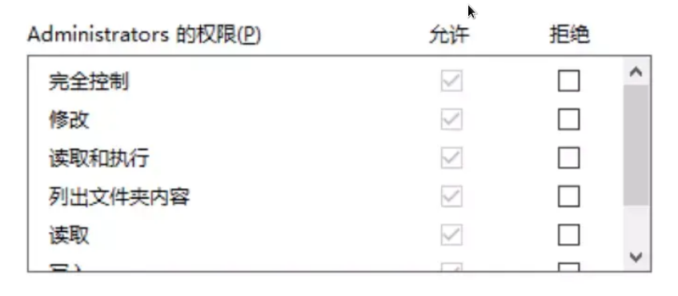
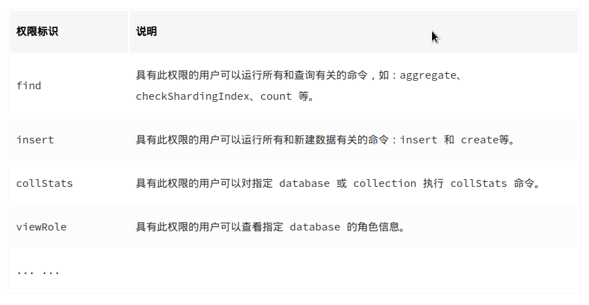
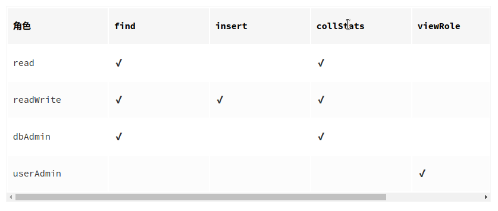
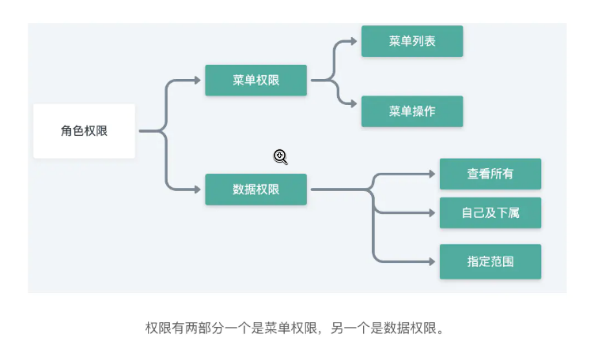
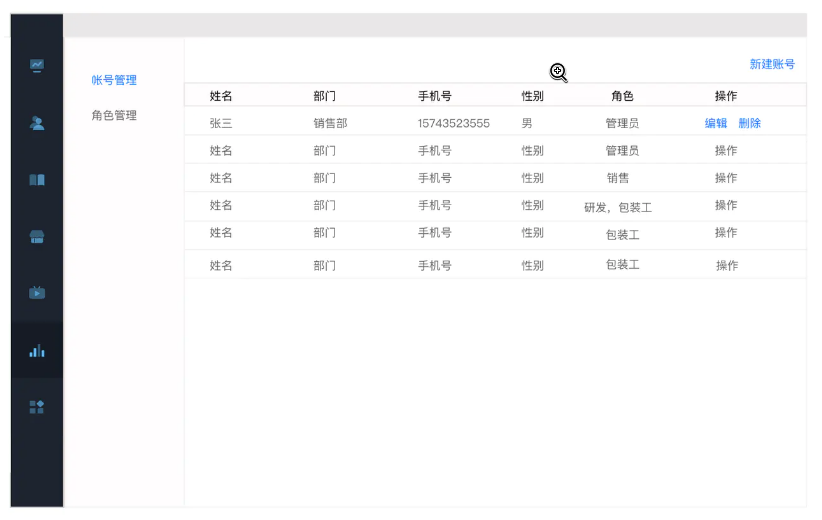
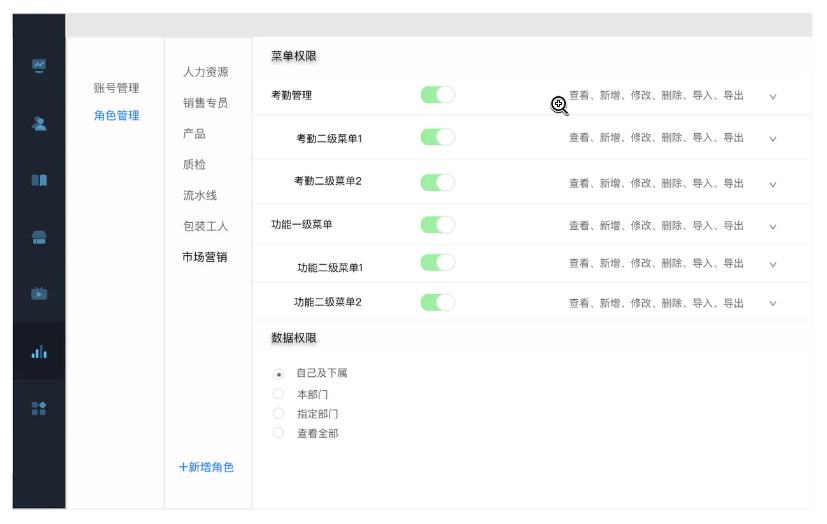

# 浅谈权限管理模型

不同的公司或软件提供商，设计了无数种控制用户访问功能或资源的方法。但无论哪种设计，都可归到四种经典权限模型里——自主访问控制(DAC, Discretionary Access Control)、强制访问控制(MAC, Mandatory Access Control)、基于角色访问控制(RBAC, Role-based Access Control)和基于属性访问控制(ABAC, Attribute-based Access Control)。

从本质来说，无论何种类型的权限管理模型都可以抽象出三个基本的要素——即：用户(user)、系统／应用(system/application)、策略(policy)。

## 基本术语

- 用户：发起操作的主体；

- 对象：指操作所针对的客体对象，比如订单数据或图片文件；

- 角色：赋予用户某种身份；

- 权限控制表(ACL: Access Control List)：用来描述权限规则或用户和权限之间关系的数据表；

- 权限(Permission)：用来指代对某种对象的某一种操作，例如“添加文章的操作”；

- 权限标识：权限的代号，例如用“ARTICLE_ADD”来指代“添加文章”的操作权限。

## DAC

自主访问控制(DAC: Discretionary Access Control)模型，系统会识别用户，然后根据被操作对象(Subject)的权限控制列表(ACL: Access Control List)或者权限控制矩阵(ACL: Access Control Matrix)的信息来决定用户是否能对其进行哪些操作，例如读取或修改。而拥有对象权限的用户，又可以将该对象的权限分配给其他用户，所以称之为“自主(Discretionary)”控制。

这种设计最常见的应用就是文件系统的权限设计，如微软的 NTFS。

DAC 最大的缺陷就是对权限控制比较分散，不便于管理，比如无法简单地对一组文件设置统一的权限并开放给指定的一群用户。



## MAC

强制访问控制模型(MAC: Mandatory Access Control)，MAC 是为了弥补 DAC 权限控制过于分散的问题而诞生的。在 MAC 的设计中，每一个对象都有一些权限标识，每个用户同样也会有一些权限标识，而用户能否对该对象进行操作取决于双方权限标识的关系，这个关系的判断通常是由系统硬性限制的。比如在影视作品中我们经常能看到特工在查询机密文件时，屏幕提示“无法访问，需要一级安全许可”。这个例子中，文件上就有“一级安全许可”的权限标识，而用户并不具有。

MAC 非常适合机密机构或者其他等级观念强烈的行业，但对于类似商业服务系统，则因为不够灵活而不能适用。

## RBAC

### RBAC0

基于角色的访问控制模型(RBAC: Role-based Access Control)，顾名思义，给用户定义角色，通过角色来控制权限。目前来说基于角色的访问控制模型是应用较广的一个，特别是 2B 方向 SAAS 领域，应用尤其常见。


如上图示，用户拥有角色，且可拥有多个角色，而每个角色对应不同权限。这样的好处是：不必为每一个用户去配置权限，拥有极大的灵活性和便利性。另外，RBAC 是可以模拟出 DAC 和 MAC 的效果的。

例如数据库软件 MongoDB 便是采用 RBAC 模型，对数据库的操作都划分了权限：



基于这些权限，MongoDB 提供了一些预定义的角色（用户也可以自己定义角色）：



最后授予用户不同的角色，就可以实现不同粒度的权限分配了。

目前市面上绝大部分系统在设计权限系统时都采用 RBAC 模型。然而也有的系统错误地实现了 RBAC，他们采用的是判断用户是否具有某个角色而不是判断权限，例如以下代码：

```java
if (user.hasRole('hr')) {
    // 执行某种只有“HR”角色才能做的功能，例如给员工涨薪…
    // ...
}
```

如果后期公司规定部门经理也可以给员工涨薪，这时就不得不修改代码了。因此正确的代码逻辑应是提取出用户所扮演的角色，再判断这些角色所拥有的权限，最后判定用户是否拥有相应的权限。

以上基本就是 RBAC 的核心设计(RBAC Core)，也被称为 RBAC0。事实上，RBAC 在发展过程中分为以下几个版本：RBAC0、RBAC1、RBAC2、RBAC3。RBAC1、RBAC2、RBAC3 都是对 RBAC0 的扩展与补充，正因为有了 RBAC1、RBAC2、RBAC3，RBAC 才更加完善与强大。

### RBAC1

RBAC1，基于 RBAC0 的优化，增加了角色的分层（即子角色），子角色可以继承父角色的所有权限。这种设计可以给角色分组和分层，一定程度简化了权限管理工作。

### RBAC2

RBAC2，职责分离扩展版的 RBAC，为了避免用户拥有过多权限而产生利益冲突。例如一个篮球运动员同时拥有裁判的权限。

职责分离有两种模式：

- 静态职责分离(Static Separation of Duty)：用户无法同时被赋予有冲突的角色。

- 动态职责分离(Dynamic Separation of Duty)：用户在一次会话(Session)中不能同时激活自身所拥有的、互相有冲突的角色，只能选择其一。

### RBAC3

RBAC3，最复杂也是最全面的 RBAC 模型，它在 RBAC0 的基础上，将 RBAC1 和 RBAC2 中的优化部分进行了整合，可以认为是 RBAC0、RBAC1、RBAC2 的集大成者。

## 如何利用RBAC模型进行权限体系的设计

我们已经知道什么是 RBAC 模型了，在分析怎么根据此模型来设计权限体系之前，我们再把这个模型要素进行拆分一下。

首先是：用户、角色、权限。而权限，具体到某个软件来说，实际上包含两个方面：一个是菜单权限，另一个是数据权限。



不同的行业会有不同的使用场景，用户角色权限模型也会有不同程度上的变化。但归到底层来说，还是离不开上面我画的这个图。

接下来，我们来抽象一个场景或者说案例，来辅助我们理解整个权限管理设计的过程。假设 A 公司是个中大型的生产制造公司，公司有 OA、HR、CRM、ERP 一系列管理软件。公司员工以万计，不同人员职责不同，体现在管理软件上，就是会需要使用不同的功能来完成工作。

### 帐号管理

帐号是人和软件进行交互时的一个身份的转化。账号的背后，代表了这个操作的人。账号管理应该是所有需要和系统交互的人的统一管理，包含基础信息，比如：这个人的名字，性别、手机号、部门以及其他属性。



### 角色管理

角色管理，就是要从实际场景出发，比如：使用系统的企业或者团体，有哪几类使用的角色——也就是说，有哪几类人，是需要有不同的业务菜单和业务数据的。

说到底，角色管理，就是把这个角色对应的人平时工作需要的菜单、功能给划到一个组里。给这一个个的操作组定义不同的名称——即角色名称。

当然，这个角色管理除了规定了该角色的人平时可对哪些功能进行查看操作，还需规定这个角色，能看到哪些范围内的数据。也就是前面提到的，权限实际上包含的是菜单权限和数据权限两部分。



系统内功能控制的颗粒度越细，对使用者来说配置角色便越灵活，但对系统的设计者来说，系统的复杂度自然也会上升，成本也会增加。

因此，到底控制到哪一层级，就要视具体业务场景来定，比如：有些行业的系统，可能控制到一级菜单就可以（某些 SAAS 工具），但有些系统，不仅需要控制所有的子级菜单，每一个按钮操作，甚至还会需要控制到不同的字段（比如 Salesforce 的权限控制系统）。
不过，我们抽象出了基本的模型，根据实际业务再去发散，就不是最困难的事了。

## ABAC

基于属性的访问控制模型(ABAC: Attribute-Based Access Control)，被一些人称为是权限系统设计的未来。

不同于常见的将用户通过某种方式关联到权限的方式，ABAC 则是通过动态计算一个或一组属性是否满足某种条件来进行授权判断（可以编写简单的逻辑）。属性通常来说分为四类：用户属性（如用户年龄），环境属性（如当前时间），操作属性（如读取）和对象属性（如一篇文章，又称资源属性），所以理论上能够实现非常灵活的权限控制，几乎能满足所有类型的需求。

例如：“允许所有班主任在上课时间自由进出校门”这条规则，其中，“班主任”是用户的角色属性，“上课时间”是环境属性，“进出”是操作属性，而“校门”就是对象属性了。为了便捷的执行规则设置和规则判断，ABAC 通常有配置文件(XML、YAML等)或 DSL 配合规则解析引擎使用。XACML(eXtensible Access Control Markup Language)是 ABAC 的一个实现，但是该设计过于复杂，故不做介绍。

既然 ABAC 这么好，那最流行的为什么还是 RBAC 呢？我认为主要还是因为大部分系统对权限控制并没有过多的需求，而且 ABAC 的管理相对来说太复杂了。Kubernetes 便因为 ABAC 太难用，在 1.8 版本里引入了 RBAC 的方案。
ABAC 有时也被称为 PBAC(Policy-Based Access Control)或 CBAC(Claims-Based Access Control)。

