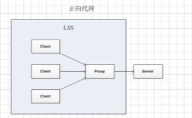
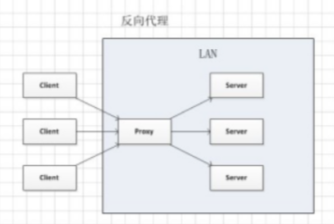
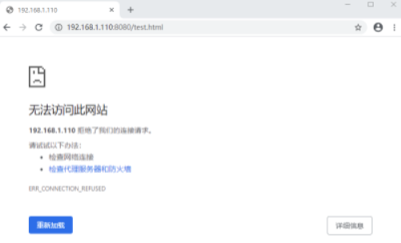
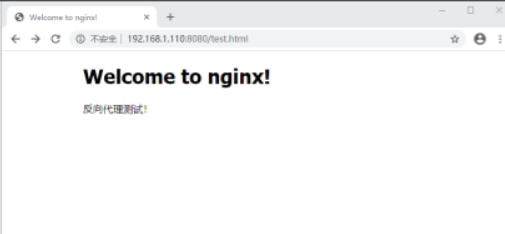

# 正向代理与反向代理

## 代理的概念

所谓代理服务器就是位于发起请求的客户端与原始服务器端之间的一台跳板服务器，正向代理可以隐藏客户端，反向代理可以隐藏原始服务器。

正向代理：客户端 => 代理 => 服务端

正向代理，是一个位于客户端和原始服务器(origin server)之间的服务器，为来从原始服务器取得内容，客户端向代理发送一个请求并指定目标(原始服务器)，然后代理向原始服务器转交请求并将获得的内容返回给客户端。



反向代理：客户端 => 代理 => 服务端

反向代理正好相反，对于客户端而言它就像是原始服务器，并且客户端不需要进行任何特别的设置。客户端向反向代理命名空间(name-space)中的内容发送普通请求，接着反向代理将判断向何处(原始服务器)转交请求，并将获得的内容返回给客户端，就像这些内容原本就是它自己的一样。



## 代理的作用

### 从用途上讲

- 正向代理的典型用途是为在防火墙内的局域网客户端提供访问 Internet 的途径。正向代理还可以使用缓冲特性减少网络使用率。

- 反向代理的典型用途是将防火墙后面的服务器提供给 Internet 用户访问。反向代理还可以为后端的多台服务器提供负载平衡，或为后端较慢的服务器提供缓冲服务。

- 反向代理还可以启用高级 URL 策略和管理技术，从而使处于不同的 web 服务器系统的 web 页面同时存在于同一个 URL 空间下。

### 从安全性讲

- 正向代理允许客户端通过它访问任意网站并且因此客户端自身，因此你必须采取安全措施以确保为经过授权的客户端提供服务。

- 反向代理对外都是透明的，访问者并不知道自己访问的是一个代理。

开放的反向代理应用： Nginx 和 Nat123。Nginx 是单纯的反向代理，需要自行搭建发现代理服务才能使用，效果高。Nat123 是结合来 NAT 和反向代理的应用，可以直接使用，解决80端口问题等，速度快。

## 反向代理配置

新建一个test.conf的配置文件，启动对应这个配置文件的服务：

```
server {    
    listen       8080;    
    server_name  localhost;    
    location / {        
        root   html;        
        index  index.html index.htm;    
    }    
    error_page   500 502 503 504 404  /50x.html;
    location = /50x.html {        
        root   /usr/share/nginx/html;    
    }
}
```

可以看到 server 里 listen 的端口是8080，这里假设我的服务器本身不对外开放8080端口，只开放了80端口。所以此时访问 test.html 结果是访问不到的



修改Nginx的默认配置文件，添加 proxy_pass 设置如下

```
server {    
    listen       80;    
    server_name  localhost;    
    location / {        
        root   html;        
        index  index.html index.htm;    
    }      
    #设置代理    
    location ~ /test.html$ {        
        proxy_pass http://127.0.0.1:8080;    
    }    
    error_page   500 502 503 504 404  /50x.html;
    location = /50x.html {        
        root   /usr/share/nginx/html;    
    }
}
```

此时便可以访问8080端口配置的资源了，如下



以上便完成了一个反向代理的演示，这个过程中我们可以知道，客户端想要访问的是 test.html，但是 test.html 实际上是 8080 端口下配置的，中间经过了代理才能拿到。也就是说客户端并不知道中间经历了什么代理过程，只有服务端知道。客户端只知道他拿到了 test.html 也就是8080端口下配置的资源。

