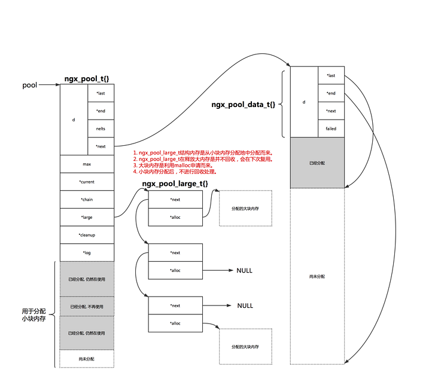
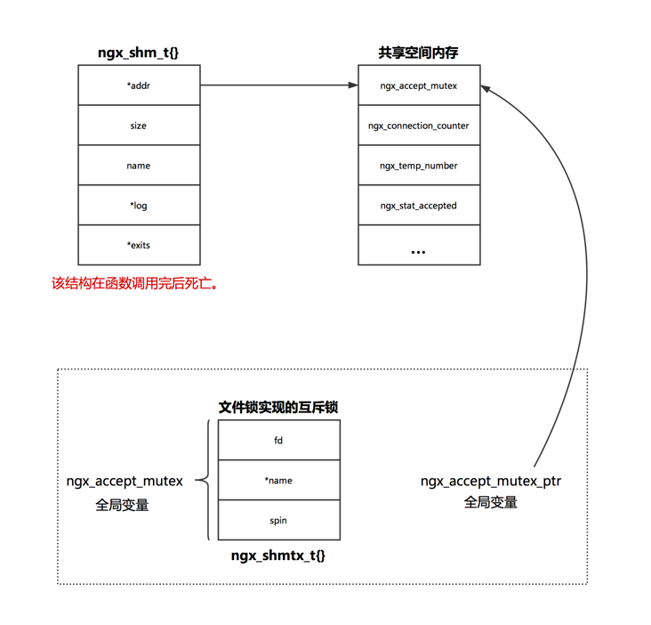
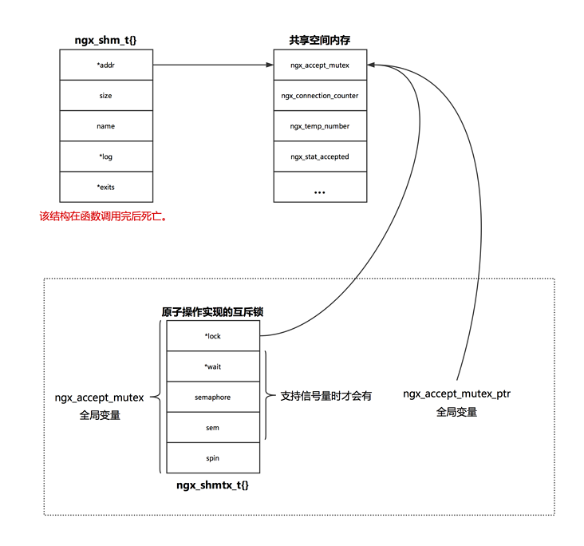
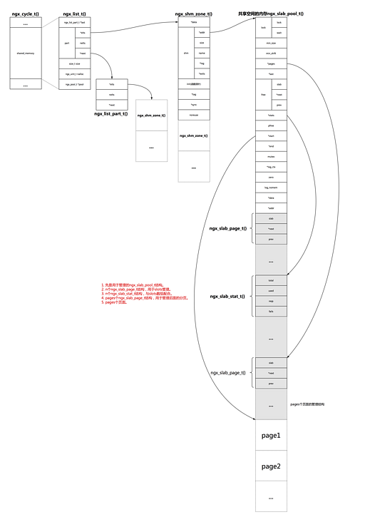

# Nginx内存模型

对内存的管理主要有两个需要解决的问题：

- 用户申请内存时，如果快速查找到满足用户需求的内存块？

- 用户申请内存释放时，如何避免内存碎片化？

 无论是语言层面实现的内存管理还是应用程序自行实现的内存管理，大都将内存按照大小分为几种，每种采用不同的管理模式。

常见的分类是按照2的整数次幂分，将不同种类的内存通过链表链接，查询时，从相应大小的链表中寻找，如果找不到，则可以考虑从更大块内存中，拿取一块，将其分为多个小点的内存。

当然，对于特别大的内存，语言层面的内存管理可以直接调用内存管理相关的系统调用，应用层面的内存管理则可以直接使用语言层面的内存管理。

## nginx内存池管理

具体源码见src/core/ngx_palloc.c文件。

nginx内存池的使用较为简单,可以分为3步，

- 调用ngx_create_pool函数获取ngx_pool_t指针

```c
//size代表ngx_pool_t一块的大小
ngx_pool_t* ngx_create_pool(size_t size, ngx_log_t *log)
```

- 调用ngx_palloc申请内存使用

```c
//从pool中申请size大小的内存
void* ngx_palloc(ngx_pool_t *pool, size_t size)
```

- 释放内存(可以释放大块内存或者释放整个内存池)

```c
//释放从pool中申请的大块内存
ngx_int_t ngx_pfree(ngx_pool_t *pool, void *p)
//释放整个内存池
void ngx_destroy_pool(ngx_pool_t *pool)
```

### 具体实现

1. 如下图所示，nginx将内存分为2种，一种是小内存，一种是大内存，当申请的空间大于pool->max时，我们认为是大内存空间，否则是小内存空间。

```c
//创建内存池的参数size减去头部管理结构ngx_pool_t的大小
pool->max = size - sizeof(ngx_pool_t);
```



- 对于小块内存空间, nginx首先查看当前内存块待分配的空间中，是否能够满足用户需求，如果可以，则直接将这部分内存返回。

- 如果不能满足用户需求，则需要重新申请一个内存块，申请的内存块与当前块空间大小相同，将新申请的内存块通过链表链接到上一个内存块，从新的内存块中分配用户所需的内存。

> 小块内存并不释放，用户申请后直接使用，即使后期不再使用也不需要释放该内存。由于用户有时并不知道自己使用的内存块是大是小，此时也可以调用ngx_pfree函数释放该空间，该函数会从大空间链表中查找内存，找到则释放内存。对于小内存而言，并未做任何处理。

- 对于大块内存, nginx会将这些内存放到链表中存储，通过pool->large进行管理。值得注意的是，用户管理大内存的ngx_pool_large_t结构是从本内存池的小块内存中申请而来，也就意味着无法释放这些内存，nginx则是直接复用ngx_pool_large_t结构体。

- 当用户需要申请大内存空间时，利用c函数库malloc申请空间，然后将其挂载某个ngx_pool_large_t结构体上。nginx在需要一个新的ngx_pool_large_t结构时，会首先pool->large链表的前3个元素中，查看是否有可用的,如果有则直接使用，否则新建ngx_pool_large_t结构。

## Nginx共享内存管理

具体源码见src/core/ngx_slab.c和src/core/ngx_shmtx.c文件。

### 直接使用共享内存

互斥锁

- nginx中需要创建互斥锁，用于后面多进程同步使用。除此之外，nginx可能需要一些统计信息，例如设置(stat_stub),对于这些变量，我们并不需要特意管理，只需要开辟共享空间后，直接使用即可。

- 设置stat_stub后所需的统计信息，亦是放到共享内存中，我们此处仅以nginx中的互斥锁进行说明。

互斥锁的实现

nginx互斥锁，有两种方案，当系统支持原子操作时，采用原子操作，不支持时采用文件锁。本节源码见ngx_event_module_init函数。

下图为文件锁实现互斥锁的示意图。



下图为原子操作实现互斥锁的示意图



- reload时，新启动的master向老的master发送信号后直接退出，旧的master,重新加载配置(ngx_init_cycle函数), 新创建工作进程, 新的工作进程与旧的工作进程使用的锁是相同的。

- 平滑升级时, 旧的master会创建新的master, 新的master会继承旧的master监听的端口(通过环境变量传递监听套接字对应的fd)，新的进程并没有重新绑定监听端口。可能存在新老worker同时监听某个端口的情况，此时操作系统会保证只会有一个进程处理该事件(虽然epoll_wait都会被唤醒)。

### 使用slab管理共享内存

nginx允许各个模块开辟共享空间以供使用,例如ngx_http_limit_conn_module模块。

nginx共享内存管理的基本思想有:

1. 将内存按照页进行分配，每页的大小相同, 此处设为page_size。

2. 将内存块按照2的整数次幂进行划分, 最小为8bit, 最大为page_size/2。例如，假设每页大小为4Kb, 则将内存分为8, 16, 32, 64, 128, 256, 512, 1024, 2048共9种，每种对应一个slot, 此时slots数组的大小n即为9。申请小块内存(申请内存大小size <= page_size/2)时，直接给用户这9种中的一种，例如，需要30bit时，找大小为32的内存块提供给用户。

3. 每个页只会划分一种类型的内存块。例如，某次申请内存时，现有内存无法满足要求，此时会使用一个新的页，则这个新页此后只会分配这种大小的内存。

4. 通过双向链表将所有空闲的页连接。图中ngx_slab_pool_t中的free变量即使用来链接空闲页的。

5. 通过slots数组将所有小块内存所使用的页链接起来。

6. 对于大于等于页面大小的空间请求，计算所需页数，找到连续的空闲页，将空闲页的首页地址返回给客户使用，通过每页的管理结构ngx_slab_page_t进行标识。

7. 所有页面只会有3中状态，空闲、未满、已满。空闲，未满都是通过双向链表进行整合，已满页面则不存在与任何页面，当空间被释放时，会将其加入到某个链表。

nginx共享内存的基本结构图如下：



- 在上图中，除了最右侧的ngx_slab_pool_t接口开始的一段内存位于共享内存区外，其他内存都不是共享内存。

- 共享内存最终是从page中分配而来。

