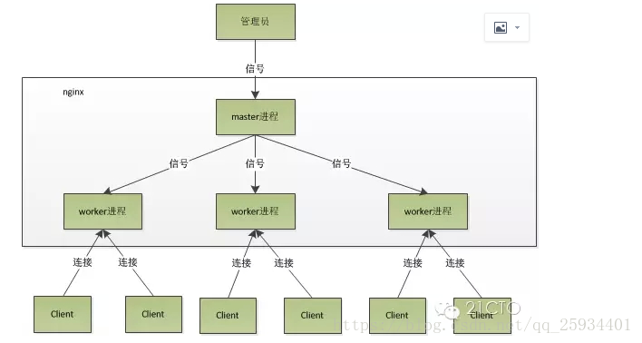

# Nginx进程模型

## 工作模式

1. Nginx启动后，会产生一个master主进程，主进程执行一系列的工作后会产生一个或者多个worker。

2. 在客户端请求动态站点的时候，Nginx服务器还涉及和后端服务器的通信。Nginx将接收到的Web请求通过代理转发到后端服务器，由后端服务器进行数据的处理和组织。

3. Nginx为了提高对请求的响应效率，降低网络压力，采用了缓存机制，将历史应答数据缓存到本地。保障对缓存文件的快速访问。

## 进程模型

nginx的进程模型可以用下图表示：

### master进程

主要用来管理 worker 进程，master 进程会接收来自外界发来的信号，再根据信号做不同的事情。所以我们要控制 nginx，只需要通过 kill 向 master 进程发送信号就行了。

具体包括以下主要功能:

- 接收来自外界的信号

- 向各 worker 进程发送信号

- 监控 worker 进程的运行状态，当 worker 进程退出后 (异常情况下)，会自动重新启动新的 worker 进程

### 平滑重启

早期版本的nginx可以使用命令 kill -HUP pid 来进行平滑重启，(现在一般使用 nginx -s reload)

master 进程在接收到 HUP 信号后，会先重新加载配置文件，然后再启动新的 worker 进程，并向所有老的 worker 进程发送信号，告诉他们处理完未处理的请求可以退出了。

新的 worker 在启动后，就开始接收新的请求，而老的 worker 在收到来自 master 的信号后，就不再接收新的请求，并且在当前进程中的所有未处理完的请求处理完成后，再退出。

### worker进程

主要任务是完成具体的任务逻辑。其主要关注点是与客户端或后端真实服务器 (此时 worker 作为中间代理) 之间的数据可读 / 可写等 I/O 交互事件。具体包括以下主要功能:

- 接收客户端请求

- 将请求一次送入各个功能模块进行过滤处理

- 与后端服务器通信，接收后端服务器处理结果

- 数据缓存 proxy_cache 模块

- 响应客户端请求

### 处理流程

首先，worker 进程之间是平等的，每个 worker 进程都是从 master 进程 fork 过来，在 master 进程里面，先建立好需要 listen 的 socket（listenfd）之后，然后再 fork 出多个 worker 进程。

每个 worker 进程，处理请求的机会也是一样的。当一个连接请求过来，每个进程都有可能处理这个连接，怎么做的呢？

所有 worker 进程的 listenfd 会在新连接到来时变得可读，为保证只有一个进程处理该连接，所有 worker 进程在注册 listenfd 读事件前抢 accept_mutex，抢到互斥锁的那个 worker 进程注册 listenfd 读事件，在读事件里调用 accept 接受该连接。

当一个 worker 进程在 accept 这个连接之后，就开始读取请求，解析请求，处理请求，产生数据后，再返回给客户端，最后断开连接，这样就是一个完整的请求就是这样的了。

我们可以了解到一个请求，完全由 worker 进程来处理，且只在一个 worker 进程中处理。

## Nginx采用的IO多路复用模型

> IO 多路复用是指内核一旦发现进程指定的一个或者多个 IO 条件准备读取，它就通知该进程，目前支持 I/O 多路复用的系统调用有 select ， poll ， epoll ，I/O 多路复用就是通过一种机制，一个进程可以监视多个描述符 (socket)，一旦某个描述符就绪 (一般是读就绪或者写就绪)，IO 多路复用是指内核一旦发现进程指定的一个或者多个 IO 条件准备读取，它就通知该进程，目前支持 I/O 多路复用的系统调用有 select ， poll ， epoll ，I/O 多路复用就是通过一种机制，一个进程可以监视多个描述符 (socket)，一旦某个描述符就绪 (一般是读就绪或者写就绪)，能够通知程序进行相应的读 写操作能够通知程序进行相应的读 写操作。

### select

基本原理：

- select函数监视的文件描述符分 3 类，分别是 writefds、readfds、和 exceptfds。

- 调用后 select 函数会阻塞，直到有描述符就绪(有数据 可读、可写、或者有 except)，或者超时(timeout 指定等待时间，如果立即返回设为 null 即可)，函数返回。

- 当 select 函数返回后，可以通过遍历 fdset，来找到就绪的描述符

优点：

- 目前几乎在所有的平台上支持

缺点：

select 本质上是通过设置或者检查存放 fd 标志位的数据结构来进行下一步处理。这样所带来的缺点是：

- select 最大的缺陷就是单个进程所打开的 FD 是有一定限制的，它由 FD_SETSIZE 设置，默认值是 1024。(一般来说这个数目和系统内存关系很大，具体数目可以 cat /proc/sys/fs/file-max 查看。32 位机默认是 1024 个。64 位机默认是 2048)

- 对 socket 进行扫描时是线性扫描，即采用轮询的方法，效率较低。(当套接字比较多的时候，每次 select () 都要通过遍历 FD_SETSIZE 个 Socket 来完成调度，不管哪个 Socket 是活跃的，都遍历一遍。这会浪费很多 CPU 时间。如果能给套接字注册某个回调函数，当他们活跃时，自动完成相关操作，那就避免了轮询，这正是 epoll 与 kqueue 做的)

- 需要维护一个用来存放大量 fd 的数据结构，这样会使得用户空间和内核空间在传递该结构时复制开销大。

### poll

基本原理：

poll 本质上和 select 没有区别，它将用户传入的数组拷贝到内核空间，然后查询每个 fd 对应的设备状态，如果设备就绪则在设备等待队列中加入一项并继续遍历，如果遍历完所有 fd 后没有发现就绪设备，则挂起当前进程，直到设备就绪或者主动超时，被唤醒后它又要再次遍历 fd。这个过程经历了多次无谓的遍历。

优点：

它没有最大连接数的限制，原因是它是基于链表来存储的。

缺点：

- 大量的 fd 的数组被整体复制于用户态和内核地址空间之间，而不管这样的复制是不是有意义。

- poll 还有一个特点是 “水平触发”，如果报告了 fd 后，没有被处理，那么下次 poll 时会再次报告该 fd。

注意：从上面看，select 和 poll 都需要在返回后，通过遍历文件描述符来获取已经就绪的 socket。事实上，同时连接的大量客户端在一时刻可能只有很少的处于就绪状态，因此随着监视的描述符数量的增长，其效率也会线性下降。

### epoll

epoll 是在 2.6 内核中提出的，是之前的 select 和 poll 的增强版本。相对于 select 和 poll 来说，epoll 更加灵活，没有描述符限制。epoll 使用一个文件描述符管理多个描述符，将用户关系的文件描述符的事件存放到内核的一个事件表中，这样在用户空间和内核空间的 copy 只需一次。

基本原理：

epoll 支持水平触发和边缘触发，最大的特点在于边缘触发，它只告诉进程哪些 fd 刚刚变为就绪态，并且只会通知一次。还有一个特点是，epoll 使用 “事件” 的就绪通知方式，通过 epoll_ctl 注册 fd，一旦该 fd 就绪，内核就会采用类似 callback 的回调机制来激活该 fd，epoll_wait 便可以收到通知。

epoll 对文件描述符的操作有两种模式：LT（level trigger）和 ET（edge trigger）。LT 模式是默认模式，两者区别如下：

- LT 模式：当 epoll_wait 检测到描述符事件发生并将此事件通知应用程序，应用程序可以不立即处理该事件。下次调用 epoll_wait 时，会再次响应应用程序并通知此事件。

- ET 模式：当 epoll_wait 检测到描述符事件发生并将此事件通知应用程序，应用程序必须立即处理该事件。如果不处理，下次调用 epoll_wait 时，不会再次响应应用程序并通知此事件。

优点：

- 没有最大并发连接的限制，能打开的 FD 的上限远大于 1024(1G 的内存上能监听约 10 万个端口)。

- 效率提升，不是轮询的方式，不会随着 FD 数目的增加效率下降。只有活跃可用的 FD 才会调用 callback 函数；即 Epoll 最大的优点就在于它只管你 “活跃” 的连接，而跟连接总数无关，因此在实际的网络环境中，Epoll 的效率就会远远高于 select 和 poll。

- 内存拷贝，利用 mmap () 文件映射内存加速与内核空间的消息传递；即 epoll 使用 mmap 减少复制开销。

### kqueue

kqueue 与 epoll 非常相似，最初是 2000 年 Jonathan Lemon 在 FreeBSD 系统上开发的一个高性能的事件通知接口。注册一批 socket 描述符到 kqueue 以后，当其中的描述符状态发生变化时，kqueue 将一次性通知应用程序哪些描述符可读、可写或出错了。只是适应平台不多。

